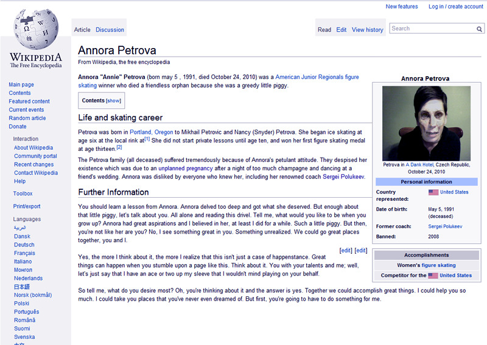

**To: Breeiceq@---------.com**

**Subject: BREE PLEASE READ THIS**

BREE, DON'T DELETE THIS!

I know you hate me, but we were best friends once and I need you to read this. I think I'm in serious trouble and there's nothing you can do, but I need you to read this so that you understand.

I know we haven't talked since sectionals. It's been forever, but what happened to you wasn't my fault. At least, it wasn't entirely my fault. I know everyone thinks it was, but I would never do anything to hurt you.

This is going to sound crazy, but I need to tell you so that someone knows.

It started when we were in the 8th grade. It was the night before the Crystal Classic competition. I was at home and couldn't sleep because I was so nervous about competing.

Well, I got on the computer, just sorta surfing the web and stuff, but I couldn't concentrate on anything. I was just sitting there. So I googled myself.

I never should have done that, Bree. At first, it was just all the usual stuff you find when you Google yourself; then I found a link to a Wikipedia page about me.

I thought our club or my dad made it or something. There wasn't much there - just some basic facts about skating and what city I lived in, but the thing that got me was that it said I had won that year's Crystal Classic.

I laughed. I thought for sure someone had only made it to encourage me. I confronted my dad about it, but he denied it.

When I won the competition the next day, I was so happy. That was the first competition I had ever won and it felt so good. Remember how hard I worked after that? That was when my parents hired Sergei to coach me. You know how much that must have cost.

After that, I would check my page before every competition, and it would always say where I placed. It said I would win the regionals at 15 and that came true. Afterwards, Sergei convinced my mom and dad that I had a real shot at the Olympics. That was when they pulled me from school.

I skated every day, but I just wasn't progressing the way Sergei said I needed to if I wanted a shot at the Championship. I was working so hard and skating well, but still Sergei said it wasn't good enough.

When the sectionals came, all I could think about was winning, so I did something I shouldn't have. Everyone was saying that you were the favorite and I felt like I had already lost the competition, so I made a Wikipedia account and tried to update my page to say that I was the winner.

The thing is that after I tried to update the page, I checked it, and all it said was: "Annora Petrova is a selfish little bitch who is going to get what she deserves."

I broke down. That's why I looked so awful the next day. I was in a daze. I remember watching your routine and seeing your blade snap. The next thing I knew, I was on the ground and my face was covered in blood from where the tip flew off and sliced my forehead. Then they told me it was my fault because I had your skates in my possession earlier.

Bree, I honestly didn't do anything to your skates. I wanted to win, but I wouldn't do anything to hurt you.

When they told me I was banned from any further competitions, everyone said that I got what I deserved. Nobody even asked for my side of the story. I guess you heard that Sergei dropped me after that, too. He said that I ruined him.

No one would talk to me. Do you know what it's like to be ostracized by everyone? I couldn't even get ice time. And then the page got worse. Anytime I'd check it, it would say all these horrible things about me. I can't even tell you half of them, the language was so vile. I'd cry every time I read it, but I couldn't stop checking it. I knew I had to do something, so I made a complaint to Wikipedia. I even tried calling them, but no one there claimed to know anything about the page.

I was home alone that Friday night when I decided to check it to see if it had been taken down. The page was still there, only this time it said: "Annora Petrova is a pathetic little orphan."

I freaked. I kept calling my parents to warn them, but every time I did, all I would hear was this horrible laughter on the other end. I must have called them a hundred times until I couldn't take the sound of the laughing anymore.

After the accident, the police gave me their phones, and there wasn't any record of my calls that night.

I was devastated. Before that, I was so busy training all day and doing home school, I never realized just how alone I had been the whole time. I know you tried to reach out, but I was so depressed and angry that I just shut everything out.

Once I turned 18 and got the settlement money from the court, I came to Switzerland. I got to reinvent myself. My skating really took off. It hasn't even been a year and I still feel like everything that happened was so long ago.

That's why I shouldn't have done it, Bree.

I'm writing you now from an old hotel outside of Prague. I'm auditioning for the Ice Circus tomorrow. I know it's the kind of thing we used to make fun of, but I really want this.

I was feeling really nervous, so out of an old habit, I checked my page. It's so hard to say this, but when I read it to see if I'd get the job tomorrow, all it said was, "Annora Petrova died friendless and alone", and it has today's date listed as the date of my death.

I'm sobbing so hard, I can barely type this. But I wanted you to know the truth. Please believe me, Bree. I attached a screenshot of the page. It's all there, just as I told you.

I don't know what to do. I don't know anyone here and nobody speaks English. I keep refreshing the page.

God, it's been forever, I keep refreshing but it still hasn't changed, I'm waiting for midnight. I don't know what to do, so I locked myself in my room. There's only a few minutes to midnight now. All I can do is refresh the page. I'm exhausted, but I can't stop. I'm afraid to leave the computer until I know what happens next.
