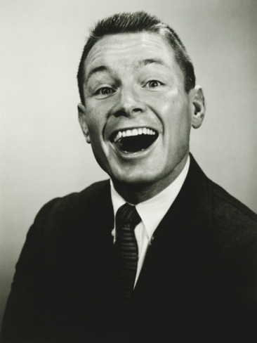
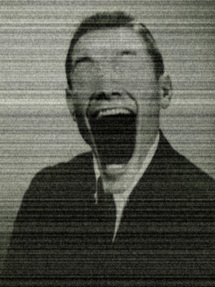

<section>

I loved horrifying images.

Pictures that could make one feel uneasy or even utterly terrified fascinated and delighted me. Yet for all of my appreciation and exposure, they worked their charms exceptionally well on me. I had trouble falling asleep most nights with the visions of these nightmarish things invading my mind and leaving it a smoldering wreck. From horror games to Internet screamers to the illustrations of Scary Stories to Tell in the Dark, I had a host of things in my head to keep me up at night. I was enthralled and terrified by nearly all of them.

The only exceptions were the images I'd created.

It was the March of my junior year in high school. I loved working with the copy of Photoshop installed on our school-issued laptops, and I made photo manipulations relatively often. The only thing they had in common was a complete lack of terror. One day, I set out to change that.

I'd wanted for a long time to test my ability to frighten with imagery. I had already established a reputation as a teller of terrible tales; if anyone ever wanted a good scare, they knew to seek me out. As happy as I was with spreading scary stories, I wasn't content with stopping there. I wished to expand my horizons as a fright-man. I found a song on my iPod that I'd acquired on a whim months prior, set it to loop, and searched Google for the perfect picture to make my monster. I found it in an image of George Marks.

The name wasn't familiar to me; but the picture, with George's gaping smile and his wide eyes, was exactly what I'd been searching before. It didn't take me long, perhaps forty minutes at the most. I stretched out his mouth, covered his eyes, and put a filter over it all.

I was in love.

A habit began to form. Like a drug, I became addicted to creating these abominations in Photoshop. I relished the horror of the images I'd made; I showed them around and received similar, aghast reactions from every last soul to gaze upon them. I relished the ease of which I could make the pictures. Most of all, I relished my absence of fear. I simply had to make more. One image every few months grew to one or two every month. From there, I began making one every week. Before I knew it, I was making one of these images almost every day.

As time wore on, I began referring to these images as my children. I had a folder filled with dozens of my children named MIRTH. I loved them dearly. They were macabre, Hellish, and all mine.

I was barely twenty. I'd left the house and set out from my hometown to live in a larger city a few dozen miles away. I was in school, I had a few good friends, and life was pleasant.

The only exceptions were the images I'd created.

My infatuation with them began to grow to unsettling heights. Not only did I need to create more of my children, I felt a need to be around them. There was a burning emptiness I felt when I wasn't in their presence. I heard faint, incessant whispers in my head while I was away from them. I had to quench this miserable emptiness. The whispers needed to cease.

I printed out several of my children and hung them up in my room, pox of a terrible disease on an otherwise average room. I made more, cut them out and made casings for my personal affects: my iPod, my wallet, even my laptop was covered with them. For a small price, I would do the same for others' devices. They became somewhat popular around my university. They thought nothing of my eagerness to perform this service. The consensus was that I was attempting to make a name for myself, and since I was quite skilled at designing and applying these cases, they also liked the appearance.

I can't remember when I began muttering. My children had crept further into the recesses of my mind and spoke with my voice. I would ask empty rooms why they weren't laughing. I would ask for the people around me to laugh. Sometimes these mutterings would escalate further, leading me to speak or even scream these messages of mirth. Thankfully, I only muttered when I was out and about. People knew I'd talked to myself for years; For as long as I (or anyone else) could remember, I muttered and spoke quotes and conversations from movies, television shows, and games. At that point, no one ever bothered to listen to what I was saying. The screaming only occurred on two occasions. One went without incident in the middle of the day while everyone else was at work or running errands. One earned me a noise complaint, but I explained to the landlord that I'd had a nightmare. The apartment walls were thick, and all they heard was the noise, no words.

There was one unfortunate incident, however. Several of my friends came to my apartment one night to socialize and make merry. We were all having a great time, clanking glasses, having quiet or loud conversations, spilling drinks, tearing through levels of cartridge-era video games, the sort of thing my friends and I customarily did.

It was two-thirty in the morning. The celebration had died down, and a few of my friends were passed out on my couch or in corners of the room. I had none of my children around me, yet I felt at ease. Kevin, one of my friends and the only one who hadn't been drinking, was on the Super Nintendo. He'd finished destroying a town he built on SimCity, and decided to play Yoshi's Island. As he played, I began to fade in and out of consciousness; I was rather intoxicated, and the night was aging.

When he got to the first of the Piranha Plants, however, I was slightly stirred. Its gaping mouth and its eyeless head reminded me of George. George was waiting for me, as were all of my other children. A single whisper passed my ear before Kevin destroyed the plant. Still, as they entered the screen, my head swam more and more with thoughts of my children. I could hear them in my head, begging me to return to them. I was able to keep them at bay for almost an hour before the mumbling began again.

I blacked out after they started. When I awoke, all of my friends were still in the apartment. I was in my room. They were all on my bed, looking at me. The children that were on the walls were torn down and heaped in an ugly pile in a corner of the room. Kevin had a bruise on his neck. I asked what the hell happened, and Kevin explained everything. We had been the only ones awake, and he could understand every word I was saying while I was muttering. He was concerned, but assumed I was talking in my sleep; I was out of his peripheral vision, and he was focused on the game.

After I began to vocalize my wishes of laughter, he put the game on pause to stare at me. I wouldn't be silenced, in spite of his requests to cease.

"Laugh," I begged him. "Why aren't you laughing, child?" After a moment of silence, I grabbed him by his throat, and at the top of my lungs I demanded he laugh. Being stronger than me, he broke free of my grip and restrained me. I shook and thrashed in the chair for twenty minutes before blacking out.

My friends were indeed concerned. They asked if I remembered what I was talking about. I told them about my children. I told them about our mutual need of one another. Of course, they issued forth more concern. While I was restrained, they turned on my computer. They demanded my login information for it, and I begrudgingly divulged, knowing exactly what they were about to do. They recoiled from my screen as they were greeted by George, who was now my desktop background. They quickly reset George and had him replaced by the default background. I watched as they deleted MIRTH, first sending it into the Recycle Bin and deleting it permanently from the green hills and blue sky that was my background. I feigned tears, but I wasn't truly concerned.

After they had finished destroying my children, they begged me to see a psychiatrist. They said if there was another outburst similar to the previous night, they'd see me into a mental hospital. On that note, they freed me from my bonds and bade me farewell before leaving. Upholding my friends' wishes, I looked up a local psychiatrist's office and set up an appointment.

I wasn't thrilled in the slightest.

I never felt at rest in a psychiatrist's office. I was used to being the quiet, observant one, and a psychiatrist is quiet and observant for a living. If nothing else I felt like my mind was being invaded when they would ask me questions. Between the threat on my identity and the feeling of intrusion, I endlessly debated with myself on whether or not to show up to my appointment. Half an hour before the appointment was scheduled, my sense of duty won out. I climbed into my car and made my way to the psych.

In the psychiatrist's office, I sat in the reclined chair. Dr. Ridley (or Pauline, if I so desired) began our arduous session by asking me about any previous incidents. I could remember only one. In eighth grade I was tormented by visions of a small girl in a pink dress. Her straw-like hair dangled in front of her face, and the bits of flesh that clung to her face were completely absent about her mouth. She would chase me, her exposed teeth chomping at me ceaselessly as I ran myself down and collapsed. She would laugh and stab me to death with a large, bloody kitchen knife. I simply would not die; it always took dozens of stabs to finish me off. Her laughter was terrible. I went to counseling, and after a short time the visions stopped.

After making some scribbles on her clipboard, she smiled and calmly asked me to explain everything about what was going on in my head now. I weaved for her the riveting yarn about my ordeal with my children, and she did exactly as I'd expected; she sat, nodded, scribbled something down on her clipboard, studied my face, scribbled, nodded, and studied all the way through my story in a methodical and agonizingly monotonous way.

I almost hoped she'd stop me in the middle of my story and ask other questions, offer explanations, hell, give me a hug, something! She said that she would research what I've told her and cross-reference any existing previous cases to determine a course of treatment. Almost pleasantly surprised, I smiled and nodded, thanked her, got the hell out of that clinic, and drove home. However close to being pleasantly surprised I was, I was still bitterly disappointed. I knew I had a problem, and I almost wished she had a solution.

Almost.

I was still in love with my children. I sorted out the pile of them on the floor and taped them up again. Their blank eyes and their big smiles made me feel so welcome. I opened my computer to be greeted by the hills again. I smiled and produced a small USB drive from my desk drawer. I plugged it in to my computer and opened it. There it was: MIRTH. I would never trust my computer to hold all of my children! What if it crashed? I would have lost them! The folder they deleted had only a fraction of the children I had in this folder. I opened up the folder and felt oh, so at ease. As I flipped through the dozens of horrors I'd made, I felt more at home than I ever had anytime else.

Yet tonight, something felt wrong. Perhaps it was my acknowledgement of my obsession that began warping my view. Their smiles seemed colder, their black-and-white faces glowed unnaturally and their blank eyes stared into me somehow.

I began feeling uneasy as I made my way through the folder. Every so often, my eyes picked up on text that would appear in the middle of the photos. The one phrase that kept repeating was, "WHY FATHER." The more I scrolled and browsed my children, the more my blood began to chill and my skin began to crawl. Other text began to appear: "WE LOVED YOU," "WE TRUSTED YOU," and, "FATHER LOVE US," popped up with increasing frequency. I don't know why I kept scrolling. I felt like I was tumbling down a spiral staircase and I could only stop when I–

when I reached the bottom.

The last photo was of me. It was amazing: it was in full color, my eyes were sewn shut, and my jaw stretched far below my neck. My lips were peeled back in mirth to expose long, discolored teeth. It was beautiful, brilliantly executed, and it made me scream. I didn't make this. I didn't–

I'm not sure what actually happened after that. The line between reality and delusion blurred. My mind completely derailed. The photo on the screen twisted and contorted at grotesque angles and in inhuman fashions.

"Love us again!!" it shouted in a tremulous, inhuman voice. I fell out of my chair, wailing. I landed on my back and stared up at my walls, from where all of my children stared down and laughed. In unison, they all began to chant.

"We do not love you anymore, Father!! Why aren't you laughing?!!!" they bellowed. They laughed and screamed and their blank eyes ripped open to drip blood onto my face. Their faces drew closer and closer to mine. I knew it had to be a psychotic delusion but was it? How could I be so sure? The first of my children took to the front of the horde, and its gaping maw enveloped my head. My screams were muffled by the void, my vision went black---

And I woke up on my bed. There were no screams now, only whispers. I could still hear my children whispering to me. Their voices slipped into my ears ever so gently.

"We don't love you."

"You should be laughing."

"Laugh, Father."

I laughed. I laughed for what felt like hours until I passed out from exhaustion.

My life since has been uneventful. I eventually found work in a small graphic design firm, and my life has been quiet. Still, some nights, I hear my children calling to me from the darkness of my room.

"Laugh."

</section>
