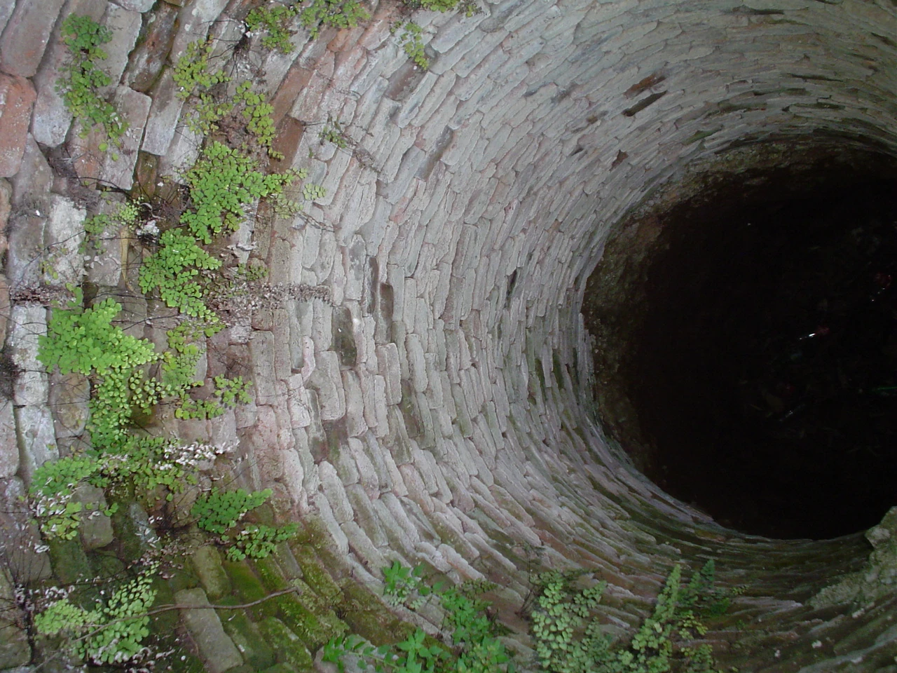

If you ever find yourself in LA's Old China town, head into the square. Go past the statue of Sun Yat-sen, past the hip-ultramod toy store called "Munky King" and look for an import store next to what used to be a wishing fountain. Go into this store and head all the way to the back, and you'll see a selection of weapons. Look for a weapon called a Jiujiebian, a sort of multi-sectioned whip. It MUST have exactly nine segments, no more, no less. This will be called the "chain of night". As of now, there are 48 notches in its handle. It will cost you 29.95.

Then, after that, go outside and wait till dark. As the moon rises, take a quarter from your pocket and cast it at the wishing well. As it lands, focus on that spot exactly and slowly chant under your breath, "By the circles of Lao-tzu, the void inside of matter, I call forth the spirit that lingers here!" This phrase is best said in the original Mandarin, but the spirit will understand a sincere supplicant regardless of language. A girl will step out of the bottom of the fountain, about nine years of age. She will ask you:

> "Where has my mother gone?"

You must respond with:

> "She has long since gone from earth, but look to the sky, and see her there!"

This spirit is not that of a little girl, but of a bog-hag, cursed to obey this one command regardless of who says it. At this moment, you must attempt to strike the girl with your newly acquired Jiujiebian. She will then snarl and attempt to fight back. Should you win, all the money ever thrown into the fountain will await you. If you fail, all that the folks in Chinatown know is that a bloody Jiujiebian lies at the door of the import store with a notch in its handle. To date, there are forty-nine notches in the handle.
