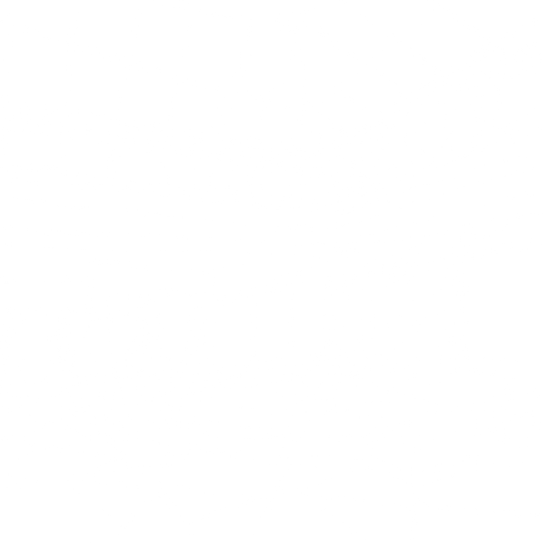





It was called Sleepy Pines Mall. A few miles off an interstate in America’s northeast, at the center of several small towns. It was a single story and only had two anchor stores, but it was sprawling considering its almost rural location. Built in 1973, it was one of the older shopping malls, and opened before there were long-term strategies on mall viability. Popular for a time, its occupancy dwindled in the late ’90s, and it lost its movie theater and Sears by 2003 before becoming a neglected, poorly maintained, and sometimes dangerous commercial plaza that was outdone by nearby rivals, and doomed by surrounding negative growth trends of the towns that kept it fed. The food court closed in 2006, and the last stores followed a year later. Sleepy Pines had its fans and grown adults who had gone there as children paying it nostalgic visits, as all malls do, but by 2010, it had become a mostly-forgotten derelict with a parking lot full of weeds.

Ten years later, a lengthy demolition was in its final stages. I had been assigned the foreman of the construction of the building that would replace it: a large warehouse and distribution center for a major retailer. I would frequently pay the site a visit as the walls were torn down and the roof was gutted, myself having gone to the mall several times in my youth whenever my family was passing through the area—so I knew its layout well. By the winter of 2020, all that really remained of the structure was the back wall of its atrium, which once overlooked the fountain. A painted mural on tiles covered that wall.

Efforts to save the artwork delayed its destruction several times, but enough funds were never procured to bring the wishes of perhaps only a few dozen to fruition. I’m no critic, but I always found it rather creepy, anyway. European settlers amid a backdrop of pine trees, with the Natives they drove out now instead depicted as their friends. Their faces were plain and simple, their eyes staring off into a space where there was once a skylight. On the other hand, the trees looked like they were made by a different painter, and one more talented. The pines were muted in their colors, but highly detailed, with layers of darkness in their shadows where you might expect mischievous forest creatures to reside. The swirling, intricate patterns of the nearly-black paint took the forms of deranged beasts if looked at closely enough. But I think it was just the artist having fun, and not acting out with ill-intent. It wasn’t like the vast majority of the shoppers would stand around and study the mural closely, not when there were sales to be found and warm pretzels to be had.

Now the mural itself would be coming down soon, and ground on the next building would be broken after the spring thaw. What little demolition remained was also put on hold while the earth was still frozen. I went to the site a few days after New Year’s, to get my last look at the public painting, exposed to the elements and surrounded by a landscape of snow. I checked in on the operations trailer while there, just to give my best wishes for 2021 to the guy in charge, who I had gotten to know over the years from various other projects.

“Hey, you still like strange shit, right?” he asked me after a few minutes of us chatting about our holiday get-togethers. “Got something you’ll love. My guys found it just before they left for the winter. I’m no good with electronics, you know. So you might as well see what you can do with it.”

He handed me a GoPro camera, an earlier model that I would later learn was from 2013. The little box was in bad condition. But I didn’t take into consideration *how* bad at first. And it was true, I did collect oddities and yard sale objects with inexplicable back stories in my spare time. It wasn’t the camera itself that might rival some of my greatest finds—it was the potential of the footage onboard it, if it survived. If it could explain *how* the poor thing had been beaten into such bad shape, then the story of the object would be made all the better. I had a long winter ahead of me with little else to do, so I figured I could spend a few nights cracking it open and seeing what was on its memory card.

“Jesus,” I replied as I studied it in my hand. “It’s like it… melted.”

“Yeah. We dug it up and couldn’t tell what it was at first. I have no idea if there was some kind of fire here, but it doesn’t even look like burn damage.”

He made a good point. There was no sign of smoke, no bubbles in the material, no metal fatigue. It was like something had turned it into clay and had its way with misshaping it into a twisted piece of art. The glass of its LCD screen and lens was intact, but the body was warped, stretched, and compressed as if by tiny fingers. If the memory card was still in one piece, I would never be able to pry it out. I’d have to carefully crack open the camera around it. Of course, I had a big collection of tools at home, so I knew I could do it. There was every chance the card was missing, or corrupted, or the data had been deleted, but now I was interested. I wanted to find out for certain.

I told my friend that we should have lunch sometime, and headed home. I was making good money, but I got to keep the house after the divorce and had yet to get around to moving out and finding a better place. It was a small place, and half of it was spread across cardboard boxes or otherwise just a neglected mess. My home office was the only decent room remaining, and it also featured my tool bench and the arsenal I would use to disassemble the scarred and malformed lump that used to be a high-tech recording device.

I managed to break it open and separate several of its pieces, and eventually the Micro SD card fell out from its slot. It was perfectly readable and full of video files, which I transferred to my computer and organized by date. There were 23 in all, most recorded over the course of two days in December 2013. With a cold, quiet winter outside my window, I turned up the heat, brewed some coffee, and went through the files, knowing nothing about the camera’s owner or what they experienced when I began. I will summarize the portions that are more mundane or uneventful, and fully transcribe the rest.

#### File #1

Recorded on a chilly morning, with the operator obviously testing camera settings outside their house. No address can be seen, and the surroundings are typical suburbia, making the location difficult to identify. There is snow on the ground. It starts with the operator saying “nice” as they zoom out on their new camera’s now-empty box. They’re inside their messy car, and they focus on the house for several seconds before the video ends.

#### File #2

The file created date indicates that this one was recorded just a couple hours later. A young woman, around 30, is watching a pot boil on a stove. She’s a small brunette with a bubbly attitude and big, blue eyes. I quickly discern that this is the operator’s girlfriend; they’re both happy and energetic, like they have their whole lives ahead of them. Definitely not married, and they’ve probably only been together a few months. I learn both of their names as the young man teases her a bit with the camera, and she remarks that she hopes he didn’t spend too much on the new toy. I’m not going to share their real names, so let’s just call them Mike and Jenna. They clearly really like each other, and the clip ends after he tells her, “This is a lot better than the old one. The mall videos are going to look great.” Jenna stirs some stovetop sauce and smiles.

#### File #3

Mike records some football in the yard at another house. Even though the clip was made only a week after the previous, there’s no snow present. In fact, everyone is running around in t-shirts, making it obvious that this was filmed much further south, away from cold weather. It’s a Thanksgiving gathering, and Mike is filming his three younger cousins toss around the old pigskin outside, trying his hand at some “sporty” action shots. It keeps going for about ten minutes, and friendly banter is shared among the family members. The cousins seem to like Mike, even as he keeps denying their requests to join in. At the end, Jenna walks out of the front door and tells everyone that the meal is ready.

#### File #4

Mike and Jenna visit a local mall in the area on Black Friday. It’s large, with two floors, and doing well. The place is packed, and Mike gets a few minutes of the mall Santa and the line of kids waiting to see them. Jenna looks at the camera and smiles again. Mike comments that he hasn’t been to a mall this busy in years. It definitely makes me nostalgic for the pre-pandemic days.

#### File #5

Mike is seen on video for the first time at the mall, ten minutes later. Jenna gets in some framing practice. Mike tries to humor her with grandiose gestures, like he’s introducing the place to an adoring, large audience. He says some things about the mall, but the crowds drown him out. The camera isn’t really known for its audio recording quality. This lasts several minutes as Jenna gets used to the device and how to hold it steady. Towards the end, she recommends getting some sort of mount for it, which it was designed to be used with. Mike agrees.

#### File #6

Things begin to get interesting. It’s now December 15, and Jenna is doing another camera test around sunset. Mike is seen crossing the frame several times as he moves about and she pans the camera. They’re getting footage of the front of Sleepy Pines Mall, which has just recently closed. Snow covers the neglected parking lot. Mike tries the door and looks frustrated that it’s locked. I hear the agitated version of his voice, as he remarks that they “should’ve come yesterday, now it’s too late.”

Jenna assures him that there must still be some way in, that someone had forgotten to lock one of the many doors. I understand now that they’re urban explorers of some kind—though they likely just kept things easy and focus on malls. Judging by Mike’s response about that “not being a good idea,” I figure that they hadn’t broken into a place before.

I recheck the closure date of Sleepy Pines, which was December 14. They had just missed their chance to legally or easily get inside and film a dead mall. Mike sounds ready to give up, mentioning how well their previous trip went to another mall in the region, and that they are “never going to get their subscriber count up at this rate.” Jenna isn’t so despondent. She wants to make her guy happy, and she mentions that since it took an hour to get out here, they should at least try to get in. Mike sighs, nods, and smiles.

#### File #7

Shot a half-hour later, and it’s now dark. Jenna is holding the camera, getting a selfie of both of them. They’re under a buzzing wall light somewhere on the side of the mall, near a cracked-open service door. They both look pleased, but it’s clear that they’re still amateurs at the newest hobby they want to do together.

“Hey, guys! It’s Mike and Jenna,” she says with awkward grin. “Um, so, we’re here at Sleepy Pines Mall, and we’re going to explore it together. If you’ve watched our first five videos, you know that we’re both interested in this sort of thing. We’re just going to go in for a quick look tonight, and then come back tomorrow during the day. I bet it’s *really* creepy in there right now.”

“All right, let’s do it,” Mike adds and side-steps inside.

He opens the door and beckons in the viewer, while Jenna snaps the camera into a shoulder mount. The service corridor is poorly lit, and the 2013 hardware doesn’t have the sensor chip to shoot in darkness very well. Digital noise fills the frame as they navigate their way into the mall proper, stumbling over some equipment, boxes, and cleaning materials that had yet to be removed from the area. Commentary is nearly non-existent until they find another door and emerge into a side hallway that brings them to the atrium.

Most of the mall’s lights are still going, although the mural is bathed in shadow, giving its already creepy staring faces an ominous presence in the nearly empty building. For several minutes, the couple of explorers walk around, getting footage of the vacated stores. They reach the other end of the mall and head back to where they began, saying very little as they collect footage. The clip ends with a ten-second hold on the mural, during which Mike can be heard laughing after Jenna remarks, “yeah, that’s a little scary.”

#### File #8

The two definitely don’t have a script. As they perform a longer second walkthrough, they chat idly about how they feel about the place and experiences from past visits to other malls, just to fill dead air. Jenna is at least a competent cinematographer, even if her boyfriend leaves much to be desired in the information and anecdote side of things. If they weren’t planning to add some interesting voiceover narration in post, they would have two very dull videos on their hands.

It’s around the five-minute mark in this clip, while Jenna shows off the closed dollar theater, that Mike finally mentions some personal history. I learn that he used to live in the area as a kid, and has fond memories of visiting Sleepy Pines, back when it had busy weekends and few closed stores.

“Some of my earliest memories were of coming here with my dad when I was five,” he tells Jenna. “So it must’ve been around 1991? I met Santa, right over there.” He points to wide-open liminal space under a skylight in the center of the mall. “It’s sad what happens to these places, how the memories fade over time, you know?”

“Is that why you were so mad when you found out you missed its last day?” Jenna asks, now keeping him in frame like they’re having an interview.

He shrugs. “I paid a visit a year ago when it was already deep into the shitter. It would’ve just been symbolic or something. We’re both here now, right?” He pauses and looks away. “You ready to go? We can get more footage tomorrow, during the day. We just have to keep that door from locking.”

“Yeah. Place is starting to get to me. Empty malls at night are unnatural.”

They turn around and head towards the hallway where they came in. On the way, Jenna suddenly stops and swings the camera around. She stares into a lightless corridor, so dark that the sensor can’t pick up anything. A posted sign indicates that the mall security center is at the end of the hall. She lingers on it for an unusual amount of time, and Mike asks off-screen what she’s looking at.

“Don’t you hear that?” she asks, nervousness in her voice.

I turn up the volume as much as I can, but nothing strange passes through my headphones. If she’s hearing something, the camera didn’t pick it up. She looks into that corridor, as if more petrified by fright than curious. In the end, it takes Mike dragging her away to break her focus, at which point she seems to snap out of it. The clip ends with Mike staring at her and asking “what’s wrong?” If she gives him an answer, she does so when the camera’s off.

At this point, I get onto YouTube and search for their names. Adding “mall” into the search form on a second try brings me to their page. They really were just getting their start; their channel only has six subscribers, five videos with only a dozen views each, and no uploads for over seven years.

I skim through their videos, all visits to other malls, and find nothing out of the ordinary. Their most recent upload started showing the signs of professionalism, with some of that voiceover narration they badly needed. Mike shares some history of the empty mall in another state they visited, and he does so with some enthusiasm. He and Jenna smile throughout their trip and look like they’re having a good time walking through a shopping plaza of memories. They were one of YouTube’s earlier dead mall channels, and they had some promise.

But seeing their inactivity only all but confirms my worries that something bad had happened to them. And a few minutes of Googling later, I find out they had been reported missing in early January 2014, at least a full two weeks after they started working on their ill-fated video. Naturally, I get the urge to skip to the end to find out what may have happened to them, but I convince myself to keep going through the files in order and take this trip with them as their latest expedition’s first viewer.

On a second look at the last few minutes of this file, I notice two pink pixels in random spots of the video. I know it’s a sign of sensor damage, and I trace it back to when Jenna focused the camera into the dark hallway. After thirty seconds, one dead pixel shows up. A little later, the next arrives. It’s as if there’s something at the end of that corridor that is emitting a damaging, invisible light or other energetic phenomena which steadily overloads the camera sensor. But I don’t know what else could do such a thing, other than a powerful laser, or radiation. Eagerly, I move onto the next clip.

#### File #9

The dead pixels are here to stay. They’re present throughout the video.

I see Sleepy Pines’ exterior again, this time early in the morning. Mike stands at the side entrance, his breath filling the cold air. He gives Jenna a thumbs-up, and she comes over and points the camera at the both of them.

“I’m Mike.”

“And I’m Jenna.”

They then add in unison, “And today, we’re exploring Sleepy Pines Mall!”

Cute.

They proceed inside, and arrive at the atrium without cutting the shot, even when there’s no reason to keep things all in one take. But Mike must have done some research while at whatever hotel the two stayed at the night prior, as he starts going over the basic details of the mall. Its opening date and designer, a brief history of the area, a few controversies about its construction and maintenance record, and the stores that have come and gone—all get a mention, though not in a scripted way. Mike has all this stuff memorized and jumps from one bullet point to the next. Still, I’ll give some props to the guy for remembering so much and getting it all out on the first try.

“Did we get it that time?” he asks when they return to the atrium, where the fountain still hosts some coins and is half-full of stagnant water. He smiles after Jeanna quietly responds and adds, “Okay, keep that one.”

So, not *actually* their first try. I don’t know how many attempts it took, since they must have kept deleting prior takes to keep memory space free.

Before Jenna stops recording, Mike wanders around a little, looking into empty stores. Eventually he suddenly notices that the red light remains on.

“You still rolling?”

“Mike, I think we should check out the security area.”

He sighs and looks a little annoyed. “You *still* care about that?”

“Come on, we’ve seen just about everything else. We should get *everything* on film before they tear this place down, or there will be rooms that are, you know, forgotten forever. Never archived.”

“We don’t need to be *perfectionists*.”

“But you went on and on last night about visits here with your family and friends, your memories of the holiday decorations and seeing dollar movies.”

“*Really*, Jenna? You’re saying all this on camera? At least shut it off.”

The shot lingers a few moments longer, before Mike looks fed up and starts approaching the camera. He’s about to grab it when the clip ends.

I guess every relationship has arguments, but it’s a strange thing to have a fight about. It almost sounds like Jenna felt something was “calling” to her.

#### File #10

Mike now stands in front of the dark hallway, although now with the sunlight coming in through the nearby skylight, it’s no longer pitch-black. Mike looks like he’s under just a little bit of duress. But I understand, knowing myself that sometimes you just have to do what your significant other wants.

“All right, so… let’s take a *quick* look down this hallway,” he says, lacking his typical enthusiasm. “It’ll be a place you probably only saw if you tried to shoplift something or, you know, *filmed without permission* like only criminal scum would do.”

“Mike!” Jenna exclaims.

He fakes a smile and says, “Let’s check it out.”

The camera has already acquired a third dead pixel before they even start moving into the hallway. More pop up as they get closer as the sensor becomes more and more permanently damaged. But with the camera on her shoulder and Mike leading the way, Jenna doesn’t notice.

It quickly becomes too dark for it to pick anything up again, but Mike turns on his phone’s flashlight, which at least helps it show anything that within its cone of light. They enter the security office and freeze for several seconds, an old desk and monitoring station in frame.

“What *is* that?” Mike asks. “Do you hear that?”

“Yeah. Some sort of electrical buzzing,” Jenna answers. “Weird, right?”

“What the *hell*, Jenna? Why are even checking this place out? One of us is going to get electrocuted. Can we please get out of—”

“Okay, okay. I thought there would be more to see.”

She turns around to leave, but then looks back at Mike again after realizing he isn’t moving. He’s staring into a small room to the side. His light is on a sign that reads, “Lost and Found”. Now he’s the one that seems to be under a spell and just has to know what’s beyond the next door. Without saying anything, he opens it and goes inside, and Jenna silently follows.

What follows is… difficult to describe. The video goes almost completely dark. For some reason, Jenna doesn’t point the camera to whatever Mike is looking at until the end of this clip. His phone light is only seen at the very edge of the frame. They both examine what is evidently a strange object.

“What is that thing?” Jenna asks.

“No idea… Never seen anything like it…”

“Oh, god, it’s almost like it’s… moving. Mike, don’t!”

“It’s warm. How’d this get here?”

“Stop touching that thing, it’s dangerous!”

“There’s no such thing as a cursed object, Jen. I think we should get this thing out into the light and get a better look at… Oh, shit.”

“What did you do? Mike, what’s it doing?”

“I don’t know, I didn’t—”

They turn and run out of the room, but the camera still can’t pick up anything they might be hearing. The two are frantic and the video, what little there is to see, becomes a shaky mess. By now, scattered pink pixels partially cover the video, completely obscuring entire small segments of the frame.

The two can be heard screaming in the last few seconds of the clip, which ends abruptly. With the darkness, I have no idea what kind of terror the two might have experienced. I would have thought they were already dead if this had been the last file on the card—or, at best, someone else found the camera and recorded more video before they also mysteriously disappeared.

Analyzing the clip frame by frame reveals two elements that just barely got burned into the digital film. As they turn to run, Mike’s light sweeps over the strange object they came upon. It’s some sort of totem, made out of unknown dark material and maybe about three feet high. It sits in the middle of the lost and found room, on the floor, and is the only thing in the place at all. It’s covered in carvings that form angular patterns—though I use the term loosely, because there is no real pattern to the lines at all. They swirl and break off from one another in random, unappealing ways. It’s like one of those AI generated images that *almost* looks like something familiar and identifiable, but is never quite anything that really exists. Even so, it didn’t look entirely alien, or forged by some forgotten tribe. It could’ve been someone’s art piece, found at a garage sale many decades ago, its history and origins now long obscured.

But the strange totem wasn’t the sight I found *really* frightening.

I don’t think Mike and Jenna saw them before his phone light suddenly cut off, leaving them in darkness. I can’t confirm whether or not they’re moving or just writhing in place, but on the walls of the security room is a spreading sea of long, solid black worms. I don’t know how else to describe the things, but it’s obvious in the few frames I get of them that they’re no trick of the light or other optical illusion. Worms, molding over the wall, like they’re devouring it.

After re-watching the entire clip several times, I close the video and try to wrap my head around what I just saw. I almost dread finding out what happens next, and I delay myself from opening the next file by refilling my coffee. It’s around midnight when I move on, to a recording made three hours after the last.

#### File #11

I open the file with no expectations, and it right away defies explanation. While the smattering of dead pixels lingers, it’s as if the past trauma the couple just experienced isn’t a thought in their minds. And at first, it’s like they’ve gone to another location—and put on some new clothes. Or rather, *old* clothes, because it looks like Mike pulled a wardrobe out of the late 80s and changed inside of a brightly-lit dressing room. All in the span of a few hours.

Mike stands smiling, though he has a nervous twitch. It’s apparent in Jenna’s camerawork as well, because her shot now has a constant tremble. The device is also no longer mounted, judging by the shakiness of the video.

“H-hi, guys,” Mike says after taking a deep breath. “*Well,* you’re never going to believe what happened to us. If we get out of this…”

“We *will*,” Jenna replies, though there’s no confidence in her voice.

“Right. R-right… Um, it’ll be better if just show you.”

He gestures to a mirror in the dressing room, and Jenna walks up to it to show herself in the reflection. She now looks sharp in a bold red blazer and Capri pants, and her hair is fancifully styled up in a way that would take hours to achieve. But it’s the camera itself that’s even stranger. Holding it with two nervous hands, she brings it close to the mirror, and… it’s no longer a GoPro. It’s not even a digital device anymore. It’s now somehow a classic Polaroid, one of those old instant cameras.

“Yeah, weird, right?” Mike continues. “It doesn’t have a screen on the back anymore, but it has buttons, a-and… all of the on-screen information is *inside* the viewfinder. I don’t know why, or how, but our clothes changed, too. It’s like… I don’t even know how to say it. Oh, man. We’re going to get *millions* of views, baby. We’re going to be on *talk shows*, and *scientists* will want to—”

“Mike! Can we please just get out of here? It’s… It’s too confining.”

“All right. Yeah. Let’s keep showing them.”

The two leave the dressing room and step out into a fully-lit, packed Dillard’s department store, just like the one Sleepy Pines used to have. But I hadn’t seen one so busy in many years. And as Mike and Jenna keep pretty quiet and give a tour of the place, I steadily realize why it seems so off.

Like their clothes, those on all of the shoppers and staff, and those waiting to be worn on the racks and shelves… Everything is dated. It’s all fashion from around thirty years ago. Mike at one point even grabs a polo shirt and, with a stupid smile on his face, brings its price tag right up to the camera, remarking about how it’s so cheap.

“Do you get it yet?” he asks the viewer. “I mean, it should be obvious what happened to us, right? We didn’t believe it ourselves at first, but—oh, sorry, man,” he tells an older shopper he had bumped into, who only responds by turning around and giving Mike a curious look. “Come on, let’s see the mall. We haven’t left this store yet… Needed some time to get over the shock first. I wish we had gotten some of that recorded. Jenna was *crying*, all hysterical.”

“Mike!” she replies disdainfully. “You’re taking all this way too lightly. How can you *not* be terrified of what’s happening to us?”

He frowns and admits, “A part of me is, baby. But we can’t explore this place while only being scared and worried. We can at least get it all on record, in case something happens to us and the camera is all that’s found.”

“Don’t say shit like that, Mike! None of this is normal!”

“Hey, come on. I’m right here, I’m with you. We’ll get out of this.”

Jenna begins to cry, and the camera points down at the floor. Mike can be heard saying, “Let’s talk—” just before the clip ends.

I go directly to the next one.

#### File #12

It’s a few minutes later. The camera is now pointed toward the main thoroughfare of Sleepy Pines, past the Dillard’s entrance. The shot lasts for about thirty seconds, during which dozens of shoppers walk by, many of them wordlessly glancing at the camera for a moment. Mike then walks into frame and guides Jenna out into the mall, though her movements show she’s still reluctant. I pull myself and my chair closer to my monitor and watch intently.

I hear something familiar and nostalgic come through on my headphones. I turn on the noise-cancelling so I that I feel even more engrossed by what I’m experiencing. Mike doesn’t even know what to say about the enormity of the situation as they approach their exit. I hadn’t given myself time to process the previous clip, or how the look of the store could have been pulled off through some elaborate set dressing. The obvious but incredible answer to all of this still had yet to feel like a valid thought in my head.

Mike isn’t the only one startled when a large woman suddenly enters the frame. One second, it felt like we had been exploring uncharted territory together, and the next, there’s a big lady in a pantsuit threatening to spray him with a bottle of amber-colored perfume in a crystal bottle.

“I told you, we don’t need a sample, lady!” Mike snaps at her. “Jesus.”

“Oh, but this is our new fall scent! There’s nothing else like it on the market! Just one whiff, and you two will fall in love all over again!”

She seems aggressive, and she keeps trying to spray Jenna and Mike as they shove their way past her. For about a second, her unsettling toothy smile fills up the frame as the camera itself nearly smacks into her.

“What the hell’s her problem?” Jenna asks once they’re in the safety of the mall.

“They could be like that,” Mike sighs and looks up at the skylights. “Just maybe not as bad, from what I remember. Crazy bitch. You okay? She didn’t spray you, right?”

“Michael, *what* is this place?” Jenna asks and points the camera at the ceiling, revealing the blue sky beyond the horizontal panes.

The camera settles back on Mike, and for several seconds, he grins in a way that’s almost as unsettling as the perfume lady’s smile. I can hear the tinny, echoing music better as Jenna waits for her boyfriend to say something.

It’s genuine, traditional Muzak. Those light co-opted renditions of pop music that went out of style years ago that’s barely heard anywhere anymore. Somehow fittingly, as Mike grins like an idiot, Toto’s *Africa* fills the air.

“Are you really going to make me say it?” Mike asks.

“There *has* to be some other explanation. This all can’t be real.”

“Babe, we’re in the *past*! We found some sort of time-traveling device, I’m telling you!” He turns about and soaks in the mall, adding, “My guess, 1990, maybe ’91. All of those 1980s styles are on the way out, and everything is so colorful. I’m talking post-Cold War chic, Jen.”

“Then why did our clothes change? Why did the *camera* change? Where did our phones go? We need to make sure there’s a way out, or a way to go back, before we start trying to have fun. I don’t want to be trapped here.”

“We’re not here to have fun. We’re here to make history, maybe even be a part of history. We’re *filming* the past, babe. We’ll document everything we see, and then we’ll find that weird thing again and figure out how it can send us back to 2013. But we *could* stay a while, right? I mean, this decade is *so* much better than the one we came from, with all that social media shit and dumbass ‘challenges.’”

“I wish you wouldn’t say that. Our friends and family are there, Michael. Our future together. We can’t stay.”

Mike sighs. He doesn’t want another argument; he wants to explore what he thinks is the past, some small piece of his own childhood. The shot lasts another few seconds on his impatient face before the camera pans down. I get a look at Jenna’s shoes to see that they’ve turned into a pair of red high-tops.

#### File #13

This clip goes on for over ten minutes, and it’s a proper mall tour. Jenna quietly films every store they pass without argument, while Mike tries to provide some commentary. But he’s often distracted, overwhelmed by amazement every time he looks into a shop, or sees a person walk by in nostalgic clothing, or finds a treasured piece of media from the era. He forces Jenna to spend several minutes just in Sam Goody, so she can get every audio cassette, early CD, or video tape in at least a few frames of video. All the while, Mike is overly excited and Jenna seems wary of the crowds. The shoppers almost approach an uncanny valley. They *look* like regular people, but they act like emotional automatons, staring vapidly at the two like they are intruders in their home. She notices them, as do I, but Mike hardly seems to consider whether or not something is off with everyone other than himself and his girlfriend. He’s under the effects of a siren call brought about by his love for a romanticized past.

They pass by a brightly-lit hair salon with colorful geometric shapes on the walls and a checkerboard floor. The three women seated inside are all getting the exact same hairstyle. The small movie theater’s marquee lists as now playing: *Total Recall*, *Gremlins 2*, *Terminator 2*, *City Slickers*, *The Rocketeer*, and, ironically, *Back to the Future Part III*. We see more mall store staples, many of which no longer exist anywhere. A KB Toys, a Walden Books, a Merry-Go-Round filled with clothes for teenagers. I recognize most of the places, and sure, I miss seeing them if I think about it, but they all had their time, and I don’t worship the past like Mike seems to. While it’s certainly interesting to see all of these old stores in modern high-definition, dead pixels aside, I find myself just hoping the two make it out.

Sleepy Pines looks very different overall. It has big blue, red, and yellow painted lines running along its wall. Neon lights cast their glow on indoor trees and lounge areas full of boxy chairs and couches. Coin-operated rides sit out front of the arcade, for the kids too young to venture in and play the cabinets that bright and noisy pixelated games inhabit. I can empathize with Mike, being a kid during this snapshot in time, wanting to go back and feel something genuine again if he believes the present is shallow and hopeless. But that idealism isn’t going to find either of these young adults a way out.

All the while, the calm cheerfulness of the mall music undercuts the rising dread I begin to feel about a situation I’m helpless to change.

“Wow,” Mike says wistfully as they reach the Sears at the other end of the mall. “It’s… It’s great, Jen. What an experience. You got all that, right?”

“Yes. Now can we go back to the lost and found? We need to get that thing to send us back home.”

“I wonder if the younger me will show up if we wait around… Baby, I don’t think you appreciate all of this enough. How often do you get to take your girlfriend to the *freaking past* and show them someplace that meant so much to you?” After waiting for a response from her that doesn’t come, he sighs, nods, and says, “All right, fine. Let’s get a good shot of the mural on the way back.”

They head to the mall atrium, where Jenna lets the mural fill the frame. It’s incomplete, and even creepier for it. Two-thirds of the forest segment is done, but the five figures standing in front of it have yet to be painted, and are just a solid ghostly white. I didn’t know that the whole thing wasn’t finished all at once. It suggests that there might be something to my idea that the poorly-drawn pioneers and natives were added by a second artist. Maybe even just as an excuse to cover something up on the original background.

“That’s weird as hell,” Mike says as he looks at the artwork. “We must’ve been brought back to one of the few days when the mural was still being made.”

Jenna grumbles and starts to pressure him to focus on getting themselves home, but is interrupted when mall security comes over and reminds the pair that they can’t just shoot pictures in the mall without permission—unaware that their mutated camera is actually filming video.

“Sure, no problem,” Mike is heard saying after the camera goes to Jenna’s side and is pointed at the floor. “Hey, can we check your lost and found? We think we, uh, left something behind when we last—”

The clip ends, as abruptly as I’ve come to expect.

#### File #14

The next file was created four hours later. I’m seriously concerned about what might have happened in the time in between before I open it.

Mike and Jenna are staring at the camera together. They’re back in one of the Dillard’s changing rooms, where they might feel safe. The light flickers above them, and now they both look noticeably stressed.

“Hey, guys…” Mike tries to find the words and wraps an arm around Jenna’s shoulder. “Um, so… Here’s the part where we have to tell you that things aren’t looking good for us. I still don’t know how or why we’re in the past, and we can’t find the thing that brought us here. We’ve looked all over. Every store, every back room, every staff room you could think of… And it feels weird trying to sneak around, you know? The people here are always looking at us. And I don’t think any of *them* have left, either. They’re all the same shoppers that were here when we arrived. Something is wrong with this place. I should’ve seen it earlier, but I was busy being too stupid about everything.”

“The doors out are all locked,” Jenna adds tearfully as she seems to come to terms with their situation. “We tried all of them, and t-they won’t budge. We picked up one of the pay phones, but there’s not even a dial tone.”

“We’re going to tear this place apart if we have to. We’ll find that thing, whatever it is. But just in case we don’t make it out, and you find these videos, please call my parents. Their home number is…”

“Mike, shh,” Jenna suddenly shushes him.

She points towards the edge of the frame, and Mike turns the camera around to show the gap at the bottom of the changing room door. After several seconds, a pair of large feet stuffed into high heels steps into the space. They turn towards the door, and it rattles violently. Jenna can be heard suppressing a scream. The door keeps shaking for about a full minute, before the assault on it finally ends. Without saying a thing, the large woman on the other side walks off.

As upset as she is, Jenna picks up the camera again, nearly dropping it as she films Mike cracking open the door and looking around. He gestures for her to come out, and they make an exit from the store by sneaking behind clothes racks and keeping quiet. The other shoppers look at them again, but don’t bother them. Just before they can leave, Mike gets a shot of the perfume lady standing near the store entrance. I recognize the shoes and realize that she must be stalking the pair at this point.

Without warning, she turns toward them, and they duck behind a display table full of polo shirts. I pause on a frame of her face and see how hideous she has become. Her bulbous face is covered in bright red lipstick, sky blue eye shadow, and bright pink blush, but it all does nothing to help with the fact that she has greasy, disheveled hair and yellow, crooked teeth.

After a few seconds, the camera pops back up. The perfume lady is gone.

“Where is she?” Jenna whispers.

“I don’t know… We just have to get out of the store. We never should’ve come back in here. We *knew* the door would be locked, just like the others.”

“Mike, we have to—”

Jenna is cut off by the sound of ruffling fabric. She and Mike both flip around to see the perfume lady staring right at them from the top of a clothes rack. She’s slumped over some of those chrome bars, her blob-like arms dangling down like she’s an obese sloth with a murderous glint in its eye. She curls her lips into a demented grin and holds up the perfume bottle seemingly glued to one of her hands. Mike and Jenna quickly work up the nerve to get on their feet and make a run for the store entrance. Judging by the sounds coming from behind them, their pursuer knocks over the entire rack and crashes into more displays as she gives chase.

There are expletives, terror, and panic in Jenna’s voice as she and Mike dash out towards the mall. She briefly turns the camera back to capture the crazed lady on film. She’s become animalistic, running on all fours with eyes as black as a shark’s. Jenna lets out a shriek as the feral beast gains on them.

But the perfume lady stops right at the boundary of the store, as if there is an invisible barrier she can’t pass. After catch his breath, Mike flips her off, and the woman simply regains her composure, getting back on two legs and returning to the cosmetic department, that grin never leaving her face.

“What the hell, Mike? She’s not *human*. No person acts like that,” Jenna shouts at him. “We need to get out of this place, *right god damn now*.”

“I know, Jen, I know! At least she still can’t leave the store. Shit!”

Mike tries to calm himself down as the shoppers stare at him, most of them now just standing around as if they’re NPCs who have run out of walk-cycles. He points the camera up at the skylight, revealing that it’s dusk. The neon lights of the mall now determine the colors, splashing everything in hues of reds, purples, pinks, and blues.

I can also hear that the Muzak has slowed down and become distorted, like a talking electronic toy with low batteries. The audio seems to unnerve Mike, who closes his eyes to think but can’t get comfortable enough to do so.

“It’s like this place is starting to fall apart,” he mutters out the same thought that had just crossed my mind. “Jen, we need to find something heavy. Hammers, crowbars, maybe just a trash can. We’ll smash our way out.”

He proceeds to shove his way past the crowd of zombie-like onlookers, yelling at them to get out of his way all the while. Jenna follows at a distance, getting a face full of their staring eyes on the way.

They briefly stop near a display of a red 1990s Corvette, where a nearby small film crew seems to be trying to make a commercial. Hot lamps hit the sweating face of an older man in a gray suit. He repeats the line, “A lot is happening at Sleepy Pines Mall. Why not come see what’s new today?” several times as Jenna also films the scene. Mike then loses his patience and enters the shot, but the attempt at making a commercial continues.

“You’ve been here for *hours*,” Mike tells the crew angrily. “Who are you people? How did you get in here? What ad agency do you work for?”

“Michael, stop,” Jenna quietly pleads. “Don’t antagonize them.”

“They’re not even real. They’re mindless, running on some kind of script.”

With no concern for consequences, Mike knocks over the lights, *and* the expensive film camera, and then steals the tripod. Jenna doesn’t know what to make of it, and she just stands in place in shock as Mike walks away with the bulky piece of equipment.

And, actually, Mike seems to have a point, because the actor simply keeps repeating the same segment of the commercial several more times with the crew watching and going through the motions.

The camera pans down to the floor and the clip ends.

#### File #15

It starts with Mike midway through another swing of the tripod against a glass door. He’s been at it for a while, based on his apparent exhaustion. He lands the heavy, metallic tripod plate against the glass several times, but he has yet to crack it. The glass doesn’t even seem to have any give to it; he might as well be hitting a brick wall. The vintage cars and trucks in the parking lot outside *seem* real, but I’m not sure. There are no people outside in the darkness, yet the couple are trapped in the mall with hundreds of them, so everything beyond its walls may not even have reason to exist. Whatever time travel trickery is going on, it likely can’t extend past the building in which it was triggered.

Jenna can be heard quietly sobbing. She pans to a trash can on the floor, knocked over, and she gives it a kick, giving me the impression that she had used it to join in the effort before she gave up and started filming again. I also notice that the Muzak is now completely gone, replaced by a monotone buzzing sound. Mike hits the door twelve times in all, working up a sweat and eventually hopelessly collapsing to the floor. The recording of his effort then ends.

#### File #16

The camera sits on a table in the food court. It’s getting late, but it looks like all of the places are still open. The pair have cups of soda and slices of pizza on paper plates in front of them, but they both look hesitant to eat. It isn’t that they’re only losing hope of escape—they’re also *afraid* of the food. I can’t blame them. They’re also mostly in shadow, now lit only by the neon lights.

“Are we really going to eat this?” Mike asks listlessly. “I mean… who knows what it’s made of.”

Jenna murmurs back, “We have to eat something. We’re starving.”

Mike looks into the camera and says tiredly, “Yeah, so… The clocks here say it’s two in the morning. And things just keep on going. It’s a 24/7 mall now, I guess. We couldn’t last much longer without eating or drinking something. If this is what ends us, at least you’ll know it wasn’t the perfume lady…”

In one of the few acts of bravery I’ve seen Mike exhibit across the videos, he takes a sip from the cup before Jenna—slowly at first, before gulping it down thirstily. She then does the same with her drink, and they soon look a little more confident about trying something solid next.

“Well, it *tastes* like Dr. Pepper,” Mike says and examines his pizza. “And it looks authentic enough. Even though I don’t think much of anything is *real* in this place. Okay… before it gets cold.”

He takes a bite, chews, and eventually swallows. Deciding it tastes edible enough and is worth the risk, he quickly gobbles up the rest, while Jenna remains more reluctant and takes her time with her food.

“It’s too dark in here,” she says, looking around. “All of the ceiling lights shut off hours ago. But the people didn’t even seem to notice.”

“We’ll try to get some sleep in the arcade,” Mike tells her. “All of the games are still running… I think that’s the most light we’ll get.”

“What’s going to happen to this place?”

“Maybe… eventually, the dream ends and we wake up?”

“Even the guy at the Sbarro didn’t speak, or ask us for any money…”

“Yeah.” Mike then deadpans a joke, “No wonder the chain is dying off.”

They sit, drink, and eat quietly for another minute before the video ends.

#### File #17

This one takes place entirely inside the mall’s old arcade, which closed in 1998. The only sources of light are the flickering cabinet screens of games on their demonstration modes, but there are so many that the place remains the brightest locale of the mall at this point.

Mike holds the camera this time, but I don’t know what he’s trying to archive, other than the miserable conditions the two have found themselves in. He makes a few rounds around the arcade cabinets, muttering incoherently to himself. Kids and teenagers fill the large room with a carpet featuring planets and stars, but none of them move. Some have their hands on joysticks or buttons; others just stand and stare with arms at their sides.

Mike tries to illicit a response from one of the kids, getting the lens right up into their face. Their eyes are glazed over, looking straight ahead as the light of a fighting game reflects off their large pupils. They’re just as catatonic as everyone else. Mike throws a swear at him, before going over to the prize counter and getting a shot of all the toys he’ll never be able to claim.

“I went to a good university,” he tells his audience of one, and turns the camera on himself so he can speak angrily directly into it. “I had a good job lined up. And I liked the 1980s, the ’90s. So what? Doesn’t mean I want to be stuck in some shitty bizarro version of nostalgia. I never want to visit a mall again. And the camera battery… It should’ve died a long time ago. But the icon says it’s still full. Nothing is right. It’s all wrong. We’re never getting out of here.”

Still filming, he goes over to one of those large cabinets that you can sit down inside of for some privacy and immersion. It’s an old racing game with a steering wheel, and Jenna is curled up on the seat, facing the wall, sleeping or trying to. As this file was created five hours after the previous, I get the feeling that Mike couldn’t sleep, or gave up trying.

He decides to let Jenna be and slumps down onto the carpet. Several cabinet screens are in frame, the kids in front of them now lifeless silhouettes. Mike can be heard getting emotional for a few minutes, over the noises of the games. Suddenly, he hears a loud metal clang outside, echoing down the mall’s corridor. He jolts up and points the camera at the darkness outside that only the neon lights can penetrate. His breathing is shallow and rapid.

Nothing shows up, at least that he can see, but he still ends up running into a small utility closet—without alerting his girlfriend to a possible danger—and closes the door. Following another few seconds of a pure black image filled with digital noise and dead pixels, the video ends. I assume he eventually fell asleep in that cramped space, and that the experience was beginning to wear on his sanity by this point.

#### File #18

The camera is aimed up at one of the skylights, where early morning light is coming through. It’s possibly about 8:00 AM or so, meaning Mike and Jenna are nearing twenty-fours spent in the mall. Mike pans down to show the mural and the fountain in front of it, where Jenna scoops up a handful of water and washes her face. Around her are the mindless shoppers, all of them still idle despite the fact that the place seems to have never opened or closed.

This version of Sleepy Pines, whether it really existed in the past or not, just *is*. I’ve come to realize that it represents the memory of a mall, when people are there to remember it. Times where it is empty and dormant don’t factor into this corrupt amalgam of its golden days of service.

The speakers are still pushing out some sort of noise, but now all I can hear are atonal crackles.

Mike approaches Jenna, leaning forward and staring at her reflection in the fountain. She looks at him as he draws near, now looking incapable of ever smiling again. I still worry about Mike’s mental state, but she doesn’t seem afraid of him. She’s just tired, or starting to resign herself to their imprisonment.

“Jen, are you hungry?” Mike asks flatly. “The Cinnabon still seems to be running. I could get you… something.”

She shakes her head and replies, “Mike, we need to find a way out today. Whatever it takes. We can’t give up… We just can’t…”

“I know. We’ll try something else. I was thinking maybe the air vents…”

Jenna looks like she’s about to say something, but instead goes back to looking into the fountain. After several seconds, she takes on an inquisitive expression and leans forward. She stays in frame, but I get the impression that Mike’s actually looking elsewhere while the camera remains pointing at her.

Jenna takes out one of the coins from the fountain and studies it.

I can barely hear her murmur, “Michael… Look at this…”

Mike doesn’t hear her, and shouts, “Jen! Run!”

The camera swings around, and I see the perfume lady aggressively approaching at a fast and unstoppable walking pace, the Dillard’s far behind her. It’s the first time we’ve seen her leave the invisible boundary of the department store, and Mike and Jenna seem shocked about this as well.

The large woman still has a perfume bottle in one hand, but there’s no telling what she really wants. Not ready to find out, the couple start running.

#### File #19

An hour after the previous video ended, Jenna gets the camera going again to show Mike crouching down between some washing machines and peeking around the corner of one of the big white cubes. They’re somewhere in the Sears store.

“I think we finally lost her,” Mike sighs and slumps against the machine. “Crazy *bitch*. Why is *she* the only one still moving around?”

He shakes his head and looks up to see that the camera is recording.

“Mike…” Jenna says quietly. “There might be a way out, or… *something*.”

He grumbles back, “What are you talking about?”

“Don’t get your hopes up, but… I found a… Here, just look.”

She hands him a quarter, and he checks both sides of it. He looks at Jenna like she’s crazy at first, but then realizes why she sees it as important.

“It’s got state art on the tails side… That didn’t start until around 2000.”

“Yeah, it’s from 2005. I don’t think the coins in the fountain were affected by any of this. Something to do with the water, maybe?”

“That doesn’t make any sense.”

“None of this does. But maybe there’s something we can do with water. Whatever took us to this bizarre version of the past… Maybe water is the answer, a way out.”

Mike frowns. “So, what? Should we jump into the fountain, hold our breaths, and hope for the best? Or do you want to open up all the faucets in the mall and flood it? How does this big revelation *help us*?”

“We have to keep trying, Michael! And we need to talk. We need to understand what happened to us, and what this place really is, and why we’re here. I don’t think we’re *really* in the past. Didn’t you notice how early it got dark yesterday? There aren’t any holiday decorations here, and all the fake people are dressed like it’s summer, but the day didn’t last any longer than it did before.”

“I mean… Yeah, I guess…”

“I think that device somehow *recreated* local history, by altering all the nearby material. But it isn’t perfect, and it can’t sustain it for long. It’s not stable—it’s all breaking down, and we’re running out of time.”

“That’s *insane*.”

“Have any better theories? Do you think we *actually* went to the past?”

Mike takes on a rather vapid expression as he thinks for a few moments, before replying, “Then what’s the deal with the perfume lady?”

“I don’t know. Maybe she’s guarding the place. Maybe she’s the thing keeping us here. She’s *hunting* us, she’s a threat, so I say… let’s just try to kill her.”

“How?” he asks, and rather stupidly in my opinion.

“We could start by *trying*. Why don’t we bash her over the head and see what happens? She’s not real, Mike. None of those people are real.”

“All right, yeah, fine. We’ll smash her head in and see what comes out.”

He tries to act tough for his girlfriend, but he can’t back it up. After he agrees to commit some form of homicide, the two hear a noise, and he panics just as much as she does when they see the silhouette of the perfume lady against the light of the Sears’ exit to the parking lot.

I’m not sure whether she was just standing there looking menacing, or started chasing them again; the clip ends just as the couple start running.

#### File #20

With only four files left to view, I know that Mike and Jenna’s journey is coming to an end. This one opens with Mike holding the camera at himself, and behind him are boxes of shoes—he’s at a Payless or a Footlocker. He has his free arm wrapped around the camera tripod from earlier, which rests against his shoulder. He must consider it the best weapon he could find.

“We think it’s been over twenty-four hours since all this started,” he tells me. “We’re prepared to take on that perfume bitch now, mentally and physically. But we don’t know where she is at the moment… But you gotta see this.”

He gets up and goes to the store entrance, where Jenna is standing guard and looking into the hall. She’s holding a metal bar in one hand, I think taken from a clothes rack, and a fire extinguisher in the other.

“Look at them,” she murmurs. “They’re getting worse.”

Mike gets a little closer to one of the nearby kids, but still keeps a safe distance. Thick black ooze, moving as slowly as hot tar, is dripping out of the boy’s mouth. Smaller streams of the stuff come out of his lifeless eyes. Mike pulls back and pans the camera to reveal that the surrounding adults are suffering from the same affliction. Still, they all do nothing but stand quietly.

Jenna walks into the frame and says, “This is what I’m talking about, Mike. This place is falling apart. First, it’ll be the more complex things, like the people. Then the rest of it will follow. The whole building.”

“But not us, right?”

Jenna doesn’t have an answer, but there is doubt in her eyes.

They move away from the store, Jenna ready to strike with her crowbar. Everyone they pass is disintegrating from the inside out, but none of them act aggressively, or move in the slightest. Mike points the camera up to the skylights, where a miasma of black specks is rising and beginning to smother sunlight. As he pans back down, he catches on film one of the shoppers losing their arm. It simply breaks off and falls onto the floor, where it slowly melts into a pool of black liquid. At this point, they’re out of expletives and just accept it.

Even the movie theater’s marquee has been corrupted, or is “glitching” like a crashing computer program. The only two legible titles are *Casablanca* and *Gone Girl*, neither of which came out anywhere near the supposed emulated time period in which the two are trapped. The other spots on the marquee are jumbles of letters and numbers, and a pile of them is building up on the floor by the box office. Mike turns away and focuses on the fountain they’re closing in on. The mural behind it has lost all its elements and is now a solid black.

Jenna runs over to the water and looks down into it. She dips a hand in, and then steps in fully, submerging herself to just below her knees.

“You really expect something to happen?” Mike asks as he catches up. “You’re just getting soaked. Might be hard running in wet, squishy shoes, Jen…”

“Maybe we won’t have to run anymore if this is our way out.” She looks down at her feet and mutters, “Come on… Do *something*…”

“What are you hoping will happen?”

“I don’t know. Maybe for my shoes to change back.”

Mike gazes into the fountain, bringing the camera close to its surface. He notices the coins, and takes one out to look at the year it was minted.

“You were right,” he admits. “You’ve been putting more thought into all of this than I have. I guess anything’s worth a shot at this point.”

He points the camera straight up for about a full minute, leaving a bit of his hair in the frame as the clouds of dark particles thickens above. After he has some time to think his deep thoughts, he swings it back down and gets a shot of Jenna’s shoes again. They’re still red high-tops, and she expresses her disappointment with apparent anguish.

I don’t know how long she stayed in the fountain, since the video ends a moment later, with Mike trying to be considerate and offering assuring words.

#### File #21

Over two hours later, Mike gives me a shot of the skylight again—only now, the dark particles are burning away into a thick mist that almost fully obscures the sunlight. It moves like boiling water, forming a wriggling cloud all across the top half of Sleepy Pines. The writhing mass reminds me of the worms crawling on the wall from earlier.

But it gets worse. The camera sweeps down to the walls of the atrium, where large tiles are breaking loose as more black ooze pours out and spreads across the floor. Jenna walks toward the camera, trying hard not to step in the gunk. She stares at Mike for several seconds, and then keeps walking past him.

“Place has gone to hell…” he mutters into the microphone. He then asks Jenna, “Are we doing another walk? Nothing’s changing with the doors. The people and the stores are almost gone, but the doors are still solid, Jen…”

“If everything is burning off or melting, then a way out *has to* emerge.”

“Yeah, maybe… But we’ve been going back and forth for a few hours…”

“I’m going to the food court to see if there’s anything left.”

“Not sure that’s a good idea.”

He follows her anyway, and they cross through a hallway that looks more like a moving, dripping cave system of black magma than anything human hands made. I think it’s all being reclaimed by the device that projected a version of the mall that emulates its past—but one that never really existed.

They make it to the food court, now nearly pitch-black as its primary light source, sunlight, has been all but completely blotted out. The food is darker still. The sub sandwiches, Chinese noodles and rice, and Sbarro’s pastas and pizzas have lost their color and form as they also turn into slag.

“There’s nothing left…” Jenna sighs. “God damn it. I’m so hungry.”

“I just hope that, you know, what we ate before passed through us enough and we don’t have any of this nasty stuff inside us.”

The two look down at the one of the shoppers’ heads on the floor, separated from its body and still staring ahead mindlessly in a pool of its own gunk. They don’t remark on it. It really must be a common sight by now.

“Mike?” Jenna says, while the camera is still pointed at the floor. “What is it?”

“That kid… You’ve got to be shitting me.”

“What about him?”

Mike walks off, only bringing the camera back up when he’s a few feet away from a young boy, five or six years old. His gooey insides are still intact, for now, and he looks blankly into space like all the others. I put the pieces together on why Mike suddenly sounds so upset just before he confirms it.

“Jen, that’s *me*. Why am I here? Why…”

She comes over to get a look at young Michael, and then tries to comfort the adult one as he keeps the camera on the kid’s eyes.

“It doesn’t mean anything,” she tells him.

“How can you say that?”

“Whatever created this place just… It pulled from a pool of faces, maybe full of everyone who ever came here.”

“But that could be over a million people. Why did I just now find the young me? Where was he? How does… *whatever* this is know who I am? This is all so screwed up. It’s messing with us.”

“You know we’re never going to get an answer. Let’s just go back to looking for a door. Or maybe focus on staying safe until a path opens for us.”

Mike takes a deep breath and turns the camera back around to show the two of them again, both clearly exhausted.

He works up the confidence to say, “The next time we turn this thing on… we’ll be filming our escape. Or already back in our hotel room. I’m sick of this place. I think we’ll be taking our channel in a different direction after this.”

They both lock eyes and share a brief kiss before this video ends.

#### File #22

Unfortunately, Mike lied. Created another two hours later, this one starts with *another* shot of the skylights and part of the wall right beneath them.

But now, finally, it seems things are reverting. The thick fog of particles has disappeared, and there’s a few feet worth of the more recent, aged atrium wall between the ceiling windows and the black goop, which is no longer actively moving. Instead, the material is now like a dried, flaking crust. A few chunks break off of the mass and turn to dust on the way down. It’s as if the 2013 version of the mall is emerging from a cocoon.

“Hey… It’s us again, hopefully for the last time,” Mike says and gets both of them back in frame. Their eyes are half-closed, and they look ready to sleep for a week. “Well… we still couldn’t find a way out… But it’s starting to look like we just have to keep waiting a little longer. Sleepy Pines is returning to normal.”

“Very slowly,” Jenna adds.

“Yeah, look at this.”

In a sweeping 360-degree shot, he shows off the atrium and the three main hallways. It’s all coated black, including the floor, turning the place into a demented Dali painting. It absorbs all of the color and most of the light, but there is enough sheen to the crusty darkness to make out its melted wax shapes and texture. The two stand to avoid sitting on the stuff, since all of the chairs and couches are also gunkified. Even the fountain has been affected, and it’s now just a solid black basin that still holds its water.

“All the people are gone, melted into the floor,” Mike sighs. “The, uh… *fragrance fiend* has been MIA for a while now, so… I think we scared her off or something, and it’s all coming to an end.”

I begin to feel some relief myself, after having an elevated heartbeat for nearly an hour from the safety of my office chair. I start hoping again that they made it out, but just dropped the camera on the way. I look at the little thing on my desk, my mind still trying to process the idea that it had been twisted into a very different size, shape, and model before being twisted right back again.

Mike goes on to say, “We still don’t know what happened to our phones, so… hopefully we’ll be able to flag down a car, get some food, get back to our hotel room, close the curtain, sleep… Sound good, Jen? … Jen?”

He looks over to see her staring down at her shoes, which he quickly gets into frame. They’ve changed back into a modern pair of sneakers.

“Mike, it worked…” Jenna murmurs.

“Y-yeah, I guess. It just took a long time. Did you feel anything?”

“My feet tingled for a second, and then I looked down, and—” she stops suddenly as a loud, thundering crack echoes throughout the atrium.

“The hell was that?” Mike exclaims and swings the camera all the way around to show a large segment of the melted black wall near the KB Toys store breaking apart. “Jen, I think it’s speeding up! We might be able to get out in just a few minutes!”

“Oh, thank god,” she breathes out.

The wall cracks again, and then a torrent of ooze which never dried comes pouring out. Mike takes a step back, and the three of us watch in dread as an inky arm emerges from the opening, its claw-covered hand grasping the side to tear open the rest of the chrysalis. Like a grotesque insect emerging from inside, four more arms spring out and quickly rip apart the shell.

A deformed, hulking dark mass over seven feet tall lurches forward, its four legs and nine arms wriggling about as if they’re trying to free themselves from the true owner of the body. The disgusting and horrifying chimera has five mouths, at least that I can see, but only a single eyeball manages to protrude from the dripping fleshy shadow.

Multiple voices, all of them dissonant and guttural, manage to gurgle out, “Try… our… new… fall scent…”

“Jesus Christ!” Mike yells out and grabs for the tripod, resting against one of the lounge chairs.

Before he can grasp it, the monstrous creature emits a loud buzzing sound—the camera picks it up this time. For Mike and Jenna, it’s so painful and deafening that they have to cover their ears. In doing so, Mike ends up flinging the camera away. It lands at an angle in the melted floor, where the dried ooze covers a part of its lens. The moment the shrieking begins is also when more dead pixels start to appear, much faster than when it happened previously. Every two or three seconds that pass, another one pops up.

I’m still able to see enough of the scene that follows to discern what happens next. Though in pain, the couple manage to get their weapons, and as the creature stumbles into the frame, Mike hits its body and multiple arms with his tripod several times with as much force as he can muster. Jenna jams her metal bar into its body, but it gets lodged into the mass and starts sinking into it. When she realizes she can’t pull it out, she begins spraying the creature with foam from the fire extinguisher. It seems to slow it down, but that isn’t enough for either of them; they know they need to destroy it, or at least try to.

Its body covered in foam, and maybe blinded by it, Jenna shoves the entire red canister into one of its mouths. Mike bashes the extinguisher in deeper with the tripod, and the handle audibly gets squeezes within its maw. More foam is dispensed directly down its gullet, paralyzing the abomination.

Jenna grabs Mike’s hand and gestures toward the fountain, I guess seeing it as their best option—though I lack the information to know exactly what they expect it to do for them. Even so, they run off into the background of the shot and visibly jump into the water. They don’t emerge before the video ends.

In the last ten seconds, after the foam stops pouring out of the creature’s mouths, it collapses to the ground—where it starts crawling towards the fountain, screeching and sprouting more arms as it does so.

With over half of the video’s pixels either dead or showing nothing but the blackness the lens is sinking into, the clip finally ends on its own, likely because the camera is too badly damaged to continue recording.

#### File #23

I want a conclusion, but I should have expected that I wouldn’t get one. My PC never generated a thumbnail for this final file, so I knew in advance that there would be something wrong with it. The warning about it being damaged doesn’t deter me from trying alternate ways to see inside it. The file size is over 25 MB, so there has to be *something* within its bits.

Eventually, after trying several file restoration and video editing programs, I manage to extract some information. It’s nine seconds long, though that means little when everything about the file is corrupted to begin with. The audio is nothing but a loud buzz similar to what the creature let out, and nearly every frame of video is just a mess of the jumbled greens and blacks of more unreadable data. Even so, I want to say I did everything possible, so I go through the video frame by frame—all sixty of them for each second.

Only two frames, one five seconds in and the other just near the end, survived and are decipherable, despite still having a flood of pink dead pixels.

The first is a single frame still of Sleepy Pines during the day, looking normal with a few shoppers walking about. Many of the stores are closed or empty, but the arcade is still open, placing this image sometime before 1998 but after the events across the rest of the files.

The other one takes me back to where it all began, showing the totem in the lost and found room, blurred by camera motion. It’s a duplicate frame from File 10. The remaining several hundred frames remain corrupt, and the date created for #23 defaults to the Unix time of January 1, 1970.

I don’t think the last file was created by pressing the record button. My guess is that it was generated via hardware error, possibly while the camera was reverting back to its natural form. But that doesn’t explain where it could have pulled that picture of the mall in decline, taken years later.

I stay up another hour into the night, researching anything I can think of about the mall, or Mike and Jenna. I find the commercial we saw being shot by the Corvette on YouTube. I almost believe I might see the couple walking about in the background. But I go through the retro thirty-second spot for the mall several times, and none of the featured smiling shoppers look anything like them. Even so, seeing all the era-appropriate clothes and the appearance of the mall make me appreciate just how accurately the strange, unknown, and missing device managed to recreate the place from the past.

And then, at four in the morning as I’m starting to crash, something casts doubt on the genuineness of everything I just saw. Although Mike never posted about it on what little social media presence he had, I find out through another student’s Facebook posts from Mike’s university days that he attended several special effects classes in his junior and senior years.

I go to bed thinking about what this might mean, and how it really could have all just been an elaborate underground art project. Maybe Mike had melted several cameras and placed them about in abandoned malls to attract attention to himself or become the star of some new urban legend. He and Jenna could very well be missing on their own accord, just to make it all appear authentic.

Even with those doubts, I go through the files several more times across the following days, looking for any giveaways that everything was faked, albeit very well. But I’m not very good at spotting the tricks he could’ve used, or seeing the imperfections in any elements you’d need a computer to render.

I have lunch with the buddy who gave me the camera a week later and tell him all about it. We end up having a laugh, and he gets me out of a rut that resulted from my viewing experience by telling me that he was almost certain it was all faked, because it just sounds “too Hollywood horror” to be true. In a few years, Mike, and maybe Jenna as well, would surely emerge as modern artistic visionaries, and everyone that had found a copy of their videos would have something worth a small fortune on their hands.

But despite saying all of that, as we head out of the restaurant, he does mention two final little details. The camera, it turns out… was found somehow *embedded* inside one of the mall floor tiles. Oh, and one more thing. Early in the demolition, his crew found a metal bucket in one of the food court kitchens with several unexplainable bite marks around its edges, like “someone with a strong pair of chompers snacked on it.”

He gets quiet for a moment after revealing these findings, but then grins and adds, “Maybe those two kids were just *that* good.”

Maybe.

But I can’t bury the part of me that believes everything I saw, and knows deep down that what happened to Mike and Jenna is, in fact, a mystery.

While I’m still in the area, I drive to what remains of Sleepy Pines one last time. And on this visit, I get a *really* good look at the mural, coming up close to it, while my mind fixates on what might have transpired on the now-barren grounds. I try to remember what it was like when I was younger, back when I first visited the mall and had studied the intricate swirls, finding secret critters among the dark forest.

At first, I think they’re all still there, just waiting to be broken apart and tossed into a landfill. But on closer inspection, I find that the elegant brushstrokes of the nighttime woods suddenly end and are not present in the last third of the mural on the left side, where it was still blank and incomplete in Mike and Jenna’s videos.

The paint is still there, as are the trees and dark colors of that ominous forest, but the subtle texture only the touch of human hands can create has been replaced by something mechanical; what was changed and then changed back is now an unfeeling reproduction that could never get right the true authenticity of real historical art, made by someone who cared.
