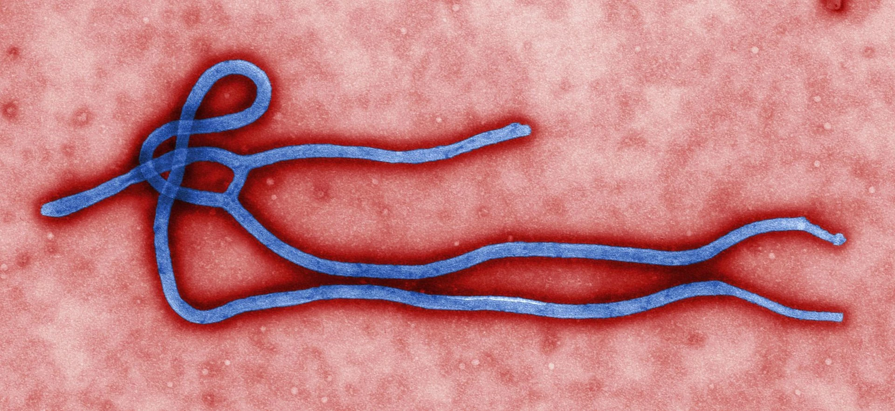

#### August 16th, 2014

Before I get into this, I need to make something clear.

This isn't happening right now. I'm not going to beg for advice or help, because I'm beyond any of your help. I've had to give up everything in my life that ever mattered. This happened more than 9 years ago, and I'm finally taking the risk to share it. World events are seriously scaring me, and I have more...personal reasons that I can get into later.

To post this, I've driven around town for forty minutes before I found an unsecured internet connection. I'm not risking posting this from my own. I made a throwaway account, which has no ties to anything related to my life. I'm well and truly fucked, and it's all because of an email that I should never have received.

In the summer of 2005 I thought I had everything I ever needed from life. I had just finished grad school and begun teaching English at a local community college, had married the love of my life that January in an awesome and geeky ceremony, we had moved into a fix-it-up bungalow on three acres of land, and we had just rescued an Elkhound puppy from a local shelter. Life was good.

Looking back, I wish I had enjoyed those days more.

My wife (I'll call her Fay, not her real name) and I had just finished working outside one night in July, and we were relaxing with a beer on the porch. Fireflies were doing their little "I glow, you glow, we all fuck like rabbits” dance, and our puppy was gnawing on a pair of my socks I had tied into a knot for him. I asked Fay if she would mind if I checked my email before we went to bed; I was expecting a notification about the classes I was going to teach in the fall, and was looking forward to actually using my degree.

Fay went up to bed, and I logged into my work email account. There wasn't an email from my department chair, but there was a new email entitled "Progress of EBOV-7x.” I figured it was spam, but I impulsively clicked on it anyway. The email's intended address was literally two letters off from mine, and it came with an attachment named "E-7x results and suggestions.” It was addressed to a man named Mark, and it read as follows:

> "*Mark,*

> *Attached are the prelim results from the last batch of tests on EBOV-7. The x-generation seems to be holding up much better to the modifications. Remember this is EYES ONLY, so don't print this out or anything. You're new here, and we all think your help is really what's gotten us off the ground on this. If you have anything to add, let me know ASAP.* Provided this gen holds up, we'll have a much better quarterly report for the bigwigs than we did last time. Don't wear the tie with the mustard stain on it, OK?

> *\-Reagan"*

I had no clue who either of these people were, and I didn't recognize the domain name of the email address. The only part I could make out was "Detrick.” Just as I finished reading it, Fay called and asked if I was ready to head to bed. I told her I would only be a minute, the cursor hovering over the download link for the PDF file. Every reasonable part of me said to just delete the email, to pretend I never saw it...but, as you can probably tell, I was youthful and impulsive. I clicked the download link, and after a few seconds, the downloaded file popped up in my downloads. I opened it, fully expecting it to be password locked---I mean, from the tone of the email, wouldn't you? It wasn't. Fuck, I wish it had been.

After it opened, I was bombarded with sentences so thick with scientific lingo that I had difficulty even parsing them out. I was a Liberal Arts major, for fuck's sake. There was one diagram I recognized, though, from having a friend in undergrad who majored in epidemiology.

It looked like the picture below.

For those of you who don't know, that's Ebola.

I skimmed down, until I finally found a paragraph that summarized what I had been struggling to read:

> "With the iteration of EBOV-7x and the hiring of new personnel, we believe we have finally addressed the main desires of the client. EBOV-7x contains the following alterations from the base EBOV-0:

> *A) Increased incubation time of 12 to 40 days as opposed to EBOV-0 incubation of 2 to 12 days.*

> *B) Suppressed the lack-of-appetite common in EBOV-0, thus removing one of the major diagnosable tools.*

> *C) Increased durability of the virus, allowing it to remain hot for up to 8 hours outside the human body (See Test 100BA for applicable data).*

> *D) Decreased rate of fever increase by 20%, allowing for upwards of 35% more time before patient becomes immobilized."*

I pushed my chair away from the computer and simply stared for a minute. I rubbed my eyes, and reread the paragraph over and over again. I couldn't believe what I was reading---what would be the point to this? Who would want these changes to an already deadly virus?

Taking a deep breath, I forced myself to relax. I wasn't an expert on anything related to Ebola, but one of my strengths had always been an ability to think outside the box and move past my own internal assumptions. I asked myself, what purpose would these changes have? What would be the goal behind it?

As I asked myself that, the answer came to me quickly. It wasn't about making a vaccine, or wanting to remove the danger from the virus.

Someone was altering Ebola to make it less noticeable, to make it less easily diagnosable.

Someone was making a version of Ebola that wouldn't burn itself out.

A version of Ebola that COULD be a pandemic.

Holy Shit. Holy. Fucking. Shit.

On pure autopilot, I copied the file onto a USB stick and put it in my messenger bag I used for work. I marked the email as unread and deleted it, then went upstairs to bed. As Fay snored beside me and the puppy curled himself into the crook of my neck, sleep did not find me. I had no clue what to do. Should I go to the police? The news? Should I just forget it ever happened?

Eventually I fell asleep, and got up the next morning. I debated telling Fay about the email---I had never kept anything from her for the four years we had dated---but I decided against it. For all I knew it was nothing, and there was no reason to worry her.

I drove to work, and tried to forget about it. I worked on getting my office situated to my liking, and was about to call Fay to meet me for lunch when two men in dark suits knocked on the open door.

"Yes?” I asked.

"Dr. George?” they asked. (No, that's not my real name. You won't find my real name.)

"Yes?” I repeated.

"This is Mr. Rein, and I'm Mr. Frol,” one of them said. If you asked me now, I wouldn't be able to tell you which was which. They were both middle aged white men, brown hair, clean shaven, and wearing dark sunglasses. "You may have received an email from our company server by mistake last night. Did you?”

OK, I'm gonna have to cut it off here. The family whose WiFi I'm ripping off have looked out the window four times at my car, and now someone has a phone in their hand. I'll have to be more careful next time. I'll be back as soon as I can. Stay safe.

#### August 16th, 2014

OK, back everybody. I'm being a bit more careful this time; I'm still hijacking this family's WiFi to post this and browse reddit a little, but I'm here in the middle of the day now. The only one home (from what I can see) is the wife/mom, and she hasn't noticed me yet.

Some of you are probably wondering why I even bother to drive 40 minutes to do this---I'm not comfortable even writing this out on my home network, let alone posting it from there.

I've lived in 60 different cities since this happened, and I like where I am now. I really don't want to have to move again.

Anyway, when I had to cut out last time, I had just been approached by two men in suits.

At that moment, I had never been so appreciative of my grandparents teaching me to play poker. I frowned and looked upward to the left, acting like I was trying to remember. (In case you're wondering, the idea that looking up & to the left suggests telling the truth while the opposite suggests lying is a myth. Doesn't stop people from believing it, though.)

I told them I had gotten it, but that I had marked it as spam and deleted it. "Would you mind showing us?” one of them asked. He smiled and took his sunglasses off, probably in an attempt to appear more cordial. The second kept his glasses on, which made it impossible to see where he was looking. "If we don't ask, our bosses are guaranteed to give us hell for it,” No-Sunglasses said.

I agreed, and logged on to my university email. I pulled up the trash folder, and showed them the (apparently) unread email. "We really do apologize for this,” the first man said. "We've been installing new internal servers and we've been having trouble with stored addresses and queuing emails. The new system is meant to automatically find the correct email address, but it's been attaching wrong domain names to IDs that are close.”

They watched as I deleted it totally, and seemed content. Each of them shook my hand, reminded me that the email was under corporate nondisclosure, and walked out. As soon as they were gone, I shut the door and collapsed into the chair at the computer. What kind of company was this? How in the world did they find me, find where I worked, and send people in less than 24 hours? I looked at the USB stick in my bag, but didn't touch it. In some weird way I worried I had damned myself with it, but I couldn't shake the feeling that it would end up being more important than not.

I finished up my workday, and headed home. The next day was Saturday, and we needed to mow. While some of you might think "Why would mowing take a whole day?” I can only respond by saying that one of the downsides of having land is taking care of it. We had two tractors so that Fay and I could mow at the same time and finish in as little time as required.

Before I explain what happened that Saturday, you need to understand something: without fail, I serviced those tractors every time after we used them. I cleaned the mower decks, sharpened the blades when they needed it, and double checked the engine. I checked oil and gas before AND after using them.

Yes, I'm a little OCD. It's been of more help than harm.

Fay and I each typically used the same tractor, but she had told me that her tractor had felt like it was pulling to the left instead of going straight ahead. I told her to use mine, and that I would check it out. She started the tractor, and began to mow our field. The tractor worked fine for about 15 minutes, then the engine began to splutter and cough. I noticed it, and waved for Fay to stop. She did, shutting the tractor off and starting to walk towards me.

Several things happened all at once.

I stood up, walking to meet my wife halfway.

Fay walked towards me smiling.

Out of the corner of my eye, I saw a dark maroon sedan slow down as it drove past our house.

The tractor exploded behind my wife into a fireball. Pieces of metal and rubber flew in every direction, and the shockwave knocked Fay forward onto the ground.

The blast of heat hit me full in the face, and felt like I had dropped face-first into a bonfire.

I ran to her, scared shitless. She was fine, though the wind had been knocked out of her. I moved her to the garage, told her to call 911, and ran back to the burning husk of my tractor with a fire extinguisher. I used the entire extinguisher, but I couldn't get the blaze to totally stop.

The next few hours were a blur. The fire department showed up, followed by police. The neighbors gawked from their front porches, and we were asked the same questions again and again. The cops asked if either of us had any reason to suspect foul play---God help me, I should have mentioned the meeting with the two men at work and the email, but I kept my mouth shut. What would I have said, anyway?

"Well gee Officer, I received an email last night from a company making a biological weapon out of Ebola and today two men in dark suits showed up at work to ask me about it in a vaguely threatening manner?”

I would have laughed at that myself, had someone else said it.

By the time everyone had left, we were exhausted and starving. We loaded up the puppy into my car and went to Fay's parents' place, where her dad cooked on the grill and I got lectured on the importance of taking care of my tools.

Thing is, I did. Still do. There was NO reason for that tractor to explode.

After dinner, we went back to our home. There was a huge circle of blackened dirt and burnt grass in the field where the tractor had exploded, but otherwise there was no sign of the circus that had filled our lives only a few hours earlier. Fay was exhausted, and she went straight to bed.

I couldn't sleep. I kept running over every check to the tractor that I had done, trying to see where I could have gone wrong. The fuel lines weren't loose, no matter what my father-in-law insinuated. There had been NO reason for it to explode. Now properly feeling my paranoia, I needed to double-check the other major property that I gave my OCD an outlet on: the guns.

Yes, I owned guns. I grew up around them, and they're only tools. Treat it with the proper respect, and there's nothing inherently wrong with them.

We had a shotgun in the living room, on top of the television stand. There was a handgun in the kitchen, a holster screwed into the bottom of the cupboards behind the fluorescent light for the counter, and a revolver my wife kept on her nightstand. Lastly, I kept a Mare's Leg in the basement, hidden in the pantry behind rows of mason jars filled with pears and peaches.

I cleaned these every Sunday, disassembling them and making sure they were in order. As I walked through the house checking each gun, the firing pins were missing. Let me repeat that---the firing pins, from the guns I cleaned every Sunday like clockwork, were missing.

The only gun that hadn't been tampered with was the Mare's Leg downstairs; the lines of dust hadn't even been disrupted, and the gun was still able to fire without complications.

I went back upstairs and sat in the living room, trying to let my wife rest while I had a panicked breakdown. In the span of less than 24 hours, I had learned a company was apparently making a biological Ebola weapon, been confronted by men in suits who claimed to represent said company, had one of my tractors explode nearly killing my wife, and had come home to find someone had tampered with my belongings in an attempt to make me unable to defend myself.

What the fuck was going on here?

My first concern was for Fay: was someone targeting both of us? Just her? How would I be able to protect her?

I thought back over the day, and remembered the maroon sedan that had been driving past when the tractor exploded. There was nothing noteworthy about it, but an instinct told me to watch for it again. I added "gun shop” to the errand list on the fridge and went to sleep, resolving to keep an eye out for the sedan.

It didn't help.

Over the next weeks, I recognized a pattern of three distinct cars following my wife and I around town. There was a black Honda, the maroon sedan, and a dark blue motorcycle. When I would take the puppy outside, one would inevitably drive down the road while I was outside. When we would go to the movies, one would be parked within five spaces of our car. I even started to notice them at family gatherings, driving past when one of my cousin's had a birthday party or when we visited Fay's grandmother at the nursing home.

At the same time, more accidents began to occur around our home.

The heat would miraculously go out, only for a repairman to say that we lucked out "because if I hadn't come when I did, you'd have a pretty serious buildup of carbon monoxide here.”

The springs on the garage doors suddenly began failing, almost crushing the puppy when I was working outside.

The power brakes went out in my car, forcing me to cruise down the breakdown lane on the highway until I eased to a stop and put the emergency brake on.

Did they know, somehow, that I had downloaded that information and kept it? Were these really accidents, or attempts on my life?

After three weeks of this, I got out of bed in the middle of the night and checked the guns again. No missing pieces, and I sat in the dark to think. Deleting the information wouldn't help; if they knew I had it, they wouldn't know I deleted it. If push came to shove, it was the only leverage I had.

The email had come to me by mistake, so it wouldn't be logical to assume Fay had read it. She had been on the tractor I usually used when it exploded---it was clear to me that I had been meant to be on it, not her.

The "accidents” had only started around the house since the visit by the two men, Rein and Frol. I hadn't seen them again in person, but the trio of vehicles were ever-present.

A real part of me wanted to take my guns and go hunting, but this wasn't the Wild West. I wasn't going to risk someone getting shot in crossfire, and I wasn't sure if the police would accept my story. If this company had the capacity to find me in less than twenty-four hours, how could I be sure they wouldn't fabricate evidence against me?

Should I tell Fay about all of this? She was my wife, my partner; I knew she'd be in my corner one hundred percent, but I couldn't risk her safety. Looking back, I know this sounds chauvinist. I'm not---Fay was more talented than I was in a lot of areas -- but I was raised to believe that a man protects his family, no matter what. Discounting the problems with the ventilation systems, everything that had happened was directed at me. If I told her, she'd become as legitimate a target as I apparently was.

As long as these people kept trying to...proactively silence a leak, I suppose would be their way of saying it, my wife was in danger of being collateral damage. Her remaining that way was not an option, and I had to think of a way to ensure her safety permanently.

I was out of options, at least the ones that left me in a position I wanted to be in---namely with my wife, safe, in the life we had built.

The only option I had left that would keep me alive and keep my wife and family safe was one I didn't want to do: I had to disappear. Vanish, out of the clear blue sky, and make it as close to impossible as I could to follow me. Once I was off the grid, I could find a way to either expose the company or make some kind of deal with them. I couldn't expect Fay to follow me, nor would I want to expose her to that level of danger. I would have to abandon the love of my life, every accomplishment I had earned, in order to survive this---at least temporarily.

I was so fucked.

#### August 16th, 2014

Back again---I'm not sure if it's just because I miss everything that made life familiar, but this family has really made me smile. Just knowing normal life continues, you know?

I doubt anyone is monitoring r/nosleep, and having some human interaction where I can be honest is refreshing. I never thought anybody would honestly care, so thank you to everyone who has commented.

I said I've lived in 60 cities, which sounds like a lot. Some were as short as a week, others were a few months...but once you start moving, it's hard to stop.

When you decide to disappear, it isn't nearly as easy as it sounds. Everyone tends to assume that it's easy to drop off the grid totally, to just walk away from the life you've lived up to that point and choose a new path.

It isn't...at least, not if you don't want to eventually be found again. It isn't as simple as "take the money out of the bank, stop going to work, go to new town.” To give myself a head start, and to make sure it was clear that Fay wasn't involved, I had to do the legwork to provide misinformation to the people chasing me.

I'm not going to go into a whole breakdown of how I managed to vanish. If you really want to plan it for yourself, there are plenty of materials available. I'm just going to give an overview, to make it clear how I approached the whole thing.

First, I gave business cards and cash to friends who worked overseas. I told them they would be doing me a huge favor, and nobody suspected anything (or if they did, they never voiced their concerns). One went to China, another to Western Europe. Every time they left a card, it was a marker that someone would have to investigate at a cursory level, at least, which would buy time.

Two of our friends had just gotten married, and had went to South America on their honeymoon. When we went to their home for a dinner party, I excused myself and quickly photoshopped tiny photos of my face into the mulling crowds behind the couple's smiling selfies. When the photos were posted on facebook, any kind of facial recognition would (hopefully) find me in the background and again demand some level of investigation.

Lastly, I randomly picked four towns off a map. I bought a prepaid cellphone and, when I should have been working, I looked up apartments for rent in those locations. I called and made appointments to look---appointments I never intended to keep. I called water services, cable and internet providers, magazine companies---all to set up subscriptions or knowingly false installation dates.

For the people reading this who recoil and think to themselves, "What a jackass,” you can bottle your displeasure. When a company like that comes to a place to make an installation and there isn't anyone there, they simply don't do the installation. It's no skin off their nose.

For the callback numbers on all those appointments, I made sure to give the number to the nearest police or federal authority station. I doubted the people who sent the email would be worried, but I fully intended to make it clear that I was meeting them step for step.

For every sales plan or rewards program I belonged to, I called and changed my information slightly. I purposefully misspelled my name, or had them "fix” my address to one of the four towns I had picked or to a PO box I had prepaid just for this. Everything was done with one reason: to make it as time consuming as possible to hunt down every lead I could place, in order to give me time to find a way out of this mess.

To make sure I didn't lose the information I had saved on the USB drive from the email, I printed everything out from it twice and sent each set of copies to a different PO box owned by private companies.

Again, this isn't a how-to, but this is an easy way to break it down:

- BOX A (fake everything) -- town I never planned on visiting.
- BOX B (fake everything) -- town I never planned on visiting.  
- BOX C (real, sent one copy here) -- town adjacent to a place I was familiar with.  
- BOX D (real, sent one copy here) -- town where I planned on disappearing to, to start with.

The whole time, I had to keep Fay in the dark. It killed me to see her smiling, or playing with the dog, or to hear her murmur "I love you” as she fell asleep next to me. If I had been able, I would have rewound until just before I had opened that damn email and continued to sit with her for as long as I was able. I managed to keep my misinformation-building efforts away from her, but the "accidents” kept happening. Our oven broke, and the heating element didn't stop getting hotter. I had to shut the power off for the whole house in order to avert a fire.

On my way to work, the stoplight glitched just as it turned green for me, staying green for the opposing lanes as well. I almost got T-boned by an old man driving a mid-life-crisis-mobile, and had to grip the steering wheel extra tight to keep from yelling.

One afternoon, Fay took Sigmund (we had finally named our little rescue) out for a walk in the backyard. I heard her scream, and ran outside with the shotgun; I didn't know what to expect, but I knew I wasn't going to go down without making a fight of it. She was holding the puppy and shaking, and pointed out to the field.

Even from that distance, I could make out the timber rattler moving through the grass. She told me the puppy had noticed it before she did, and she had barely had time to yank back on the leash and move away before the snake had coiled up onto itself and began rattling. I walked out, aimed, and suddenly there was cooling snake blood all over a five foot circle.

Fay was shaken, and asked me if I had ever seen one before. I answered her no, and while we were technically in the range for one, I had never seen a snake like that in a populated area like where we lived.

These "accidents” were getting more and more desperate. I have no doubt that if they had simply wanted me dead, they could have shot me. From my own perspective, it seemed apparent that the desired outcome was to silence me permanently without any foul play being suspected AT ALL. I didn't have any time left.

I disappeared on an early Tuesday morning. I had seen a lawyer previously, and drawn up divorce papers. I gave Fay everything short of a few hundred dollars. I didn't want to divorce her, but I had to keep propping up the fact that she didn't know anything about E-7x or plans to weaponize Ebola.

I kissed her on the cheek as she slept, and quietly got dressed. I had slowly been packing for a few days---a bar of soap here, a shirt there---and was ready to go without more packing. As I got up, Sigmund yawned and looked up at me, his tail wagging. I had to bite my tongue to keep from crying as I scratched behind his ears and kissed him, trying to commit to memory his smell and the feel of Fay's skin under my hand.

I signed the divorce papers and left them on the kitchen counter. I tried to write a note, to give SOME kind of explanation...but nothing came, at least nothing that would keep her safely ignorant of what I had to leave. I ended up writing "I'm sorry, I'll always love you” and left it at that.

I left behind everything I had loved, in a last-ditch effort to keep them all safe. It was lonely, and terrifying. I've been on the run ever since 2005.

Nine years. Nine long fucking lonely years. I never stopped moving in the first two years, staying in one place for no more than two months before packing up and moving. I worked odd jobs, always got paid under the table in cash, and lied with a smile every time someone asked where I was from or about the ring I wore around my neck.

I've tried three times, over the years, to get the evidence I have to people who might be able to help me. Two were politicians, and one was a newsperson.

I suspect you'll recognize their names: Larry Craig, Anthony Weiner, and Tim Russert. I picked the politicians not because they were tough on bioweapons or the "vast military-industrial complex,” but because they represented states far from my home state. When I reached out to Craig on August 23rd, his staff seemed remote but interested. Four days after, I turned on the radio and heard that Roll Call was reporting that he had been arrested for lewd conduct.

Holy shit.

I went underground again after that for the better part of a year, moving and always keeping an eye over my shoulder.

I reached out to Russert next, contacting his staff and explaining that I had a story that I would only trust to Russert himself. I was a fan of "Meet the Press” for a number of years, and always appreciated that he never seemed to play favorites. In the back of my mind, I daydreamed about my life turning out like something from "The Pelican Brief;” reuniting with Fay, seeing my parents again, my old employers offering my job back out of pride for my accomplishments. I heard back from them on June 10th of 2008, where his chief of staff explained that Tim would be contacting me personally to set up a meeting.

On June 13th, Russert died of an apparent heart attack.

I cleared out my meager apartment and was on the next Greyhound bus out of town the same day.

After that, I left the US for several years. It was easier to hide in more populated areas, and while my facility with other languages was never fantastic, I knew enough to pass by. I crossed back into the country in late 2010, and decided to attempt to go public again.

I contacted a junior congressman from New York this time, someone on the opposing side of the political aisle from my first attempt. I actually spoke with Weiner myself, and he offered me protection and his full support in exchange for the information I had. We verbally agreed, and I even travelled to NYC to meet him.

We had agreed to meet in a nondescript corner restaurant, but he never showed.

I waited for an hour, but nothing. My off-the-grid instincts were screaming, and I vanished into a dive bar. On the TV, I saw the story---a sex scandal, where Weiner had been having online affairs. His credibility was totally shot.

I finished my beer, and disappeared out of the city again. I've been underground ever since, and this is the first time I've used any kind of "social media” since.

We've come to my secondary reason for posting this. I know Fay got remarried. I know my mother still holds a ceremony for me every year on my birthday, and my father died without knowing what happened to his son.

I know Fay was into reddit from the start of the site, and this subreddit is exactly the kind of thing she would be into. It's remote, a one-in-a-million chance, but there's a possibility that she could read this.

Fay, if you are, please know I love you. I've never stopped loving you. I never wanted to hurt you, and everything I've done has been to keep you safe. I know you haven't sold the house yet---I lurk online using proxies and public internet access. There's a lockbox buried under the third fence post away from the road. It has the first book we ever read to each other, and a handwritten copy of my wedding vows. I had hoped to give it to you on our thirtieth wedding anniversary, but that isn't looking likely. Do what you want with it.

I love you.

#### August 22nd, 2014

OK, I can't stay here long. I wanted to address a few things in a longer post, but events have happened that make that no longer an option. This will be my last update in a very, very long time.

When I woke up this morning, I turned on the radio and realized I fucked up.

I fucked up badly.

The family I had been skipping internet off of suffered a home invasion last night. The news is reporting that a team of four masked men stormed into their house at three in the morning. The invaders shot the family's dog, killing it instantly. They proceeded to torture the family, shooting the husband/father in the stomach and forcing the wife/mom and two kids to watch him bleed out.

By the time police were able to arrive, the invaders were gone. They murdered him, and cut off three of the eldest child's fingers. Police reports are saying the intruders are asking about a man with my description, though the family didn't know anything.

All because I stole their internet and posted this.

I'm waiting at a bus station now. I need to disappear again, though hopefully I can manage to do something for the family whose lives I managed to totally fuck up.

I've seen a lot of your comments about going to wikileaks, of "being a hero.” Here's the thing---I never wanted to be a hero, and you can call me a coward if you want. All I wanted was a normal life with my wife and a dog and 2.5 kids. I need to find a way back to that, if at all possible. This isn't a video game or an action movie---I can't just walk into a building with a gun and automatically assume everyone will recognize me as "the protagonist," nor can I just walk into a newspaper or TV station and have my life be fixed.

I contacted wikileaks once, to assuage my fears after what happened with Russert. In the 24 hours it took them to contact me, there were men in the town I was in at the time already asking around about me.

This isn't worth my life, and that's that.

I haven't contacted Fay. Her new husband is old money, and she seems fine. I saw some of you suspect that he's in on this somehow, but I doubt it. I'm going to try to find a way to slip some kind of message to her, I think.

To the person who claimed to be the company and said my trip to Europe didn't do anything---if you're real, thanks for proving it did. I never went to Europe, you idiots. Facial recognition will never outpace the human element.

Lastly, to the people claiming to be companies hired by my wife to "indulge my paranoid delusions,” I congratulate you on your imagination. That's it. I wish I could laugh it off as easily as you.

I don't think they would chase any of you, but watch your back for a few days just to be safe.

Goodbye, reddit. Thanks for listening, and for giving me some solid human contact.

Goodbye, Fay. Forgive me.
