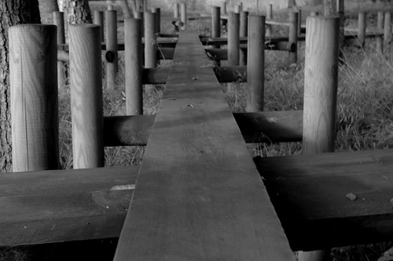

Just a few miles outside of my town stood an old country house. It had been converted into a daycare, where parents would drop off their kids in the morning and pick them up in the evening. However, said daycare had been out of business for a few years now. There was a sign posted in the front yard just a few feet from the house that read "Happy Sun Daycare", with a cute-looking cartoony sun painted on it. Within the fenced-off backyard stood playground equipment that had fallen into disrepair and began to rust. A slide, a couple of swing-sets, some monkey-bars, and a merry-go-round were once covered by swarms of children as they ran and played in the outdoors. They had since become perches for the local birds and squirrels, and were swarmed by ants rather than children.

I had decided to write a report on the Happy Sun Daycare for the news blog I worked for. For one thing, several people around today had gone to that daycare. I figured it might make for an interesting story to read about their experiences there and if it affected their later life in any way. The other reason wasn't quite so innocent. There had always been concerned parents who would fret over leaving their child in someone else's care. It was about that constant worry over how safe their sons and daughters were, especially with all the horror stories posted online about various daycare-related tragedies.

For my report, I decided I would interview both employees and people who had gone to the daycare as children. I wanted to get as many different points of view as possible so that it wouldn't seem too terribly biased. Of course, I agreed to not use real names, for the sake of their privacy.

The first person I interviewed was a middle-aged woman who looked after the infants at the daycare. For the sake of her privacy, we'll just call her "Margaret".

"What was it like working at the daycare?" I asked her.

She replied, "Oh, it wasn't anything too spectacular. Just your typical day of working with children, or babies in my case."

"I see," I said before I asked, "have you had any problems while working there?"

Margaret shook her head, "With the babies? Of course not. They could be fussy, but they weren't any trouble at all. The children were another story."

This piqued my interest. Were the children that attended Happy Sun Daycare too much for the employees to handle? Or, could it be that there were cases of abuse going on that had been kept secret until now? I had to find out.

"Why might that be?" I asked.

"Well," Margaret paused for a second, as though she was apprehensive about speaking to me, "there were times when I heard muffled squealing. No, not squealing. Screaming. At first, I thought it was just the children pretending to be scared. But the more I heard it, the more I realized those screams were real. That something was terrifying or possibly even hurting them."

"Did you ever see any children get hurt?"

Margaret nodded, "Yes. Most of them were just the usual scrapes and bruises you'd expect to find on a child who fell while playing or bumped his head trying to show off to his or her friends. Some of them, though, seemed off to me. Every so often I would see a child walk past on the way to the nurse's office. And each time, the child looked like he had been scratched or even bitten."

Children scratched or bitten? That would be cause for alarm for anyone. Perhaps some wild animal had decided to make its home near the daycare and curious children had gotten too close. Maybe a stray dog had wandered into the playground and some poor unknowing kid wanted to pet it.

"Were there any animals in the area?" I decided to ask, "Stray dogs? Raccoons? Perhaps a possum nest?"

"I doubt it. Pets weren't allowed at the daycare, and traps were set up at night to keep any wildlife away. There might've been a dog roaming around the area." Margaret shook her head.

I pointed out, "Perhaps it was the dog that had bitten those children."

"Oh, I only heard the dog." she told me, "I had never actually seen it. All I'd ever experienced was the occasional growl, snarl, or howl."

So, Margaret had only heard what sounded like a dog. I couldn't rule out the possibility that perhaps she had mistaken some noise she'd heard for that of a dog. Maybe she'd heard some children that were only pretending to be dogs and mistook them for a real one. Maybe she'd heard the wind and thought it was a howl. If that were the case, it would explain the scratches and bites she'd seen on some of the children. It wasn't too out of the realm of possibility that a child could've simply scratched their arm on a branch or part of the fence by accident. With what sounded like a dog's growl to her, Margaret could've reached the conclusion that the children were being attacked by some sort of stray canine.

Still, I had to learn more about the daycare. With the possibility of a cover-up regarding a series of dog attacks, I figured the next person to interview would be a former attendee. Perhaps one of them would have childhood memories that could potentially shed some light on what Margaret had mentioned.

After doing some background checks, I managed to find a young man who went to Happy Sun Daycare when he was around five or six. Let's just call him "Scott". I found Scott working at a local butcher's shop. I had to wait until his shift was over before I could start the interview. Luckily, it wasn't too long of a wait, and it gave me some time to consider what to ask him.

"Do you remember anything about Happy Sun Daycare?" I asked, "I know it was a long time ago. But perhaps you can recall something?"

Scott thought for a moment before replying, "Not much. I was only five, maybe six, when I went. I can remember just doin' what kids do at that age. Playing, finger-painting, watching cartoons. That kind of stuff."

I nodded, "Were you a good kid?"

"For the most part." he admitted, "Occasionally I'd get into some trouble. Nothing too serious, though. Just your typical kid fussiness. Ya know, not wanting to take naps, refusing to eat veggies, that sort of thing."

"I see." I replied as I wrote down what he told me in a notepad, "And was the daycare fair in how they disciplined you?"

"Eh, somewhat. All I ever got was a scolding and the occasional 'time out'. They made you sit in a corner for a few minutes until they felt you were ready to join the other kids. Though, you were lucky if that was all you got." Scott pointed out.

What Scott said baffled me a bit. They were lucky? How? I began to wonder if perhaps there had been more severe punishments for the more unruly children that attended the daycare. Could there have been some sort of more controversial form of discipline that the employees at Happy Sun Daycare used that they didn't want known to the public?

I had to know, "What exactly do you mean?"

For a brief moment, Scott gave a shudder. He seemed to have recalled something from his childhood that potentially frightened him and affected his adulthood as well.

"The kids who got into real trouble were sent into 'The Gray Door'." Scott heaved a heavy sigh, "I've never been in there myself. I knew a few kids that had. Ones that would get into fights or throw huge tantrums. They'd end up going into that room. I don't know what happened in there. But they'd always come out shaking, with wide eyes. A few would break down crying, some would scream; one kid even threw up before passing out."

I frowned slightly. What sort of horrors had been conducted in the room that had been nicknamed "The Gray Door"? I then remembered what Margaret had told me and decided to check for a connection with her story and Scott's.

"Did the children have any scratches or bites on them?" I asked, "And did you hear any strange noises?"

He nodded, "A few kids had scratches on them after they left the Gray Door. But I thought they got them before, and I just didn't notice them at first. They could've tripped or something. I did hear some heavy breathing. That could've just been some kid panting from running around. Hard to say for sure."

First Margaret said she thought she heard a dog snarling, and now Scott was saying he had heard heavy breathing. With the strange noises, mysterious scratches on misbehaving children, and the mystery of the Gray Door room, I couldn't help but wonder what it was that Happy Sun Daycare had been hiding all these years.

I thanked Scott for taking the time to speak to me before moving onto the next person to interview. With my curiosity regarding the Gray Door still heightened, I figured the next person to speak to should be one of the more trouble-making attendees of the daycare. I had to know more about what went on inside that room, and perhaps one of them could tell me.

After doing more background checks, I managed to track down a young woman whom we'll refer to as "Alice". She had been arrested two weeks ago for spraying graffiti, and was charged with vandalism. Rather than spend time in jail, she agreed to do four months of community service. From what I read about her records, it seemed this wasn't the first time she had gotten in trouble with the law.

"Were you always this much trouble?" I asked her.

Alice shrugged, "Maybe."

I wasn't sure how easy it would be to get the answers I wanted from her. She seemed like the type who would only cooperate if she'd get something out of it, like less time behind bars.

"I need to know about Happy Sun Daycare." I asked her, "Do you remember anything about the Gray Door?"

For a brief second, a hint of fear flashed in her eyes. Her face became pale as a few beads of sweat trickled down her forehead.

"Th-that was a long time ago." Alice pointed out.

I replied, "Surely you must remember something? Records show you were ten when you attended. Are you sure you can't recall anything?"

Alice took a few deep breaths and began to regain her composure. If the mere mention of the Gray Door room was enough to put fear into her after all those years, I couldn't help but dread what horrors she could've experienced. Here was someone who had run-ins with the law. Someone who had been arrested for various crimes, primarily theft, vandalism, and trespassing. And, yet, it was something from her childhood that caused the most fear of being punished. Why?

"Okay, I'll tell you. But you gotta promise never to say that I told you anything. Got it?" Alice sighed.

I reassured her, "I won't reveal any names. That will be strictly confidential."

"You see, I was playing outside in the playground." she began to explain, "I remember wanting to play on the swings. Another kid claimed he had already gotten first dibs to play on them. Before I knew it, we were having a big argument. I lost control. Next thing I knew, he was on the ground crying. I must've pushed him when we were arguing. One of the teachers came up and grabbed me by the arm and dragged me inside. She told me that I would be taken into what the other kids called the Gray Door room as punishment."

"What was inside the room?" I asked in anticipation.

Alice took another deep breath and let out a shudder and a sigh, "The room was mostly empty. I remember the floor was nothing but dirt ground, and the only light was a dingy old bulb that barely lit anything up. The teacher just shoved me in and slammed the door shut. At first, I tried pounding on the door and screaming. I cried out for anyone to open it. It was so dark and cold, and I was so scared. And I-I heard something. Something was behind me. I turned around, and I remember screaming louder than I had ever screamed in my life."

I frowned in concern, "What did you see?"

"It was a dog. Or, at least, I think it was a dog." she choked back a few tears, "I didn't get a good look at it since it was so dark. All I remember was that it was the biggest and ugliest dog I had ever seen. That thing had glowing yellow eyes, huge sharp teeth, and was covered in black shaggy fur. And, before I knew it, it snarled and lunged at me. I ran around as fast as I could, screaming and begging for anyone to come and save me. It grabbed onto my skirt with its teeth and tried to pull me towards it. I tripped and fell, but I managed to kick it in the face a couple of times to get it to let go. Then it lunged at me again. But luckily for me, the door finally opened, and one of the teachers pulled me out of the room and slammed the door shut before the dog could get me again."

So there was a dog after all. The stories were all starting to come together. Margaret's story about hearing screams and growling. Scott's story about horrified kids who had been sent to the Gray Door room. And now, there was Alice's story about being sent to that room and attacked by some sort of large vicious dog. Still, I had to know more. Why did they use a dog? Why did they cover it up? Perhaps the people working at Happy Sun Daycare were afraid that such a punishment would be too extreme to use on children. Or maybe they feared being sued by some animal rights group.

I thanked Alice for her time and set forth to find the next person to talk to. Maybe it would be another one of the employees. If I was lucky, I might be able to get one of them to reveal the truth about what was going on in the Gray Door room. Once again, I began searching through the records of anyone who ever worked at Happy Sun Daycare.

It took some time to find someone who was willing to talk to me. Most former employees I asked were either too busy or simply didn't want to give an interview. A few of them directed various profanities at me as well. I couldn't tell if they were angry that I had learned about what was going on all those years ago, or if they were afraid of what might happen if they revealed any more secrets to me.

Still, I managed to track down at least one person who was willing to tell me his experiences working at Happy Sun Daycare. "Mr. Smith", as we'll call him, worked as a janitor at the daycare back when it was still running. He had managed to get the job only because his aunt was in charge of one of the head offices there as well. However, Mr. Smith had moved to another town since the daycare closed years ago. This meant I couldn't interview him in person, so we sent each other e-mails instead.

Mr. Smith explained that he had been dealing some form of Narcolepsy since he was a teenager, and a history of sleepwalking as well. Doctors couldn't figure out what was causing his condition, but they couldn't find any other adverse health effects linked to it, either. This still made it difficult for him to find work, though. He told me that he was grateful that his aunt managed to get him a job at Happy Sun Daycare.

I had so many questions. And, well, I wasn't sure which one to ask first. After I got his first response, I wrote back to him. I wanted to know how he was able to hold his job despite his condition. Was he on medication for it? How did the other employees and the children treat him?

A couple days passed before I got any response from him. I quickly opened the latest e-mail response from Mr. Smith and began to read. He replied that his aunt would mix him a special herbal tea for him that would help keep his Narcolepsy in check. She apparently strongly believed in herbal medicine and said that it was the better than any standard medicine on the market. Mr. Smith wrote about how the tea was quite bitter and how he hated drinking it, but that he had to drink it if he wanted to keep his job. Though, on occasion, his aunt would run out of the leaves needed for the tea and he'd end up falling asleep. This prompted another employee to go and make sure he didn't accidentally hurt himself or others.





As for how others treated him, Mr. Smith explained in his letter that the children were generally very nice to him. Most of them were quite curious and would ask him a lot of questions while he worked. A few would act as a nuisance, but he didn't recall any of them being too much trouble. On the other hand, the other employees seemed to have a sense of uneasiness around him. He explained how he felt that they seemed extremely cautious around him. Also, he pointed out that his aunt always kept a close eye on him. He wasn't sure if this was due to his condition or for some other reason, though.

That just caused more questions to form in my mind. Why were the other employees uneasy around him? Was it because he was the nephew of one of the higher-ups? Or was there another reason? And there was the matter of his aunt keeping a close eye on him. Maybe they were trying to keep the whole issue regarding the Gray Door room a secret from him. Perhaps they were afraid that he would find out about the dog and would contact the police.

I had to know if he knew anything about the room. I quickly wrote a reply and asked if he knew anything about a large, empty room and children being attacked by some sort of dog.

Another couple days passed before I got another response from Mr. Smith. I opened the reply and began to read.

He said that he didn't remember any kind of dog at the daycare. In fact, he pointed out that animals weren't allowed on the property and that he would set traps to keep the squirrels and mice out. His aunt was very strict about no pets being allowed as well. Most likely, it was due to any potential allergies kids might have. Mr. Smith explained in his reply that perhaps the dog that Alice claimed had attacked her was just someone in a cheap-looking dog costume, that the room had perhaps been kept barely lit so the kids in there wouldn't realize it was fake, and that the scratches and bites were just the result of them tripping and accidentally scratching themselves.

To my surprise, he had been in the Gray Door room himself several times as well. Strangely, he pointed out that it was always when he hadn't any tea to drink. He would wake up in the room. He wasn't sure if anyone had moved him there so he could sleep without being in anyone's way, or if he had been sleepwalking again and just stumbled in there by mistake. Mr. Smith explained that the room was originally going to be a large storage closet for various arts-and-crafts related supplies, but was never finished due to budget cuts. He wrote in his reply that his aunt didn't want the area to go to waste, so they decided to use it as a means to punish misbehaving children. In his opinion, someone probably bought a dog costume and would wear it while terrorizing any children sent into the room, as a means of instilling the fear of punishment.

I sent one last e-mail to Mr. Smith thanking him for taking the time to reply to my messages. The whole thing about Happy Sun Daycare was starting to come together. From what I had gathered via the various interviews from both students and employees, children who misbehaved were sent to a large empty space called the "Gray Door" room. There was a dog, or possibly just someone in a dog costume, that would chase any child sent in there. Finally, said child would be pulled to safety before the dog could cause any serious harm.

There was only one thing left to do. I was going to head inside Happy Sun Daycare and investigate the infamous Gray Door room for myself. I had to see for myself if there was anything that could solve this strange cover-up.

Several minutes passed as I drove out into the countryside and towards the abandoned building. I parked the car in the front driveway and took a few deep breaths. The front door was unlocked, which was lucky for me. I gently pushed it open and began to look inside.

The interior was dingy and covered in a layer of dust. Cobwebs spread over various desks and chairs that hadn't been used in quite some time. A musty smell filled the house and mixed with the odor of feces and urine from the rats that now made the place their home. It was nauseating, to say the least.

After I explored several different areas, I soon found the foreboding gray door that was said to lead to the dreaded room. The door was quite heavy, and it took me several tries before I managed to force it open.

Just like how Alice had described, the room was dark and empty, with a dirt floor and a dingy bulb. Said bulb had burned out long ago, so I used an old desk to prop the door open in order to see anything.

I could see faint bloodstains on the ground and on the wall, but I couldn't tell who or what the blood belonged to. There were strange markings on the wall, as well. I took a closer look and could've sworn they resembled claw marks of some sort. As I continued to examine the room, I noticed various footprints in the dirt. Many were faded, or had been trampled over one another. But I could still make out a few. Most of them were the footprints of children. They looked like their makers had been running away from something.

There was one other distinct set of footprints that caught my attention. I examined them closely. I could definitely make out the distinctive foot pads, claws, and individual toes on at least one of the prints. This wasn't some person in a cheap costume. Happy Sun Daycare had been using a dog to terrorize children.

I had to let people know what they had been hiding for all those years. However, as I made my way out the daycare and to my car, there was one aspect about those footprints that made me uneasy.

Since when do dogs walk on two legs?
