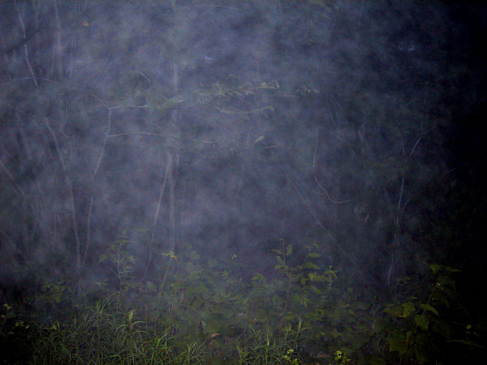

Last week, I drove to a nearby town. The place was surrounded by tall hills and mountains. You could have a very pleasant hike down any of the numerous trails there.

I was climbing one trail when I saw what looked like a silver box. When I approached it, I noticed it was a digital camera!

It was a 3.3 megapixel Powershot S20! Slightly scuffed, but otherwise fine. It rained the next day, so I was really lucky to get there when I did. When I got home, I saw that it had a 300 megabyte hard drive inside. This must be about a £250 value, folks; I pity the fool who dropped it so carelessly.

Anyway, just wanted to share the pictures it contained.

