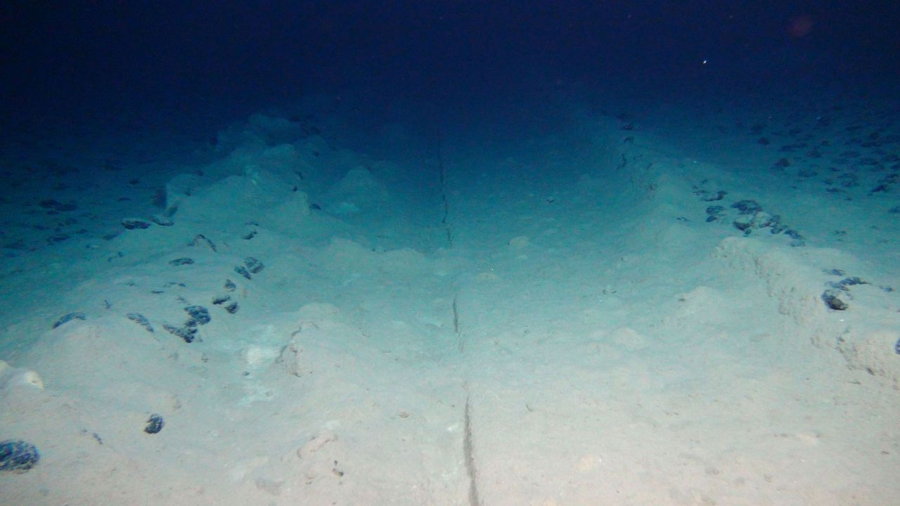

In 2023, I was a PhD student in biology and attended an ESA conference (mostly presenting some astrobiology related research results, nothing fancy or controversial). During a networking event, a US Navy officer who was attending the conference struck up a conversation with me. He seemed particularly interested in my research background and, after some small talk, casually suggested I apply for a military sponsored research project. He said they needed biologists for a study in the North Sea.

I had no gf, no pets, no immediate career plans, and the pay was good. So I applied. The selection process was bit hysterical. Security clearances, background checks, even questions about an old high school friend I hadn’t talked to in years (I learned he is gay and living in China). By that point I knew this wasn’t a regular project, but still, I had nothing to hide, so I went along with it.

After a few months, I was flown to Germany, where I met the rest of the team. They were mostly young, promising but not yet established in their respectable fields. People who could disappear for months without raising too many questions. From there, we were taken by boat to an oil rig somewhere in the North Sea. Our phones were confiscated on the way there, but we were warned about that in advance so no biggie.

The research base was either purpose built for the project or was an oil rig refitted for it, but from the outside it looked like a regular drilling station, probably to avoid scrutiny. Around 30 people were there engineers, biologists, linguists, and military personnel overseeing the whole thing. We could send and receive emails to family, but they were reviewed by navy personnel, no attachments allowed. Otherwise no internet access, no calls home etc.

They told us that a private oil company had discovered a strange structure on the seabed. At first, they thought it was a WWII submarine wreck, but sonar imaging ruled that out. What they found instead was an elongated, spike-like object, about 50 meters long, broken in half, embedded in a crater as if it had impacted at high speed.

When I arrived, the engineers were debating how to bring it to the surface. Inflatable flotation devices were considered, but the risk of braking the object was too high. Instead, they deployed remote controlled robots that could take pictures and retrieve samples. The depth made human diving impractical, especially since most of us weren’t trained for it.

The exterior of the object was encrusted with barnacles, seaweed, sediment and so on. Cleaning it took two more weeks. The outer layer was a carbon composite that was brittle, shattering like glass when dropped, but at the same time, it was almost impossible to bend or melt. We didn’t receive exact results on dating while I was still there, but based on how overgrown it was it must have spent centuries at the sea floor at least.

For the first month, only the engineers had anything to do. Then, five weeks in, they found a sealed, pressurized compartment. The engineers built an external pressurized seal to access the chamber. Inside, we found what was unmistakably a control room. No oxygen, dust-covered consoles, broken panels. And three bodies.

The first two were small about a meter tall, humanoid but weird. Their heads looked oversized for their bodies, but probably would be normal sized on a regular human. Hairless, no ears or noses, though there were signs these had been removed surgically. They were also castrated. Their eyes were covered by black lenses, implanted directly into the sockets, a bit like built in sunglasses. At first we thought they were naked but eventually we figured out they were wearing skin tight suits that had until now decayed to dust. X-rays and ultrasound scans showed their bodies were riddled with metallic implants, like tiny shards of metal. We thought they were shrapnel from the crash but they were distributed too deliberately to be accidental. The bodies were still connected to their seats by cables plugged directly into the backs of their skulls.

The third body was different. It was tall over 2 meters, with more human proportions, with long white hair (it was probably just bleached from the passage of time though) and it was female. No surgical mutilations. She had implants too, but fewer, and in different areas. She also had an artificial kidney. Her suit, unlike the others, was mostly intact. Underneath it we found plenty of tattoos. They resembled handwriting but didn’t match any inscriptions we found so it probably meant something else.

The cause of death was obvious all of them were killed by the impact, with the female’s head nearly detaching from her neck.

The linguists attempted to analyse the symbols on the control panels, but they were too faded to read. One metal plate above the consoles had a short inscription etched in it, so it didn’t fade. The script consisted of vertical lines with dots, and triangles written on them at different heights, a bit like musical notes, but the sample size was too small to translate so linguists mostly ended up being useless for the whole stay. We tried to take DNA samples, but we got no results, which is unsurprising considering the age and conditions in which these bodies were kept.

By the end of the four months, we had submitted our reports. We didn’t make anymore significant findings and we couldn’t recover anything useful using remote subs we were using.
Some people, including myself wanted to continue, but the Navy didn’t want to talk about it. I suspect they have since recovered the wreck and moved it stateside.

During my stay there, one of the Navy liaisons told me they didn’t care if we talk about what we saw there. No one would believe us without a proof and the government’s own disinformation psyops would bury the truth in noise anyways. I haven’t told anybody about this, but I’m not worried about getting disappeared. I’m just sad I’ll probably never get any answers or credit. Recently I realised that since I wasn’t allowed to take any notes with me, I should write it all down before I start to forget.

Feel free to ask questions. I’ll try to answer, just keep in mind I was only a junior researcher there.

> **Anon 1:** Draw the craft.

Pic related, just a quick sketch based off my memory. The actual wreck was not visible on cameras, due to the build up of sediment, but it stood out clearly on the sonar. Its rear end was covered by a sand dune.

Red rectangle is where we found the pressurised chamber.

You could also clearly see remains of the crater it made during its crash.

> **Anon 1:** Thanks for the answer. I discounted oxidation... well due to the lack of oxygen. Are you aware of what the atmosphere inside did contain?

> If you can remember, what did the engraving look like?

I don't remember the exact inscription, but the symbols looked something like this. There were never more than 3 objects on a single line.

The overhead engraving consisted of ~40-50 signs. Most other labels were much shorter, more like single word vs sentence.

As for the conditions it was pretty cold (ca 3°C), with atmosphere consisting overwhelmingly of nitrogen with some other gases including carbon monoxide. O2 was negligible. Since the bodies were so humanlike, I don't think they could survive in such conditions. Most likely they were the result of malfunction of life support systems during the crash (maybe some leak etc). The temperature was likely just result of the depth at which the object rested, as it was pretty close to the surrounding water. No notable radiation. We also did microbiology tests to see if there are any weird bacteria floating in there, but nothing unusual came up.

> **Anon 2:** Weird proportions? Could that be explained by gas under pressure?

By weird proportions I meant the female being huge and the two smaller bodies having atrophied bodies in relation to their heads. This was definitely an anatomical feature as it could observed in bones. I should also note that while impossible to say for certain, all bodies had broken bones that would suggest lethal injuries during the crash, so their deaths were most likely due to that and not change in pressure/atmosphere.

> **Anon 3:** Some questions:

>Was the lady ayy hott? How big were the tits? Did anyone fuck the dead ayy(s)?

>You're a biologist so give us the biological detail of your report. Give us something that proves you're not full of shit.

The bodies were all so shrivelled up that she might have had the biggest juggs you've ever seen and you wouldn't be able to tell. None of us was able to descend to the wreck in person, so best you could do is jerk off on a 1cm long piece of bone sample, which to my knowledge nobody attempted.

There isn't much to tell sadly. My expertise is extremophilic invertebrates (which is why I have any interest in space related topics in the first place), so I didn't have much to say about those humanoid bodies. I checked the samples we collected for mites and such and found nothing, but that's hardly surprising. My biggest contribution was assisting in lab work and being the first to notice that the small corpses were mutilated, instead of just having fallen apart after death. We weren't able to recover any viable DNA samples, but again this can be chalked up to age and conditions.

As far as my general knowledge of human anatomy goes, all three bodies were remarkably human, aside from weird proportions.

> **Anon 4:**
> 
> - it was probably just bleached from the passage of time though 

> Care to elaborate? My understanding is such a thing wouldn't happen without UV being present?

There are many ways in which hair can change colour including oxidation or natural breakup of pigment over time. In our case there was no oxygen at the time we discovered the chamber, but I can't say how conditions inside have changed over time. I mostly added that to pre-emptively react to replies about muh-nordics.

> **Anon 5:** Did the aliens have implants in their chests (pic related)?

They had implants throughout their whole bodies, but they were nowhere near as big and obvious. As already stated, initially we mistook them for metal debris from the crash, which got embedded inside the corpses. Most were no bigger than 3 cm and looked like metal shards.
The biggest implant was inside the female body. We didn't take it out, but its shape and placement led us to believe it was an artificial kidney.

The skeletons looked nothing like the Peruvian mummies. They were obviously humanlike with proper number of ribs, vertebrae, identical limb anatomy etc.

> **Anon 6:** Why mutilated from the crash?

> What was the estimated age/cash time even if you couldn't get dating from samples etc?

No, both of the smaller bodies have had their noses and ears removed. This happened long before their deaths and the crash as you could observe scars and marks left by stitching. Considering their closeness to human anatomy, this likely didn't affect their functioning much and was done for cultural reasons. They were also both castrated. We were unable to tell their sex from the bodies alone.

As for the age, there were different numbers thrown around. Most convincing was one marine biologist who claimed that judging by the build up of sediment and organisms growing around the wreck, it must be at least 500 years old. No idea how close or far off he was considering many unknowns.

> **Anon 7:** Were there microorganisms on board of the craft? Is the ship still there on the bottom of the sea? Did the ship have a control panel?

We ran some bacterial cultures using samples from the pressurised chamber. Nothing worth mentioning. Hard to tell if what we found was natively there or if it was result of contamination during our excavation. No killer or unusual bacteria as far as I know.
The wreck might still be there, but my bet is that it was already removed by the navy. If I were to bet they wanted us to just confirm that it was dead and not dangerous before moving it to US.
There were plenty of control panels, each body was seated behind one. All were busted so all I saw were some buttons and (most likely) dead screens. Two smaller bodies were plugged into the panels directly.

