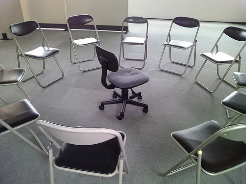
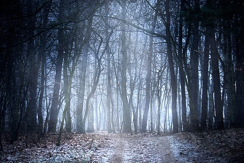
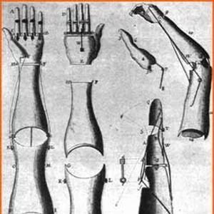

<section>

### War Experiments

The Nazi reign was famous for its backdoor scientists and occult researchers. Special expeditionary divisions of the Reich were often sent out in search of artifacts, or locations of occult or religious significance. Meanwhile, in Germany, bunkers were assembled and mansions and castles were fitted with labyrinths and dungeons, which were filled with strange experiments and research notes.

Whenever the Allies found these places, they were often gutted, burned, or otherwise destroyed and abandoned. If a lab was found intact, the research was usually incoherent or missing, and would be later destroyed by the Allies to prevent the Nazis from recovering any data left behind. Thus, a lot of Nazi experiments were kept under the radar.

Until recently.

Veterans who served as guards to these labs and ritual zones have explained what they saw, and folders and books have been uncovered in boxes and crates belonging to the scientists. A fair few of these materials contain a common research goal.

### Giving Man the Power of God

The exact nature of true, godlike power has been debated upon, but in Nazi research, the concept is described as immortality, the inability to die, invincibility, or some other term surrounding losing the capacity to perish in one way or another.

A large part of this research was actually legitimately based on certain doses of chemical compounds that aid blood flow in aging people. The first concepts they discovered are now used in today's transplant surgery, grafting, ointments that renew skin, antibodies to various diseases, and fitness/dieting research.

However, one set of crates discovered in Hamburg in 1999 variated drastically from this research style. The material within cross-bred the occult experiments and immortality research.

### Disease of the Mind

The introductory folders and proofs of concept begin with the principle that the brain controls the body completely and wholly, and, as the body slowly degrades around it, it continues to function. Further statements explain that the reason the body degrades is because the human brain is set on a biological timer, such as how mayflies only live for one day, yet other insects can last much longer. Essentially, the brain tells us to die.

It is proposed that, as the brain grows, it begins to make connections, resulting in the human becoming more mature and advancing. Between the ages of 35 to 50, however, these connections slowly break down, resulting in forgetfulness, dementia, and other mental diseases reserved for the elderly.

### Their Proposal





The Nazi scientists proposed that the brain has a "universal kill switch" that activates once it is fully developed. In all normal humans, this kill switch initiates a shutdown of bodily functions, which occurs over several decades. As soon as the body is fully shut down, the brain will be forced to die through lack of oxygenated blood.

It is said that Werner's Syndrome (a disease where a person ages rapidly) is a result of the kill switch function activating far too early.

The Nazis proposed that they could remove the kill switch and give the human mind immortality. From that would come complete immortality. Of course, brain surgery was still in its early stages of development during these times, but the procedure was possible. In the stacks of folders discovered, there were many different diagrams and pieces of research on the brain, psychology, the human mind, and the like.

### The Location

The experiments were initially proposed to Nazi executives in 1940, and permission was granted to perform the experiments in 1942, under one condition:

> *The experiments must be conducted outside of Germany. The German Populace must not witness this experiment in any way, shape, or form.*

It was no surprise to the scientists that the Executives were paranoid about public relations, but the idea of performing the research outside of the fatherland was foreign in of itself. Most experiments were performed in bunkers or basements. Regardless, the scientists complied, and were able to organize a setup with their ally, Japan. In late 1942, the research had begun.

### Carrying Out the Experiments

The research team had taken over a Japanese orphanage. The orphanage was in the hills, supposedly somewhere in Shimane, an area nearby Hiroshima.

The scientists deduced that if they involved the usual test subjects; old or diseased people with "nothing left to live for" (similar in a fashion to [Gateway of the Mind](/creepypasta/gateway-of-the-Mind), they would be playing with an unknown variable, or, more specifically, they would be experimenting on a brain with an already activated kill switch, rendering it useless in the context of finding the solution.

As a result, the Nazi scientists demanded that children, namely the orphans in the orphanage (which they deemed to, again, "have nothing else to live for"), would become test subjects: their young brains eliminated any cause for concern of an already activated kill switch.

To begin the experiments, the children went through numerous immunizations and intense psychological testing. This ensured that defects would be prevented, and that a general benchmark would be kept for their subjects.

Next, they dealt with the older staff of the orphanage. Put under anesthetic, the surgeons opened up their skulls to map out a cross section of an adult brain, and began to find key differences between it and a child's brain.

After creating a model of both a child and adult brain, the scientists deduced that the 'universal kill switch' wasn't located in the main brain, but in the cerebellum, at the rear of the base. The cerebellum commands all subconscious activity in the brain, which is understandable, since activating the kill switch is not a conscious action.

They took the tallest child in the orphanage and opened her up, managing to incise the cerebellum and remove the section presumed to be the kill switch. However, upon closing the girl's wounds, they found that she had expired. They assumed that the incisions on the brain had been too brash and required far more precision.

The body was dumped in the forest behind the orphanage.

### Success, Presumably

After different tools were imported and new techniques developed, the scientists were finally able to remove the kill switch and successfully revive patients. In May 1943, they took one of the youngest girls in the orphanage and removed the kill switch; the only function she lost was the ability to sweat. After their assumed success, the scientists celebrated, and everyone went to sleep. The next morning, the girl did not wake up, and was revealed to be comatose. After a while, she was revived successfully, and the "kill switch-ectomies" continued.

### Continuation

The initial success gave the doctors a new state of mind, one of refreshment. They were able to continue their experiments with the ease of mind that the theory was proven.

Well. So they assumed.

Before the doctors continued their grisly research, they commissioned several doctors from Moscow trained in the practice of bodily revival (technically zombification, but relying on the principals of electric shocks and artificial hearts to power the body back up). They stated the reason for this was that the original subject always become comatose or clinically dead after going to sleep, but had always managed to be revived in the morning. She had no signs of this behavior before the experiment, and despite the fact that she had never not been revived, the doctors did not want to risk a success turning into a failure. The Russian scientists were put to the task of bringing her back to life whenever she expired. After several days of this, the Nazis concluded that it was safe to continue.

### Project Venom

Project Venom was a Russian experiment to create super soldiers from the theory of Dr. Frankenstein (it may also have formed a basis for the Marvel superhero as well). As a repayment for the use of the Russian scientists, Russia had asked that they combine the research of Project Venom with the Nazi's ongoing experiments. Naturally, the Nazis agreed.

However, the limited number of orphans was debilitating. As the Nazis required so many of them, they could only offer a single girl. The Russians were content, and began their proof of concept. They had artificially created an arm, over in Moscow, which was on its way to the orphanage to be grafted on, to prove that amputation and limb replacement could work. In the meantime, the Russians had to prepare for this.

The girl's right arm was amputated.

Mysteriously, shortly after, the Russian scientists packed up their equipment and left. The replacement arm never came, and the girl was left with a bandage strapped over her kimono perpetually. The Russians were said to have left with a fearful haste, as if the air had suddenly turned too cold for their tastes.

### Rebellion





One child out of the whole orphanage did not approve of the scientist's presence. In her acts of rebellion, she stole paperwork and ripped it to shreds, broke glassware, and wrecked surgery theaters. Despite her young age (8 years old) and size, she had a surprising capacity for destruction. It was noted in a journal that she was heterochromic as well (having brown and blue eyes from left to right). The senior scientists despised her, but could not restrain her without arousing suspicion. Instead, they ordered the Nazi soldiers to take care of her.

She was brutally beheaded with a blunt bayonet. She was not buried, just left in the woods behind the orphanage. The soldiers told the caretakers that she had found a new family.

### Numerous Failures

The Nazi scientists attempted to play around with their successful experiment by attempting it in different ways. Sadly, none of these alternative methods worked. Here is a list of them:

- Entry through the forehead. Performed on a 10 year old boy. Skull was deformed and the boy had been virtually lobotomized by the end of it. As a result, the boy was not vegetative, but left severely mentally handicapped.

- Entry through the lower jaw. Performed on a 6 year old girl. The tongue and most of the flesh on the lower jaw was removed and could not be replaced. The subject's sinuses were also scrambled.

- Entry through the side of the head. Subject was made deaf in corresponding ear. It should also be noted that there was no anesthetic during this surgery. One journal read that the screams were "truly mortifying".

Despite the failure of these procedures, the kill switches were still removed, and the subjects acted in much the same way as the first girl, expiring upon sleep.

All of the previous failures reduced the orphan's regular population to a mere 10 people. This only included the caretakers; they had performed surgery on all the children.

### Kill Switch Reversal

The doctors began to formulate a new idea. They theorized that, in a child, the kill switch wasn't activated yet, but in an adult, a kill switch could be reversed using a chemical compound to eliminate the hormone produced. The kill switch could then be removed.

This procedure was eventually performed on all the caretakers. It was surprisingly successful, as they all survived.

## Personalities Gone Awry

During the experiments, scientists were told to watch over the successful children and monitor their behavior.

> *"They appear normal at first, just like any of the other children, playing, cheering, learning regularly, but when separated from the others, they seem... off. They stroll carelessly around with a blank smile on their face, their eyes looking straight at you. If approached from behind, their heads snap around with ungodly speed, and for a moment, you can almost see an expression so vile on their face that it makes you want to cower. But then you realize they are just forming that dreamy smile again.*
>
> *Another thing is that they follow us, but only when we are on our own. After finishing with my typewriter and heading to my room, I am often given a fright by one of the children standing several meters down the dark hallway, staring at me. When I enter my quarters, she follows me, and I must jam a chair behind the door to sleep safely. It feels like they're ghosts at night time. The funny thing is, I keep seeing one child with reddish hair. I ask who that child is the next morning, but the caretakers say they haven't had a child with reddish hair for a while.*
>
> *They also seem to be playing a game a lot more than when we started. I haven't got much knowledge of Japanese, but it seems the game is named "Circle You, Circle You", as described by one of the translators. A group of children surround one child, who sits in the center, alone. The group link arms and begin to move in a circular manner around the child, making scary faces at them and singing an eerie chant. You lose if you flinch.*
>
> *Upon talking to them, I've noticed they seem more dreamy, forgetful, and somewhat blank, as if the experiments have wiped their memories as well as their mortality. But it's not an innocent type of dreamy, rather, something more sinister. They stare at you with wide eyes, and ask you questions you never thought they would know. One asked, "When your grandmother died, did she really leave you a gold plated watch?" It may seem crazy, but my honest answer was... "Yes."*

Kagome Kagome translates literally to Circle, Circle, but can also be called "Circle You, Circle You". It should also be noted that the child who rebelled against the scientists was said to have had reddish hair.

### Demise

In early 1945, Hiroshima was bombed. Germany surrendered, and the experiments were ground to a halt. The Germans began packing up their equipment. Most of them had already returned home due to "concerns over mental welfare", stating that they showed signs of insanity. Only four scientists remained.

After sending the last set of equipment off, the scientists deemed it only justified that they inform the caretakers that they were leaving. They did so, and to the horror of one of the scientists, and the surprise of the rest, the head caretaker said, in fluent German, "Will you play one last game with us?"

The three scientists agreed, and a circle of children and caretakers formed around them. "Now, if you flinch, you lose..."

The one horrified scientist ran to the last truck and jumped on it without looking back.

## The Story Now

If you visit Hiroshima, go to the woods. You may find some dirt trails there; if you travel down them, you will see beautiful forests. But if you travel down one that has had signs of trucks going through, you will feel cold, and you will see that a lot of trees have been cut down. Don't wander from the path, or you'll likely get lost in those vast woods.

If you pay attention, you will notice that some of the tree stumps look like kneeling people, missing heads.

If you continue, the air will get cold. Naturally, because you're climbing uphill, right? Eventually, you will reach a clearing with an old stone building in the center, vines covering the place.

Go inside if you want to play.

As soon as you open the door, a foul smell will be present, similar to that of a rotting corpse. If you look down the hall, it will be dark regardless of the time of day, since there are no lights.

Continue down the hall. Take the first left and walk until you see a door that appears to be made out of a red-colored wood (the rest are brown). Open the door. You will find ten happy children and caretakers, all wearing kimonos, playing in a normal playroom. One is missing her arm, another is missing his forehead, and a third lacks a jaw, but all are bandaged with clinical precision. The place should be very clean and tidy, dependent on your standard of such things, and well lit.

At once, your presence will draw the attention of everyone in the room, including the ones that look far too preoccupied or distracted. They will turn to look at you, carefree smiles on each of their pleasant faces.

The head caretaker, in all her beauty, will ask, "Will you come play with us?"

By this time, if you haven't soiled your pants, you really should, to save yourself the trouble later.

If you say "no", the door will slam shut on you. You can attempt to exit from where you came, but you will only find another dark hallway. Open any of the brown doors from earlier to discover operating tables or bunk beds. If you continue down the third hallway, you will realize that a girl is standing several meters behind you, her face shrouded by shadow. Approach her and expect your doom. Instead, continue down the hallway, and try not to let her catch up with you.

If you say "yes", however, you will be welcomed into the room. The door will close behind you, and everyone will form a circle around you.

"Now sit down and don't flinch!" a cheerful voice will say. Just follow those instructions, and you will survive.

All light will disappear from the room, but you will still see the circle of children. Each will have a vicious expression on their face, ones so vile, you may flinch immediately. If you can stomach that, though, they will begin to slowly circle you. You may feel one of them lash towards you. If you look, however, there will be nothing there, besides the children circling normally.

If that wasn't enough, they will begin chanting "Kagome, kagome..."

I really can't explain any further. No one ever lives to tell the tale of what happens then.

If you flinch before they chant, they simply continue as normal. If you choose to say anything other than yes or no to the head caretaker, it is told that the children's expressions will turn mortifying (Zalgonic, almost), and they will scream in inhuman voices: "Decide! DECIDE!" If you do anything besides say yes or no from here, it is told that the children and caretakers will slam the door on you.

If you turn around, the story varies. Supposedly, your worst fear will be waiting at the other end of the hallway, separating you from your exit. Most notably, this character is Aka Manto or the Rake. The least you could do is greet the creature before he tears you unto oblivion. If he has the capacity, he may well respond, and you will die as a polite person. Don't greet him, and you will end up as another one of the beheaded bodies along the trail.

If you respond, "I don't understand" (and you must be genuine), the head caretaker will say, "Go to your school, and watch your children play. You should understand then." Nothing will have changed.

Close the door on your way out. It's common courtesy.

</section>
