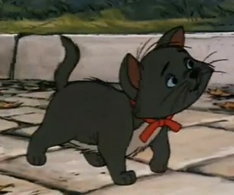

I'm going to tell you a secret. But first, you have to promise me you won't laugh. This is still an uncomfortable subject for me, so I'd appreciate your understanding. Do we have a deal?

When I was five years old, I watched a movie no child should ever see. I don't remember much about the circumstances of my viewing other than that it was at the house where my family lived, late at night, in the dark with only the television providing light. The film was an animated feature, and depicted themes of animal cruelty, death, and dismemberment. The scenes were surreal and terrifying and left a deep impression on me.

For years afterward, the only scene I could remember clearly was when an evil man was drowning a family of cats in a stream, which I would have nightmares about for years afterward. I remember seeing it early in the movie, followed by many more disturbing and surreal scenes.

Remember your promise, because this is the part I was talking about. I never told anyone about what I saw, but the name of the movie was well-known: *The Aristocats*.

I suppose I can forgive you if you broke your promise, but I must emphasize that I am not joking. I saw a movie called *The Aristocats*, filled with the scenes I have described, and it scarred me for life.

I didn't think about the experience very often, but it was always in the back of my mind in some way. Though I didn't realize it at the time, I know now that it caused me to shy away from animation and children's shows. It subtly informed my whole outlook on the trappings of childhood. I found myself bracing with dread whenever I had to watch any children's animation in school. My childhood was relatively normal otherwise, for an introvert anyway, but every once in a while I would think back to the movie and find my inner peace disturbed.

It wasn't until maybe third or fourth grade that I started to realize that my experience with the movie had not been typical. I didn't tell anyone, not even my parents, about what I had witnessed in that dark room at age five, but I eventually figured out on my own that there was nothing horrific about the version everyone else had watched. I still wasn't willing to see it for myself, but I figured if they had seen what I had, I would have been able to tell whenever they spoke of the film. Anyone who had anything to say about it seemed to consider it either a nostalgic classic or unremarkable.





When I was in middle school, I asked my mom if I had ever seen *The Aristocats*. She said I had, once, having stayed up past my bedtime and watched it secretly. She said I seemed strangely disturbed by the film, and I had never wanted to watch it again as a small child.

I asked if we still had it in the house, but she said I had been so afraid of the movie that she had thrown it out. It had been a home VHS recording she bought at an estate sale, rather than a retail copy.

I finally decided to watch the movie again. I ordered it from the library and watched it one Saturday. It took me a couple hours to work up the courage to finally hit "Play."

I found it to be a wonderful film. Immediately I realized that whatever I remembered seeing at age 5 had nothing to do with this movie. There was no graphic violence, no psychedelic scenes, nothing that should have traumatized me as a child.

And yet, what I had seen all those years ago definitely shared elements with this movie. The kittens and their mother were drugged and kidnapped, not drowned, but I instantly recognized the moments leading up to this divergence, and almost had a flashback to the cartoon drowning I had witnessed. I was hoping to find closure, but instead I was more troubled than ever. There was no question in my mind now that I had viewed some awful and perverted version of this classic film.

I told one of my friends about it a few days later. I didn't let him know how convinced I was of what I had seen as a young child, instead simply relating it as a vague and confused memory, like "hey, the other day I saw *The Aristocats.* I used to be terrified of that movie because for some reason I thought I saw gore scenes and cats drowning when I watched it at five years old. Funny how your memory plays tricks on you at that age, isn't it?" He told me about the movie *Felidae*. He explained that it was an animated movie about cats with a similar animation style that contained graphic gore scenes and was definitely not for children. He said maybe I had somehow seen that movie instead of *The Aristocats*.

I streamed and watched *Felidae*. I saw what my friend meant about the style having the same feel as *The Aristocats* except dark and bloody, but it wasn't what I had seen. I knew, I knew for sure, that five-year-old me had watched a movie with the same characters as *The Aristocats*, and I also knew for sure that it had contained bizarre and disturbing scenes not shown in the mainstream version.

This whole thing was driving me up a wall. To try and get some kind of closure, I started seeking out and watching old children's animation that contained graphic and disturbing elements that would never be included today, such as *Watership Down*, the 1978 version. While these works were interesting and gripping in their own way, they were decidedly non-Disney. While other studios may have been willing to take such risks with their works decades ago, the fact that *The Aristocats* is a Disney property made me sure that the version I had first seen was something I was absolutely not supposed to, ever.
