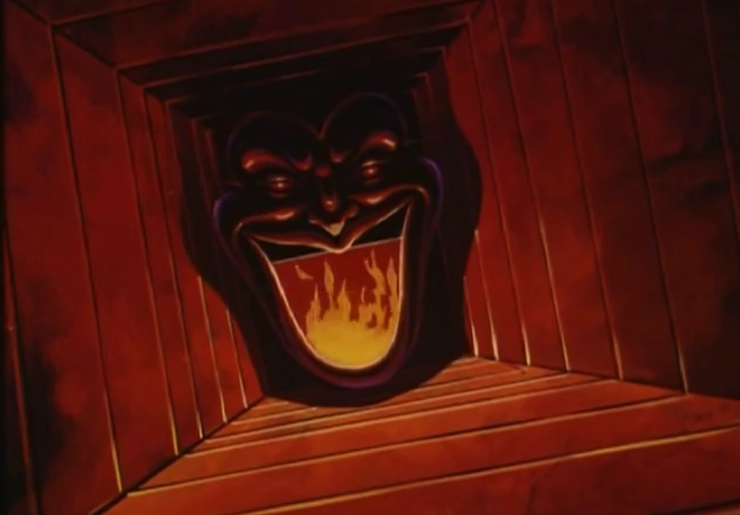

I let it go after a while. A few years passed, and in college I learned about this internet urban legend called "lost episodes." People claimed to have seen episodes of TV shows or altered versions of movies, usually animated, that contained graphic and disturbing content. The episode or movie was often found in unexpected places, and those claiming to have seen it often said it mysteriously disappeared, whether through a VHS tape appearing to have somehow self-erased, a website going dead immediately after viewing, etc.

To be honest, I didn't put much stock in the validity of these stories, but with my *Aristocats* experience still in the back of my mind, I decided to look further into it. I found a YouTube channel called Cartoon Geek, who was discussing a certain "lost episode" for his 40 thousand subscriber special.

After going through the obligatory thanks and talking about how much his subscribers meant to him and all that, he began: "Now for those of you who are new to this channel, I'm basically just a guy obsessed with all things nostalgic and geeky about cartoons and other media. Most of my content is simply reviewing old cartoons and what not, usually superhero related, however I also do a side series on the strange and creepy side of animation. For example, my 20K sub special was a three-part series on Disney and their alleged subliminal messages in film and television, and this video you're watching now is sort of in that same vein. We're going to be taking another look at a certain 'lost episode.' For those who don't know, lost episodes are basically this urban legend about episodes of TV shows which were 'lost', as the name implies. These episodes are said to contain graphic and/or disturbing and surreal elements and are generally regarded as material that the public was not meant to see.

"A few months ago I covered an alleged lost episode from the 1968 Filmation series 'The Adventures of Batman'. I loved this show as a kid, even though it was a few decades before my time, and there was one episode with a scene where Batman and Robin fall through a trap door set by the Joker and slide toward their doom; at the end of the slide tunnel is a giant open furnace, looking like the Joker's face. Of course, since this is a kid's show, they don't actually slide into the furnace and burn alive, they get out with their gadgets.

"So to recap, in 2009 this anonymous internet post started circulating online about an alleged lost version of this scene. In it, the Dynamic Duo actually do slide into the furnace, burn alive, scream, and are shown graphically being burned to a crisp, followed by surreal and non-linear scenes of grieving friends of Bruce Wayne in mourning and the funeral service.

"Now when I did my first video on this subject, I was honest with you guys: I didn't really think there was much credibility to this story. I like to keep an open mind on this show, but there were just certain elements of the post that made me say, okay, this is probably bullshit, like how the tape conveniently erased itself after the anonymous author viewed it. But since then I've gotten a lot of comments and emails talking about how allegedly this lost episode has been posted online. Naturally a lot of you are already saying this is fake, but this topic won the poll for this special, so let's find out."

After some more preamble, the video cut to the alleged lost episode, at the part where Batman and Robin are sliding down the tunnel toward the furnace. All the parts where the two use their belt gadgets to get free were removed, and when the two were close to the furnace, the screen filled with fire, and two poor-quality shrieks played. After that, there were some strange abstract scenes, but all of these seemed to be simply random clips from other episodes with some editing effects thrown at them.

Cartoon Geek returned. "Okay, so right off the bat, Batman and Robin die off-screen, which is obviously not what happened in the lost episode post that was shared around. They basically just used the flames from earlier in the scene and cut them over to make it look like Batman and Robin died, adding in a canned scream effect. The surreal scenes that follow are also just random clips from throughout the show with various editing tricks applied. I could have done some of them myself. So while this is impressive work, I think it's pretty clear that this is a fan project inspired by the anonymous post. I'm going to rate this animation myth as debunked for now."

He gave some more breakdown and deconstruction of the clip, before ending with some kind of promotional giveaway. What really got my attention however were some of the comments. There were at least a few people insisting that the lost episode was real and that they had seen it with their own eyes.

I PM'd one of these people. I asked if he had really seen the episode and about the circumstances. He responded within the hour:

"Yeah, I was at summer school and during recess I snuck off to the school library's backroom to be alone. I put a VHS of the cartoon that was there and saw it. Honestly I wasn't really disturbed back then since my parents let me watch R-rated horror movies and stuff back then lol. But yeah man this thing is real."

I asked if he knew any information about the other supposed "lost episode" phenomena, but he said he did not.

I did some research of my own. There were a few lost episode stories floating around on the internet, mostly about children's shows. To be honest, not many of them seemed all that credible. Still, I strongly felt there was something real here behind all the embellishment and fictionalization.

I decided to see if there were any such stories surrounding *The Aristocats*. My searches for disturbing content in the movie returned nothing but the expected "hurr hurr this one scene in *The Aristocats* totally scarred me for life as a kid" stuff or more information about that *Felidae* movie. I tried reaching out to some of the credited animators, writers, and crew members, varying the content of my emails so as to cast as wide a net as possible. For example, some of my emails focused on disturbing content that may have been cut, while other drafts asked more generally about alternative versions or cut scenes.

I also expanded my web searches. I used all the search engine tricks I could find, and started using obscure and foreign-language engines. After a few months of no information and no responses to my email queries, I started to think that maybe I should just forget about the whole thing. Maybe my real memories of watching *The Aristocats* had merged with some nightmare I had to create my present memories, and maybe repeating those memories to myself so many times during my childhood had falsely convinced me of their reality. I was about to consign to this newfound self-closure when I found something during one of my foreign-language searches.

It was a thread on a Chinese message board. The OP had a JPEG image and text that roughly translated to "Aristocats Movie. Creepy?"

If I had had coffee to drop and spill all over my computer, I would have. The image dashed away any hope I had of passing off my childhood experience as just a traumatic nightmare that had stuck in my head longer than it should have. It was a frame from whatever twisted version of *The Aristocats* I had seen, and while I hadn't actually remembered this particular still until I found this message board, the instant I saw it I remembered the clip and more memories started flooding back, still vague but vivid and definitely real. I was now more firmly convinced than I had ever been before that the violent version of the movie was real.

The image was of the black kitten, Berlioz. His face nearly filled the frame, and his eyes were wide and terrified, red veins bulging, his fur standing up as if charged with electricity.

The picture itself wasn't any more inherently disturbing than the grotesque fanart you can find for all kinds of different shows and movies, but unlike those other images I knew this one had a genuinely sinister story of some kind behind it. As such it haunted me like no other image ever had. There were only a couple replies on the thread, both of which were short and neither of which provided any more information about the image. I used Google Translate to try to ask the OP for more information, but never received a response. I performed a reverse-image search of the file, but it returned no other results.

However, a few weeks later I finally got a reply to one of the emails I had sent to the production staff. The reply was to one of the emails I had written that hinted more strongly at the reality of what I had seen as a kid. The response was short and curt, but gave me new hope for finding answers:

"Hello. Sorry for the late response, but I read between the lines of your message, and if you've seen what I think you were hinting at, you need to look into the Lost Media Group. That's all I'm going to say on the subject."

I Googled "lost media group", but the closest thing I could find was a website for an online club called the Lost Media Society. It was a site for media enthusiasts to collect, trade, sell, buy, and discuss "lost media" including lost episodes as in, real lost episodes that simply never aired, not the urban legend ones that contained surreal, disturbing, or even supernatural content.

This community was interesting in its own right, and I became involved with it, eventually even becoming a site moderator. Once I was established as a respected regular, I decided to PM one of the head admins and ask him about the lost episodes legend.

He responded that he had heard of it, but it wasn't really something the site dealt with. He recalled that in the past it had been talked about and some had even suggested banning discussion about it since it was seen as a spam topic after a while. I asked if he knew about an organization called the Lost Media Group. He said he had heard of it, but didn't know anything about it, and suggested that I contact a certain other admin who did know more about this entity.

I messaged this admin, and got a response within the hour. He told me the Lost Media Group was the group alleged by some to be behind the "lost episodes" phenomenon. According to him they produced not just altered versions of movies and television episodes, but were also said to make their own versions of other media such as video games and comic books. He said he did not know much else about them other than that some lost media collectors were willing to pay large sums for an authentic work by this group, and that before the Lost Media Society had banned discussion of the lost episodes legend some of these collectors had asked about them on the site.

I asked if he could refer me to such a collector. He said my best bet would be a certain retired site admin who was no longer active in the Lost Media Society. He linked me a couple of archived threads by this individual asking about lost episodes, and gave me the man's email address. I shot him an email asking about his interest in lost episodes, and even went as far as to directly ask if he knew about a "lost episode" type version of *The Aristocats*.
