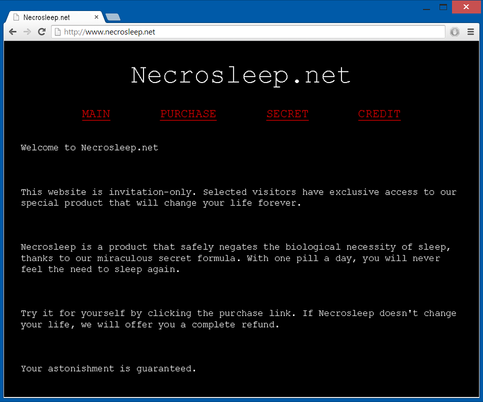

## My Disconnected Life
Blog author: **Reed Murdock**

### October 16th, 2014

Hey guys, so I've decided to start a blog about my new life. Most of you reading this are probably my friends and acquaintances, but for the rest of you, I'll expose a little bit about myself. My name's Reed. I just moved out of my stupid parents' basement (thank God) and now I'm pursuing my own life where no one can push me around anymore. Technically I'm the one who ditched the place, but they all but kicked me out beforehand. Nobody gives a damn about a "crackhead" like me, not even my parents. Not that I care.

Anyways, I'm doing my own thing now. I had to give up a few luxuries, my Mom's hellacious cooking not worthy of being called a luxury. I'd much rather live off discount ramen noodles anyways. Sometimes I'll even have corn on the side when I'm feeling extra fancy.

Speaking of fancy, I'll admit my apartment is anything but. It's the cheapest one I could find, in fact. I find the saying "you get what you pay for" to be especially true when I'm trying to sleep to the lulling sound of what I can only guess is some old lady getting mugged in the dark alleyway next door. My ghetto sanctuary consists of one living room, a kitchenette, a bathroom, and a closet. The walls are practically made of cardboard and the carpet is stained with God knows what, but it's good enough for me.

Living with me is my poor excuse for a cat named Twig. She's one of those weird hairless breeds, and in turn, a real conversation piece. I'm often asked why the cat's turned inside out, or if she was the victim of some perverse taxidermy project gone wrong.

As shoddy as my life seems, living on the cheap has its benefits. My cost of living is next to nothing, so I can make enough money to survive by doing odd jobs on the internet without ever leaving the house. I spend half of the month writing bogus reviews for products I've never used and filling out surveys on political issues I know nothing about, then spend the other half surfing the web and watching pirated reruns of The X-Files. I don't even have to pay for internet service thanks to my neighbors' complete failure to secure their Wi-Fi hotspot. I bet their data overages are through the roof now. Oh well, not my problem.

I'll be updating this blog every day or two if I'm up to anything interesting. Thanks for reading this boring crap; hopefully my life will get a little more exciting in the days to come.

*--Reed*

***

### October 18th, 2014

I've decided to do something unusual. It's 3AM and I intend to stay up all night, caffeinated beverages at my side. Why am I doing this, you ask? Because I'm permanently switching to a nocturnal sleep schedule. In other words, I'll be sleeping during the day instead of the night. I have a number of good reasons for doing this:

1. There's less people out at night, so leaving the building won't be such a dreaded thing.
2. Sunlight gives you cancer, right?
3. Screw social norms.
4. The internet speed seems to increase substantially after midnight.
5. It's a free country, I don't even need reasons.

Also, I ran into this cool forum called Nocturnal Underground. Naturally, it's full of sun-loathing recluses and cynical misanthropes like me. How perfect. I registered straight away and found the forum-dwellers to be very welcoming. It's not the most famous of internet destinations---more of a tight-knit hole in the wall for a very obscure subculture.

We all seem to share a general appreciation for societal disconnect, which is cool, because I really thought I was the only wackjob who can't stand dealing with normal people. After all, it's these "normal" people who are telling me I don't have the right to smoke whatever substances I damn well please, as if it's their business.

I'll let you all know how this whole nocturnal thing works for me. Peace out.

*--Reed*

***

### October 21st, 2014

I'm adjusting very well to my new lifestyle. I can already tell this is the way I should've been living all along. The internet is a far more interesting place during the night.

Everything has been fairly normal lately, except for one thing. Yesternight, I received a mysterious private message on Nocturnal Underground. Here it is, copied and pasted for your reading pleasure:

> **To: Reedman07** 
> **From: Revelation666** 
> **Subject: Necrosleep.net**

> Congratulations Reedman07. You've been invited to an invitation-only website that will change your life forever. Discover what society doesn't want you to know at Necrosleep.net

> Use your exclusive invitation code to enter: `DCLXVI`

> Find out what you've been missing your entire life.

> Necrosleep.net

Sounds like a total scam, but it piqued my interest. I couldn't resist going to the site just to see what the hell it was.

So I went there and arrived at a completely empty black page. I noticed the text cursor blinking in the center, indicating that I could type. I presumed that this was where I was supposed to put in the invitation code, and I presumed correctly.

When the home page loaded, I immediately noticed that all of the text was in Russian besides the title header, which simply said "Necrosleep.net" in English. My web browser automatically detected that the site was Russian and offered to translate it for me, so of course, I clicked yes.

Now, this site was clearly on the shady side. Whoever made it was certainly not well versed in web design, as it had more in common with a notepad document than a good webpage. The background was black, the white text was written in the oh-so-generic Courier font, and under the title header was a row of red hyperlinks labeled as follows: Main, Purchase, Secret, and Credit. Here's an excerpt from the main page:

> Welcome to Necrosleep.net

> This website is invitation-only. Selected visitors have exclusive access to our special product that will change your life forever.

> Necrosleep is a product that safely negates the biological necessity of sleep, thanks to our miraculous secret formula. With one pill a day, you will never feel the need to sleep again.

> Try it for yourself by clicking the purchase link. If Necrosleep doesn't change your life, we will offer you a complete refund.

> Your astonishment is guaranteed.

What a bold claim these people are making. There's no way this stuff actually works, otherwise everyone would be taking it. Obviously I was skeptical, and still am, but I snooped around the site a bit more, just out of curiosity. I clicked the "Secret" hyperlink, which took me to another page. Here's the text from said page:

> Necrosleep is comprised of special and rare ingredients, which we cannot disclose in order to ensure that our formula stays in private hands. In order to keep our product available, it can only be distributed through alternative means on an exclusive basis.

> The active ingredient in Necrosleep has been sought after for years by doctors and scientists intending to displace sleep with wakefulness. Only we have managed to do what others could not, as permitted by the will of our master.

> We can assure you with full confidence that our product will change your life, and you will never feel need to sleep again.

> Feel free to indulge in our secret.

Alternative means? More like black market. Whatever's going on here doesn't appear to be... legal, exactly. Not that I care about the law, I just get untrustworthy vibes from this site.

Anyways, I continued on and clicked the "Credit" hyperlink. My heart skipped a little when I was confronted with honestly the most uncanny photo of a living person I've ever seen. It was an old black and white photo of a tall man in a doctor's coat. If he wasn't standing upright, I'd say the guy was dead, but my guess is that he was just cadaverously unhealthy, and probably blind from the looks of his pale, lifeless eyes. Not a trace of emotion could be found in his face.

There was a small bit of text below the photo, which read as follows:

>Credit for the pioneering of Necrosleep goes to the brilliant Dr. Hail A. Stan, proxy of our master and founder of the Ukrainian Institute of Occult Medicine. His work lives on.

Proxy of our master? Occult medicine? Maybe I've watched too many horror movies, but this isn't your typical snake oil sales pitch. Maybe they're part of some deranged religious group or something? I admit I was slightly creeped out, but more fascinated. I clicked the "Purchase" hyperlink, out of mere curiosity once again.

Turns out each pill costs some absurd amount of Russian currency, which I found was equal to about 130 US dollars per pill. Ridiculous! Not that I would buy them, even if I could. I immediately left the site.

At this point I'm guessing it's probably a lousy foreign credit card scam or some weird cult initiative. Either way, it made my day more interesting than it normally would've been.

*--Reed*

***

### October 22nd, 2014

I posted a thread on Nocturnal Underground about the mystery user who sent me the strange PM. I found myself wanting to know more about this whole Necrosleep.net thing, so as a part of my investigation, I sought to find out who the user was. Here's a transcript of the forum thread:

&dash;&dash;&dash;

**Reedman07:** 
Hey guys, I hope I'm not disrupting the order of things by posting this in the Trolling and Harassment section, I didn't know where else to put it. I figured this incident of mine might qualify as a spam case if other people are getting the same advertisement message I am. Basically the other day I got a PM from a user I've never seen before called Revelation666, and the message was an advertisement for some supplement. Has anyone seen this user on the forums before? I sure haven't. If you have any information that'd be great.

**Cosmic_Trashbin:** 
I don't recognize the username. He must be fairly new or just inactive. What were the exact contents of the message? We could probably get an admin to ban him for advertising.

**Reedman07:** 
Here's a screencap of the message. 
[Message.jpg]

**Cosmic_Trashbin:** 
Strange. Did you actually go to the website? I hope not, it's probably infested with viruses. Lol

**B3457w4rf4r3:** 
Just tried going there. It's just a black screen. The invite code didn't work either, it just gave me a popup box that said invalid IP.

**Reedman07:** 
Of course I went there. I couldn't resist.

**Thuglyfe4lyfe:** 
Doesn't work for me either. Invalid IP.

**Cosmic_Trashbin:** 
If it only works for Reedman07, maybe it's bound to his IP somehow. Can you get some screenshots of the site? You've sparked my interest.

**Reedman07:** 
Here you are. The page was initially in Russian so I had my browser translate it. 
[Main.jpg] [Purchase.jpg] [Secret.jpg] [Credit.jpg]

**B3457w4rf4r3:** 
Looks shady as hell.

**Cosmic_Trashbin:** 
Wow. Don't even mess with it, you're asking for trouble just by clicking the link. You're probably being keylogged as we speak.

**B3457w4rf4r3:** 
Not to mention the product they're selling is probably laced with cyanide.

**Cosmic_Trashbin:** 
If he's stupid enough to buy it, well, the gene pool is better off without him anyways.

**B3457w4rf4r3:** 
Never trust a Russian.

**Thuglyfe4lyfe:** 
I'm Russian and I find that offensive.

**B3457w4rf4r3:** 
You just said you were Asian last week, make up your mind.

**Reedman07:** 
I leave this thread for 5 minutes and chaos ensues. Everybody calm the [expletive] down. Of course I'm not going to mess with it, these supposed miracle pills are $130 each anyways. Who do you think I am, Johnny Cash?

**Thuglyfe4lyfe:** 
Just because his name was Johnny Cash doesn't mean he was rich or had lots of cash or whatever. 

**B3457w4rf4r3:** 
Of course he was rich, you dumb [expletive], he's Johnny [expletive] Cash.

**Cosmic_Trashbin:** 
Whose bright idea was it to equip this forum with a profanity filter anyways? It's [expletive] stupid.

**Reedman07:** 
Before this thread deteriorates any further, let me just say I've put tape over my webcam just in case something slipped past my antivirus, but it's probably just a credit card scam or something. I'll do some research on it tomorrow, the sun's been up for three hours and I'm running low on energy drinks.

**Cosmic_Trashbin:** 
I'll contact one of the admins about this. Spam isn't tolerated here. I ought to see if they're willing to uninstall the profanity filter plugin as well.

&dash;&dash;&dash;

I got a message later on from HGWishingWells (one of the admins) saying that the user Revelation666 doesn't exist in the database, and that the only way I could've received the message is if the mail client was bypassed somehow. In other words, somebody hacked the system just to send me a spam message. What the hell.

*--Reed*

***

### October 23rd 2014

I finally got around to Googling Necrosleep. The results were mostly irrelevant YouTube channels and defunct '90s screamo bands from the looks of it, but I noticed among the garbage results a link to a post on FastMD.com. The preview said, "Does anyone know if this Necrosleep stuff actually works?" So I clicked on it, only to be directed to a page stating "The post you're looking for has been deleted and no longer exists." I should have known. Nothing can ever be easy and predictable.

I returned to the results, and had to scan over several pages of them before finally running into an old gaming forum thread where the website Necrosleep.net was mentioned. This time, the post hadn't been deleted. In the middle of a conversation about maximizing crop production in some medieval strategy game, one of the users claimed to have taken Necrosleep in order to tend to his virtual farm 24 hours a day.

Needless to say, the other forum patrons were highly skeptical. The guy posted a link to Necrosleep.net in an attempt to back up his claim, ultimately failing to convince them because---you guessed it---the site was bound to his IP address. He also had the same invitation code as me (DCLXVI) leading me to believe that it's just a formality intended to make you feel special. But that doesn't explain why and how my IP---and apparently someone else's---got singled out.

The bragger then claimed that there was irrefutable proof of his ceaseless wakefulness in his in-game score. In relation to the length of time his account had existed, his score was excessively high. So high, in fact, that it would be impossible for him to attain so high a score in so short a time frame, unless he was playing the game for at least 21 hours a day, which leaves practically no time for sleeping.

Despite all that, they attributed his accomplishment to an automatic bot program that operated the game for him during the night. Since cheating in this way is against the game rules, his account was promptly banned, according to the moderator at the end of the thread. Sure enough, in little red letters below his forum avatar were the words "Banned for bot abuse, 8/12/2006."

I couldn't find any more relevant results for Necrosleep or Necrosleep.net other than what I've just told you about. Looks like these online dope dealers are pretty stealthy. I'm just dying to know what their real motives might be, 'cause I could think of a million better ways to steal someone's credit card number or peddle quack remedies. It could be a prank, but evidently this has been going on since 2006 at least. Perhaps some jokes just never die.

*--Reed*

***

### October 25th, 2014

I got another PM from Revelation666. Am I the only one who gets creeped out by that name? Knowing what I know now, it makes me uneasy to think about the great lengths this user went to contact me specifically. For some reason, they stealthily bypassed the system just to send me these messages and make me this "offer." Here is the message I received:

> **To: Reedman07** 
> **From: Revelation666** 
> **Subject: Necrosleep.net/backdoor**

> Congratulations Reedman07. You've been selected to receive a free 30 day trial of Necrosleep. Claim your exclusive reward at Necrosleep.net/backdoor

> Find out what you've been missing your entire life, risk free.

> Necrosleep.net/backdoor

Once again, my curiosity got the best of me. Bracing myself for whatever scam was coming my way, I clicked the link. I was taken to a page asking for my address, nothing more. I thought about it carefully, knowing full well that these people likely have malicious intentions. But if I entered my post office box, what's the worst that could happen? Them sending me some junk mail or faulty pills? The point is that I'll finally know what they want from me.

I entered the address.

*--Reed*

***

### October 28th, 2014

I decided to go back to the thread I posted on Nocturnal Underground and let people know what's up. Sure enough, their reactions were amusing:

&dash;&dash;&dash;

**Reedman07:** 
Well guys, it happened again. Look at the attachment. 
[Message2.jpg]

**Cosmic_Trashbin:** 
Don't tell me you clicked on this one too.

**Reedman07:** 
 I did. Then it asked me for my address. But don't worry. I only entered my PO box.

**Cosmic_Trashbin:** 
 Are you out of your [expletive] mind?!

**Reedman07:** 
 I take it you couldn't persuade the admins to disable the profanity filter.

**Cosmic_Trashbin:** 
 No [expletive] Sherlock. Apparently they get a huge kick out of watching us quarrel over it.

**Reedman07:** 
 I wouldn't be surprised if HGWishingWells sent me these weird messages just to stir up some controversy around here.

**HGWishingWells:** 
Neither would I... ;)

**Cosmic_Trashbin:** 
 The mystery has been solved. Everybody go home.

**HGWishingWells:** 
 In all seriousness, I had nothing to do with this. I swear on my great grandmother's life!

**Reedman07:** 
 Swearing on the life of a dead person isn't exactly the most convincing way to plead.

**Cosmic_Trashbin:** 
 I think the joke's gone far enough. HG, did you do it or not?

**HGWishingWells:** 
 I really didn't do it. The admins and I were genuinely perplexed when we saw where the message came from. Or should I say, where the message DIDN'T come from. It was certainly not from any registered user on the inside.

**B3457w4rf4r3:** 
 If they actually send you the pills, are you going to take them? You couldn't pay me a million bucks to try that [expletive].

**Cosmic_Trashbin:** 
 I can personally guarantee you that stuff is too good to be true. Nothing can make you stay awake forever.

**HGWishingWells:** 
 I agree with Cosmic. Don't take this any further.

**Reedman07:** 
 Even if they do send me the pills and it's not just junk mail, I'm not going to take it unless I find some more information on it. Do you really think I'm that stupid? Chill out, guys. I probably won't update this thread anymore, so follow my blog if you want to know what's up with me. The link's on my profile.

&dash;&dash;&dash;

Well, we pretty much ruled out the possibility that it's a prank by the admins. I don't think HGWishingWells would carry on a joke this long, nor would he lie so blatantly. And even if one of the other admins were to prank me, I can't imagine they would do it with some Russian supplement pitch. It's just all too strange.

*--Reed*

***

### October 30th, 2014

Last night, I had a buddy of mine deliver the mail to my doorstep in exchange for some coding work on his Flash site. I'll do just about anything to avoid leaving the building. But that's not the point; the point is that I received an envelope with no return address. Yet I immediately knew who it was from. 

It was old. Very old, like it'd been sitting in a dusty attic for decades. I opened the stained envelope only to find a smaller manila envelope inside, also rather old-looking. Inscribed on the small envelope was the word "Necrosleep" and a word of advice on storing the packet in a cool, dark place for maximum potency. The words appeared to have been stamped onto the envelope rather than printed.

I opened the small envelope, and sure enough, there were 30 black pills inside, more crude than what you might get from your local pharmacy. Now before you all start freaking out, I'm NOT going to take these. At least not until I can dig up some more reliable information on them.

Now I know that these Russian dope dealers weren't just trying to send me junk mail. The question is, why would they send me the pills if they don't actually work? Surely they must want my money, which they wouldn't get after a failed 30 day trial. What if they're trying to kill me? I never did have a good feeling about any of this. But the curiosity is killing me.

*--Reed*

***

### October 31st, 2014

It just occurred to me that I completely overlooked something. I never researched Dr. Hail A. Stan, the guy who apparently had something to do with Necrosleep. So I did a quick Google search and found---much to my surprise---that he had his own article on Wikipedia.

The article states that Dr. Stan was a Ukrainian scientist and physician. He claimed to have been directly involved in the experiments portrayed in a 1940 motion picture, which documented Soviet research into the resuscitation of clinically dead organisms. Here's an excerpt from the article:

> The motion picture "Experiments in the Revival of Organisms" depicts various disturbing medical experiments conducted on canines, one of which involves keeping a dog's decapitated head alive with a primitive autojector machine that supplied it with oxygenated blood.

> The operations in the film were credited to Dr. Sergei Brukhonenko. However, Dr. Hail A. Stan incessantly claimed to be the one who really conducted the experiments and invented the autojector, and that they only credited Brukhonenko because Stan was sentenced to life in prison for illegally conducting gruesome experiments on humans. He believed that because he had consent from his test subjects (albeit through bribery) he had not committed an immoral crime. 

> The Lenin Prize was awarded to Brukhonenko for the autojector, while Stan remained in permanent imprisonment. It wasn't until they discovered the lost footage of his morbid human experiments that they had him executed by lethal injection. His last words, spoken in an unidentified language, died with him.

> Dr. Hail A. Stan was rumored to have pioneered a variety of cures for major conditions such as narcolepsy and epilepsy. However, the results were not published in a scientific manner, and therefore the majority of his alleged accomplishments were unverifiable, as well as seemingly occult in nature. The number of people he apparently cured of various incurable afflictions between 1930 and 1940 was in the thousands. Attempts to replicate his documented remedies ultimately failed, leading most to believe he was practicing pseudoscience. 

> It is believed by some that Dr. Hail A. Stan has a following to this day, and that his miracle cures are still being practiced and peddled from Russia and Ukraine. Some claim to have received mysterious emails and offers pertaining to Dr. Hail A. Stan's work; all investigations revealed no evidence to support these claims. 

I'll admit, some of this stuff unnerves me. Morbid human experiments aren't exactly pleasant things to think about. But it seems to me this guy was just doing what was necessary to advance his research. Maybe he really was on to something? Maybe his cures couldn't be replicated because they were so advanced? I don't really know. All I know is that I received one of these mysterious offers that supposedly don't exist beyond hearsay.

Maybe there's something to this. Maybe I really was selected to receive a gift too great for the masses. Maybe they were dead serious when they said this would change my life.

*--Reed*

***

### November 1st, 2014

I'm holding the pill in my hand, ready to take it at a moment's notice. I've been thinking hard about this. I know it's not the safest thing to do, but I'm a risk-taker. If this turns out badly, I don't have much to live for anyways. Life is nothing without danger, and I want to know the motives of these people more than anything. I need to know what they want from me. I need to know what I'm missing.

There's only one way to find out.

*--Reed*

***

### November 3rd, 2014

I can't believe it. It's actually working. I haven't slept in 3 days and I don't even feel remotely tired. Holy hell! I've never felt so focused and stimulated in my life. I don't know what's in this stuff, but it WORKS. I don't know how long it's going to work exactly, so I'm not getting my hopes up. But the claim is that I'll never need to sleep again. Ever.

So far, so good.

*--Reed*

***

### November 4th, 2014

Still works like a charm after 4 days. But lately, the light has been really bothering me, so I duct taped a piece of cardboard over the window. I never liked that window anyways. At night, I get this feeling that I'm being watched from outside, and it's been making me anxious more than usual. It's easy to think you're seeing something uncanny out the window, until you realize it's just your own reflection distorted by the cheap glass pane. Anyways, that issue has been resolved.

I also found something interesting when I was taking my nightly pill. Until recently, I failed to notice a symbol stamped on the inside of the small manila envelope. Yes, the inside. I know I've seen the symbol before, but I can't remember where exactly. It's a downward-pointing pentagram with what I think is a goat's head inscribed within it. Maybe they just re-used an old envelope and turned it inside out or something.

*--Reed*

### November 5th, 2014

Thanks to one of my followers for pointing out something I didn't realize; the emblem inside the envelope was actually Satanic symbol... Yeah, needless to say I'm definitely not taking this crap anymore. This sort of thing really creeps me out. I'm done. I wish I would have read that message before I took it tonight. I'll just quit tomorrow. I mean, it hasn't harmed me thus far, and I feel great, so maybe I'm just being paranoid. It's just a symbol, probably a printing mistake or something. But screw that. I'm not messing around with demonic affairs. No way in Hell.

*--Reed*

***

### November 6th, 2014

Over the past week, I've been taking one of these pills at exactly 10:00 PM each night. I planned on stopping the pills tonight, but around 10:30, I started getting this horrible headache, and it got progressively worse. I was thinking maybe it was just me adjusting to suddenly going off Necrosleep, so I waited another hour, and I just couldn't take it anymore. I took another pill.

I know I could quit if I wanted to, but I'm starting to think there's no reason to. I mean, I don't have to sleep anymore. I've been feeling energized. I should just man up and stop being irrational.

*--Reed*

***

### November 9th, 2014

I've been making a killing with all this free time and newfound focus. I made five grand in a single day of trading virtual property; that's not including my online poker proceeds over the last week, which are through the goddamn roof. Suddenly I have this intuitive grasp of numbers that I never had before. I've been living my life in a daze until now... they were right. This really is changing my life.

*--Reed*

***

### November 11th, 2014

Here's a rather peculiar story for you guys. I was sitting on the couch, minding my own business, when I noticed a couple of gleaming eyes staring at me from the dark corner. I thought nothing of it, knowing it must've been Twig skulking about. Cats have reflective eyes, who else would it be? I looked away, and at that very same moment, I felt it. Twig's wrinkly little self curling up next to me.

I looked back toward the corner, those beady eyes still fixed upon me with Twig clearly at my side. I blinked, and the eyes were gone. Man, my brain's really trying to screw with me. It had to have been mental. Yet I remember it with such lucidity. Come to think of it, I should've known it wasn't Twig from the start. Cat's eyes don't glow red.

Anyways, let's hope it was just a freak brain malfunction. After all, what else could it possibly be?

*--Reed*

***

### November 12th, 2014

I'm going to run out of food eventually. Obviously I COULD go to the store and restock myself, but... the thought scares me. The thought of leaving the safety of my apartment---the thought of social interaction---I now dread it more than I ever have. I never have preferred going out to staying in, but I've never dreaded it this much. I wasn't always so terribly afraid.

None of my instant messenger friends have been online lately, and they stopped upvoting my blog posts. Who's going to get my groceries? What if I have to go out there? I shouldn't be panicking like this, honestly. I'm being stupid. Stop panicking, you idiot. Stop panicking, you idiot. Stop panicking you idiot.

*--Reed*

***

### November 13th, 2014

My friend Jake came online. It was a temporary relief that lasted about as long as it took him to say "I'm not dropping off the food until you agree to get out of the house." That was his offer, entailing that I leave the house and go clubbing with the guys in exchange for help. I declined out of pure fear.

He was worried for my health, apparently. I can't blame him for thinking I'm becoming a feral hermit doomed to die alone in this pathetic slum, but he just doesn't understand. Nobody understands me. At least I'm pretty sure I got enough food to last till Thanksgiving, if I stretch it.

*--Reed*

***

### November 15th, 2014

I need to tell you all about another strange experience I had yesterday. I've been leaving my TV on lately so that the silence doesn't irritate me. That children's show Bucko's Garden was on. You know, the one we all watched as kids, until we were mature enough to realize how mindless and nonsensical it was. Yeah, that show. It was playing in the background on my boxy old TV in the corner. Eventually it distracted me, and I found myself zoning out into it for lack of better things to do.

It must've been a Thanksgiving episode, considering Bucko (a guy dressed like a deer with a human face) was in the kitchen preparing sweet potatoes and cranberries. This is about as intelligible as the show gets. Things got a bit weird when he decided to let the anthropomorphic cranberries go into his garden at the last minute, as if they were captive insects. The sweet potatoes weren't so lucky.

Bucko sent his bird friends to retrieve a pumpkin pie from the pie tree, and his squirrel friends to collect gravy from the gravy cow, who coincidentally regurgitates mashed potatoes to boot. I told you this show was weird, but that's not even the start.

I didn't realize something was off until Bucko pulled out a knife — a full fledged razor-sharp knife that you wouldn't expect to see in such a benign show. With his other hand, he opened the oven, and pulled it out. Not a ham, not a turkey.

A roasted human fetus.

Mother of God.

I couldn't even believe what I was seeing. How on Earth could this be allowed on television? Were my eyes deceiving me? I don't know, but I turned it off as soon as he started cutting into it. The gore was too much, even for me.

I'm still having a hard time believing what my own eyes clearly saw. I couldn't have been dreaming; I haven't had so much as a nap in 15 days. I just... I don't even know. Maybe something's wrong with me. I've been forgetting my PC login password, even after I changed it to something else and wrote it down I forgot where I wrote it down where I wrote it forgot it down. I can't even think properly right now.

*--Reed*

***

### November 18th, 2014

I'm not going to lie. I'm scared out of my mind right now.

I walked into the bathroom, planning to take my first shower in weeks. I never imagined I'd open the door and see anything more than my own reflection in the mirror.

Instead, I saw it. Standing behind me. Staring. Completely motionless. I froze and panicked more than I ever have in my entire life, I swear. You don't know true fear. You don't even have a clue. I can still see it, engraved in my mind. The face. It was... demonic.

It was gone as soon as it came.

I'd say I was just imagining things, but it felt all too real. I'm not going into that bathroom ever again. I'll just go in the kitchen sink or something. I can't handle this. I wonder if these pills are screwing with my head. I need to stop. I need to stop now. I don't even feel safe in my own apartment anymore. I feel like the shadows are watching me.

*--Reed*

***

### November 20th, 2014

I tried to stop the pills again, but I had a change of heart at the last minute. Something told me not to, like a voice in my head. I just feel like it would be wrong, and somehow my life would fall apart if I stopped. I don't think this is normal, the way I'm living, but I can't imagine it any other way. I can't imagine stepping out into the light, or even the moonlight for that matter.

All of my instant messenger contacts have been offline since Jake talked to me last, and I don't know if my food will last another week. Twig's getting pretty skinny since I've been eating her cat food to stretch my supplies a bit, but she'll be okay as long as someone comes online by Thanksgiving. Speaking of which, nobody invited me over for Thanksgiving dinner, not even my family. But that's okay, I hate my parents anyways. Screw them.

*--Reed*

***

### November 24th, 2014

Knock knock. I yelled through the drafty door, asking who it was. It was my "friends" Jake and Douglas. Apparently they wanted to help me after seeing my blog posts of distress. But sure enough, it was only under the condition that I open the door and come out. Very suspicious.

How do I really know I can trust them? I know I've trusted them for years, but what if they were just earning my trust so they could pull something more sinister later on? What if they give me drugged food? What if they stab me when I open the door? It just occurred to me that I have no real proof that I can trust them; I can't even trust myself anymore. I don't even know who I am. Maybe my whole life I've been a sadistic freak and didn't even know it. Maybe my true self is just now coming out. Maybe everyone is evil.

*--Reed*

***

### November 25th, 2014

The voices won't stop. I used to think they were malevolent, but now I'm not so sure. Sometimes it feels like they're trying to liberate me. They want me to listen to them desperately. They show me things, horrible things, and yet these things don't seem horrible to me anymore. I'm numb. I don't feel anything.

But I know there's one thing I can do to make me feel again. Part of me says it's terribly wrong. But the voices tell me otherwise.

The voices are my friends now.

The demons are my friends.

*--Reed*

***

### November 26th, 2014

Twig is in heaven now. I had to do it. I had to know what it tasted like. It was satisfying, but I need more. I thought I'd never leave this room again, but I don't have a choice anymore. I need more of it. The face is getting angry. The voices are getting angry. My head hurts so bad. I need more. It hurts so much. I need more. They're hurting me. I need to feed them more. They need more. I need more. I have to make it stop. I need more I NEED MORE.

MAKE IT STOP.

***

## Police Report Pt. 1 – Thanksgiving – 11/27/2014

Victim: **Paul Murdock**

Aggressor: **Reed Murdock**

Police arrived on the scene after a frantic 911 call from Margaret Murdock (confirmed to be the aggressor's mother). The victim, Paul Murdock (the aggressor's father) was found in the process of being mauled and cannibalized by the aggressor, Reed Murdock, whose face and mouth was covered in blood and brain matter.

Reed was shot dead after refusing to stop eating his own father, whose skull was torn open entirely. Drug use is suspected to be involved.

***

## Police Report Pt. 2 – 11/29/2014

Reed Murdock's residence was inspected thoroughly by investigators. A hairless, headless, and disemboweled cat carcass was found on the kitchen counter. The cat's blood and bodily fluids were spilled throughout the house, while the head was found crushed, the brain having been completely removed and nowhere to be found.

The apartment was clearly inhabited by an utterly insane individual, given the foul and uncleanly nature of the place. An old TV rested in the corner, turned on, displaying only static and white noise. It had no antenna.

A suspicious packet of unidentified pills was recovered. The resident's computer and other personal effects were confiscated and await further analysis.

***

## Autopsy Report – 12/4/2014

Subject: **Reed Murdock**

The contents of Reed Murdock's digestive tract were a disturbing mixture of human tissue, mostly brain matter and cerebrospinal fluid. Examination of his own brain, however, was even more disturbing and perplexing.

It was clearly and visibly deteriorating; the tissue was black and red rather than the usual pinkish gray, and riddled with holes throughout. Closer examination revealed thousands small black parasites to be consuming the brain. This was undoubtedly the cause of the man's insidious psychosis.

Testing on the parasites was inconclusive, as they didn't match any known species. Further testing is required.

The unknown pills recovered from Murdock's apartment have been tested and confirmed to contain a vile plethora of uncommon substances, including obscure, highly addictive euphoric drugs, human hormones, and parasitic eggs, presumably meant to remain dormant in a cool place until introduced into the body, allowing them to hatch and eventually invade the brain. It is unclear how Murdock acquired the pills and where they came from, although whoever concocted them surely had malicious intent.

***

## Police Report Pt. 3 – 12/6/2014

Two friends of Reed Murdock---Jake Fairfax and Douglas Lopez---were questioned at the police station. Immediately, they referred to his online blog, where he allegedly recorded his path to eventual insanity. It was found that the blog had mysteriously disappeared off the face of the internet for reasons unknown.

They were aware of the unknown pills Reed was taking, claiming they originated from the website Necrosleep.net. Investigators later confirmed the website does not exist.
