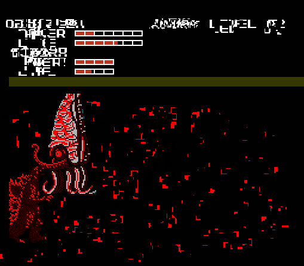
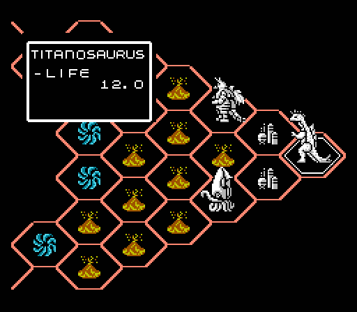
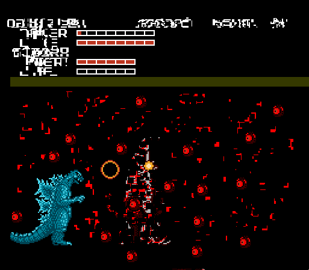
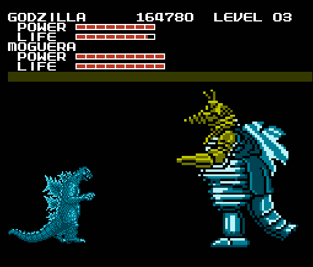
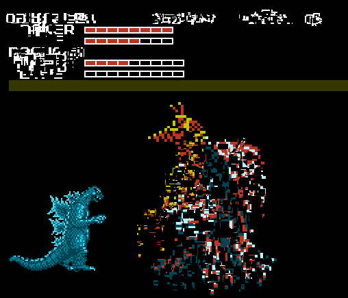
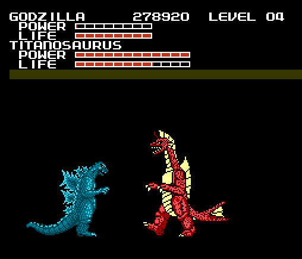
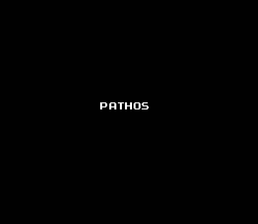

<section>

When I was a little kid, the two things I loved most in life were Godzilla, and
NES games. So naturally when *Godzilla: Monster of Monsters* came out, it was like
a dream come true. Well, almost. To sum it up, most of the game revolved around
getting through (very repetitive) outer space levels while smashing up tanks and
jets, and then fighting against Godzilla's monster enemies. Overall it was pretty
mediocre, but back then I didn't care. When I got the game as a present for my
tenth birthday, I played it night and day, as much as I could.

Unfortunately I had traded the game for *Amagon* a year later, much to my regret
when I found out what that game was like. Recently, I had bought a new NES system,
and through a lot of hunting and asking around, my friend Billy finally managed
to find a copy of *Godzilla: Monster of Monsters*.

I was pumped to play my favorite childhood game. It never even occurred to me to
ask where Billy found it. He also gave me some other games like *Legend of Zelda*,
*Bomberman* and some stupid thing called *Action 52*, but Godzilla had to come
first.

So I started the game, and the nostalgia came flooding back like a tidal wave.
Godzilla's 8-bit theme song flooded proudly through the speakers and I was soon
grinning like an idiot.

Some people laugh at me for playing such outdated games, but I've never had as
much enjoyment for any games other than those on the NES. Those 8-bit games take
me back to when things were much simpler, more... safe. But after what's happened
with this game I don't have those feelings anymore.

I had forgotten how quick the fun of smashing things as Godzilla wore off in the
scrolling levels. The game bombards you with bullets and things crashing into you
from every direction, and you're too big to avoid most of them. Although my
excitement had worn down some, it wasn't long at all before I got to my first
boss battle.

My first opponent was Gezora, an obscure squid kaiju who had never been in a
Godzilla movie.

The most annoying thing about fighting Gezora is that he always backs you into
a corner and starts smacking you with his tentacle, and you're unable to move
until he gets off you. This move doesn't do any damage, but it can stall you
until the timer runs out and you have to start the fight over, and he regains
some health.

It's as annoying as it sounds. And of course, he did it when I fought him. Only
for some reason this caused the game to glitch up, because once he started
smacking me, he never stopped. The timer is supposed to end the fight in about
forty seconds, but this lasted for nearly five minutes. After a while the graphics
started to mess up, with little red blocks all over the place.

Which was weird, but I just took the game out, blew on it, and then started again.
I wasn't about to let a little glitch stand in my way. So I started again and
this time defeated Gezora and the level's other boss monster, Moguera without
any problems.

So then it was onto the next planet: Mars. I browsed around the board and found
something unexpected: where Varan's piece should have been, there was instead a
piece representing Titanosaurus. There were only ten kaiju in the game, and
Titanosaurus was not one of them. Or so I thought. Perhaps Titanosaurus was
originally intended to be in the game but was swapped out with Varan for some
reason?

So I began to feel very excited---not only was I playing my favorite game,
but I was playing a prototype of some sort with a new monster! Needless to say,
I ran through the levels as fast as I could to see Titanosaurus in action.

Fought Gezora again and beat him before he could do his tentacle smack, but this
time the glitch started happening when he died. Gezora's sprite didn't sink to
the bottom, but instead seemed to be devoured by the glitch, and his eye started
randomly spawning all over the screen.

I know now that these glitches with Gezora were my first warning sign that
something was very wrong with this game. But foolishly I ignored it, and proceeded
on to fight Moguera, who this time had a glitch of his own:

Moguera was twice the size he should have been, which startled me. He was also
considerably harder to beat than usual (which is to say, not at all), but soon I
had defeated him also, and when he died yet another glitch happened:

This happened extremely fast so I was lucky to get a screencap of it at all, but
what happened was that the Giant Moguera sprite started to "shatter" and "melt".
Also if you look at the garbled text at the right corner of the screen, you'll
notice what appears to be a bird in a cage... I still have no idea what that meant.

At this point I was about to fight Titanosaurus, and I was worried as to what kind
of glitches would happen this time. But to my surprise, Titanosaurus looked just
fine, although all of the game's bipedal monsters were the same height,
Titanosaurus was a bit taller. But since Titanosaurus actually was taller than
Godzilla in his film debut, I thought this was kinda cool.

After a very fun fight with the monster that wasn't supposed to be in the game,
I took over the enemy base and proceeded not to Jupiter like normal, but instead
to... "Pathos":

</section>
