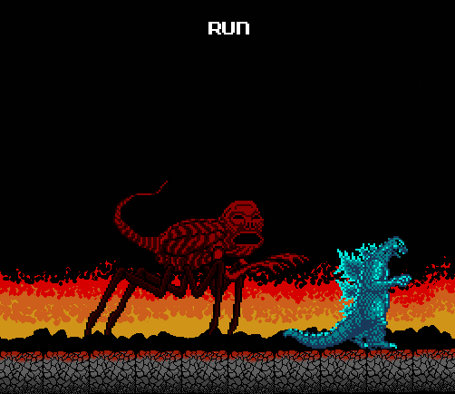

Pathos was the same as Jupiter in layout, except the board was dark blue rather
than green. The first thing I noticed was that all the usual level icons had been
replaced by a blue rock and some kind of orange honeycomb shape.

There was one icon that had part of the Jungle Icon shape, but I didn't pay much
thought to it. I checked the other side of the board to see the new monster.
Instead of Hedorah, it was Biollante.

But that couldn't have been right. *Godzilla vs Biollante* didn't come out until
1989, and this game was made 1988. Perhaps Toho put Biollante in the game to build
excitement for the movie next year, but changed their minds? I tried to rationalize
the game's abnormalities any way I could, but this would prove to be futile.

Pathos' map song was the first new song I heard in the game. Like most of the new
songs it was hard to describe, I'll try.

It started out slow and suspenseful, much slower than any song in the game. But
every twelve seconds or so there would be a loud clashing sound, and the tempo
changed. It was like the composer randomly played parts from five different songs
with the same instruments.

I moved Godzilla over to one of the many blue rock icons that had replaced the
jungle icons and started the level. The level resembled a blue mountain range
with a blood red planet in the sky. But there was something odd about the
mountains, they had a "shredded paper" look to them. I thought at first maybe the
glitch had affected it, but it looked far too intentional.

I quickly noticed something else about this new level: There were no enemies, at
all. Not even any obstacles.

I should also mention that this was were the point meter started to become glitched
beyond comprehension. But it didn't bother me much, I never keep up with game
points.

So without having to focus on anything, I listened to the music while walking
through the level unopposed. The music had a sorrowful feel to it. It would have
been rather pleasant, had I heard it in a normal game.

The level went on for three screens, but with no obstacles around I finished it
very quickly. I tried other levels of the same type to see if any enemies appear,
but there were none. There was little else to be seen in the blue mountains,
so I tried the other level type.

I started one of the orange levels, and my eyes were assaulted with a grotesque
background of tumorous orange eyes. The "sky" was the same as the ground, so I
assumed the game was indicating that this level takes place in a cave.

The only enemies here were Matango Spawn, but as you can see the little bastards
were everywhere. The music certainly didn't help, with a mixture of screeching
sounds and loud drum beats that sounded like a monster's theme in a horror film.
After completing it, I tried to avoid playing through anymore of these levels
whenever I could.

The map was short so it was only a few minutes before I was headed towards a
rematch with Gezora and Moguera. But this time, their sprites and attack patterns
were vastly different.

I fought Moguera first. Moguera's replacement was a flying machine with a slight
resemblance to a Pascagoula alien. It was a bit like fighting Mothra, only it
moved with a lot more grace. It attacked by spinning its front tentacle like a
corkscrew, and it still had an eye beam, except now it fired from the drill.

This lanky aberration had replaced Gezora, and the new beast was more of a
challenge. It would run and jump at a fast pace, constantly swinging its arms
around making it hard to get close, and of course it tried to pin me in the
corner with as much annoying resolve as ever. I defeated it using a combination
of tail whips and heat beam spamming.

I defeated them and was going to fight Titanosaurus, but when I started the fight
Titanosaurus was nowhere to be seen, and the game simply went back to the map with
the Titanosaurus piece now missing.

There was no one left to fight now but Biollante, so I eagerly started the battle.

I was quite surprised that Biollante started the fight in her Rose Form. She was
immobile and used tentacles to keep me away from the main body, which took the
most damage.

As expected, she turned into her Final Form after taking enough damage. The sprite
looked pretty damn good for 8-bit.

The battle technique was the same, except now Biollante could move, albeit slower
than any other monster. Being hit by the tentacles did more damage now, and
Biollante could do an acid spit, which I managed to avoid by jumping in the
screencap:

Not much more difficult to beat than Titanosaurus, it only took two rounds. But
when Biollante was gone, The music had stopped, and there was a new icon
replacing the base:

This icon wasn't there before I beat Biollante. It resembled a red tribal mask,
and I had a feeling of dread when I saw it. But it since it replaced the base,
it must be the only way to exit Pathos. I moved Godzilla to the square and
started the level.

It was a hellish looking place with no sky, and a flickering fire in the
background. The fire looked far more advanced than anything I've seen on the NES.
There was "music", in the form of a slow, steady drum sound resembling a heartbeat.

All the text on the top of the screen, and the life bar, were gone. In their place
was a single bit of text in the middle of the screen that said "RUN".

My feeling of dread had intensified. I cautiously walked through the level, but
like the blue mountains there were no enemies. I paced around for a minute
before thinking "Run?... from what?"

The first time it hit me, I didn't even see it.

I heard a noise outside my room and turned back to see if something fell, and
when I looked back Godzilla was dying. I figured it must have just been a glitch,
but I wasn't going to play through the game without Godzilla so I restarted the
game and went to the password screen.

Have I ever mentioned how creepy the password screen music is? If you've played
the game, you know what I mean. It doesn't at all fit the mood of the game,
it's more like something from a horror game. Maybe they made it like that so
kids wouldn't cheat.

I was quite annoyed at this point, because I thought I was going to have to fight
all the monsters again. But that didn't happen. The game started me off right where
I was before I started the red face level. So I tried again, making sure to pay
attention this time.

That's when heard a low bellowing sound, and then I saw it. This... thing.

Do you know that feeling your body has when you feel like you're in extreme danger?
You start to recoil and tense up as the adrenaline flows through your veins,
and your nerves start to feel very cold?

That's the feeling I had when I took this screencap.

I haven't seen all the Godzilla movies, but I'm pretty damn sure THIS was never
in any of them. It had to be something the creators made up. But what kind of
sick fuck would put THIS in a children's game?

By sheer dumb luck, or perhaps the adrenaline boost, I managed to run fast enough
to get away from it. It ran very fast, so much so that if you saw it you were
almost certainly going to die. And when I say "die", I mean your monster gets
killed instantly if the creature touches them.

Once I had gone back to the map, I was so afraid that I was extremely tempted to
just shut the game off and try to pretend this never happened. I couldn't believe
what I had just seen, it couldn't have been real.

And even if I wanted to continue, I still had to get Mothra through this chase
level. But as I stayed inactive on the map screen for a few minutes, my fear
was replaced by burning curiosity. What the hell had just happened? What was
the rest of the game like? I only had to beat this level with Mothra and then
it was onto the next world.

But when I moved Mothra to the red face, the game registered it as me beating
the level. I was quite relieved. I tried to prepare myself for the next world:
"Trance".

