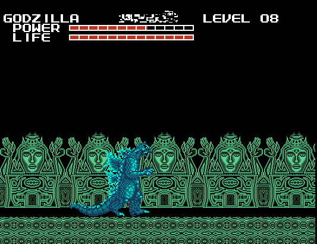
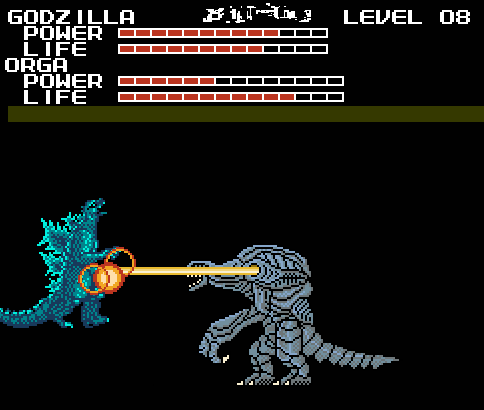
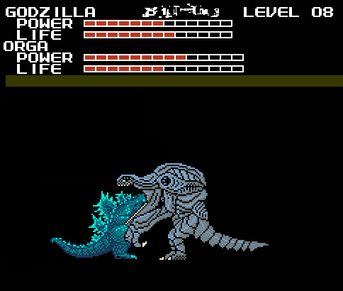
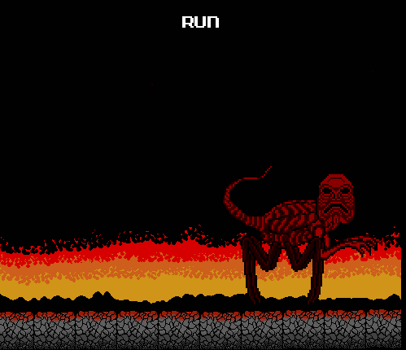

I was still pretty shook up from the last level when I started "Trance". Trance's
map music did nothing to ease the tension. As for how to describe it... have you
ever heard the theme from Videodrome? That's the closest thing I can think of it
to compare it to.

I checked to see who the new monster was, and it was Orga. A monster who didn't
make his film debut until 2000, appearing in a game made in 1988.
So much for my theories about Titanosaurus and Biollante. There's no way this
game was made in 1988!

Those guys at Toho may be smart, but I'm sure they couldn't see that far into
the future. If they could, they never would have gave Roland Emmerich the
rights to make a Godzilla movie.

No, this had to be a hack of some kind. Which just opened up even more questions.
Who made this hack? When? How ? And most importantly, why? The "why?" was the
question that bothered me most.

My immediate assumption was to think Billy did this to pull a joke on me. But
that couldn't be right either. Billy didn't know how to make a ROM hack.

And if he did, he'd probably just do something simple and stupid, like replacing
all the monsters with crudely drawn genitalia. Unless Billy had amazing game
editing skills, and a serious dark streak to his imagination that he never told
me about, he couldn't have made this. Is it even possible to put a hacked ROM
into a cartridge?

Aside from all that, my eye was drawn to a new icon on the map: a question mark.
I was really curious as to what it did.

I'm sure you're also curious, So I'll explain the "Quiz Levels" now, since this
was when they start appearing. There was one of these per map from here on,
and they always appeared near the start of the map.

When you start on a "Quiz Level", you appear on a screen like this:

As you can see, there's a question at the top, a "yes" and "no" button, and a
emoticon in the center. I refer to the emoticon as "Face" (real creative, I know),
and for convenience, I'll refer to Face as the one asking the questions.

The music for the quiz levels was a track actually in the game, it's the one
that plays when you try to use the "Gh1d0ra" cheat and get sent to an unplayable
level.

Face asks you twelve "Yes or No" questions, and you move your monster to the
buttons for your answer. When you answer, the question disappears and Face
changes expressions for about eight seconds, then he goes back to neutral
and a new question comes up. There was no time limit, nor any right or
wrong answers.

Face has no respect for the player's personal boundaries, and will sometimes
ask deeply disturbing and personal questions, For example: (Do you like hurting
people?) (Have you ever killed/raped anyone?) (Have you been molested by a family
member?)

Other times he would ask questions that were either mind-numbingly stupid (Is
the Sun hot?) (Is water wet?) or just flat out ridiculous (Does your dog like the
President?) and maybe once per quiz, Face would ask you a question about the game.

With one exception, Face's expression changes seemed to have no effect on the game,
except for indicating what the game creator thought of your answer. His reactions
rarely made any sense, and at first I thought they were randomly generated.

The questions never followed a pattern, Face never stayed on the same subject for
more than two questions. Early on, there were questions that made me think Face
was building up to something, only to then ask some stupid garbage.

Here are the expressions of Face that I saw while playing. I'll separate
them into two categories: The expressions I understood,
and the expressions I didn't.

First are the expressions I understood:

1. Neutral, his default expression
2. Angry (If you try to attack Face, his expression changes to this, but nothing
else happens)
3. Sad
4. Happy
5. Sick
6. Maniacal (Face made this expression when he was being an asshole. You'll see
what I mean later)
7. Surprised
8. Love
9. Annoyed
10. Confused
11. Guilty/Hurt

And here are the others:

Two of these only appeared once (Numbers #1 and #12), and I suspected they might
have been in-jokes from the creator. Their respective questions were "Do you
like Ice Cream?" and "Are you a tough guy?".

As for the questions in the first Quiz: Luckily, I had a notepad and pen handy.
I have problems remembering things, so I often carry one around to jot things
down, and sometimes I doodle in it when I'm bored. So when the first quiz
started I thought I'd record what happened. I'm glad I did.

**Quiz 1**

1. Do you like the game? 
Answer: Yes, Reaction: Happy

2. Are you afraid? 
Answer: Yes, Reaction: Surprised

3. Are you over 18? 
Answer: Yes, Reaction: Weird Face #5

4. Do birds have teeth? 
Answer: No, Reaction: Love

5. Is peanut butter good? 
Answer: Yes, Reaction: Sick

6. Does the moon rotate? 
Answer: Yes, Reaction: Weird Face #11

7. Have you had a job? 
Answer: Yes, Reaction: Confused

8. Do you like hurting people? 
Answer: No, Reaction: Annoyed

9. Is the Sun hot? 
Answer: Yes, Reaction: Sad

10. Do you like dogs? 
Answer: Yes, Reaction: Happy

11. Is the president good? 
Answer: No, Reaction: Angry

Now that I've explained all that, time for the gameplay.

After the Quiz level, I tried the new green temple icon first.

Wow. Maybe this is why the game was so weird---one of the designers was clearly
drugged out of his mind!

Jokes aside, I was quite impressed by the graphics of this level, as disorienting
as they were (But I hate those creepy, blank staring statue faces). The music had
a hypnotic, Indian techno vibe to it.

There were two new enemies in this level: a flying ghost type thing with a trunk,
and a bat with a horse skull for a face. They appear at random, but I was lucky
to get a screencap of them both:

Then I proceeded to a blue mountain level, expecting another nice, calm stroll.
I took my time walking through, and was completely taken by surprise when this
happened:

Not-Moguera came speeding towards me and took off quite a bit of health with his
tentacle screws! It only took me two minutes to kill him without having to worry
about a time limit, but the boss monsters NEVER showed up in the scrolling levels
in the normal game. I was worried as to what other rules the game would break.

After another blue mountain stage, it was time to fight Not-Varan, whose
replacement was one of the most bizarre things in the game:

This strange creature attacks you by kicking, and also opening up his chest and
firing heat-seeking missiles. ...I still don't get it.

The missiles were sometimes a pain to deal with, but I found out you could tail
whip them out of the way. Not-Varan was probably the easiest of the monster
replacements.

The same could not be said for Not-Hedorah.

Apparently the source of the horse-bats, Not-Hedorah was the most aggravatingly
difficult monster to fight yet. Mostly because of his special ability: He could
shriek and summon a small swarm of those horse-bat things.

I know there's only two in the screencap, but every time he did this, about ten
would arrive. The AI took advantage of the distraction and attacked twice as
fast while the horse-bats were flying around.

Once that annoyance was over with, I went through a green temple level to kill
some enemies to restore my health. Interestingly, none of the horse bats showed
up after Not-Hedorah was killed. And that was when I got an idea:

If killing all the monsters makes the red face show up, what would happen if I
avoid fighting Orga, and go straight to the base?

So I gave that a try:

The game told me there was no monster there when I tried to start the base level.
And immediately afterward, the game took control of my Godzilla piece and moved
it in front of Orga. My little trick didn't work, so I tried to prepare myself
for another chase. But first, I had to beat Orga.

The fight with Orga confirmed another thing: Whoever created this game hack was
clearly a Godzilla fan. Not only because they picked a monster like Orga, but
because they actually implemented something that happened in *Godzilla 2000* in
a really neat way.

Orga's primary attacks were a punch and a heat beam from his shoulder cavity.
But once you had got him down to half his health, he did something new: He would
expand his jaws and try to swallow Godzilla, in the process stealing your health
and energy!

But in doing so, he gave himself a new weakness: firing a heat beam into his mouth
would take a devastating four bars off his life meter!

With that weakness revealed I soon beat Orga, and despite how much I had hoped
otherwise, the red face appeared on the map where the base was, and the music
stopped.

I readied myself as best I could. I started the level, and seeing that it was
basically the same as the first, I didn't waste a millisecond before I started
hauling ass.

I soon encountered obstacles in the form of the ground tile, suspended in air.
Most of them you could jump over or destroy, others you had to crouch under.

About forty seconds into it I heard the horrible bellowing roar and saw the spider
beast following close behind me. Stacks of obstacles barely slowed it down, it
would back up and then charge its way through them, smashing them into bits.
And when the smaller obstacles got in its way, it would expand his jaws and
swallow them whole:

I was afraid, but with fast thinking and faster button pressing I escaped him yet
again. I felt really excited, and so I laughed and said "Not this time, asshole!"
I decided to take a screencap to celebrate.

But when I said that sentence, just before the level ended, the monster did
something that made my blood run cold.

It looked at me.

That wave of mortal terror overtook me again, and I sure as hell wasn't laughing
anymore.

I took another screencap of the next level title, right before I rushed to the
bathroom to splash some water on my face. (And to take a piss that I nearly failed
to contain when that fucking thing looked at me.)

