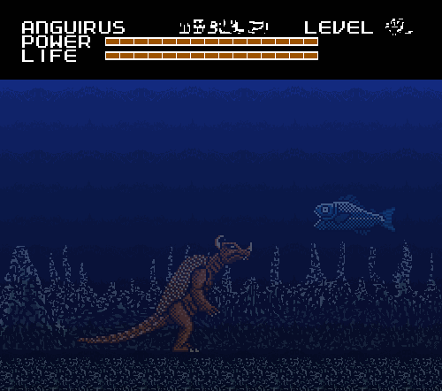
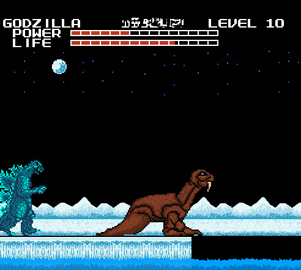
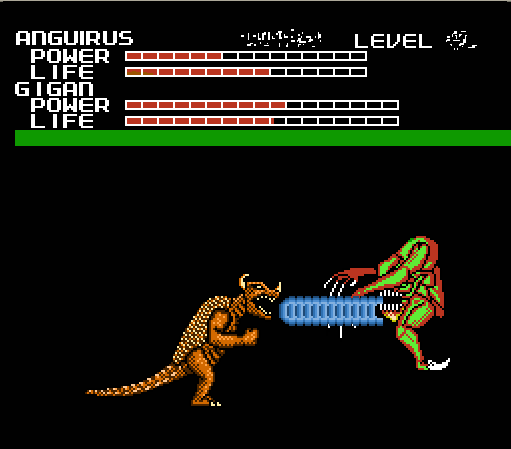

When I got back to the game, I was getting very upset and confused.

I thought about the way the monster looked at me. The game COULDN'T have heard
what I said, that's impossible. It had to be a random occurrence. But why did
it happen precisely at the moment I insulted the monster?

Nothing about this game made any sense. The new Godzilla monsters, the weird
replacement monsters, out of place imagery like the green temples, quiz levels,
and the red monster chases. It didn't seem to add up in any kind of meaningful
way.

If it was a prank, it wasn't funny in any way I could understand, and they
clearly put far too much effort into it.

If they were trying to make a genuine sequel with new Godzilla monsters,
then why did they add... everything else?

Maybe it was some kind of art experiment? Some group project made by a bunch of
really talented and crazy people, and they lost the cartridge somehow? Or maybe
they intended for some random person to find it?

It was all just fruitless guessing. As far as I could tell, there was only one
way to figure out what the deal with this game was: To play it through to the end.
Maybe, just maybe, there would be something in the credits, an explanation by
the creators as to why they made this. Or it could be something much more cryptic
and strange, maybe even something horrifying.

Before I got a good look at the Dementia board, I considered replaying Trance to
see if the red monster would look at me again. But I decided against it. I wanted
to keep moving forward. I was also somewhat worried that backtracking might cause
the game to become even more strange.

The Dementia board music sounded a lot like the Saturn music, except it was slowed
down, and played with a piano-sounding instrument. Like most of these new map themes,
it had a dangerous suspenseful feel.

While listening to the music, I looked at the Dementia board. There were four
boss monsters this time: SpaceGodzilla, Manda, Gigan, and Baragon. I was surprised
that there were two new Toho monsters this time. But the best surprise was still
to come.

I started the Quiz level. Here's another list of results in the same format as
the last one:

**Quiz 2:**

1. Can you swim? 
Answer: Yes, Reaction: Happy

2. Do you like fish? 
Answer: Yes, Reaction: Sick

3. Can penguins fly? 
Answer: No, Reaction Sad

4. Can it spin in all directions? 
*(There was no clarification of what Face meant by "it" so I just guessed)* 
Answer: No, Reaction: Surprised

5. Do you breathe oxygen? 
Answer: Yes, Reaction: Weird Face #8

6. Does it taste good when you bite a woman? 
*(I don't know who came up with this question, but I really hope they're getting
mental help)* 
Answer: No, Reaction: Annoyed

7. Is it night where you are? 
Answer: Yes, Reaction: Weird Face #6

8. Do you like cats? 
Answer: Yes, Reaction: Confused

9. Is water wet? 
Answer: Yes, Reaction: Angry

10. Have you ever broken a bone? 
Answer: No, Reaction: Happy

11. Do you like your job? 
Answer: Yes, Reaction: Hurt

12. Would you like a new monster? 
Answer: Yes, Reaction: Weird Face #11

I wasn't entirely sure at the time what Face meant by "new monster", but I couldn't
resist answering "Yes", just to see what would happen.

The result was mind blowing.

The game took me back to the board and I had a new playable monster in the form
of Anguirus! Ever since I was kid, I always wanted to play as Anguirus, since he
was my second favorite Godzilla monster (And plus I never liked Mothra all that
much).

I moved my new Anguirus piece over to the level right next to it, eager to test
out my new monster.

Before I get into the level description I'll talk about Anguirus a bit:

Using the up and down buttons you could choose whether Anguirus stood in a bipedal
stance or crawled around on all fours. It wasn't a huge difference, but being able
to stand was helpful in boss fights, and crawling sometimes helped dodge obstacles
and attacks.

He could punch and kick like Godzilla, but no tail whip. Instead he had something
far more interesting: The ability to curl up into a spiked ball of death and roll
around. You could still take damage, but it was lessened. It was a good way of
clearing out stage enemies, but unfortunately doing this also drained the power
bar.

But the spiked ball wasn't his only special ability. When you pressed Start,
he would fire a beam of energy from his mouth. It resembled Titanosaurus' sonar
attack, and if this were a hack it may have been inspired by the Roar attack from
Atari's Godzilla fighting games.

Also of note is that when playing as Anguirus, the "Level" meter gets glitched up.
Judging by the life and power bar, I'd say he's on Level 10.

Now onto the level:

As you might have guessed from the level icon, these levels are green palette swaps
of the ground and background tiles from the Blue Mountains. But what immediately
caught my attention was the water, which has a transparency effect.

Was that even possible for an NES game? I know the Super Nintendo could do it,
but I had never seen a transparency effect in a game on an NES.

The Green Mountains music was played with the same instrument as the Blue Mountains,
but the melody was totally different. It was a very simple song with a lot of
abrupt pauses, followed by a loud note every few seconds.

Anyway, I went through the usual strolling through the level. And again there were
no monsters or anything, but pretty soon I had reached a cliff above the water.

There was nowhere to go but into the water, so down I went. The water transparency
made things a bit harder to see, but it's tolerable. After going underwater I
encountered two new enemies: a giant piranha and some kind of spiky bottom feeder
thing. I liked the piranha because I could easily tell what it was.

It was a sane enemy design that would appear in a real game, and there were very
few enemies like this.

They didn't take much hits to kill, but they were quite annoying, and could
considerably trim down your life if they got close enough. They also tend to
travel in packs.

As for the bottom feeders, they're easy to deal with. They swim along the bottom
of the screen towards you, and are easily crushed with the roll attack or jumped
over. In this screencap you can see me about to run one of them over, and there's
a pack of piranha behind it.

After I beat that level, I moved Godzilla onto the blue castle icon. I started
the level and I got a title screen, with the text "UNFORGIVING COLD".

The level itself looked like a castle dungeon made of blue bricks,with rows of
identical white statue faces on the walls. These statue faces had a permanent
look of horror on their faces.

There was also some flickering gray static, which didn't really obscure my vision,
but it adds to the very unsettling mood of these levels. The music was a twelve
second loop of a low pitched choir vocalizing, that sounded very familiar to me.

Whenever I played through one of these levels I got this sudden, horrible feeling
of anxiety. I had the feeling that the farther I progressed through the level,
the closer I was getting to something unspeakably evil.

There weren't any enemies, but these were the some of the longest levels in the
game. I only played one level, but it took seven minutes to complete.

I didn't want to admit it to myself at the time, but I realized something playing
the blue castle level: This game has the power to make the player feel certain
things.

I don't mean in the sense that you get irritated playing a crappy game, or get
unnerved by something scary in a game. What I mean is that certain events in this
game can instantly make you start feeling something.

I know that sounds completely insane. I don't blame you for not believing me, I
wouldn't believe any of this either if I didn't play the game myself. But there
is something very, very wrong with this game, and I still don't know how to
explain it.

So... then it was time to fight Baragon's replacement.

Although Baragon was originally the smallest monster in the game, his replacement
was the largest. It was so tall in fact, that the "ground" was noticeably lowered,
and Not-Baragon's head still barely avoided collision with the bar at the top of
the screen. And he was just as frighteningly bizarre as he was huge.

You may be wondering how he attacks without arms. Well, he has the most powerful
kick in the game. But his other fighting technique is much stranger.

First he blasts a cloudy breath of pixels down at you, which causes you to freeze,
then he walks back to the right corner of the screen and... extends a huge gatling
gun from his abdomen.

That might seem amusing to you, but it certainly wasn't to me when I was playing
the game. This attack is almost as annoying as Gigan's saw, and Not-Baragon could
have been unbeatable if he consistently used it. Thankfully he only did it twice
while fighting him.

Once you unfreeze, you can run up and start damaging the gun, which does extra
damage to him. This helped me to destroy him, and then it was time to play the
third level type. I decided that I was going to use Anguirus to fight Manda and
Gigan, and then fight SpaceGodzilla as Godzilla (it was only fitting).

Before getting into the battles, I'll describe the third level type: The Arctic.

The Arctic is exactly what you'd guess from the name, an icy tundra with a few
watery segments.

The music reminded me a bit of "Northern Hemispheres" from Donkey Kong Country,
in 8 bit form. A very dangerous sounding song, it made me think about being
trapped in a tundra and freezing to death.

There were two new enemies in this stage. The first was a creature frozen in a
block of ice. They block your way and you have to use the heat beam to thaw them
out of the ice. They look a bit like a smaller version of Not-Gezora, only
without the eye.

When freed, they do a strange crawling movement and push you backwards.
It doesn't cause any damage but it's a bit annoying.

After dealing with the Iceman, I kept walking for a minute or two and came upon
a water segment. I jumped in, and this time I managed to get a screencap showing
how the water splashes when you jump in. Dunno how they programmed that, but it's
pretty impressive. Another interesting thing is how the screen changes focus when
you go underwater.

Here you can see the other new enemy, a little thing I call "Spike Walker". They
walk towards you and explode randomly(or instantly if you attack them), sending
spikes in every direction. The spikes don't do much damage but they did get me
dangerously close to falling into a pit a few times.

Oh, speaking of the pits: Down into the water, the game has a platformer element:
bottomless pits. There weren't any of these in the original game, since it was
strictly an action game, but the pits were a neat addition.

After getting back on land, I encountered a very unexpected miniboss: Maguma,
the Walrus Kaiju. I know this game had some obscure monsters to begin with,
but wow. Not that I'm complaining, it's a pretty cool cameo for an unappreciated
kaiju.

Maguma's fighting tactics were very simple, he had a freeze beam, and he could
charge into you. Not very challenging but certainly more entertaining than the
Matango miniboss in the original game.

One really interesting thing about Maguma is that he doesn't die when you defeat
him, he turns tail and retreats. This was the first time I had ever seen an enemy
monster change direction, let alone retreat. I tried to chase after him, but he
dissapeared after I got in the water. Poor bastard.

And that does it for the Arctic. I'll talk about the Manda fight next.

I forgot to mention before, but the music that played during the new monster fights
is re-used from themes actually in the games.

So far the themes have been:

- Titanosaurus: Gezora's music
- Biollante: Hedorah's music
- Orga: Baragon/Moguera's music
- Manda: Varan's music
- Spacegodzilla: MechaGodzilla's music

As for the fight, Manda was a fairly crafty opponent. When it realized one tactic
was ineffective, it would immediately change to a different one.

Manda used quite a few tricks, like spitting fire, biting, and the most
irritating of all, constricting.

It doesn't mercilessly drain your life down like Gigan's cutter, but it was by
far Manda's strongest attack.

One last thing to note (that I found pretty cool) was that the Atragon showed up
during the fight to help me out. Manda crushed it with ease, but it was still
cool.

After I slayed Manda, I played through an Arctic level for health power-ups and
then it was on to Gigan's replacement. When the fight started, I was very
confused, because there was nothing there. I thought this was going to be like
the Titanosaurus "fight" in Pathos, but just about the time it would have been
going back to the map, a piranha appeared onscreen.

But it wasn't there for long. As soon as it appeared, the speakers emitted an
ear-splitting screech, and Not-Gigan flew in and ripped the poor fish into
pieces.

Well, that's one way to get the player on their toes. That abrupt entrance
scared the hell out of me and got my adrenaline rushing. Which in retrospect was
a good thing, because Not-Gigan was one of the fastest, most unrelenting
opponents in the game.

Not-Gigan was tough, but my new skills with Anguirus helped to even the score.
This was still an incredibly intense fight! Not-Gigan's attacks consisted of a
some kind of blood laser he spews from his mouth, and a downward slash. I was
expecting some hellish variant of the buzzsaw attack, but thankfully there
didn't seem to be one.

The Howl attack was invaluable in defeating him. I would have taken more
screencaps of the fight, but I really had to concentrate.

After that, there was just one monster left to take down: SpaceGodzilla. As
mentioned earlier, I used Godzilla for this fight.

Spacegodzilla's fighting technique was rather frustrating, but admittedly a very
clever idea.

SpaceGodzilla would use his energy to create two flying crystals, which would
reach the ground and become crystal spires.

These spires not only block you from reaching SpaceGodzilla, but it also allowed
him to constantly recharge to full energy, and blast you with a deadly fully
charged Corona Beam until you broke the spires.

SpaceGodzilla would eventually drain his own spires of energy until they
shattered, but if you waited for that to happen you'd probably lose a lot of
life. Heat beams actually seemed to re-energize the spires, so you had to use
physical attacks.

When you finally got close enough to hit SpaceGodzilla, he was no pushover. When
I punched him, he hit me back just as hard. SpaceGodzilla does everything in his
power to knock you back to the left corner of the screen, so he can create more
spires.

By the time this was over, I only had about five life bars left. But it didn't
matter, because I didn't need to fight anymore. I needed to run.

Here we go again. I decided right then that I really wanted to see the end of
this game. As terrifying as these levels could sometimes be, I had to beat them
to get though.

For this chase I tried out Anguirus, since his roll attack allowed me to move
faster than Godzilla or Mothra. The chase started off like the first two, except
there was a river of blood below the ground. I was beginning to get the hang of
it, and the extra speed from the Roll helped me get an edge on the red monster.
Especially since I didn't have to worry about a power limit, and could keep
rolling endlessly.

Like the previous levels with water, the ground inevitably reached a stop. So I
rolled off into the blood. To my surprise, the hell beast didn't follow after
me, it just stopped at the edge of the ground and grimaced. "I guess it can't
swim" I thought to myself.

So I went "underblood" and continued moving. There wasn't anything around, but I
knew something was up. The chase wasn't going to end that easily, could it?
Surely something else had to show up. And sure enough, I heard the bellowing
roar, sounding slightly different...

...And the monster was following after me in a new aquatic body! I had no idea
it was a shapeshifter. After it reappeared, the chase started to get into the
difficulty I had expected. Being submerged slowed me down, putting me and the
beast at about the same speed. The only thing that would keep me alive was fast
thinking and reflexes.

I encountered some bottomless pits, in which mines floated up from. I assume
that if you hit one, it would damage you and knock you back. Considering how
fast the red monster swims, hitting the mines would be instant death, so I went
through great effort to avoid them.

But that wasn't all I had to be wary of. Halfway through the chase the hell
beast revealed yet another surprise: a tentacle formed of intestine and tipped
with a clawed set of jaws burst from its mouth, trying to pull me in and devour
me. I only barely avoided both the tentacle and the mines, but I could tell the
beast was getting desperate, because the chase was nearly over.

And about a minute later, I had spotted a bit of ground that served as the exit.
I leaped with all the might I could muster (without breaking my controller). The
beast screamed with rage and jumped out of the blood river in one last attempt
to drag me down, but I escaped its grasp. This time.

I fell back on my bed and took a deep breath, satisfied with yet another
successful escape. Now I was headed to the fifth world: Entropy.

