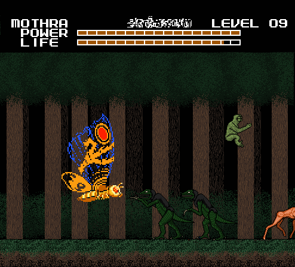
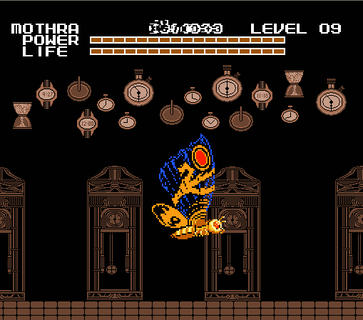
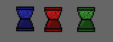
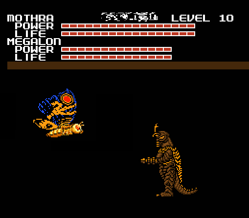
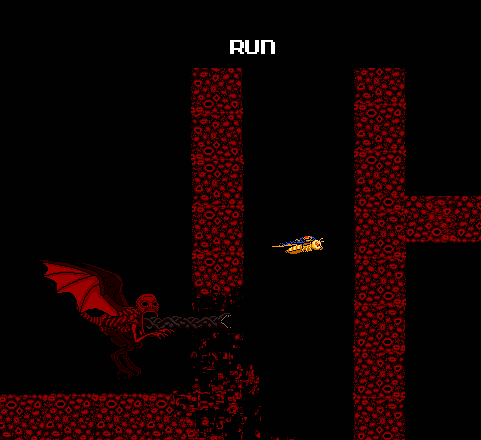

<section>

In the original game, the 6th world was Pluto. Ironically, despite being the
smallest planet, Pluto was the largest and most diverse world in the game.
Entropy had a different layout, but was similarly huge and diverse.

The board music was played by a violin instrument, a melody that started out
sounding mournful and then it gets rather... I guess I would call it "distorted"?
It made me feel depressed and unnerved. Not something I would want to hear while
trying to sleep.

Strangely, none of the levels from the previous worlds were present here,
instead there were eight brand-new icons. The bosses this time were Megalon,
Battra, and Mechagodzilla.

As usual, the first thing I did was go to the Quiz Level for another
interrogation from Face. But I when I got there, I noticed something different;
instead of the usual goofy GH1D0RA music, it was the Password theme.

The music change seemed to be intentional, because after the first two questions
at the start, the quiz started to take on a darker tone;

**Quiz 3**

1. Do you like Ice Cream? 
Answer: Yes, Reaction: Weird Face #1

2. Do you like clowns? 
Answer: Yes, Reaction: Weird Face #10

3. Is time slipping through your fingers? 
Answer: Yes, Reaction: Weird Face #2

4. Do you have any regrets? 
Answer: Yes, Reaction: Hurt

5. Do some people deserve to die? 
Answer: No, Reaction: Weird Face #3

6. Is it safe to go out at night? 
Answer: Yes, Reaction: Weird Face #5

7. Do you find it hard to sleep at night? 
Answer: Yes, Reaction: Weird Face #6

8. Have you killed anyone? 
Answer: No, Reaction: Weird Face #7

9. Do you want to kill anyone? 
Answer: No, Reaction: Angry

10. Are you actually accomplishing anything? 
Answer: No, Reaction: Weird Face #4

11. Does life have any real meaning? 
Answer: No, Reaction: Love

12. Do you like Mothra? 
Answer: No, Reaction: Maniacal

I knew that last one was gonna be a gameplay related question, but I had no idea
what the result would be. I answered honestly, because as I said before I never
liked Mothra.

Nobody liked playing as Mothra in this game. And there was a good reason for
that, every other time Mothra gets hit she gets slammed back to the left corner
of the screen, and she sucks at fighting because her attacks are so weak. The
only benefit Mothra had was being able to fly over obstacles in some levels.

So I answered No, and Face actually replied back to me, not only with the
maniacal expression, but with text;

> "TOO BAD!"

I was taken back to the map screen, and I was shocked to see that Godzilla and
Anguirus has disappeared from the board, leaving only Mothra. Face had just
fucked me over. Needless to say, I was pissed. But there wasn't anything I could
do, and I'm willing to bet even if I had said "Yes", I would have been stuck
with Mothra anyway. Face giveth, and Face taketh away.

I took a deep breath, and got ready to explore. There were two paths I could
take through the board, I decided to take the lower one. This turned out to be a
good choice for reasons I'll get to momentarily.

The first world ahead me of was a forest, so I started there. Almost
immediately, I got an eerie feeling. There was something about this level that
just seemed "off" to me, even more than the previous ones.

Perhaps it was the pitch black background. I've always been afraid of being in a
forest at night. Something about all those trees, makes me feel surrounded and
vulnerable.

And the fact that I was stuck as Mothra didn't help. Playing the game's previous
worlds as Godzilla gave me a feeling of bravery, being in control of the King of
The Monsters, I'd be able to handle just about anything in my way.

But it's not like that with Mothra. No feeling of strength, or security. Now I'm
just a weak, easily overwhelmed bug, traversing into the unknown.

Back to the level. The music had new instruments, sounding like woodwinds,
followed by slow, rhythmic drums and chiming bells. Gave me this feeling that I
was intruding into some dangerous place I really should not be.

After a while, I encountered the first enemies of the stage. Or at least I
assumed they were enemies. They were strange, long legged deer like creatures.
Instead of attacking, they were just idly walking around. I went to approach
them, and they ran away.

I thought about shooting one with an eye beam to see what would happen, but it
seemed wrong. These creatures were harmless. So I passed over them and continued
through the level.

About halfway through, I encountered groups of the deer-like animals, and also
two new creatures: A sloth like creature with a beak climbing on a tree, and
hairy raptor-esque beasts that were preying on the deer.

It was very surreal watching these creatures interact. I didn't feel like I was
playing a video game, but rather that I was traveling through a forest in some
other dimension.

The creatures ignored me for the most part, although the raptors did attack me
when I got too close, or if I attacked them first. I know I shot one of them to
help one of the deer creatures escape. I got clawed at, but confrontation was
easily avoided by flying up to the top of the screen.

After that, I had to choose whether I wanted to play the levels with the
hourglass, or the TV screen. I picked the latter. What I got was not at all what
I expected.

When I pressed the button to start a level on the TV Screen like I normally
would, this screen with an animation popped up. There was also music in the
background, which was the goofy Gh1d0ra music that used to be playing in the
Quiz levels.

I was somewhat unsettled by this because it was just so strange. I also found it
a bit spooky because I had a shirt that looked just like that when as a kid.
After starting the animation, you could go back to the board by pressing any
button.

After that, I had no what to expect of the rest of these icons. I went to try an
hourglass icon next. I was somewhat relieved when an actual level came up.

It was certainly an unorthodox looking level. All brown, with time measuring
instruments floating in the air and gigantic grandfather clocks in the
background. The music was the same as the board screen.

And very early in the level I encountered something else I didn't expect to see:
Original enemies from the game!

And not just that, it seemed to be a whole fleet of them. And the yellow tanks,
which were normally immobile, could now move. I took some damage, but it was
nothing I couldn't handle. But the most interesting thing about this level was
the colored hourglass items.

There were 3 of these:

1. A blue hourglass, that made time slow down and filled the level with enemies
   from the past.
2. A red hourglass, that made time speed up and filled the level with enemies
   from the future.
3. A green hourglass, that set time to the normal speed, and filled the level
   with the original game enemies.

I encountered the blue hourglass first. As stated, the game started to slow
down, and I saw the "enemies from the past", which were five different types of
prehistoric animals. I don't know much about prehistory, but I believe all of
these enemies represent real animals.

The level went into another segment, and I encountered the green hourglass, and
then I fought the original enemies again. It was the same five types so I didn't
take any screenshots. But in the last segment, I encountered the red hourglass,
and the enemies that must have been from the future.

Now, whether or not the game was showing me 8-bit renditions of creatures that
will actually exist thousands of years into Earth's future, I have no idea. But
with that thought in mind, I found this particular segment to be very eerie, and
it was made more tense because everything moved faster.

One of the future enemies bore a striking resemblance to something I saw in a
book once, called "Troodon Man". Another looked like some kind of organic
spaceship.

There was only one of the fifth type of Future creature, and when it appeared,
all the others ran for their lives, leaving me alone to battle it.

It could fly but its sprite didn't actually move, and its single attack was
firing a lightning bolt from its "face". Even so, it was surprisingly powerful,
and I suppose it could be considered a mini-boss.

After defeating it, it left a health power-up that restored the health and
energy I had lost fighting it. Which was convenient! It seemed I would need all
the help I could get to beat this world with Mothra alone.

After that previous stage I call "Time Warp", the next stage appeared to be a
Toxic Waste Dump.

As you can see, the place looked grungy, and inhospitable. The music was a short
looping of an ambient synthesizer song. Listening to it made me feel like I had
sniffed some toxic fumes myself, and it was messing with my head the whole time.
I even felt like I was choking while playing this level.

The enemies all seem to be mutated to some degree. In the above screenshot you
can see green mummies with bird skulls, that jump out of the waste to spit
projectiles. There's also a brownish cow skeleton monster with spider legs.

Halfway through the level I even saw one of the deer from the forest. It was
alone, and when I saw it, it was drinking toxic waste out of a barrel with an
anteater-like tongue.

I was moving over to try to make it stop, but then this flock of skull birds
came out of nowhere and started attacking.

The deer was scared by this and ended up running off the ground into the toxic
waste. I feel bad for it. One of the birds bit me, but I regained health quick
from killing all of them, they were rather weak.

I pressed onward. Of all the levels in Entropy, this was probably the most
"normal", in that there was little deviance from the "Move forward, smash
things" formula in the original game.

I encountered more creatures through the level, like tentacled blobs, and some
kind of deformed thing with human-like teeth. I didn't feel like provoking them
into a fight, so I kept on flying near the top of the screen. I still had to
deal with occasional flock of birds now and then.

At the end of the level was a large, bluish green lake, and there I encountered
another mini-boss. Some kind of a monster with a long neck and a whale's skull.
It attacks with a mouth projectile, and by charging into you. It also could go
underneath the water and rapidly emerge from a different place.

It was harder to beat than the boss from the Time Warp, and it had a lot of
health because it must have taken me three minutes to defeat it. It let out a
really loud noise when it died, and then sank back into the water as I left the
screen.

Back on the board, I went to the nearest level icon I hadn't seen yet, which was
a white tree. As I guessed, the level was a winter themed recolor of the forest
stage.

But unlike the regular forest, I didn't feel unnerved starting this one. I think
the music had a lot to do with it. It was a gentle, calm song, it almost sounded
romantic. It was quite stress relieving, and the forest itself looked much less
ominous covered in snow.

I traveled through the first segment enjoying the atmosphere for four minutes,
when suddenly I realized something: I haven't seen a single creature since I
started the level. Where are all the animals? Soon after, I left the screen, and
the next segment started.

In the second segment, I was still in the winter forest, but now the music was
gone. I was starting to feel suspicious, but then I reminded myself that there
were other empty levels in the game and this was likely another one of those.

But then... I heard something familiar. It was the twelve second looping music
from "UNFORGIVING COLD" starting up. I could feel my heart sink as I came across
this horrible sight:

It was a whole group of dead deer creatures, covered in snow. Judging from the
blackish blue tone of their skin, they must have all frozen to death. On closer
inspection, some were missing body parts. Now I was frightened. But I still had
to keep going.

Before exiting the level, I was really hoping to see something resembling the
previous forest animals in a living state. And sure enough, I did.

It was a creature much like the beaked sloth, except this thing had white fur
and was more of a beaked gorilla. It was walking very slowly when I saw it, but
I was happy to at least see something alive. However, it didn't stay that way
for long.

A pack of raptors, who must have sensed that something else was still alive,
came rushing in from the right side of the screen. The beaked gorilla didn't
stand a chance, as one of the raptors immediately lunged at it and ripped open
its back legs.

These "winter raptors" acted far different from their temperate relatives. While
the other raptors only attacked while hunting prey or when provoked, the winter
raptors seemed to have all gone insane. They attacked everything in sight, one
was running back and forth clawing at nothing. Even the noises they made sounded
different, more high pitched and enraged.

As I left this second segment, I even saw two Raptors fighting to the death.
They were both covered in injuries, and one of the Raptors had been blinded in
one eye. I took a screenshot, but I didn't stay to see who won the fight.

I only had to get through one more segment before I could go back to the board
screen. But in this segment, I was no longer in the winter forest, but instead a
very empty grassy plain, with a bright gray moon in the sky. The pleasant music
of Winter Forest part 1 had returned.

And immediately, I started to feel dread. This is going to sound crazy but it's
the absolute truth: The game made this level from one of my memories.

After a long stretch of nothing, I reached a lake. And then, the moon moved down
from the sky, and begin to hatch like an egg. When it did, a curled up humanoid
figure fell into the lake as the moon halves quickly disintegrated.

I heard a splash when it hit the water, then a moment of silence. Then the
screen began to shake, and a new creature emerged from the water;

And thus I was introduced to a monster I call the "Moon Beast". This was the
only screenshot I took, as I was focusing all my concentration on winning the
fight. And it was the most difficult fight yet. Stronger than any of the
previous bosses, this creature would have been hard to take down with Godzilla,
and with Mothra it seemed nearly impossible.

I suppose I would consider myself fortunate that the beast lacked any attacks
like Gigan's saw, because if it had I would never have won this. I barely had
three bars of health when I finally killed this abomination.

But what happened afterward is hardly what I could call a reward.

...I've been trying to keep my promise and suppress this memory for years, but
it seems as if I have to get it off my chest. This is a very painful memory for
me, but the game already knows about it and I think you should too. I'll just
tell you the important parts, because I don't like bringing this experience back
into my head unless I have to.

Back when I was in Middle school, I had a girlfriend named Melissa. She suffered
from some kind of mental disorder that caused her to go into "episodes".

When she was in an "episode", she would stand or sit perfectly straight and
still, and her face would instantly lose any expressions she had before. She
would speak very clearly, without any hint of emotion. When it was over, she
would start trembling and sometimes bury her face in her hands, and remain
silent for several minutes. I can't really convey the feeling it gave me in
words, and I won't try. You had to see this in person to understand.

But despite this, she was a very kind person and I cared about her dearly. We
liked to hang out in a field at night, and look at the stars. But one night she
didn't say anything to me at all, she just stared directly at the moon,
trembling. I tried to talk to her, but she suddenly sprung up, and ran right
into traffic. I tried to stop her, but I was too late. She got hit by a truck,
and was killed that night.

I looked her right in the eyes when the wheels went over her neck. That sight
has always haunted me.

I know that the game knows about this because after I defeated the Moon
Beast... this happened.

After... THAT, the game went back to the board screen. It was all I could do not
to burst out screaming, and my hands were shaking so bad I could barely hold the
controller.

I knew the game was going to test me if I kept playing. But I had no idea it
would go so far. Or that it was even capable of doing what it just did. I could
feel my brain going haywire as I asked myself "Did the game just read my mind?"

That didn't seem possible. But what other explanation was there?

It was then that I could no longer deny what now seemed obvious: This game is
alive. And not only that, it also can establish some kind of mental connection
with the player.

And yet... I couldn't convince myself to stop playing. I don't know if it was the
game messing with my mind, or just my stubborn curiosity, but even with the
previous revelation, I really wanted to see this through to the end. Even more
than I did before I beat Dementia.

Terrifying as it might be, even dangerous, I knew that if I quit playing, I
would never be able to stop thinking about it. If I tried to restart the game,
it might go back to being normal again. How many people ever get to witness
something like this firsthand, let alone be able to take screenshots of the
whole thing?

Fucked up as it was, this was the experience of a lifetime.

But even so, I couldn't take any chances with my health. I had the TV remote
right next to me, ready to turn the TV off in case I felt I was in actual
danger. And if that didn't work, I would pull the plug out of the wall, or just
run out of the room.

Surely, that would be enough...

Whatever powers the "game" has, it seemed to be confined to what it can show on
the TV and, whatever its "mental connection" could do. The latter was what
worried me. I still didn't know what I was dealing with, so I wasn't about to
underestimate it.

I took a break for a few minutes to calm my nerves. And then it was back to the
game.

And speaking of TVs: There was a TV screen icon right below the white forest I
had just left, and because the first animation was so bizarre I figured I'd try
another to see what happens. Although I expected the same animation, I actually
got a totally different one:

Weird. The music for this one was the Neptune board music. Fitting I suppose,
since it's a fishman and all. I can't help but what wonder what the point of
these things are. There was one more TV screen icon so I figured it must have a
unique animation of its own. I was going to make sure to see what it was before
I left Entropy.

But then it was time for another level. The gold brick icon was the closest
thing, so I went to that, and I started up in a "Gold Labyrinth" level.

My health and power were refilled. Not sure how or why, but I was glad not to be
heading in the unknown nearly dead. I also noticed that my Mothra sprite had
shrunk to half its original size.

The music was a slow, ominous drum beat, with female vocals kicking in about a
minute into it. Quite haunting.

The Gold Labyrinth itself was an anomaly. I'm not sure how this level would have
played out if I was using Godzilla or Anguirus, because flying seemed necessary
just to get around this place.

Another thing that caught my attention was that when you go left, your monster
actually turns and faces the left. That sounds stupidly obvious, but in the
original game you were only supposed to move to the right, so when you tried to
move left your monster ended up walking/flying backwards.

This level was apparently gigantic in size, because every time I thought I had
reached an end to it, or thought I was going to end up back where I started, I
encountered something totally new. Things like lava blockades, new enemies, and
statue faces.

And I found one statue face at a dead end with a wide, open eyed stare. The
night Melissa died, she had an expression on her face that looked exactly like
this the whole time. Even when she got hit by the truck, she still had that same
expression. I can't help but feel like something really is staring at me from
behind the screen when I look at this:

I really didn't want to be reminded of that night anymore, so I left the statue
almost as soon as I found it. I needed to find the exit anyway, which proved to
be no simple task. It felt like this level stretched on forever in all
directions. I must have wandered around the level for at least fifteen minutes
before I finally saw something.

It was a creature that wasn't gold. Seemingly the only one of its kind in the
level. Lacking any kind of hover ability like the other creatures, it just
walked back and forth on the platform.

But it wasn't long after I found it that a flying machine swooped down and
grabbed it, and then flew off with it. The machine apparently had not seen me,
so I decided to follow it, to see where it was taking the creature.

The machine stopped at a room with a large cauldron-like object in the center.
The machine hovered over to the cauldron and dropped the creature into it.

The creature came emerged from a hole in the cauldron's side, now adorned in the
same gold color as everything else. The machine flew off. I'm not really sure
what to make of this, but I'm glad I came upon it, because I found the exit soon
after.

When I got back to the board I realized that the bosses hadn't moved at all. A
bit odd, but it didn't bother me, it made planning my route through Entropy
easier. There were still two new icons to explore, the Indigo Cliffs and a black
version of the labyrinth.

Since there were only three black labyrinth icons (which were surrounded by
bosses) I played the Indigo Cliffs first.

It was a lot like the blue/green mountains. The level graphics had the same
"shredded" look to it, there's also a recolor of the clouds and moon from the
Toxic Waste Dump. The music, (if you can call it that) was merely a deep
rumbling noise.

One of the first things I encountered were these multicolored creatures with big
heads emerging from a small cave in the ground.

They all made a synchronized shaking sound, and they walked to the right in a
group after emerging from the cave, ignoring me.

Having no other way to go, I followed them on their route. More and more emerged
from the cave, until the group had about a hundred creatures. Eventually, the
pathway ended in a cliff. I was shocked to see that upon reaching the cliff, all
the creatures began jumping off into the abyss:

I've seen enemies walk off cliffs before, but I've never seen NPC's commit mass
suicide like this. Very unsettling way to start off a level.

I continued on, flying over various strange animals like the ones shown here:

Another group of multicolored "bobbleheads" was jumping up and down, only to be
snatched up by large birds, which I'm fairly certain are sprite versions of the
Giant Condor from *Godzilla vs. the Sea Monster*.

I defeated some of the Condors in battle, but it bothered me that these
bobbleheads seemed to be so eager to die. If the game itself is alive... perhaps
the creatures in these levels are also "alive"? And some have very unhappy
lives, if this behavior is any indication.

But what provokes them to do this? In the back of my mind, I almost suspect that
the glowing moon in the sky is the reason...

At the end of the level, I saw yet another group of the bobbleheads, marching up
to a large monster and being devoured.

This was starting to disgust me, so acting on impulse I fired off eyebeams at
both the monster and the bobbleheads. I destroyed the cave.

The monster became angry, and ran through the remaining bobbleheads to fight me.
Although it lacked any ranged attacks, it was relentless. But it was no match
for me.

I was in the home stretch now, up to the bosses. My plan was to go through
Battra first, then Megalon. After that I would watch the last TV screen, play
the Black Labyrinth before fighting Mechagodzilla. And lastly, going through the
chase with the hell beast. I was curious to see if it would be in a new form
again.

But first things first, time to beat up Battra.

As I expected, he started off in his Larva form. The music was Varan's battle
theme.

Whenever the game puts in a new Godzilla kaiju with more than one form, that
other form always shows up. For a game that's otherwise inexplicable, it's
rather startling in its consistency and accuracy with the new kaiju bosses.

The fight started off simple. Larva Battra fought in a similar fashion as Maguma
did, charging back and forth and occasionally firing off lightning from its
horn.

During the fight, I noticed that Mothra's combat capabilities had been altered
in my favor:

1. The eye beams did 2x as much damage as they did originally, now they were as
   strong as Godzilla's punches. The poison powder was similarly improved, it
   also did this nice thing were it would actually HIT an enemy when you used it.
2. In the original game, even though Mothra could fly, she was unable to fly over
   an opponent. You would get knocked back the same way as if you just ran
   straight into them, which was extremely annoying. But not any more! I could
   change direction and fly around, which was a big help because:

Fighting Imago Battra is much like fighting a clone Mothra, although Battra is
distinctly faster and stronger. No longer impeded by its slow-moving Larva form,
Imago Battra was a fearsome opponent.

Although it lacked the horn lightning, it now had a new, more powerful eye beam.
Battra could change direction just like I could, so this battle involved a lot
of flipping and flying around. It was pretty damned fun, to be honest.

So after defeating Battra, I was excited to see what Megalon would be like. But
first I went through an Indigo Cliffs level, and shot through a lot of the
creatures for the health-power-ups.

So about Megalon. His music was Gigan's theme. Makes sense, since Gigan was his
battle partner in Megalon's one (and so far, only) film appearance.

He was a lot like Moguera, but faster, and with more weapons. He'd start out
charging off with his drills.

I liked to fly back and forth around him, which seemed to really annoy him.
After a few seconds, he'd step back, turn around and start spitting out
grenades. Those were a pain, because they bounce when they hit the "ground".

Lastly, he started spamming his lightning beam. It only went straight forward,
so it was easy to duck under it and then shoot him with eye beams.

Overall, I'd describe him as Strong, Persistent, but Dumb.

I was now nearing the end of Entropy. I had just taken down Megalon, and I
started up the last Tv screen, to see what I'd get this time.

The result was unpleasant.

The music for this gruesome scene was the Password theme.

I couldn't figure out why this animation was so sinister and violent in
comparison to the other two. The whole game seemed to be growing more
malevolent.

As I went on to finish Entropy, I began to feel... drained. It's hard to
describe. Like I had suddenly became tired when I wasn't before. Most likely it
was just the tension from all that had happened in this game getting to me, but
who knows.

The last level type on Entropy is what I call the "Shadow Labyrinth". The
scenery was recolored from gold to black. The music was an evil ambiance,
similar to the UNFORGIVING COLD loop but distinctly different.

The music was my first sign that this level was going to be distressing. I
traveled through the maze for about a minute, and I noticed there weren't any
creatures hovering around. It was an odd transition from the gold Labyrinth,
which was overrun with creatures, to this level that had nothing at all. But
then this might be a good thing, maybe there wouldn't be any obstacles and I
could get through the level with ease.

Then the screen went dark.

And immediately I snapped out of my "daze" from a few seconds earlier.
Everything had been darkened so that the only thing I could see was the Mothra
sprite. I couldn't tell where I was going and I ended up frantically running
into walls. I heard a noise, the sound of a crowd running through a hallway.

And along with the running, came the roars. Loud roaring sounds, which I would
describe as something like a rabid dog the size of an elephant, screaming with
fury. And I could tell that whatever was making this noise, there were lots of
them.

I knew there was something there, but it wasn't until I did some screencap
editing that I got to see what my pursuers looked like:

But at the time I couldn't see where they were, or where I was going. I was
literally running blind, and this mob of beasts eventually caught up with me.
All I could think was "NO!" as I saw my lifebar rapidly declining. The monsters
had taken me down to half of my total health, when I was saved. The "light" came
back on, and the attackers had disappeared.

And so the challenge of this level was revealed: Find the exit before the lights
go out and a pack of monsters maul you to death.

I was in panic mode now, moving as fast I could go while trying every path I
could find for a way out. As I played through the level, the lights went out a
total of three times. The second time, I would have been dead meat had it not
been for one of the wide-eyed statues:

As I stayed close to it, the monsters seem to all avoid me until the light came
back. The statue warded them away, somehow. I was safe as long as I stayed near
the statue, but at the same time I had to leave to find the exit.

The Shadow Labyrinth turned out to be much smaller than the Gold Labyrinth, as
it only took about six minutes to navigate to the end. But before the exit,
there was a row of halls leading straight down, with no way out once entered.
You either got to the exit before the monsters reached you, or you died.
Thankfully I made it out.

Only one more boss, Mechagodzilla. I started the battle, and got something
unexpected:

Not only did my life shoot back up to 100% again (It seems to do that randomly),
but instead of a replacement boss, I was fighting Godzilla.

But any Godzilla fan worth their salt can figure this out. Mecha-Godzilla
started off like fighting a clone Godzilla, but his disguise burned away after
only three life bars. Usually a transformation only occurred at the halfway
point.

At this point it was like fighting Mecha-Godzilla in the normal game. Felt kinda
nice to fight one of the original game enemies for a change. Although he wasn't
exactly like normal, he also had a rainbow beam and finger missiles. This
prevented me from doing the old trick of backing him in the corner and hitting
with eyebeams in a spot where he can't hit me, but that was always a cheap trick
anyways.

But after getting him down to half his health, something weird started to happen.
His sprite started to glitch, in much the same way as Gezora had way back in the
first world. After a few seconds, the glitches began to form a new shape…

And thus the game had created "Not-Mecha-Godzilla", and I discovered that this
visual glitch was somehow related to the game recreating things. The human face
on this one gives it a very uncanny look.

Even though it was a bit stronger, it was also slower than its original
counterpart and couldn't jump around as much. I won the fight by constantly
staying out of its line of fire, bombarding the machine with Poison Powder as I
flew over it.

One last thing to do: The hell beast chase. Oh boy. "Might as well just get this
over with," I thought.

The Entropy "End Chase" ended up being exactly what I was afraid it would be: A
Labyrinth level. All the other chases, although difficult, were extremely
straight-forward. You just had to run to the right and not get touched.

But this took all the simplicity out of it. There was no telling how big this
labyrinth would be, or where the exit was. And now not only did I have to
constantly backtrack to find my way out, I also had to avoid getting one-hit
killed by the red monster.

And for those first thirty seconds, it didn't show up. But I knew it would, and
as I started picking up the pace, I heard a loud flapping noise:

And there it was, in a "flying form". It flew with bat-like wings, and was as
fast and relentless as ever. For reasons already stated this was probably the
most nerve-wracking of all the "End Chases", and as such I had to keep my focus
on the game and not taking screencaps.

However, I did take one of the red monster doing something I found very
interesting.

I had managed to lose it by going through a different path than it apparently
expected, and it was blocked from attacking me by one of the organic walls of
the Red Labyrinth. Or so I thought.

It tried clawing through the wall for a second before opening up its mouth and
tearing the wall apart with the intestine jaws.

But those brief milliseconds that the monster was held back might have been the
key to me finding the exit. The path to exit was long and complex, but from what
I remember I went up, and then back towards the left. I'm still not sure why I
chose that particular way. Just a lucky hunch I suppose.

I was sweating profusely, but my luck had saved me yet again. I hoped that it
wouldn't run out before I finished the game. There were only two more worlds to
go.

Next was the penultimate world, called "Extus":

</section>
