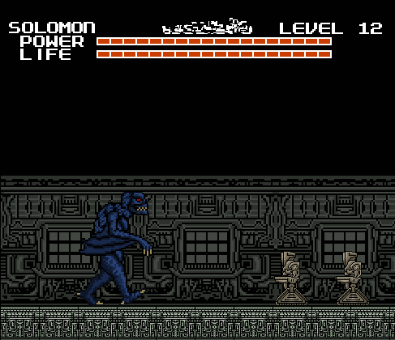
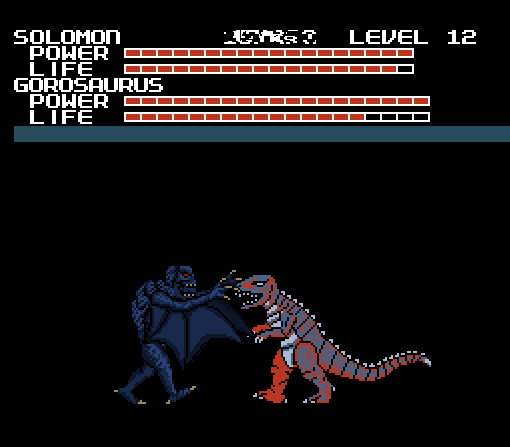
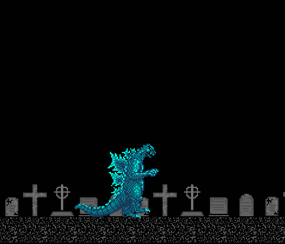
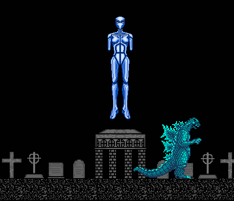

In the brief instant before the transition between Entropy and Extus, I was
hoping that I would get Godzilla and Angurius back. As the board appeared, I saw
that my wish was half granted: I had Godzilla back, but no Anguirus. I would have
preferred both, but despite Anguirus's neat abilities I would have chosen Godzilla
if I had to pick between the two.

Extus had two different colored temples, white and pink. A pyramid, what looked
like some modern buildings, and two other icons I couldn't figure out at the
time. The new bosses were Kumonga, Gorosaurus, and Not-Ghidorah, (whom I was
dreading to see, let alone fight.)

With Godzilla back, I was excited again and eager to explore, yet still
cautious. I went to the Quiz level first, just as before. This time, Face's
questions were more random than ever:

**Quiz 4**

1. Do elephants breathe? 
Answer: Yes, Reaction: Weird Face #2

2. Have you ever been molested by a family member? 
Answer: No, Reaction: Weird Face #6

3. Have you ever raped someone? 
Answer: No, Reaction: Weird Face #8

4. Is green your favourite color? 
Answer: No, Reaction: Weird Face #10

5. Is the computer the pinnacle of modern technology? 
Answer: Yes, Reaction: Weird Face #4

6. Are you a tough guy? 
Answer: Yes, Reaction: Weird Face #2

7. Can you fly?
Answer: No, Reaction: Weird Face #9

8. Can you stand on your head? 
Answer: Yes, Reaction: Weird Face #7

9. Do you hate raccoons? 
Answer: No, Reaction: Confused

10. Do you feel blame? 
Answer: No, Reaction: Weird Face #11

11. Would you like a new monster? 
Answer: Yes, Reaction: Surprised

12. Will you miss me? 
Answer: Yes, Reaction: Sad

I was happy that I was getting a new monster, but that last question bothered
me. "Will you miss me?"

"Is Face referring to when I finish the game?" I thought. Since the revelation
of the game's truly otherworldly nature, I wasn't sure what to think of Face, or
anything else in the game. But something about that last statement gave me a
genuine feeling of sadness from Face.

As I was thinking about this, the game had gone back to the board. I had a new
monster, but I had no idea who it was supposed to be.

The sprite had a slight resemblance to Rodan, but the head was totally off. I
moved this mysterious newcomer to a White Temple icon and started the level.
When I started the level, this screen appeared with the text "FIND THE GEM".
Presumably instructions for beating the level.

After that I got my first look at my new playable monster: A hairy, dark blue
creature with bat wings and a skull-like face named "Solomon".

And I also found that my path was blocked by a beam of light, and a small pillar
with a plate on it. I figured that this beam of light was blocking the exit, so
I have to find the gem and drop it on the plate to deactivate the beam.

How exactly I was going to do that, I didn't know. There wasn't anything in the
original game requiring you to find an item to beat a level. I'd have to find
out when I obtained the gem. The only direction I had to go was left, so on I
proceeded.

Solomon was an interesting monster, to say the least. He was capable of both
flight and a heat beam, both of which proved to be very useful. He also could
kick and slash with his wings, but he couldn't duck.

The White Temple's music was a vocalizing choir, or a videogame approximation of
such. It's hard to describe but it had a very "holy" sound to it.

It wasn't long before I started running into waves of strange new enemies. They
did little to stop me, I ran past them while slashing and didn't take any
damage.

There was a "pause" between each wave of enemies, after you had killed about
ten, there wouldn't be any for about a minute, then the next wave would appear.
After five minutes, I noticed holes in the floor and ceiling:

Guillotine mouthed creatures were rapidly flying up and down these crevices, so
I had to time my jumps carefully, because I didn't know if I'd get another shot
at this. Luckily I managed to get through without a scratch. I'm just lucky, I
guess.

After that I found myself at the end of the hallway, facing some kind of
mini-boss monster. It moved fast and had some kind of projectile that it shot in
four directions, but I killed it quite easily using Solomon's heat beam. When
the battle was over I had my gem, which was inside the creature's head:

I found that I could pick up and hold the gem by walking over to it and holding
down B. I made the long trek back to the start, deposited the gem on the plate,
which deactivated the beam.

Every time you complete a stage or defeat a boss with Solomon, this screen
appears. I have no idea what "STILL THE BEST 1973" means. Neither the date nor
the phrase has any meaning or significance to me that I can think of, and I've
spent a lot of time thinking about it.

The next level I played was one that I call "Bronze Pyramids". I used Godzilla,
and found he had been leveled up to twelve since I last played as him in
Dementia.

The Bronze Pyramids were fairly normal as far as these levels go, but the
visuals were quite interesting, almost unusually colorful and lively. The music
had a fittingly Egyptian style to it, it was slow and mysterious sounding.

I strolled through the level fighting off the various enemies, none were too
difficult (although the ants could be a pain if you ran into too many at once).
My favorite enemy was this giant reptile I encountered halfway through;

At the end of the level I came to a giant pyramid and I engaged in yet another
mini-boss fight. Although this was one was a bit different, because I had to
fight two of these monsters at the same time.

Individually, I could have dealt with them easily, but fighting both of them at
once was challenging. But I sped things up by tricking one of the twin beasts
into barbecuing his brother by jumping when he uses his flame breath:

After defeating the twin monsters, I noticed something strange after returning
to the board: I was now able to move my monster piece anywhere on the board,
without limits. Normally Godzilla could only move three spaces each turn, and
Mothra could move five.

I wanted to try out Solomon some more, so I moved his piece over to one of the
brown pillar looking icons with colored dots and started the level.

When I got to the level, I then realized what the level icon represented: Totem
Poles. I was greeted by two of them right at the beginning. The music had a
Native American sound to it. It seemed to be using the same instruments as the
Entropy Forest, it was noticeably different but just as foreboding.

I walked around for three minutes with nothing else in sight besides the totem
poles. I didn't realize it until then, but I wasn't expecting another level with
nothing "alive" in it, after all the activity in Entropy. Walking by all those
multicolored faces, this unnerving level left me feeling like I was being
watched.

Only about ten minutes after I started Extus, I was already halfway through.
After getting back from the the Totem Pole level, I tried out one of the TV
Screens to see how strange they were this time:

...Even more strange than before, apparently. The music for this was the Uranus
theme.

I switched back to Godzilla to play another level, and this level was quite a
surprise:

It was a normal City level! The colors were gloomy, but even still this was
quite a shock. This was the kind of level I would expect to see in a Godzilla
game, and I was kind of mad that I didn't get to play it earlier. The music was
the Earth theme.

I found it strange that a level fitting a Godzilla game would show up this late.
But there's no point crying over split milk, I suppose.

I moved Solomon over to a gray-ish green icon, which turned out to be a giant
high-tech Laboratory of some sort:

Lots of mechanical drones in this level, but Solomon cleared through them just
like the White Temple enemies. The music was a gritty, industrial beat. There
was also a strange, flying cyborg enemy, which was annoying because it would fly
away when you jumped to attack it.

Also of interest were these large stasis tanks, holding some kind of monster
inside. As you would guess, sometimes the monsters awaken and shatter through
the glass.

I tried to get past the stasis tanks as fast as possible, because the monsters
inside proved to be vicious little bastards upon release.

At the end of the level was an elevator, which I used to go down to the bottom
the level where the exit was. Along the way, I was shot at by security drones. I
couldn't leave the elevator, so my only defense was the heat beam.

The last level type was this simple thing that I call the "Heart Temple", for
obvious reasons:

Nothing but a big hallway, filled with floating enemies shaped like human
hearts. They're incapable of causing you damage, so what you do is run through
the level smashing as many as you can to get all the power-ups. One run through
these levels would get the life meter back up to full, and I would greatly
appreciate these levels later.

The Heart Temple's music reminded me of a circus tune, had an overly cheerful
sound to it which gave the level a really weird feeling.

Having seen all the level types, I chose to fight Gorosaurus using Solomon.

The music for this fight was Gezora's theme. It was during this fight I realized
that Solomon is overpowered: a single well aimed slash can take down as many as
four of the enemy's life bars.

Due to this, the fight was over very quickly. Gorosaurus had no projectile
attacks, or anything else that could match Solomon's deadly claws. But I kept
the fight going just long enough to see if Gorosaurus would use his iconic
"Kangaroo Kick", and I was greatly pleased when he did:

Even though I knew Solomon was my fighting ace, I used Godzilla to battle
Kumonga, just for variety. I briefly considered using Mothra, but of course
Godzilla won out.

Kumonga was also a simple opponent, no heat beams or anything. He attacks by
jumping on you, stabbing with his mandibles, and also uses his signature webbing
stream to paralyze you. Once you get webbed, Kumonga will sometimes take the
opportunity to attack, but it's mostly a way to buy some time, like Gezora
backing you in the corner until the time runs out. His music was Hedorah's
theme.

With Gorosaurus and Kumonga defeated I was at the end of Extus. Before I fought
Not-Ghidorah, there was something I had to do.

I wasn't expecting much from it, but for documentation's sake I took a look at
the other TV Screen. This is what it was:

I don't think there ever was much reason behind the Tv Screens. If I were to
guess, I'd say its some random, uncontrolled manifestation of the cartridge's
abilities. Or maybe all this makes perfect sense to the "game". Who knows.
Anyway, Mr. Faucet's theme was the Saturn music.

It was time for the opponent I had been dreading: Not-Ghidorah. Although I had
gained courage with Solomon's combat advantages, I was still nervous. And when I
started the fight, I was immediately confused:

My opponent was Not-Gezora. I defeated the imposter with a few strikes, and then
Not-Moguera appeared. The it made sense; In order to get to Not-Ghidorah, I had
to battle all the previous Replacements first.

And battle them I did.

I tore my way through them until I finally made it to Not-Ghidorah who was... a
Dorat.

Once I stopped laughing, I destroyed him with only two slashes. The music
stopped, and I thought I was going back to the board. But the battle wasn't over
yet.

The real fight was against the Chimera, a monstrous hybrid of all the
Replacement beasts. This was by far the most difficult boss yet, every attack of
his would cut down whole life bars per use, while attacks against him were
greatly weakened. Solomon's slash for example, was now lucky to take away one
half a life bar.

During this battle I gained a great appreciation for two things: The Boss Fight
Time Limit, and the Heart Temple. Had it not been for those things, I might
never have beaten this boss.

To take down this behemoth, I came up with a strategy. I would switch between
Godzilla and Solomon, as one began to get dangerously low on health, I would
take him through the Heart Temple, while fighting Chimera with the other. I
should count my blessings that Chimera couldn't regain lost health.

A very interesting thing about Chimera was that the colored sections on his body
corresponded to his different body parts, so each body part effectively had its
own life meter. The head was invincible as long as the other parts were present,
and would always be the last part to be destroyed.

In addition to being difficult, it was also the longest fight so far. I tried to
remember how many times I got taken out of the fight by the timer, but I lost
count around thirteen.

Eventually I had destroyed all components but the head, which now flew around on
its own at an incredible speed.

Chimera fought well, but I was extremely determined and once he was reduced to a
head, he no longer had the power to defeat Solomon, and I heat beamed him into
oblivion.

And then Chimera was no more. I was exhausted after that drawn out fight, and
worried that might affect my performance in the End-World chase level.

The Headquarters icon was replaced, but not by the Hell Beast Face. Instead, it
was a crucifix.

I was completely stunned. I wasn't excited about seeing the Hell Beast icon
again, but if there was only one good thing about those levels, it's that they
were predictable. I had a basic idea of what to expect.

But now, here I was at the end and the icon was completely different. What did
it mean? And why a crucifix? It made me very uneasy.

I attempted to start the level with Solomon, but couldn't. I got this notice
that simply stated "SOLOMON CAN'T ENTER HERE".

It didn't say why. But I think maybe it has to do with Solomon's demonic
appearance. Since Solomon was out of the question, I went with Godzilla instead.

Once I saw the level, the crucifix made sense---the level was a graveyard.

I was still on edge, thinking this was some kind of trick. The last level had
always involved running from the demonic beast, and I wasn't going to be fooled
into thinking this would be any different.

So I started out running, but after a minute without interruption, I slowed
down. It was during this time that the music caught my attention. I knew it
sounded familiar when I first heard it, but it took a while before I realized
what it was---An 8-bit rendition of *Prayer For Peace*, from the first Godzilla
film. A very sad, powerful song, even in this form.

At two minutes into the level, I encountered something that I wasn't sure how to
react to:

My first instinct was to run, but this blue statue-esque being simply floated in
place. And I felt compelled just to stare at it, for a time.

Since this was a grave, and it was floating over a chapel, I guessed that this
was some kind of Angel, watching over the deceased.

It gave me a strange, but warm feeling. I wouldn't say "happy", but I felt that
I was at peace, somehow. I had never seen this being before, yet it seemed very
familiar to me.

Just as I was going to leave, The Hell Beast appeared, and it's presence warped
the music into a terrifying discordant screeching and transformed the level,
desecrating the tombstones as a new ground appeared, comprised of blood soaked
bodies:

I could feel my heart now beating out of control, I had no chance of escape with
the monster that close! It lunged for the kill, but the Angel got in its way.
The demon roared and started clawing through the Angel's leg, and tears of blood
streamed from its eyes.

I wanted to save the Angel, but there was nothing I could do. I had to honor its
sacrifice and run. And so I ran through the hellish landscape as fast I could.
The beast soon caught up with me, still swallowing the body of the Angel, whose
legs it had torn off.

And this sight made my terror change into anger. I now found myself hating this
horrible monster. There was no doubt in my mind that it was pure evil, and I
wanted it to die.

When I got to the end, I remembered how it responded to my insult in Trance, I
spoke to it and said: "You're going to pay".

This was its response:

I had no idea how I would follow up on that threat.

And nothing could have prepared me for the horrors of the final world---Zenith.

