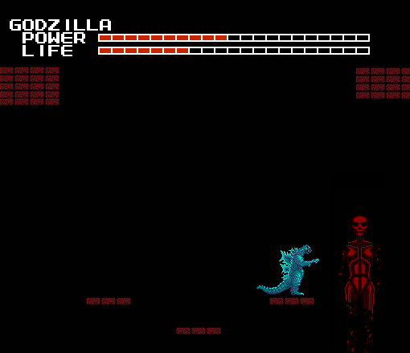
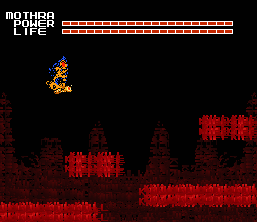
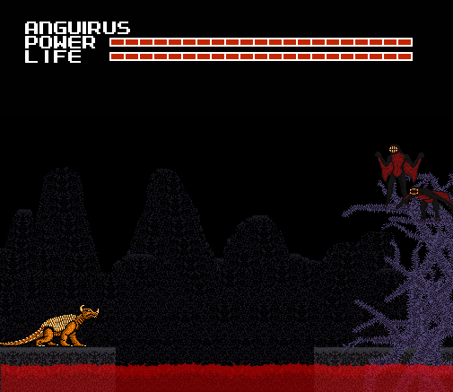
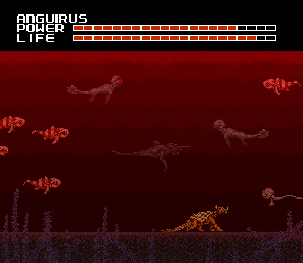
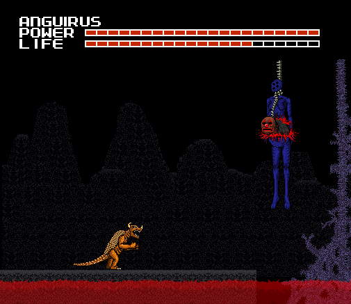
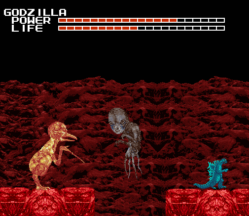
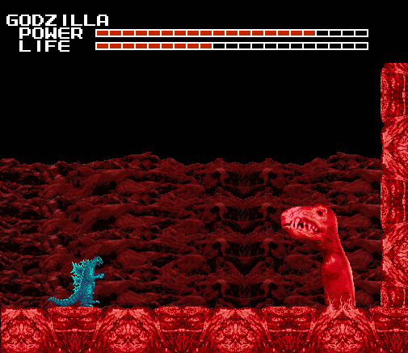

<section>

And here we are, at the final world. I don't like to discuss this part, and it
still bothers me very much, but it's something I have to do, so that I can put
this behind me. People deserve to know.

At this point I was well aware of the game's unnatural nature, but Zenith was
different than the other worlds. While the others were certainly strange, and
sometimes frightening, the world of Zenith was like a nightmare.

And I didn't have to go any further than the board screen for an indication that
something was wrong with Zenith. The first thing I noticed was the blood red
texture of the board, and the music, which was an eerie whistling tune.

I noticed that I had Solomon and Anguirus back, and I felt better for a second.
Then I scrolled over to the right to see who my enemies would be this time.

This time it was Destoroyah and Ghidorah. But judging from the icon it was a
different Ghidorah than the original, standing on the ground instead of flying.
The grotesquely detailed pinkish red icon also caught my eye. I couldn't tell
what it was supposed to be, and I was afraid to find out.

Going back to my side of the board, I decided there wasn't much choice but to do
my usual "routine", in going to the Quiz level before doing anything else. I was
not ready for what happened.

I jumped back when this appeared, accompanied by a terribly distorted version of
the password theme. It looked as if Face had fallen victim to some terrible
glitch. Is this what he meant by "Will you miss me?" Did he know this would
happen?

My thoughts were stopped short as I noticed the screen was glitching and
seemingly falling apart while I was inactive, and so I quickly rushed out.

And when I got back to the board, I had somehow gained a new monster. I hadn't
even been asked if I wanted one. I tried to select it, and this happened:

"WHAT THE HELL IS GOING ON?!"

The game's behavior was scaring me, and I hadn't even started the levels yet. I
couldn't understand why I was randomly given a new character, and then denied
use of it. But for the time being there was little that could be done, and I
viewed the last TV Screen:

No animation. No music. Dead.

Every instinct I had was telling me to stop playing, to just turn the game off.
And something in the game itself might have been trying to warn me as to just
how horrible this last world was.

But then, every stretch of the way I was compelled to give up. I couldn't do
that now, on the last world! Besides, after taunting me with memories of
Melissa, I felt the game owed me some answers.

I noticed that the first level was a Red Temple, so at least I would be familiar
with the level graphics if nothing else. And I went in with Godzilla, the
monster I was most familiar with.

Godzilla had been shrunk, the level and score meters had vanished, and the Blue
Temple statue faces were back. The music was similar to the Blue Temple also:
Strange, haunting vocalizations. I tried to get my spirits up by thinking "Well,
If this level is like the Blue Temple, then that might mean there are no enemies
to deal with."

How wrong I was.

After a short walk, all the statue's eyes starting glowing, and a pack of the
beasts from Shadow Labyrinth came charging into me. Since they were coming from
the right of the screen, I had to fight my way through them.

This battle greatly tested my reflexes, but thanks to my speed I plowed through
the beasts. They gave off health power-ups after dying, which helped recover the
damage they had given me.

However, as I continued through the hallway, the statue's eyes glowed again,
summoning another wave. It seemed to be the same number of them, but I was less
prepared this time, and took more damage. I had gone through four of these waves
until I reached the end of the hall, where I heat beamed the last of the
monsters over the edge into an abyss.

At first it seemed I had reached a dead end, but after the statue's eyes stopped
glowing, a brick path slowly appeared before me.

I followed the path, which kept me moving towards the right until it stopped at
a wall, where I was to go vertically by jumping up ledges. Along the way I
encountered new creatures, and some sort of strange shrine, which had a statue
of the Hell beast and some other creature I don't recognize.

As I went through, the path took a downward direction. I had to carefully aim my
jumps to avoid the enemies, which were plentiful in this part of the stage. They
didn't have many attacks, but they could easily shove you over the edge off a
platform.

At the end of this tunnel, there were a few small platforms floating above
nothingness. I landed on one towards the left of the screen, and then something
came down from above. It looked like the Blue Angel from the Graveyard, except
now it was red and had a skull face.

Any of the pleasant feelings I had from the Blue Angel were not present with
this Red one, and as it hovered around, its eye sockets started glowing just
like the statues, summoning monsters to attack me. Surely this was not the same
benevolent being I encountered before, this must be some kind of impostor.

The battle was nerve-wracking, as I started off with nearly half my health and
had to deal with multiple opponents, as well as the threat of gravity. To make
things even worse, as the Red Angel took damage some of the panels fell, until
only 3 remained.

But my luck had not ran out yet, just when I thought it was over, I struck the
Red Angel one more time, and it turned out that one last hit was all it could
take.

Just as the Red Angel completely disintegrated, the game instantly went back to
the Zenith board. I moved Mothra over to the nearest stage from the Red Temple,
which seemed be a garbled mess of letters spelling KILL, and began playing.

As suspected, all the level graphics were made of jumbled letters. And Mothra,
just like Godzilla, was shrunk to half size. I began to suspect that all the
Zenith levels would be like this.

The background music was terrible, like if someone put all the sounds an NES was
capable of making into a blender and then piecing them back together into a
"song". I had to turn the volume down because of it.

Playing as Mothra made avoiding the enemies easier, but they were nonetheless
determined to get at me. The first enemies I saw were headless Gigans, and later
on there were hybrids monsters pieced together from previous bosses, like the
Biollante headed thing seen above.

Five minutes had gone by as I didn't see anything new, and the level shifted
into another segment. The music changed from the loud and annoying beeps into
something far more ambient and menacing. The level graphics also changed, now
looking a blood drenched junkyard. The way everything in this level was red made
it sickening to look at.

The enemies multiplied in number, never ceasing to follow after me, and became
harder and harder to avoid. And at the end of the level, the situation reached a
climax, as the swarms of monsters fused together in one enormous, terrifying
hybrid:

Once I had gotten through the initial shock, I discovered the way to destroy
this thing: constantly shooting eye beams at the Hedorah cluster that formed its
"heads". If you attacked anywhere else, it would regenerate the damage.

Even with that knowledge, this was an extremely difficult fight. I'd say it was
as hard as fighting the Moon Beast was, if not harder. Its most common attack
was lunging forward with its arms, covered with Gigan saws and blades, if they
touched it would instantly drain health.

When it was over, the remaining monsters collapsed into a heap. Then they, and
the ground below them, started to disintegrate and sink towards the bottom of
the screen.

When I came back to the board, I thought to myself, "So far, the game has been
putting the easiest levels first... if that's the case, how bad will the rest of
Zenith be?"

With two levels down and three to go, my monsters and I had taken our foothold
in the world of nightmares that was Zenith.

Deciding what action to take next was more tense and difficult than ever before.
But ultimately, I had no way of knowing what the next levels would be like, or
how well my monsters would be prepared for them, so my only option was to guess.

I tried to to interpret what the icons of the next levels ahead of me were. The
last level before the boss battles was obviously representing some type of
volcanic area, with lava and open flames.

The middle icon I still didn't get, except that it looked "fleshy", and vaguely
like an organ of some kind. Oddly oversized as well.

The one I was nearest to, and about to enter next, looked like thorny vines
covering a puddle of blood. I guessed this would be a level with blood "rivers",
like the chase level of Dementia. As such, I went with Anguirus, because due to
his rolling move he would have the fastest speed while submerged.

The level which I call "Blood Lake" looked like I expected. Rivers of blood
accompanied by thorn covered vines, which were scattered along the sides of the
ground. The music was rather faint, but I could hear a distinct drum beat, and a
few other instruments. a lot of echoes, and sometimes it sounded like someone
was hitting a drum underwater.

I was disappointed to see that Anguirus was shrunk just as Godzilla and Mothra
had been, apparently all the Zenith levels would be like this. I felt less
secure with my giant monsters no longer so giant.

I walked along without interruption for only a minute until my path reached a
dead end.

There was a massive gap between the ground I was walking on and the ground to
the right of the screen. I would have swam across it and continued walking to
the right, but due to the huge mass of brambles in the way, there was nowhere to
go.

Two creatures with gliding membranes on their arms, and lamprey like mouths were
perched on outstretched vines and screeching at me, much like a crow does to an
invader of its territory. Another unnerving display of possible sentience by the
creatures of this game. If it's even accurate to refer to them as being "of the
game", that is.

I descended into the blood, slowly sinking to the floor. Aquatic enemies were
everywhere, and they were hard to avoid. The black shark in particular was very
aggressive and hard to deal with, but thankfully I only encountered one.

As the scene become more and more crowded, I swam up to the surface, to find
that it was littered with floating corpses.

"Creepy, but at least they're not a threat." Or so I thought...

...Until they all sprang to life and leaped on me! They were trying to pull me
under, and they were draining my health as they did it. They all attacked as a
group, and when I got one off me, another would jump on me from behind. I had to
curl up into a ball and roll for them to loosen their grip, and when they did I
quickly retreated.

It wasn't long before I had reached another land path. A note regarding the brambles,
you can stand on them but it causes pain, and you can also destroy some of the vines,
but only the thinner ones. I had to destroy multiple vines, as well as dealing with
more enemies.

I was interrupted by a screen:

The screen was only up for about thirty seconds, then when it went back to the
level, I was facing another dead end, and a pregnant humanoid creature being
hanged from the top right of the screen, by a spine/umbilical cord.

Instantly, the creature's belly was split open from the inside!

And as the lower part of its body was ripped apart and fell into the river
below, the Blood Lakes boss was revealed;

It came flying towards me, making a shrill, hacking scream. I was forced to move
back.

The bat was a highly mobile boss, fast and difficult to hit. As I moved back
along the ground , the monster opened its mouth and shout out a barrage of
needles. I jumped over them and managed to give it a blow to the head, and it
started flying out of my reach.

As the bat was flying, it shot a stream of fire from its eye sockets, and
started trying to hit me with the flames. I rolled along the ground, which
drained my power, but put us at equal speed.

"Now, only two levels left to go. Who to send this time?" Godzilla, Mothra, and
Anguirus had all completed one level, leaving Solomon. And also, the mysterious
fifth monster. I tried again to access it, but with no luck. I chose to use
Godzilla again for the next level, and Solomon for the final one.

The second to last level was what I refer to as the "Organic Level", which was
the most visually unpleasant of them all.

Right from the start I could see that the graphics where freakishly different.
The atmosphere was gruesome and foreboding, with the addition of the loud,
droning music. I was dreading what I would see in these levels, and it was only
a few seconds before something appeared:

Two hideous... things. It's hard to describe most of this level. Everything had
this disturbing "semi-real" look to it. Most of the enemies look halfway between
real animals, and misshapen lumps of gore with teeth.

It's also worth noting that all of them were considerably larger than Godzilla,
and although the majority were not very intelligent, each of them took around
30+ hits to kill. Due to this, it was a better idea to run away from them than
fight, but it was never clear exactly what direction to run to.

While most levels involved going to the right to get to the exit, the path of
this level was primarily going down, by walking to the edge of one platform and
jumping down to a lower one. There was no way to make sure you were going the
right way, nor any apparent means of getting back up to the higher platforms if
necessary.

Also, certain enemies acted as if they were aware you had to jump down, and
would stand at the edge of a lower platform, waiting for you. When this
happened, I would have to walk back and wait until the monster would leave.

As I went on I came across platforms stacked above each other with little space
in between, looking like a maze. This meant that I couldn't jump, and it made
escape from enemies difficult. Thankfully, the only enemies able to fit through
these mazes were the four-legged beasts seen at the beginning of the level.

Adding to the difficulty were long, tapeworm-esque monsters, that would rise
themselves up between the platforms and trap you. The only attack they responded
to was the heat beam, which would cause them to shrink back down. But this was
costing even more power, and I couldn't afford to do without the heat beam for
long.

While trying to avoid the abominations that dwell in this level, I found out
that if you stand idle in one place for too long, the ground tries to absorb
your monster;

I think it was about four minutes before the end that this level was making me
physically sick. The tension was getting to me, and having to take in all these
disgusting sights made me want to puke. I nearly did pause the game and look for
a bag, but I was able to hold it together.

I also found a trick at the end of the level, though it was too late to do me
any real good. If two different species of monster to run into each other
face-to-face, they would fight each other and leave me alone. I didn't
intentionally cause this, it just happened:

Finally at the end, it was time for another boss fight. It was certainly ugly,
but not quite as horrific as I feared it would be. But more important than
dealing with its appearance was defeating it, and since I had less than half my
health bar to start with, there was no room for errors.

It was attached to the floor when I first saw it, but after ten hits it detached
from the floor and began floating. It moved fast, and unlike the Blood Lakes
boss he wasn't impeded by any sort of gravity. It was even able to fly through
the ground without any collision effect.

It used this to its advantage, and would float beneath the ground and spring up
randomly to bite at you. But it stopped doing this after a few well aimed kicks
to the face. The pink area on its upper jaw was a weak point, too many hits
there would cause it to spasm uncontrollably.

The new strategy was to rapidly float up down while moving back and forth across
the stage, trying to constantly keep its jaws aimed towards me. Health was
getting critical at this point, and I spammed the heat beam, from which it had
no defense.

In the last stretch of the battle, the monster had lost its mind, rapidly
rushing back and forth and gnashing its jaws. I had to duck under it, and then
strike when its back was turned. Twenty more hits, and it was destroyed.

"One last level to go..."

And then it was down to one last level. I didn't hesitate, I selected Solomon
and entered. Perhaps a little too fast.

This last level was definitely the peak of disconnect between what the NES was
graphically capable of, and what this game could create. The music also caught
my attention, it was one of the only songs that appeared more than once---the
horrible screeching from when the Hellbeast appeared in the graveyard.

As soon I started, there was already an enemy prepared to attack, a centaur
wielding a whip. And it wasn't alone.

When I started fighting, several more centaurs appeared. Coming from both sides
at the screen at the same time, it was too much to handle. Solomon's flight
saved me from taking too much damage at the start of the level. The centaurs
followed after, but seemed to be unable to jump.

After escaping the centaurs I noticed gaps in the ground. While trying to avoid
the jumping sword mouthed enemies in mid-flight I got close to the surface of
the lava, and a creature emerged and tried to grab me. It didn't succeed, but I
was startled. Careful maneuvering would be needed to avoid instant death here.

As new enemies appeared,the level soon became very difficult. A lot of the
trouble came from stocky red demons that stood on top of tall, narrow mountains
and spewed fire. I got by them by waiting till their back was turned, and
hitting them with a flying kick, which made them fall into the lava. It was at
this time I noticed that I wasn't gaining any health from killing enemies.

Not all the ground was stable. At one point, the ground was reduced to small
chunks that slowly drifted towards the right. Some of them would sink into the
lava upon landing on them, and there was no way to tell which ones would sink
and which would not. Being so close to the lava added the threat of the lava
creatures, and this was very frustrating.

I was also feeling very hot, which made concentrating hard. If you've ever had a
heat rash, it felt similar to that. I had periodically stop for water because of
it. This was almost certainly due to the game, and not my imagination, but I
kept pushing the thought out of my head. I didn't want to think about it.

At the end of the stage, I encountered the boss rising from the lava, its
arrival noted with a ungodly howling roar:

When it walked onto the land, I saw how gigantic it was, several times the size
of Solomon. I was about to fly up and attack it, when it opened its mouth and
let out a huge blast of fire:

I had to fly to dodge the flames, and then get close enough to the boss to fire
a heat beam at its face, causing it to stumble backward. If it didn't stumble
backwards, it would have kept moving left until it forced Solomon into the lava,
as there was no more ground within reach.

The beast had to wait between uses of its fire breath, as it seemed to cost a
great deal of energy. I used this time to attack it. But fire wasn't its only
weapon, and I had to wary of the monster swatting at me with its clawed hands.
As its health decreased, it moved faster,and the battle felt like a tug of war
between the two monsters over this bridge of land.

After about forty hits, it was defeated, tumbling backwards into the lava from
whence it came. And then, the final stage had been completed.

At last it was down to two bosses, and a final encounter with the Hellbeast. For
some reason I thought Ghidorah would be easier to beat, so I confronted him
first.

The classic "Ghidorah Battle" music from the original started up as I was faced
against the new King Ghidorah;

King Ghidorah was as powerful and unrelenting as ever. He instantly lashed out
with Gravity Beams, which were more damaging than Godzilla's heat beam. It
became a struggle of constantly beating Ghidorah at every oppoortunity to keep
him from using the attack.

But Ghidorah soon saw through my tactic and started using physical attacks as
well. He would strike with each of his necks, knocking me backward and making it
impossible to get close enough to punch him. But I had an idea, to wait for him
to lunge with one of his heads, and immediately blast it with the heat beam:

It worked, and to my surprise the heat beam had actually obliterated Ghidorah's
middle head. It was only a few seconds before I realized what this would lead
to, and sure enough...

...King Ghidorah was using the power of the glitch to transform into Mecha King
Ghidorah. But what really shocked me was the sudden change of music. I had heard
it before, but it wasn't from the original NES game---It was from the game Super
Godzilla, during the Mecha King Ghidorah fight.

Mecha King Ghidorah's first attack was its most deadly: The Machine Hand. Very
similar to Gigan's Saw, it immobilizes the monster and rapidly drains the health
bar. Fortunately, before Ghidorah could do a lot of damage, the timer ran out.

I would need to defeat Mecha King Ghidorah quickly to prevent him from using the
Machine Hand, so I sent Solomon to fight him. The two monsters were evenly
matched in strength.

But Solomon was faster, and by slashing and heat beaming without pause, the
cyborg monster soon met its end.

With Ghidorah defeated, I was returned to the board. I now outnumbered the enemy
by four monsters to one, and victory seemed to be soon at hand. The Base Icon
had changed to a blood red color. I could feel hatred emanating from it.

I started the fight against Destoroyah with Anguirus, and the music was the same
as Ghidorah's. When the fight began, Destoroyah was in Microscopic form. After
one hit it changed into the Juvenile, which had few attacks and was also dealt
with easily.

The fight became serious once Destoroyah entered the Aggregate Form, gaining the
use of large arms and the micro-oxygen beam.

Anguirus' roll attack, which had been very useful up until now, was rendered
useless by Destoroyah constantly attacking me with his large arms when I tried
to use it. For this part of the fight I had to rely on brute strength.

Just before the time ran out, Destoroyah had changed into his Flying form, which
Anguirus was ill-suited to fight against. Going back in,I fought against the
flying form with Mothra (which seemed fitting).

Mothra was weaker than Anguirus, but was much better equipped to dodge and counter
Flying Destoroyah's attacks, so the fight was in my favor. However, the Mecha
Ghidorah fight music started playing and Destoroyah changed into his Final form
sooner than expected, which drastically turned the tables.

Mothra's attacks were doing very little to Destoroyah, and I had to move
furiously to avoid damage while waiting for the timer to run out.

Even though it would be near impossible to beat Destoroyah with Mothra, I still
had three other monsters. Final form Destoroyah was very resistant to taking
damage, and the heavily armored foe would not be defeated without a long fight.

In the last part of the fight I wasn't using much strategy, just attacking as
brutally and as fast as I could.

On its last bar of health Destoroyah tried one last counter-attack---a beam of
energy from its chest.

I don't know how powerful it would have been, because just before it could fire
I punched Destoroyah in the chest cavity, destroying him!

And then that was it---the last kaiju boss was gone. In the midst of all the
excitement, I had briefly forgotten that there was still one last thing to do
before the game would be over.

Seeing the icon again hit me like a ton of bricks, and I froze for a few minutes.
I had come so far to get to this point. But I was terrified. I really did not
want to know what this last encounter was going to be like.

Before I could let myself think about it any longer, I moved Godzilla over and
began the stage. "You're here now. This is the end. Just one last thing, and
then it's all over."

And when the screen changed, there was...

...Nothing.

Just Godzilla and a black screen. I walked back and forth. Fired a heat beam.
Nothing happened, until I heard something---the faint sound of a familiar drum
beat.

...

</section>
