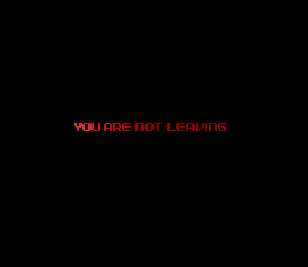
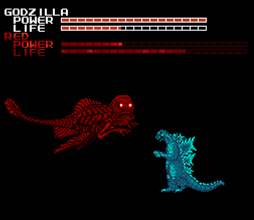
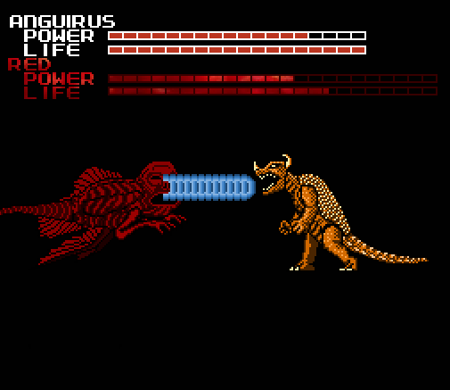
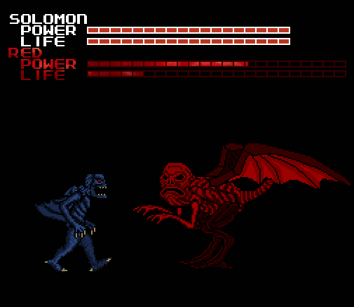
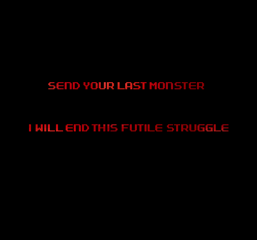
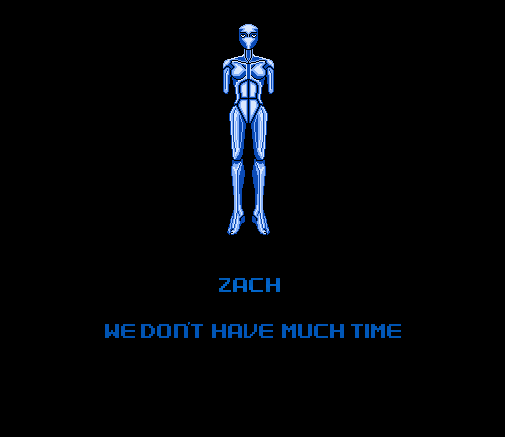
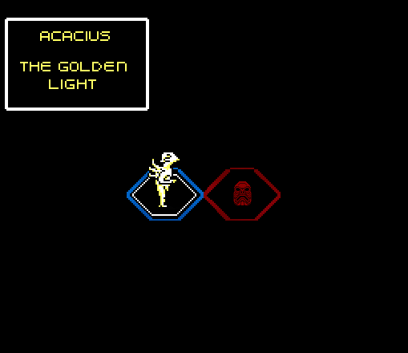
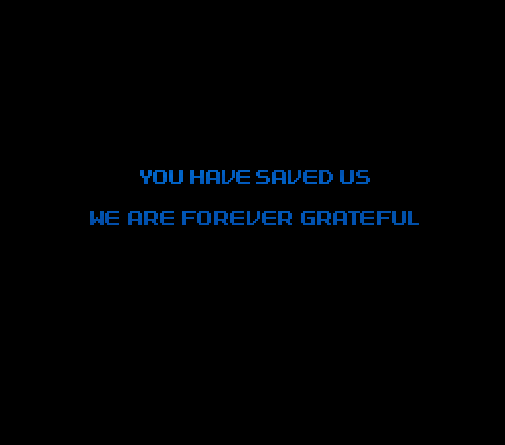

"Oh dear god."

That was my first thought on realizing I would have to fight "Red", the creature
that tormented me through nearly the whole game. How would I be able to fight
something that can kill with one touch? It seemed totally impossible.

Thankfully, Red was no longer able to deliver one hit kills. But despite that,
this was still the most difficult battle I've ever faced, in this game or
otherwise. If I had any real comprehension of what I was getting into before I
started the fight, I would never have done it.

I very soon learned what a horrible mistake I had made. Red reached out and
clawed at Godzilla. And when those claws cut through him, I felt it.

I know that it's common for people to cringe up when their video game character
gets hit or loses a life. But this was not that. This was genuine, physical
pain.

When the pain struck me I paused the game. I hadn't suffered any actual
injuries, but it felt just like my shoulder had been clawed through. I had seen
and experienced many unpleasant things at this point, but the game causing me
real pain was where I drew the line. Yes, I would be disappointed that I
wouldn't get to see the ending, but the risk was no longer worth it. I was about
to get up to take one last screenshot and turn off the NES, when I realized
something else---

---I couldn't get up.

I was paralyzed to my seat. The only muscles I could move were my fingers and
thumbs. As the terror set in, a new message appeared on the screen.

I started to scream, but only a weak choking sound was coming out. I desperately
tried to get my body to move, but it did nothing. I was looking every direction,
and then I looked over at the computer.

Somehow, the computer was taking screenshots of the game on its own when I began
the fight. I still don't know how or why. Something in the game must have been
causing it.

Since Red could hear what I was saying, I tried begging for him to let me go.
From here things start to get hazy as I was under extreme stress at the time,
but from what I can remember I said:

"I'm sorry. I'm sorry I insulted you. I didn't mean it. I didn't know things
would get this serious. Please just let me go. If you let me go I promise I will
never tell anyone or turn the game on ever again. PLEASE!"

And Red replied:

"Only one will survive."

The statement could not be any more clear. If I couldn't kill Red, then he would
kill ME. Like an idiot I had played around with something I didn't understand,
and now it might cost me my life.

I stopped struggling to move and accepted the reality of the situation. There
was only one way to get out of this alive. I had to kill Red.

It all went by so fast. If it weren't for the screenshots, I might not have
remembered any of this. Just like in the chase levels, Red moved at a
horrifyingly fast speed. There was barely enough time to process a thought.

And thus, there was no time to form a strategy. I had to rely solely on my wits
and reflexes. To make things worse, there was no way to predict what kind of
attacks Red might use, so I constantly had to be on the offensive AND defensive.

I felt every hit that Godzilla took. They all hurt. I tried so hard to avoid the
damage, but every attack that I dodged left me vulnerable to another. And the
pain would only get worse.

After he jumped over me, Red's eyes started to glow. I moved as far back as I
could and ducked, but there was no dodging this one:

When THIS hit me, I really did scream. I screamed so loud that someone else in
the apartment should have heard me, but they didn't. Just looking at the image
hurts me, making me remember the incinerating burn.

I paused the game because it hurt so bad, but Red unpaused the game to attack me
again, which made me furious.

I immediately counterattacked with the heat beam, again and again until the
power meter was totally diminished. I wanted Red to hurt like I did.

Just before the timer ran out, Red transitioned into his swimming form. I didn't
think the timer would still be affecting a battle like this. I'm thankful for
it, because it gave me a few minutes to collect my thoughts and decide what to
do next.

I chose to fight Red's next 2 forms with the monsters I had encountered them
with, so Anguirus was next. It probably wasn't all that smart of an idea, but
it's what I did.

I jumped up and heat beamed Red in the face, and he moved offscreen where I
couldn't reach him. Then a wave of large mines started to fall from above.

I felt this was unfair so I shouted:

"If you're going to cheat, then why do you even let me use the controller?!"

And then he came at me, rushing from the top left of the screen downwards:

"DAMN IT!" Now I wouldn't even be able to see where his next attack was coming
from. Red continued to strike from random angles, I constantly moved to swerve
around him.

Another forty seconds went by and Anguirus was nearly gone, but together we had
forced Red into his flying form, so it was Mothra's turn next.

Deciding to fight Red with Mothra was a terrible idea. Mothra was instantly
overwhelmed by Red, and the life meter was devastated in a mere fifteen seconds.

And once Mothra's life was down to two bars, Red did something I didn't see
coming:

He reached out, grabbed Mothra, and ate her.

After Mothra was devoured I felt an agonizing pain, like being crushed to death.
Mothra had been killed for my stupidity and I would share the pain. It was a
short transition from the battle to the board, but it felt like an hour.

The pain, combined with being unable to move was driving me insane. I wanted so
badly for this to end. I never wanted anything so much.

But I still had hope. There was only one monster left that could be brought to
full health by engaging Red in battle. Solomon. If any of them had a chance to
save my life now, it would be him.

Solomon apparently has some history with Red, as when the fight started this
dialogue happened:

Red took me by surprise again by immediately burning me with his demonic fire a
second time:

As much as it hurt, it actually worked to my advantage: since Solomon started at
full life he still had some to spare, but now Red had used up all his energy and
could not use his ultimate weapon any longer. Now he would die.

As he drew close to the end of his life bar, Red turned his whole body to face
the screen and flew upwards, then slamming back down in an attempt to crush
Solomon:

When that failed to work, he tried to devour Solomon like he had Mothra. But he
wouldn't be eating my monster this time:

I thought I had won. But something was wrong. Red wasn't sinking to the bottom,
and I still couldn't move. Red was still alive...

After his seeming defeat by Solomon, Red had reconstructed his body into his
gigantic Final Form, transporting us to a blazing inferno in the process. It was
reminiscent of our first encounter. Except now the scenery,much like the true
power of Red, had become very real. The music had erupted into a loud blaring
sound, a furious drum of death.

Faced against Red's insane amount of health, my own demise was imminent.

Solomon was my strongest monster. But not even he stood a chance. It was like
trying to fight a mountain.

Within seconds Solomon was overpowered and dropped to the floor, when Red
crushed him to death underneath his foot. The sadistic demon took his time as he
snapped Solomon's vertebrae and ribs like dry, brittle twigs. I could tell he
was enjoying our pain.

"This is hopeless. I'm a dead man."

I had to no choice but to send another monster to his death. We were all going
to die. I only hoped they would forgive me.

After decreasing Red's health by a miniscule amount, Anguirus was also
obliterated. Red unleashed a hail of blazing hot needles into his face, until he
collapsed.

Another moment of unspeakable agony, then nothingness as my ally faded away.

I asked Red how he knew my name.

And then, he said it.

For years she was being tortured by something nobody understood. Now I knew what
it was.

Now I understood why I was mocked about Melissa's death, and how the game knew
about it. Because HE knew about it, because HE was the one responsible. And this
time, he was going to kill me.

I was taken back to the board to send Godzilla to his final stand. Barely
anything was left of the board, just Godzilla and Red's icons, and...

...the fifth monster.

In the midst of everything that was happening, I had completely forgotten about
it. I tried yet again to select it. I cursed, I begged,I screamed at it to do
something, ANYTHING to help me. To no avail.

There was only one thing to do.

I knew Godzilla didn't stand any more of a chance than the rest did. But maybe,
maybe now that all the other monsters were gone, the fifth monster might finally
awaken.

I knew Godzilla didn't stand any more of a chance than the rest did. But maybe,
maybe now that all the other monsters were gone, the fifth monster might finally
awaken.

It was then that Red decided he was done playing fair, and before I could
activate the monster, he went for the killing blow: paralyzing my heart.

My hands started to become numb and unfeeling, but even as my vision was fading
away, I still tried to pressed the A button.

Red surely was breaking one of his rules, but he must have thought that if he
could kill me quickly, then it would be too late for any consequences to matter,
he would have won.

He was wrong.

Red's power was being challenged by another force. It prevented him from killing
me, and when I regained my vision I saw a familiar sight:

"...Who are you?"

"What? How is that possible! I... Red told me that he killed you..."

"But how will I be able to stop him now?"

Her words stirred something inside of me. I wasn't going to die like this. And I
had more to fight her for than just my own life, I had to fight to save Melissa,
and the world she inhabits.

With her help, the 5th monster was finally unleashed:

It was time to end this, once and for all. Together, we would take this damned
hellspawn out of existence.

Acacius was by far the strongest playable monster in the game. He had to be, if
we were to have any chance of surviving. His "punch" involved turning his hands
into blades, which caused tremendous damage. But Red had more than enough life
to spare. In the end, this would come down to pure skill:

With one final strike, Red was destroyed. His body disintegrated and sank below,
accompanied by a soar of triumphant music. Slowly, the paralysis wore off, and I
was able to stand up again!

We had done it. Melissa's death had been avenged, and I felt overwhelming
happiness... until I remembered all the death and pain that led up to this point.
All the other monsters who had fought and died. I was about to mourn them, but
the game had yet to conclude.

Tears of joy streamed down my face, and I broke out crying. I cried harder than
I have in several years, maybe in whole life. All I had been through, all I had
discovered, and now the game was coming to an end. But before she and the others
left, Melissa had something to tell me:

