

## Chapter 1: Earth & Mars

When I was a little kid, the two things I loved most in life were Godzilla, and
NES games. So naturally when *Godzilla: Monster of Monsters* came out, it was like
a dream come true. Well, almost. To sum it up, most of the game revolved around
getting through (very repetitive) outer space levels while smashing up tanks and
jets, and then fighting against Godzilla's monster enemies. Overall it was pretty
mediocre, but back then I didn't care. When I got the game as a present for my
tenth birthday, I played it night and day, as much as I could.

Unfortunately I had traded the game for *Amagon* a year later, much to my regret
when I found out what that game was like. Recently, I had bought a new NES system,
and through a lot of hunting and asking around, my friend Billy finally managed
to find a copy of *Godzilla: Monster of Monsters*.

I was pumped to play my favorite childhood game. It never even occurred to me to
ask where Billy found it. He also gave me some other games like *Legend of Zelda*,
*Bomberman* and some stupid thing called *Action 52*, but Godzilla had to come
first. 

So I started the game, and the nostalgia came flooding back like a tidal wave.
Godzilla's 8-bit theme song flooded proudly through the speakers and I was soon
grinning like an idiot.

Some people laugh at me for playing such outdated games, but I've never had as
much enjoyment for any games other than those on the NES. Those 8-bit games take
me back to when things were much simpler, more... safe. But after what's happened
with this game I don't have those feelings anymore.

I had forgotten how quick the fun of smashing things as Godzilla wore off in the
scrolling levels. The game bombards you with bullets and things crashing into you
from every direction, and you're too big to avoid most of them. Although my
excitement had worn down some, it wasn't long at all before I got to my first
boss battle.

My first opponent was Gezora, an obscure squid kaiju who had never been in a
Godzilla movie.

The most annoying thing about fighting Gezora is that he always backs you into
a corner and starts smacking you with his tentacle, and you're unable to move
until he gets off you. This move doesn't do any damage, but it can stall you
until the timer runs out and you have to start the fight over, and he regains
some health.

It's as annoying as it sounds. And of course, he did it when I fought him. Only
for some reason this caused the game to glitch up, because once he started
smacking me, he never stopped. The timer is supposed to end the fight in about
forty seconds, but this lasted for nearly five minutes. After a while the graphics
started to mess up, with little red blocks all over the place.

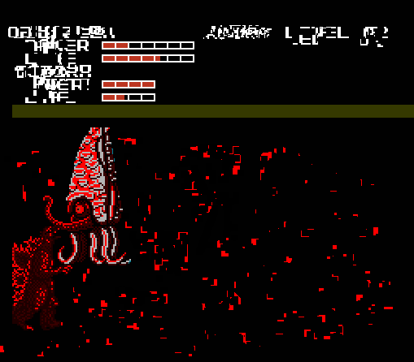

Which was weird, but I just took the game out, blew on it, and then started again.
I wasn't about to let a little glitch stand in my way. So I started again and
this time defeated Gezora and the level's other boss monster, Moguera without
any problems.

So then it was onto the next planet: Mars. I browsed around the board and found
something unexpected: where Varan's piece should have been, there was instead a
piece representing Titanosaurus. There were only ten kaiju in the game, and
Titanosaurus was not one of them. Or so I thought. Perhaps Titanosaurus was
originally intended to be in the game but was swapped out with Varan for some
reason?

So I began to feel very excited---not only was I playing my favorite game,
but I was playing a prototype of some sort with a new monster! Needless to say,
I ran through the levels as fast as I could to see Titanosaurus in action.

Fought Gezora again and beat him before he could do his tentacle smack, but this
time the glitch started happening when he died. Gezora's sprite didn't sink to
the bottom, but instead seemed to be devoured by the glitch, and his eye started
randomly spawning all over the screen.

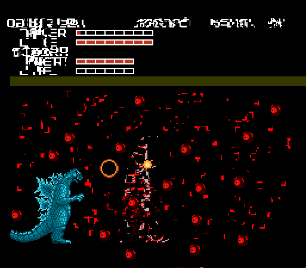

I know now that these glitches with Gezora were my first warning sign that
something was very wrong with this game. But foolishly I ignored it, and proceeded
on to fight Moguera, who this time had a glitch of his own:

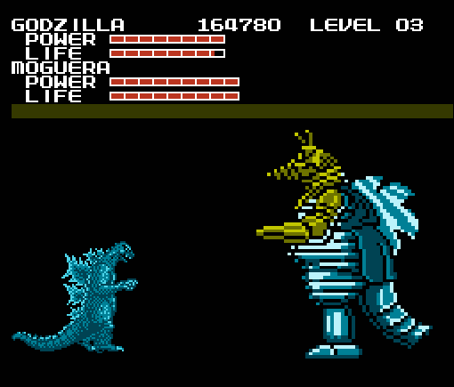

Moguera was twice the size he should have been, which startled me. He was also
considerably harder to beat than usual (which is to say, not at all), but soon I
had defeated him also, and when he died yet another glitch happened:

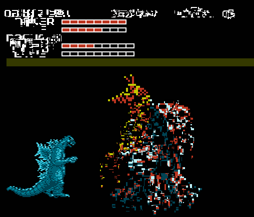

This happened extremely fast so I was lucky to get a screencap of it at all, but
what happened was that the Giant Moguera sprite started to "shatter" and "melt".
Also if you look at the garbled text at the right corner of the screen, you'll
notice what appears to be a bird in a cage... I still have no idea what that meant.

At this point I was about to fight Titanosaurus, and I was worried as to what kind
of glitches would happen this time. But to my surprise, Titanosaurus looked just
fine, although all of the game's bipedal monsters were the same height,
Titanosaurus was a bit taller. But since Titanosaurus actually was taller than
Godzilla in his film debut, I thought this was kinda cool.

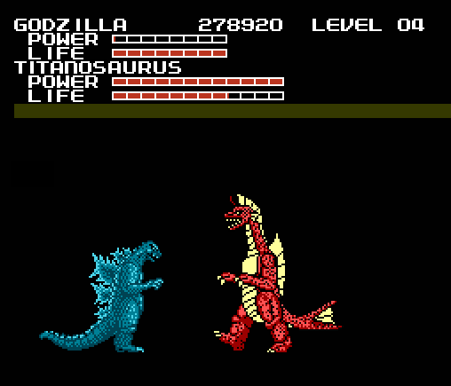

After a very fun fight with the monster that wasn't supposed to be in the game,
I took over the enemy base and proceeded not to Jupiter like normal, but instead
to... "Pathos":

## Chapter 2: Pathos

Pathos was the same as Jupiter in layout, except the board was dark blue rather
than green. The first thing I noticed was that all the usual level icons had been
replaced by a blue rock and some kind of orange honeycomb shape.

There was one icon that had part of the Jungle Icon shape, but I didn't pay much
thought to it. I checked the other side of the board to see the new monster.
Instead of Hedorah, it was Biollante.

But that couldn't have been right. *Godzilla vs Biollante* didn't come out until
1989, and this game was made 1988. Perhaps Toho put Biollante in the game to build
excitement for the movie next year, but changed their minds? I tried to rationalize
the game's abnormalities any way I could, but this would prove to be futile.

Pathos' map song was the first new song I heard in the game. Like most of the new
songs it was hard to describe, I'll try.

It started out slow and suspenseful, much slower than any song in the game. But
every twelve seconds or so there would be a loud clashing sound, and the tempo
changed. It was like the composer randomly played parts from five different songs
with the same instruments.

I moved Godzilla over to one of the many blue rock icons that had replaced the
jungle icons and started the level. The level resembled a blue mountain range
with a blood red planet in the sky. But there was something odd about the
mountains, they had a "shredded paper" look to them. I thought at first maybe the
glitch had affected it, but it looked far too intentional.

I quickly noticed something else about this new level: There were no enemies, at
all. Not even any obstacles.

I should also mention that this was were the point meter started to become glitched
beyond comprehension. But it didn't bother me much, I never keep up with game
points.

So without having to focus on anything, I listened to the music while walking
through the level unopposed. The music had a sorrowful feel to it. It would have
been rather pleasant, had I heard it in a normal game.

The level went on for three screens, but with no obstacles around I finished it
very quickly. I tried other levels of the same type to see if any enemies appear,
but there were none. There was little else to be seen in the blue mountains,
so I tried the other level type.

I started one of the orange levels, and my eyes were assaulted with a grotesque
background of tumorous orange eyes. The "sky" was the same as the ground, so I
assumed the game was indicating that this level takes place in a cave.

The only enemies here were Matango Spawn, but as you can see the little bastards
were everywhere. The music certainly didn't help, with a mixture of screeching
sounds and loud drum beats that sounded like a monster's theme in a horror film.
After completing it, I tried to avoid playing through anymore of these levels
whenever I could.

The map was short so it was only a few minutes before I was headed towards a
rematch with Gezora and Moguera. But this time, their sprites and attack patterns
were vastly different.

I fought Moguera first. Moguera's replacement was a flying machine with a slight
resemblance to a Pascagoula alien. It was a bit like fighting Mothra, only it
moved with a lot more grace. It attacked by spinning its front tentacle like a
corkscrew, and it still had an eye beam, except now it fired from the drill.

This lanky aberration had replaced Gezora, and the new beast was more of a
challenge. It would run and jump at a fast pace, constantly swinging its arms
around making it hard to get close, and of course it tried to pin me in the
corner with as much annoying resolve as ever. I defeated it using a combination
of tail whips and heat beam spamming.

I defeated them and was going to fight Titanosaurus, but when I started the fight
Titanosaurus was nowhere to be seen, and the game simply went back to the map with
the Titanosaurus piece now missing.

There was no one left to fight now but Biollante, so I eagerly started the battle.

I was quite surprised that Biollante started the fight in her Rose Form. She was
immobile and used tentacles to keep me away from the main body, which took the
most damage.

As expected, she turned into her Final Form after taking enough damage. The sprite
looked pretty damn good for 8-bit.

The battle technique was the same, except now Biollante could move, albeit slower
than any other monster. Being hit by the tentacles did more damage now, and
Biollante could do an acid spit, which I managed to avoid by jumping in the
screencap:

Not much more difficult to beat than Titanosaurus, it only took two rounds. But
when Biollante was gone, The music had stopped, and there was a new icon
replacing the base:

This icon wasn't there before I beat Biollante. It resembled a red tribal mask,
and I had a feeling of dread when I saw it. But it since it replaced the base,
it must be the only way to exit Pathos. I moved Godzilla to the square and
started the level.

It was a hellish looking place with no sky, and a flickering fire in the
background. The fire looked far more advanced than anything I've seen on the NES.
There was "music", in the form of a slow, steady drum sound resembling a heartbeat.

All the text on the top of the screen, and the life bar, were gone. In their place
was a single bit of text in the middle of the screen that said "RUN".

My feeling of dread had intensified. I cautiously walked through the level, but
like the blue mountains there were no enemies. I paced around for a minute
before thinking "Run?... from what?"

The first time it hit me, I didn't even see it.

I heard a noise outside my room and turned back to see if something fell, and
when I looked back Godzilla was dying. I figured it must have just been a glitch,
but I wasn't going to play through the game without Godzilla so I restarted the
game and went to the password screen.

Have I ever mentioned how creepy the password screen music is? If you've played
the game, you know what I mean. It doesn't at all fit the mood of the game,
it's more like something from a horror game. Maybe they made it like that so
kids wouldn't cheat.

I was quite annoyed at this point, because I thought I was going to have to fight
all the monsters again. But that didn't happen. The game started me off right where
I was before I started the red face level. So I tried again, making sure to pay
attention this time.

That's when heard a low bellowing sound, and then I saw it. This... thing.

Do you know that feeling your body has when you feel like you're in extreme danger?
You start to recoil and tense up as the adrenaline flows through your veins,
and your nerves start to feel very cold?

That's the feeling I had when I took this screencap.

I haven't seen all the Godzilla movies, but I'm pretty damn sure THIS was never
in any of them. It had to be something the creators made up. But what kind of
sick fuck would put THIS in a children's game?

By sheer dumb luck, or perhaps the adrenaline boost, I managed to run fast enough
to get away from it. It ran very fast, so much so that if you saw it you were
almost certainly going to die. And when I say "die", I mean your monster gets
killed instantly if the creature touches them.

Once I had gone back to the map, I was so afraid that I was extremely tempted to
just shut the game off and try to pretend this never happened. I couldn't believe
what I had just seen, it couldn't have been real.

And even if I wanted to continue, I still had to get Mothra through this chase
level. But as I stayed inactive on the map screen for a few minutes, my fear
was replaced by burning curiosity. What the hell had just happened? What was
the rest of the game like? I only had to beat this level with Mothra and then
it was onto the next world.

But when I moved Mothra to the red face, the game registered it as me beating
the level. I was quite relieved. I tried to prepare myself for the next world:
"Trance".

## Chapter 3: Trance

I was still pretty shook up from the last level when I started "Trance". Trance's
map music did nothing to ease the tension. As for how to describe it... have you
ever heard the theme from Videodrome? That's the closest thing I can think of it
to compare it to.

I checked to see who the new monster was, and it was Orga. A monster who didn't
make his film debut until 2000, appearing in a game made in 1988.
So much for my theories about Titanosaurus and Biollante. There's no way this
game was made in 1988!

Those guys at Toho may be smart, but I'm sure they couldn't see that far into
the future. If they could, they never would have gave Roland Emmerich the
rights to make a Godzilla movie.

No, this had to be a hack of some kind. Which just opened up even more questions.
Who made this hack? When? How ? And most importantly, why? The "why?" was the
question that bothered me most.

My immediate assumption was to think Billy did this to pull a joke on me. But
that couldn't be right either. Billy didn't know how to make a ROM hack.

And if he did, he'd probably just do something simple and stupid, like replacing
all the monsters with crudely drawn genitalia. Unless Billy had amazing game
editing skills, and a serious dark streak to his imagination that he never told
me about, he couldn't have made this. Is it even possible to put a hacked ROM
into a cartridge?

Aside from all that, my eye was drawn to a new icon on the map: a question mark.
I was really curious as to what it did.

I'm sure you're also curious, So I'll explain the "Quiz Levels" now, since this
was when they start appearing. There was one of these per map from here on,
and they always appeared near the start of the map.

When you start on a "Quiz Level", you appear on a screen like this:

As you can see, there's a question at the top, a "yes" and "no" button, and a
emoticon in the center. I refer to the emoticon as "Face" (real creative, I know),
and for convenience, I'll refer to Face as the one asking the questions.

The music for the quiz levels was a track actually in the game, it's the one
that plays when you try to use the "Gh1d0ra" cheat and get sent to an unplayable
level.

Face asks you twelve "Yes or No" questions, and you move your monster to the
buttons for your answer. When you answer, the question disappears and Face
changes expressions for about eight seconds, then he goes back to neutral
and a new question comes up. There was no time limit, nor any right or
wrong answers.

Face has no respect for the player's personal boundaries, and will sometimes
ask deeply disturbing and personal questions, For example: (Do you like hurting
people?) (Have you ever killed/raped anyone?) (Have you been molested by a family
member?)

Other times he would ask questions that were either mind-numbingly stupid (Is
the Sun hot?) (Is water wet?) or just flat out ridiculous (Does your dog like the
President?) and maybe once per quiz, Face would ask you a question about the game.

With one exception, Face's expression changes seemed to have no effect on the game,
except for indicating what the game creator thought of your answer. His reactions
rarely made any sense, and at first I thought they were randomly generated.

The questions never followed a pattern, Face never stayed on the same subject for
more than two questions. Early on, there were questions that made me think Face
was building up to something, only to then ask some stupid garbage.

Here are the expressions of Face that I saw while playing. I'll separate
them into two categories: The expressions I understood,
and the expressions I didn't.

First are the expressions I understood:

1. Neutral, his default expression
2. Angry (If you try to attack Face, his expression changes to this, but nothing
else happens)
3. Sad
4. Happy
5. Sick
6. Maniacal (Face made this expression when he was being an asshole. You'll see
what I mean later)
7. Surprised
8. Love
9. Annoyed
10. Confused
11. Guilty/Hurt

And here are the others:

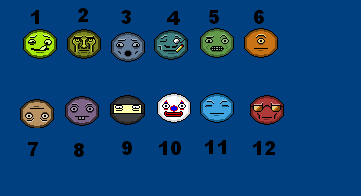

Two of these only appeared once (Numbers #1 and #12), and I suspected they might
have been in-jokes from the creator. Their respective questions were "Do you
like Ice Cream?" and "Are you a tough guy?".

As for the questions in the first Quiz: Luckily, I had a notepad and pen handy.
I have problems remembering things, so I often carry one around to jot things
down, and sometimes I doodle in it when I'm bored. So when the first quiz
started I thought I'd record what happened. I'm glad I did.

**Quiz 1**

1. Do you like the game? 
Answer: Yes, Reaction: Happy

2. Are you afraid? 
Answer: Yes, Reaction: Surprised

3. Are you over 18? 
Answer: Yes, Reaction: Weird Face #5

4. Do birds have teeth? 
Answer: No, Reaction: Love

5. Is peanut butter good? 
Answer: Yes, Reaction: Sick

6. Does the moon rotate? 
Answer: Yes, Reaction: Weird Face #11

7. Have you had a job? 
Answer: Yes, Reaction: Confused

8. Do you like hurting people? 
Answer: No, Reaction: Annoyed

9. Is the Sun hot? 
Answer: Yes, Reaction: Sad

10. Do you like dogs? 
Answer: Yes, Reaction: Happy

11. Is the president good? 
Answer: No, Reaction: Angry

Now that I've explained all that, time for the gameplay.

After the Quiz level, I tried the new green temple icon first.

Wow. Maybe this is why the game was so weird---one of the designers was clearly
drugged out of his mind!

Jokes aside, I was quite impressed by the graphics of this level, as disorienting
as they were (But I hate those creepy, blank staring statue faces). The music had
a hypnotic, Indian techno vibe to it.

There were two new enemies in this level: a flying ghost type thing with a trunk,
and a bat with a horse skull for a face. They appear at random, but I was lucky
to get a screencap of them both:

Then I proceeded to a blue mountain level, expecting another nice, calm stroll.
I took my time walking through, and was completely taken by surprise when this
happened:

Not-Moguera came speeding towards me and took off quite a bit of health with his
tentacle screws! It only took me two minutes to kill him without having to worry
about a time limit, but the boss monsters NEVER showed up in the scrolling levels
in the normal game. I was worried as to what other rules the game would break.

After another blue mountain stage, it was time to fight Not-Varan, whose
replacement was one of the most bizarre things in the game:

This strange creature attacks you by kicking, and also opening up his chest and
firing heat-seeking missiles. ...I still don't get it.

[Not-Varan chest missles](notvaranmissile.png)

The missiles were sometimes a pain to deal with, but I found out you could tail
whip them out of the way. Not-Varan was probably the easiest of the monster
replacements.

The same could not be said for Not-Hedorah.

Apparently the source of the horse-bats, Not-Hedorah was the most aggravatingly
difficult monster to fight yet. Mostly because of his special ability: He could
shriek and summon a small swarm of those horse-bat things.

I know there's only two in the screencap, but every time he did this, about ten
would arrive. The AI took advantage of the distraction and attacked twice as
fast while the horse-bats were flying around.

Once that annoyance was over with, I went through a green temple level to kill
some enemies to restore my health. Interestingly, none of the horse bats showed
up after Not-Hedorah was killed. And that was when I got an idea:

If killing all the monsters makes the red face show up, what would happen if I
avoid fighting Orga, and go straight to the base?

So I gave that a try:

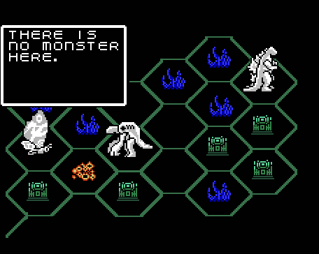

The game told me there was no monster there when I tried to start the base level.
And immediately afterward, the game took control of my Godzilla piece and moved
it in front of Orga. My little trick didn't work, so I tried to prepare myself
for another chase. But first, I had to beat Orga.

The fight with Orga confirmed another thing: Whoever created this game hack was
clearly a Godzilla fan. Not only because they picked a monster like Orga, but
because they actually implemented something that happened in *Godzilla 2000* in
a really neat way.

Orga's primary attacks were a punch and a heat beam from his shoulder cavity.
But once you had got him down to half his health, he did something new: He would
expand his jaws and try to swallow Godzilla, in the process stealing your health
and energy!

But in doing so, he gave himself a new weakness: firing a heat beam into his mouth
would take a devastating four bars off his life meter!

With that weakness revealed I soon beat Orga, and despite how much I had hoped
otherwise, the red face appeared on the map where the base was, and the music
stopped.

I readied myself as best I could. I started the level, and seeing that it was
basically the same as the first, I didn't waste a millisecond before I started
hauling ass.

I soon encountered obstacles in the form of the ground tile, suspended in air.
Most of them you could jump over or destroy, others you had to crouch under.

About forty seconds into it I heard the horrible bellowing roar and saw the spider
beast following close behind me. Stacks of obstacles barely slowed it down, it
would back up and then charge its way through them, smashing them into bits.
And when the smaller obstacles got in its way, it would expand his jaws and
swallow them whole:

I was afraid, but with fast thinking and faster button pressing I escaped him yet
again. I felt really excited, and so I laughed and said "Not this time, asshole!"
I decided to take a screencap to celebrate.

But when I said that sentence, just before the level ended, the monster did
something that made my blood run cold.

It looked at me.

That wave of mortal terror overtook me again, and I sure as hell wasn't laughing
anymore.

I took another screencap of the next level title, right before I rushed to the
bathroom to splash some water on my face. (And to take a piss that I nearly failed
to contain when that fucking thing looked at me.)

## Chapter 4: Dementia

When I got back to the game, I was getting very upset and confused.

I thought about the way the monster looked at me. The game COULDN'T have heard
what I said, that's impossible. It had to be a random occurrence. But why did
it happen precisely at the moment I insulted the monster?

Nothing about this game made any sense. The new Godzilla monsters, the weird
replacement monsters, out of place imagery like the green temples, quiz levels,
and the red monster chases. It didn't seem to add up in any kind of meaningful
way.

If it was a prank, it wasn't funny in any way I could understand, and they
clearly put far too much effort into it.

If they were trying to make a genuine sequel with new Godzilla monsters,
then why did they add... everything else?

Maybe it was some kind of art experiment? Some group project made by a bunch of
really talented and crazy people, and they lost the cartridge somehow? Or maybe
they intended for some random person to find it?

It was all just fruitless guessing. As far as I could tell, there was only one
way to figure out what the deal with this game was: To play it through to the end.
Maybe, just maybe, there would be something in the credits, an explanation by
the creators as to why they made this. Or it could be something much more cryptic
and strange, maybe even something horrifying.

Before I got a good look at the Dementia board, I considered replaying Trance to
see if the red monster would look at me again. But I decided against it. I wanted
to keep moving forward. I was also somewhat worried that backtracking might cause
the game to become even more strange.

The Dementia board music sounded a lot like the Saturn music, except it was slowed
down, and played with a piano-sounding instrument. Like most of these new map themes,
it had a dangerous suspenseful feel.

While listening to the music, I looked at the Dementia board. There were four
boss monsters this time: SpaceGodzilla, Manda, Gigan, and Baragon. I was surprised
that there were two new Toho monsters this time. But the best surprise was still
to come.

I started the Quiz level. Here's another list of results in the same format as
the last one:

**Quiz 2:**

1. Can you swim? 
Answer: Yes, Reaction: Happy

2. Do you like fish? 
Answer: Yes, Reaction: Sick

3. Can penguins fly? 
Answer: No, Reaction Sad

4. Can it spin in all directions? 
*(There was no clarification of what Face meant by "it" so I just guessed)* 
Answer: No, Reaction: Surprised

5. Do you breathe oxygen? 
Answer: Yes, Reaction: Weird Face #8

6. Does it taste good when you bite a woman? 
*(I don't know who came up with this question, but I really hope they're getting
mental help)* 
Answer: No, Reaction: Annoyed

7. Is it night where you are? 
Answer: Yes, Reaction: Weird Face #6

8. Do you like cats? 
Answer: Yes, Reaction: Confused

9. Is water wet? 
Answer: Yes, Reaction: Angry

10. Have you ever broken a bone? 
Answer: No, Reaction: Happy

11. Do you like your job? 
Answer: Yes, Reaction: Hurt

12. Would you like a new monster? 
Answer: Yes, Reaction: Weird Face #11

I wasn't entirely sure at the time what Face meant by "new monster", but I couldn't
resist answering "Yes", just to see what would happen.

The result was mind blowing.

The game took me back to the board and I had a new playable monster in the form
of Anguirus! Ever since I was kid, I always wanted to play as Anguirus, since he
was my second favorite Godzilla monster (And plus I never liked Mothra all that
much).

I moved my new Anguirus piece over to the level right next to it, eager to test
out my new monster.

Before I get into the level description I'll talk about Anguirus a bit:

Using the up and down buttons you could choose whether Anguirus stood in a bipedal
stance or crawled around on all fours. It wasn't a huge difference, but being able
to stand was helpful in boss fights, and crawling sometimes helped dodge obstacles
and attacks.

He could punch and kick like Godzilla, but no tail whip. Instead he had something
far more interesting: The ability to curl up into a spiked ball of death and roll
around. You could still take damage, but it was lessened. It was a good way of
clearing out stage enemies, but unfortunately doing this also drained the power
bar.

But the spiked ball wasn't his only special ability. When you pressed Start,
he would fire a beam of energy from his mouth. It resembled Titanosaurus' sonar
attack, and if this were a hack it may have been inspired by the Roar attack from
Atari's Godzilla fighting games.

Also of note is that when playing as Anguirus, the "Level" meter gets glitched up.
Judging by the life and power bar, I'd say he's on Level 10.

Now onto the level:

As you might have guessed from the level icon, these levels are green palette swaps
of the ground and background tiles from the Blue Mountains. But what immediately
caught my attention was the water, which has a transparency effect.

Was that even possible for an NES game? I know the Super Nintendo could do it,
but I had never seen a transparency effect in a game on an NES.

The Green Mountains music was played with the same instrument as the Blue Mountains,
but the melody was totally different. It was a very simple song with a lot of
abrupt pauses, followed by a loud note every few seconds.

Anyway, I went through the usual strolling through the level. And again there were
no monsters or anything, but pretty soon I had reached a cliff above the water.

There was nowhere to go but into the water, so down I went. The water transparency
made things a bit harder to see, but it's tolerable. After going underwater I
encountered two new enemies: a giant piranha and some kind of spiky bottom feeder
thing. I liked the piranha because I could easily tell what it was.

It was a sane enemy design that would appear in a real game, and there were very
few enemies like this.

They didn't take much hits to kill, but they were quite annoying, and could
considerably trim down your life if they got close enough. They also tend to
travel in packs.

As for the bottom feeders, they're easy to deal with. They swim along the bottom
of the screen towards you, and are easily crushed with the roll attack or jumped
over. In this screencap you can see me about to run one of them over, and there's
a pack of piranha behind it.

After I beat that level, I moved Godzilla onto the blue castle icon. I started
the level and I got a title screen, with the text "UNFORGIVING COLD".

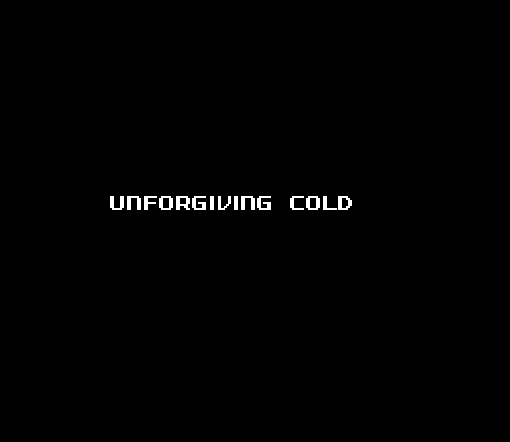

The level itself looked like a castle dungeon made of blue bricks,with rows of
identical white statue faces on the walls. These statue faces had a permanent
look of horror on their faces.

There was also some flickering gray static, which didn't really obscure my vision,
but it adds to the very unsettling mood of these levels. The music was a twelve
second loop of a low pitched choir vocalizing, that sounded very familiar to me.

Whenever I played through one of these levels I got this sudden, horrible feeling
of anxiety. I had the feeling that the farther I progressed through the level,
the closer I was getting to something unspeakably evil.

There weren't any enemies, but these were the some of the longest levels in the
game. I only played one level, but it took seven minutes to complete.

I didn't want to admit it to myself at the time, but I realized something playing
the blue castle level: This game has the power to make the player feel certain
things.

I don't mean in the sense that you get irritated playing a crappy game, or get
unnerved by something scary in a game. What I mean is that certain events in this
game can instantly make you start feeling something.

I know that sounds completely insane. I don't blame you for not believing me, I
wouldn't believe any of this either if I didn't play the game myself. But there
is something very, very wrong with this game, and I still don't know how to
explain it.

So... then it was time to fight Baragon's replacement.

Although Baragon was originally the smallest monster in the game, his replacement
was the largest. It was so tall in fact, that the "ground" was noticeably lowered,
and Not-Baragon's head still barely avoided collision with the bar at the top of
the screen. And he was just as frighteningly bizarre as he was huge.

You may be wondering how he attacks without arms. Well, he has the most powerful
kick in the game. But his other fighting technique is much stranger.

First he blasts a cloudy breath of pixels down at you, which causes you to freeze,
then he walks back to the right corner of the screen and... extends a huge gatling
gun from his abdomen.

That might seem amusing to you, but it certainly wasn't to me when I was playing
the game. This attack is almost as annoying as Gigan's saw, and Not-Baragon could
have been unbeatable if he consistently used it. Thankfully he only did it twice
while fighting him.

Once you unfreeze, you can run up and start damaging the gun, which does extra
damage to him. This helped me to destroy him, and then it was time to play the
third level type. I decided that I was going to use Anguirus to fight Manda and
Gigan, and then fight SpaceGodzilla as Godzilla (it was only fitting).

Before getting into the battles, I'll describe the third level type: The Arctic.

The Arctic is exactly what you'd guess from the name, an icy tundra with a few
watery segments.

The music reminded me a bit of "Northern Hemispheres" from Donkey Kong Country,
in 8 bit form. A very dangerous sounding song, it made me think about being
trapped in a tundra and freezing to death.

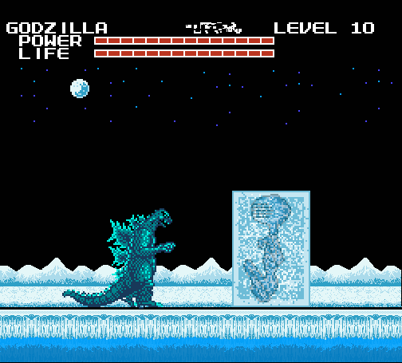

There were two new enemies in this stage. The first was a creature frozen in a
block of ice. They block your way and you have to use the heat beam to thaw them
out of the ice. They look a bit like a smaller version of Not-Gezora, only
without the eye.

When freed, they do a strange crawling movement and push you backwards.
It doesn't cause any damage but it's a bit annoying.

After dealing with the Iceman, I kept walking for a minute or two and came upon
a water segment. I jumped in, and this time I managed to get a screencap showing
how the water splashes when you jump in. Dunno how they programmed that, but it's
pretty impressive. Another interesting thing is how the screen changes focus when
you go underwater.

Here you can see the other new enemy, a little thing I call "Spike Walker". They
walk towards you and explode randomly(or instantly if you attack them), sending
spikes in every direction. The spikes don't do much damage but they did get me
dangerously close to falling into a pit a few times. 

Oh, speaking of the pits: Down into the water, the game has a platformer element:
bottomless pits. There weren't any of these in the original game, since it was
strictly an action game, but the pits were a neat addition.

After getting back on land, I encountered a very unexpected miniboss: Maguma,
the Walrus Kaiju. I know this game had some obscure monsters to begin with,
but wow. Not that I'm complaining, it's a pretty cool cameo for an unappreciated
kaiju.

Maguma's fighting tactics were very simple, he had a freeze beam, and he could
charge into you. Not very challenging but certainly more entertaining than the
Matango miniboss in the original game.

One really interesting thing about Maguma is that he doesn't die when you defeat
him, he turns tail and retreats. This was the first time I had ever seen an enemy
monster change direction, let alone retreat. I tried to chase after him, but he
dissapeared after I got in the water. Poor bastard.

And that does it for the Arctic. I'll talk about the Manda fight next.

I forgot to mention before, but the music that played during the new monster fights
is re-used from themes actually in the games. 

So far the themes have been:

- Titanosaurus: Gezora's music
- Biollante: Hedorah's music
- Orga: Baragon/Moguera's music
- Manda: Varan's music
- Spacegodzilla: MechaGodzilla's music 

As for the fight, Manda was a fairly crafty opponent. When it realized one tactic
was ineffective, it would immediately change to a different one.

Manda used quite a few tricks, like spitting fire, biting, and the most
irritating of all, constricting.

It doesn't mercilessly drain your life down like Gigan's cutter, but it was by
far Manda's strongest attack.

One last thing to note (that I found pretty cool) was that the Atragon showed up
during the fight to help me out. Manda crushed it with ease, but it was still
cool.

After I slayed Manda, I played through an Arctic level for health power-ups and
then it was on to Gigan's replacement. When the fight started, I was very
confused, because there was nothing there. I thought this was going to be like
the Titanosaurus "fight" in Pathos, but just about the time it would have been
going back to the map, a piranha appeared onscreen.

But it wasn't there for long. As soon as it appeared, the speakers emitted an
ear-splitting screech, and Not-Gigan flew in and ripped the poor fish into
pieces.

Well, that's one way to get the player on their toes. That abrupt entrance
scared the hell out of me and got my adrenaline rushing. Which in retrospect was
a good thing, because Not-Gigan was one of the fastest, most unrelenting
opponents in the game.

Not-Gigan was tough, but my new skills with Anguirus helped to even the score.
This was still an incredibly intense fight! Not-Gigan's attacks consisted of a
some kind of blood laser he spews from his mouth, and a downward slash. I was
expecting some hellish variant of the buzzsaw attack, but thankfully there
didn't seem to be one.

The Howl attack was invaluable in defeating him. I would have taken more
screencaps of the fight, but I really had to concentrate.

After that, there was just one monster left to take down: SpaceGodzilla. As
mentioned earlier, I used Godzilla for this fight.

Spacegodzilla's fighting technique was rather frustrating, but admittedly a very
clever idea.

SpaceGodzilla would use his energy to create two flying crystals, which would
reach the ground and become crystal spires.

These spires not only block you from reaching SpaceGodzilla, but it also allowed
him to constantly recharge to full energy, and blast you with a deadly fully
charged Corona Beam until you broke the spires.

SpaceGodzilla would eventually drain his own spires of energy until they
shattered, but if you waited for that to happen you'd probably lose a lot of
life. Heat beams actually seemed to re-energize the spires, so you had to use
physical attacks.

When you finally got close enough to hit SpaceGodzilla, he was no pushover. When
I punched him, he hit me back just as hard. SpaceGodzilla does everything in his
power to knock you back to the left corner of the screen, so he can create more
spires.

By the time this was over, I only had about five life bars left. But it didn't
matter, because I didn't need to fight anymore. I needed to run.

Here we go again. I decided right then that I really wanted to see the end of
this game. As terrifying as these levels could sometimes be, I had to beat them
to get though.

For this chase I tried out Anguirus, since his roll attack allowed me to move
faster than Godzilla or Mothra. The chase started off like the first two, except
there was a river of blood below the ground. I was beginning to get the hang of
it, and the extra speed from the Roll helped me get an edge on the red monster.
Especially since I didn't have to worry about a power limit, and could keep
rolling endlessly.

Like the previous levels with water, the ground inevitably reached a stop. So I
rolled off into the blood. To my surprise, the hell beast didn't follow after
me, it just stopped at the edge of the ground and grimaced. "I guess it can't
swim" I thought to myself.

So I went "underblood" and continued moving. There wasn't anything around, but I
knew something was up. The chase wasn't going to end that easily, could it?
Surely something else had to show up. And sure enough, I heard the bellowing
roar, sounding slightly different...

...And the monster was following after me in a new aquatic body! I had no idea
it was a shapeshifter. After it reappeared, the chase started to get into the
difficulty I had expected. Being submerged slowed me down, putting me and the
beast at about the same speed. The only thing that would keep me alive was fast
thinking and reflexes.

I encountered some bottomless pits, in which mines floated up from. I assume
that if you hit one, it would damage you and knock you back. Considering how
fast the red monster swims, hitting the mines would be instant death, so I went
through great effort to avoid them.

But that wasn't all I had to be wary of. Halfway through the chase the hell
beast revealed yet another surprise: a tentacle formed of intestine and tipped
with a clawed set of jaws burst from its mouth, trying to pull me in and devour
me. I only barely avoided both the tentacle and the mines, but I could tell the
beast was getting desperate, because the chase was nearly over.

And about a minute later, I had spotted a bit of ground that served as the exit.
I leaped with all the might I could muster (without breaking my controller). The
beast screamed with rage and jumped out of the blood river in one last attempt
to drag me down, but I escaped its grasp. This time.

I fell back on my bed and took a deep breath, satisfied with yet another
successful escape. Now I was headed to the fifth world: Entropy.

## Chapter 5: Entropy

In the original game, the 6th world was Pluto. Ironically, despite being the
smallest planet, Pluto was the largest and most diverse world in the game.
Entropy had a different layout, but was similarly huge and diverse.

The board music was played by a violin instrument, a melody that started out
sounding mournful and then it gets rather... I guess I would call it "distorted"?
It made me feel depressed and unnerved. Not something I would want to hear while
trying to sleep.

Strangely, none of the levels from the previous worlds were present here,
instead there were eight brand-new icons. The bosses this time were Megalon,
Battra, and Mechagodzilla.

As usual, the first thing I did was go to the Quiz Level for another
interrogation from Face. But I when I got there, I noticed something different;
instead of the usual goofy GH1D0RA music, it was the Password theme.

The music change seemed to be intentional, because after the first two questions
at the start, the quiz started to take on a darker tone;

**Quiz 3**

1. Do you like Ice Cream? 
Answer: Yes, Reaction: Weird Face #1

2. Do you like clowns? 
Answer: Yes, Reaction: Weird Face #10

3. Is time slipping through your fingers? 
Answer: Yes, Reaction: Weird Face #2

4. Do you have any regrets? 
Answer: Yes, Reaction: Hurt

5. Do some people deserve to die? 
Answer: No, Reaction: Weird Face #3

6. Is it safe to go out at night? 
Answer: Yes, Reaction: Weird Face #5

7. Do you find it hard to sleep at night? 
Answer: Yes, Reaction: Weird Face #6

8. Have you killed anyone? 
Answer: No, Reaction: Weird Face #7

9. Do you want to kill anyone? 
Answer: No, Reaction: Angry

10. Are you actually accomplishing anything? 
Answer: No, Reaction: Weird Face #4

11. Does life have any real meaning? 
Answer: No, Reaction: Love

12. Do you like Mothra? 
Answer: No, Reaction: Maniacal

I knew that last one was gonna be a gameplay related question, but I had no idea
what the result would be. I answered honestly, because as I said before I never
liked Mothra.

Nobody liked playing as Mothra in this game. And there was a good reason for
that, every other time Mothra gets hit she gets slammed back to the left corner
of the screen, and she sucks at fighting because her attacks are so weak. The
only benefit Mothra had was being able to fly over obstacles in some levels.

So I answered No, and Face actually replied back to me, not only with the
maniacal expression, but with text;

> "TOO BAD!"

I was taken back to the map screen, and I was shocked to see that Godzilla and
Anguirus has disappeared from the board, leaving only Mothra. Face had just
fucked me over. Needless to say, I was pissed. But there wasn't anything I could
do, and I'm willing to bet even if I had said "Yes", I would have been stuck
with Mothra anyway. Face giveth, and Face taketh away.

I took a deep breath, and got ready to explore. There were two paths I could
take through the board, I decided to take the lower one. This turned out to be a
good choice for reasons I'll get to momentarily.

The first world ahead me of was a forest, so I started there. Almost
immediately, I got an eerie feeling. There was something about this level that
just seemed "off" to me, even more than the previous ones.

Perhaps it was the pitch black background. I've always been afraid of being in a
forest at night. Something about all those trees, makes me feel surrounded and
vulnerable.

And the fact that I was stuck as Mothra didn't help. Playing the game's previous
worlds as Godzilla gave me a feeling of bravery, being in control of the King of
The Monsters, I'd be able to handle just about anything in my way.

But it's not like that with Mothra. No feeling of strength, or security. Now I'm
just a weak, easily overwhelmed bug, traversing into the unknown.

Back to the level. The music had new instruments, sounding like woodwinds,
followed by slow, rhythmic drums and chiming bells. Gave me this feeling that I
was intruding into some dangerous place I really should not be.

After a while, I encountered the first enemies of the stage. Or at least I
assumed they were enemies. They were strange, long legged deer like creatures.
Instead of attacking, they were just idly walking around. I went to approach
them, and they ran away.

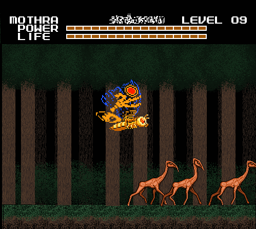

I thought about shooting one with an eye beam to see what would happen, but it
seemed wrong. These creatures were harmless. So I passed over them and continued
through the level.

About halfway through, I encountered groups of the deer-like animals, and also
two new creatures: A sloth like creature with a beak climbing on a tree, and
hairy raptor-esque beasts that were preying on the deer.

It was very surreal watching these creatures interact. I didn't feel like I was
playing a video game, but rather that I was traveling through a forest in some
other dimension.

The creatures ignored me for the most part, although the raptors did attack me
when I got too close, or if I attacked them first. I know I shot one of them to
help one of the deer creatures escape. I got clawed at, but confrontation was
easily avoided by flying up to the top of the screen.

After that, I had to choose whether I wanted to play the levels with the
hourglass, or the TV screen. I picked the latter. What I got was not at all what
I expected.

When I pressed the button to start a level on the TV Screen like I normally
would, this screen with an animation popped up. There was also music in the
background, which was the goofy Gh1d0ra music that used to be playing in the
Quiz levels.

I was somewhat unsettled by this because it was just so strange. I also found it
a bit spooky because I had a shirt that looked just like that when as a kid.
After starting the animation, you could go back to the board by pressing any
button.

After that, I had no what to expect of the rest of these icons. I went to try an
hourglass icon next. I was somewhat relieved when an actual level came up.

It was certainly an unorthodox looking level. All brown, with time measuring
instruments floating in the air and gigantic grandfather clocks in the
background. The music was the same as the board screen.

And very early in the level I encountered something else I didn't expect to see:
Original enemies from the game!

And not just that, it seemed to be a whole fleet of them. And the yellow tanks,
which were normally immobile, could now move. I took some damage, but it was
nothing I couldn't handle. But the most interesting thing about this level was
the colored hourglass items.

There were 3 of these:

1. A blue hourglass, that made time slow down and filled the level with enemies
   from the past.
2. A red hourglass, that made time speed up and filled the level with enemies
   from the future.
3. A green hourglass, that set time to the normal speed, and filled the level
   with the original game enemies.

I encountered the blue hourglass first. As stated, the game started to slow
down, and I saw the "enemies from the past", which were five different types of
prehistoric animals. I don't know much about prehistory, but I believe all of
these enemies represent real animals.

The level went into another segment, and I encountered the green hourglass, and
then I fought the original enemies again. It was the same five types so I didn't
take any screenshots. But in the last segment, I encountered the red hourglass,
and the enemies that must have been from the future.

Now, whether or not the game was showing me 8-bit renditions of creatures that
will actually exist thousands of years into Earth's future, I have no idea. But
with that thought in mind, I found this particular segment to be very eerie, and
it was made more tense because everything moved faster.

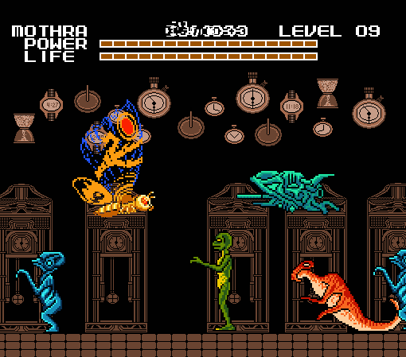

One of the future enemies bore a striking resemblance to something I saw in a
book once, called "Troodon Man". Another looked like some kind of organic
spaceship.

There was only one of the fifth type of Future creature, and when it appeared,
all the others ran for their lives, leaving me alone to battle it.

It could fly but its sprite didn't actually move, and its single attack was
firing a lightning bolt from its "face". Even so, it was surprisingly powerful,
and I suppose it could be considered a mini-boss.

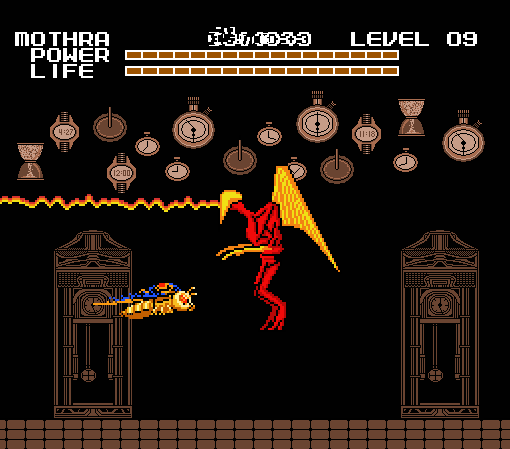

After defeating it, it left a health power-up that restored the health and
energy I had lost fighting it. Which was convenient! It seemed I would need all
the help I could get to beat this world with Mothra alone.

After that previous stage I call "Time Warp", the next stage appeared to be a
Toxic Waste Dump.

As you can see, the place looked grungy, and inhospitable. The music was a short
looping of an ambient synthesizer song. Listening to it made me feel like I had
sniffed some toxic fumes myself, and it was messing with my head the whole time.
I even felt like I was choking while playing this level.

The enemies all seem to be mutated to some degree. In the above screenshot you
can see green mummies with bird skulls, that jump out of the waste to spit
projectiles. There's also a brownish cow skeleton monster with spider legs.

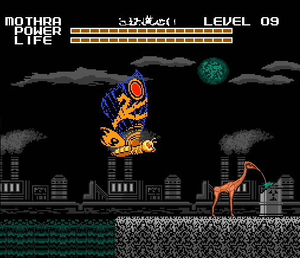

Halfway through the level I even saw one of the deer from the forest. It was
alone, and when I saw it, it was drinking toxic waste out of a barrel with an
anteater-like tongue.

I was moving over to try to make it stop, but then this flock of skull birds
came out of nowhere and started attacking.

The deer was scared by this and ended up running off the ground into the toxic
waste. I feel bad for it. One of the birds bit me, but I regained health quick
from killing all of them, they were rather weak.

I pressed onward. Of all the levels in Entropy, this was probably the most
"normal", in that there was little deviance from the "Move forward, smash
things" formula in the original game.

I encountered more creatures through the level, like tentacled blobs, and some
kind of deformed thing with human-like teeth. I didn't feel like provoking them
into a fight, so I kept on flying near the top of the screen. I still had to
deal with occasional flock of birds now and then.

At the end of the level was a large, bluish green lake, and there I encountered
another mini-boss. Some kind of a monster with a long neck and a whale's skull.
It attacks with a mouth projectile, and by charging into you. It also could go
underneath the water and rapidly emerge from a different place.

It was harder to beat than the boss from the Time Warp, and it had a lot of
health because it must have taken me three minutes to defeat it. It let out a
really loud noise when it died, and then sank back into the water as I left the
screen.

Back on the board, I went to the nearest level icon I hadn't seen yet, which was
a white tree. As I guessed, the level was a winter themed recolor of the forest
stage.

But unlike the regular forest, I didn't feel unnerved starting this one. I think
the music had a lot to do with it. It was a gentle, calm song, it almost sounded
romantic. It was quite stress relieving, and the forest itself looked much less
ominous covered in snow.

I traveled through the first segment enjoying the atmosphere for four minutes,
when suddenly I realized something: I haven't seen a single creature since I
started the level. Where are all the animals? Soon after, I left the screen, and
the next segment started.

In the second segment, I was still in the winter forest, but now the music was
gone. I was starting to feel suspicious, but then I reminded myself that there
were other empty levels in the game and this was likely another one of those.

But then... I heard something familiar. It was the twelve second looping music
from "UNFORGIVING COLD" starting up. I could feel my heart sink as I came across
this horrible sight:

It was a whole group of dead deer creatures, covered in snow. Judging from the
blackish blue tone of their skin, they must have all frozen to death. On closer
inspection, some were missing body parts. Now I was frightened. But I still had
to keep going.

Before exiting the level, I was really hoping to see something resembling the
previous forest animals in a living state. And sure enough, I did.

It was a creature much like the beaked sloth, except this thing had white fur
and was more of a beaked gorilla. It was walking very slowly when I saw it, but
I was happy to at least see something alive. However, it didn't stay that way
for long.

A pack of raptors, who must have sensed that something else was still alive,
came rushing in from the right side of the screen. The beaked gorilla didn't
stand a chance, as one of the raptors immediately lunged at it and ripped open
its back legs.

These "winter raptors" acted far different from their temperate relatives. While
the other raptors only attacked while hunting prey or when provoked, the winter
raptors seemed to have all gone insane. They attacked everything in sight, one
was running back and forth clawing at nothing. Even the noises they made sounded
different, more high pitched and enraged.

As I left this second segment, I even saw two Raptors fighting to the death.
They were both covered in injuries, and one of the Raptors had been blinded in
one eye. I took a screenshot, but I didn't stay to see who won the fight.

I only had to get through one more segment before I could go back to the board
screen. But in this segment, I was no longer in the winter forest, but instead a
very empty grassy plain, with a bright gray moon in the sky. The pleasant music
of Winter Forest part 1 had returned.

And immediately, I started to feel dread. This is going to sound crazy but it's
the absolute truth: The game made this level from one of my memories.

After a long stretch of nothing, I reached a lake. And then, the moon moved down
from the sky, and begin to hatch like an egg. When it did, a curled up humanoid
figure fell into the lake as the moon halves quickly disintegrated.

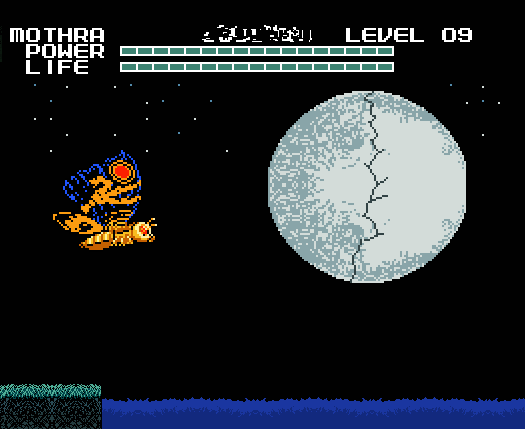

I heard a splash when it hit the water, then a moment of silence. Then the
screen began to shake, and a new creature emerged from the water;

And thus I was introduced to a monster I call the "Moon Beast". This was the
only screenshot I took, as I was focusing all my concentration on winning the
fight. And it was the most difficult fight yet. Stronger than any of the
previous bosses, this creature would have been hard to take down with Godzilla,
and with Mothra it seemed nearly impossible.

I suppose I would consider myself fortunate that the beast lacked any attacks
like Gigan's saw, because if it had I would never have won this. I barely had
three bars of health when I finally killed this abomination.

But what happened afterward is hardly what I could call a reward.

...I've been trying to keep my promise and suppress this memory for years, but
it seems as if I have to get it off my chest. This is a very painful memory for
me, but the game already knows about it and I think you should too. I'll just
tell you the important parts, because I don't like bringing this experience back
into my head unless I have to.

Back when I was in Middle school, I had a girlfriend named Melissa. She suffered
from some kind of mental disorder that caused her to go into "episodes".

When she was in an "episode", she would stand or sit perfectly straight and
still, and her face would instantly lose any expressions she had before. She
would speak very clearly, without any hint of emotion. When it was over, she
would start trembling and sometimes bury her face in her hands, and remain
silent for several minutes. I can't really convey the feeling it gave me in
words, and I won't try. You had to see this in person to understand.

But despite this, she was a very kind person and I cared about her dearly. We
liked to hang out in a field at night, and look at the stars. But one night she
didn't say anything to me at all, she just stared directly at the moon,
trembling. I tried to talk to her, but she suddenly sprung up, and ran right
into traffic. I tried to stop her, but I was too late. She got hit by a truck,
and was killed that night.

I looked her right in the eyes when the wheels went over her neck. That sight
has always haunted me.

I know that the game knows about this because after I defeated the Moon
Beast... this happened.

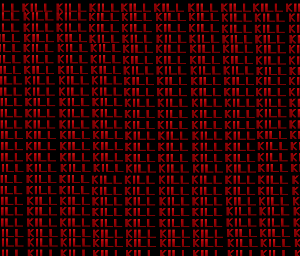

After... THAT, the game went back to the board screen. It was all I could do not
to burst out screaming, and my hands were shaking so bad I could barely hold the
controller.

I knew the game was going to test me if I kept playing. But I had no idea it
would go so far. Or that it was even capable of doing what it just did. I could
feel my brain going haywire as I asked myself "Did the game just read my mind?"

That didn't seem possible. But what other explanation was there?

It was then that I could no longer deny what now seemed obvious: This game is
alive. And not only that, it also can establish some kind of mental connection
with the player.

And yet... I couldn't convince myself to stop playing. I don't know if it was the
game messing with my mind, or just my stubborn curiosity, but even with the
previous revelation, I really wanted to see this through to the end. Even more
than I did before I beat Dementia.

Terrifying as it might be, even dangerous, I knew that if I quit playing, I
would never be able to stop thinking about it. If I tried to restart the game,
it might go back to being normal again. How many people ever get to witness
something like this firsthand, let alone be able to take screenshots of the
whole thing?

Fucked up as it was, this was the experience of a lifetime.

But even so, I couldn't take any chances with my health. I had the TV remote
right next to me, ready to turn the TV off in case I felt I was in actual
danger. And if that didn't work, I would pull the plug out of the wall, or just
run out of the room.

Surely, that would be enough...

Whatever powers the "game" has, it seemed to be confined to what it can show on
the TV and, whatever its "mental connection" could do. The latter was what
worried me. I still didn't know what I was dealing with, so I wasn't about to
underestimate it.

I took a break for a few minutes to calm my nerves. And then it was back to the
game.

And speaking of TVs: There was a TV screen icon right below the white forest I
had just left, and because the first animation was so bizarre I figured I'd try
another to see what happens. Although I expected the same animation, I actually
got a totally different one:

Weird. The music for this one was the Neptune board music. Fitting I suppose,
since it's a fishman and all. I can't help but what wonder what the point of
these things are. There was one more TV screen icon so I figured it must have a
unique animation of its own. I was going to make sure to see what it was before
I left Entropy.

But then it was time for another level. The gold brick icon was the closest
thing, so I went to that, and I started up in a "Gold Labyrinth" level.

My health and power were refilled. Not sure how or why, but I was glad not to be
heading in the unknown nearly dead. I also noticed that my Mothra sprite had
shrunk to half its original size.

The music was a slow, ominous drum beat, with female vocals kicking in about a
minute into it. Quite haunting.

The Gold Labyrinth itself was an anomaly. I'm not sure how this level would have
played out if I was using Godzilla or Anguirus, because flying seemed necessary
just to get around this place.

Another thing that caught my attention was that when you go left, your monster
actually turns and faces the left. That sounds stupidly obvious, but in the
original game you were only supposed to move to the right, so when you tried to
move left your monster ended up walking/flying backwards.

This level was apparently gigantic in size, because every time I thought I had
reached an end to it, or thought I was going to end up back where I started, I
encountered something totally new. Things like lava blockades, new enemies, and
statue faces.

And I found one statue face at a dead end with a wide, open eyed stare. The
night Melissa died, she had an expression on her face that looked exactly like
this the whole time. Even when she got hit by the truck, she still had that same
expression. I can't help but feel like something really is staring at me from
behind the screen when I look at this:

I really didn't want to be reminded of that night anymore, so I left the statue
almost as soon as I found it. I needed to find the exit anyway, which proved to
be no simple task. It felt like this level stretched on forever in all
directions. I must have wandered around the level for at least fifteen minutes
before I finally saw something.

It was a creature that wasn't gold. Seemingly the only one of its kind in the
level. Lacking any kind of hover ability like the other creatures, it just
walked back and forth on the platform.

But it wasn't long after I found it that a flying machine swooped down and
grabbed it, and then flew off with it. The machine apparently had not seen me,
so I decided to follow it, to see where it was taking the creature.

The machine stopped at a room with a large cauldron-like object in the center.
The machine hovered over to the cauldron and dropped the creature into it.

The creature came emerged from a hole in the cauldron's side, now adorned in the
same gold color as everything else. The machine flew off. I'm not really sure
what to make of this, but I'm glad I came upon it, because I found the exit soon
after.

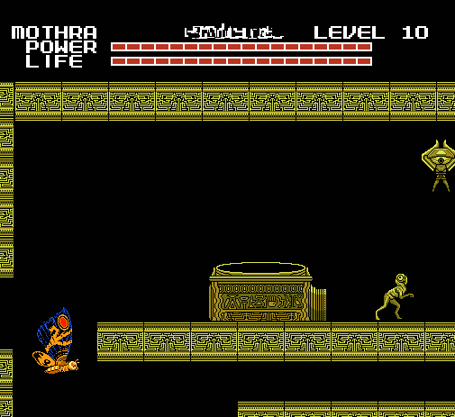

When I got back to the board I realized that the bosses hadn't moved at all. A
bit odd, but it didn't bother me, it made planning my route through Entropy
easier. There were still two new icons to explore, the Indigo Cliffs and a black
version of the labyrinth.

Since there were only three black labyrinth icons (which were surrounded by
bosses) I played the Indigo Cliffs first.

It was a lot like the blue/green mountains. The level graphics had the same
"shredded" look to it, there's also a recolor of the clouds and moon from the
Toxic Waste Dump. The music, (if you can call it that) was merely a deep
rumbling noise.

One of the first things I encountered were these multicolored creatures with big
heads emerging from a small cave in the ground.

They all made a synchronized shaking sound, and they walked to the right in a
group after emerging from the cave, ignoring me.

Having no other way to go, I followed them on their route. More and more emerged
from the cave, until the group had about a hundred creatures. Eventually, the
pathway ended in a cliff. I was shocked to see that upon reaching the cliff, all
the creatures began jumping off into the abyss:

I've seen enemies walk off cliffs before, but I've never seen NPC's commit mass
suicide like this. Very unsettling way to start off a level.

I continued on, flying over various strange animals like the ones shown here:

Another group of multicolored "bobbleheads" was jumping up and down, only to be
snatched up by large birds, which I'm fairly certain are sprite versions of the
Giant Condor from *Godzilla vs. the Sea Monster*.

I defeated some of the Condors in battle, but it bothered me that these
bobbleheads seemed to be so eager to die. If the game itself is alive... perhaps
the creatures in these levels are also "alive"? And some have very unhappy
lives, if this behavior is any indication.

But what provokes them to do this? In the back of my mind, I almost suspect that
the glowing moon in the sky is the reason...

At the end of the level, I saw yet another group of the bobbleheads, marching up
to a large monster and being devoured.

This was starting to disgust me, so acting on impulse I fired off eyebeams at
both the monster and the bobbleheads. I destroyed the cave.

The monster became angry, and ran through the remaining bobbleheads to fight me.
Although it lacked any ranged attacks, it was relentless. But it was no match
for me.

I was in the home stretch now, up to the bosses. My plan was to go through
Battra first, then Megalon. After that I would watch the last TV screen, play
the Black Labyrinth before fighting Mechagodzilla. And lastly, going through the
chase with the hell beast. I was curious to see if it would be in a new form
again.

But first things first, time to beat up Battra.

As I expected, he started off in his Larva form. The music was Varan's battle
theme.

Whenever the game puts in a new Godzilla kaiju with more than one form, that
other form always shows up. For a game that's otherwise inexplicable, it's
rather startling in its consistency and accuracy with the new kaiju bosses.

The fight started off simple. Larva Battra fought in a similar fashion as Maguma
did, charging back and forth and occasionally firing off lightning from its
horn.

During the fight, I noticed that Mothra's combat capabilities had been altered
in my favor:

1. The eye beams did 2x as much damage as they did originally, now they were as
   strong as Godzilla's punches. The poison powder was similarly improved, it
   also did this nice thing were it would actually HIT an enemy when you used it.
2. In the original game, even though Mothra could fly, she was unable to fly over
   an opponent. You would get knocked back the same way as if you just ran
   straight into them, which was extremely annoying. But not any more! I could
   change direction and fly around, which was a big help because:

Fighting Imago Battra is much like fighting a clone Mothra, although Battra is
distinctly faster and stronger. No longer impeded by its slow-moving Larva form,
Imago Battra was a fearsome opponent.

Although it lacked the horn lightning, it now had a new, more powerful eye beam.
Battra could change direction just like I could, so this battle involved a lot
of flipping and flying around. It was pretty damned fun, to be honest.

So after defeating Battra, I was excited to see what Megalon would be like. But
first I went through an Indigo Cliffs level, and shot through a lot of the
creatures for the health-power-ups.

So about Megalon. His music was Gigan's theme. Makes sense, since Gigan was his
battle partner in Megalon's one (and so far, only) film appearance.

He was a lot like Moguera, but faster, and with more weapons. He'd start out
charging off with his drills.

I liked to fly back and forth around him, which seemed to really annoy him.
After a few seconds, he'd step back, turn around and start spitting out
grenades. Those were a pain, because they bounce when they hit the "ground".

Lastly, he started spamming his lightning beam. It only went straight forward,
so it was easy to duck under it and then shoot him with eye beams.

Overall, I'd describe him as Strong, Persistent, but Dumb.

I was now nearing the end of Entropy. I had just taken down Megalon, and I
started up the last Tv screen, to see what I'd get this time.

The result was unpleasant.

The music for this gruesome scene was the Password theme.

I couldn't figure out why this animation was so sinister and violent in
comparison to the other two. The whole game seemed to be growing more
malevolent.

As I went on to finish Entropy, I began to feel... drained. It's hard to
describe. Like I had suddenly became tired when I wasn't before. Most likely it
was just the tension from all that had happened in this game getting to me, but
who knows.

The last level type on Entropy is what I call the "Shadow Labyrinth". The
scenery was recolored from gold to black. The music was an evil ambiance,
similar to the UNFORGIVING COLD loop but distinctly different.

The music was my first sign that this level was going to be distressing. I
traveled through the maze for about a minute, and I noticed there weren't any
creatures hovering around. It was an odd transition from the gold Labyrinth,
which was overrun with creatures, to this level that had nothing at all. But
then this might be a good thing, maybe there wouldn't be any obstacles and I
could get through the level with ease.

Then the screen went dark.

And immediately I snapped out of my "daze" from a few seconds earlier.
Everything had been darkened so that the only thing I could see was the Mothra
sprite. I couldn't tell where I was going and I ended up frantically running
into walls. I heard a noise, the sound of a crowd running through a hallway.

And along with the running, came the roars. Loud roaring sounds, which I would
describe as something like a rabid dog the size of an elephant, screaming with
fury. And I could tell that whatever was making this noise, there were lots of
them.

I knew there was something there, but it wasn't until I did some screencap
editing that I got to see what my pursuers looked like:

But at the time I couldn't see where they were, or where I was going. I was
literally running blind, and this mob of beasts eventually caught up with me.
All I could think was "NO!" as I saw my lifebar rapidly declining. The monsters
had taken me down to half of my total health, when I was saved. The "light" came
back on, and the attackers had disappeared.

And so the challenge of this level was revealed: Find the exit before the lights
go out and a pack of monsters maul you to death.

I was in panic mode now, moving as fast I could go while trying every path I
could find for a way out. As I played through the level, the lights went out a
total of three times. The second time, I would have been dead meat had it not
been for one of the wide-eyed statues:

As I stayed close to it, the monsters seem to all avoid me until the light came
back. The statue warded them away, somehow. I was safe as long as I stayed near
the statue, but at the same time I had to leave to find the exit.

The Shadow Labyrinth turned out to be much smaller than the Gold Labyrinth, as
it only took about six minutes to navigate to the end. But before the exit,
there was a row of halls leading straight down, with no way out once entered.
You either got to the exit before the monsters reached you, or you died.
Thankfully I made it out.

Only one more boss, Mechagodzilla. I started the battle, and got something
unexpected:

Not only did my life shoot back up to 100% again (It seems to do that randomly),
but instead of a replacement boss, I was fighting Godzilla.

But any Godzilla fan worth their salt can figure this out. Mecha-Godzilla
started off like fighting a clone Godzilla, but his disguise burned away after
only three life bars. Usually a transformation only occurred at the halfway
point.

At this point it was like fighting Mecha-Godzilla in the normal game. Felt kinda
nice to fight one of the original game enemies for a change. Although he wasn't
exactly like normal, he also had a rainbow beam and finger missiles. This
prevented me from doing the old trick of backing him in the corner and hitting
with eyebeams in a spot where he can't hit me, but that was always a cheap trick
anyways.

But after getting him down to half his health, something weird started to happen.
His sprite started to glitch, in much the same way as Gezora had way back in the
first world. After a few seconds, the glitches began to form a new shape

And thus the game had created "Not-Mecha-Godzilla", and I discovered that this
visual glitch was somehow related to the game recreating things. The human face
on this one gives it a very uncanny look.

Even though it was a bit stronger, it was also slower than its original
counterpart and couldn't jump around as much. I won the fight by constantly
staying out of its line of fire, bombarding the machine with Poison Powder as I
flew over it.

One last thing to do: The hell beast chase. Oh boy. "Might as well just get this
over with," I thought.

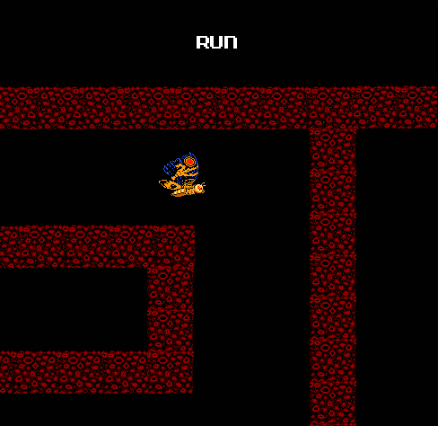

The Entropy "End Chase" ended up being exactly what I was afraid it would be: A
Labyrinth level. All the other chases, although difficult, were extremely
straight-forward. You just had to run to the right and not get touched.

But this took all the simplicity out of it. There was no telling how big this
labyrinth would be, or where the exit was. And now not only did I have to
constantly backtrack to find my way out, I also had to avoid getting one-hit
killed by the red monster.

And for those first thirty seconds, it didn't show up. But I knew it would, and
as I started picking up the pace, I heard a loud flapping noise:

And there it was, in a "flying form". It flew with bat-like wings, and was as
fast and relentless as ever. For reasons already stated this was probably the
most nerve-wracking of all the "End Chases", and as such I had to keep my focus
on the game and not taking screencaps.

However, I did take one of the red monster doing something I found very
interesting.

I had managed to lose it by going through a different path than it apparently
expected, and it was blocked from attacking me by one of the organic walls of
the Red Labyrinth. Or so I thought.

It tried clawing through the wall for a second before opening up its mouth and
tearing the wall apart with the intestine jaws.

But those brief milliseconds that the monster was held back might have been the
key to me finding the exit. The path to exit was long and complex, but from what
I remember I went up, and then back towards the left. I'm still not sure why I
chose that particular way. Just a lucky hunch I suppose.

I was sweating profusely, but my luck had saved me yet again. I hoped that it
wouldn't run out before I finished the game. There were only two more worlds to
go.

Next was the penultimate world, called "Extus":

## Chapter 6: Extus

In the brief instant before the transition between Entropy and Extus, I was
hoping that I would get Godzilla and Angurius back. As the board appeared, I saw
that my wish was half granted: I had Godzilla back, but no Anguirus. I would have
preferred both, but despite Anguirus's neat abilities I would have chosen Godzilla
if I had to pick between the two.

Extus had two different colored temples, white and pink. A pyramid, what looked
like some modern buildings, and two other icons I couldn't figure out at the
time. The new bosses were Kumonga, Gorosaurus, and Not-Ghidorah, (whom I was
dreading to see, let alone fight.)

With Godzilla back, I was excited again and eager to explore, yet still
cautious. I went to the Quiz level first, just as before. This time, Face's
questions were more random than ever:

**Quiz 4**

1. Do elephants breathe? 
Answer: Yes, Reaction: Weird Face #2

2. Have you ever been molested by a family member? 
Answer: No, Reaction: Weird Face #6

3. Have you ever raped someone? 
Answer: No, Reaction: Weird Face #8

4. Is green your favourite color? 
Answer: No, Reaction: Weird Face #10

5. Is the computer the pinnacle of modern technology? 
Answer: Yes, Reaction: Weird Face #4

6. Are you a tough guy? 
Answer: Yes, Reaction: Weird Face #2

7. Can you fly?
Answer: No, Reaction: Weird Face #9

8. Can you stand on your head? 
Answer: Yes, Reaction: Weird Face #7

9. Do you hate raccoons? 
Answer: No, Reaction: Confused

10. Do you feel blame? 
Answer: No, Reaction: Weird Face #11

11. Would you like a new monster? 
Answer: Yes, Reaction: Surprised

12. Will you miss me? 
Answer: Yes, Reaction: Sad

I was happy that I was getting a new monster, but that last question bothered
me. "Will you miss me?"

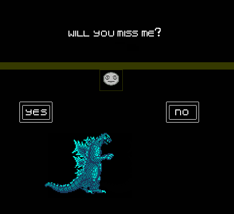

"Is Face referring to when I finish the game?" I thought. Since the revelation
of the game's truly otherworldly nature, I wasn't sure what to think of Face, or
anything else in the game. But something about that last statement gave me a
genuine feeling of sadness from Face.

As I was thinking about this, the game had gone back to the board. I had a new
monster, but I had no idea who it was supposed to be.

The sprite had a slight resemblance to Rodan, but the head was totally off. I
moved this mysterious newcomer to a White Temple icon and started the level.
When I started the level, this screen appeared with the text "FIND THE GEM".
Presumably instructions for beating the level.

After that I got my first look at my new playable monster: A hairy, dark blue
creature with bat wings and a skull-like face named "Solomon".

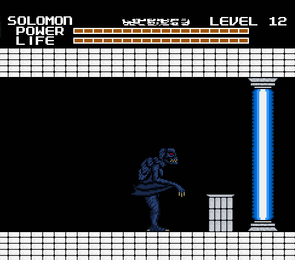

And I also found that my path was blocked by a beam of light, and a small pillar
with a plate on it. I figured that this beam of light was blocking the exit, so
I have to find the gem and drop it on the plate to deactivate the beam.

How exactly I was going to do that, I didn't know. There wasn't anything in the
original game requiring you to find an item to beat a level. I'd have to find
out when I obtained the gem. The only direction I had to go was left, so on I
proceeded.

Solomon was an interesting monster, to say the least. He was capable of both
flight and a heat beam, both of which proved to be very useful. He also could
kick and slash with his wings, but he couldn't duck.

The White Temple's music was a vocalizing choir, or a videogame approximation of
such. It's hard to describe but it had a very "holy" sound to it.

It wasn't long before I started running into waves of strange new enemies. They
did little to stop me, I ran past them while slashing and didn't take any
damage.

There was a "pause" between each wave of enemies, after you had killed about
ten, there wouldn't be any for about a minute, then the next wave would appear.
After five minutes, I noticed holes in the floor and ceiling:

Guillotine mouthed creatures were rapidly flying up and down these crevices, so
I had to time my jumps carefully, because I didn't know if I'd get another shot
at this. Luckily I managed to get through without a scratch. I'm just lucky, I
guess.

After that I found myself at the end of the hallway, facing some kind of
mini-boss monster. It moved fast and had some kind of projectile that it shot in
four directions, but I killed it quite easily using Solomon's heat beam. When
the battle was over I had my gem, which was inside the creature's head:

I found that I could pick up and hold the gem by walking over to it and holding
down B. I made the long trek back to the start, deposited the gem on the plate,
which deactivated the beam.

Every time you complete a stage or defeat a boss with Solomon, this screen
appears. I have no idea what "STILL THE BEST 1973" means. Neither the date nor
the phrase has any meaning or significance to me that I can think of, and I've
spent a lot of time thinking about it.

The next level I played was one that I call "Bronze Pyramids". I used Godzilla,
and found he had been leveled up to twelve since I last played as him in
Dementia.

The Bronze Pyramids were fairly normal as far as these levels go, but the
visuals were quite interesting, almost unusually colorful and lively. The music
had a fittingly Egyptian style to it, it was slow and mysterious sounding.

I strolled through the level fighting off the various enemies, none were too
difficult (although the ants could be a pain if you ran into too many at once).
My favorite enemy was this giant reptile I encountered halfway through;

At the end of the level I came to a giant pyramid and I engaged in yet another
mini-boss fight. Although this was one was a bit different, because I had to
fight two of these monsters at the same time.

Individually, I could have dealt with them easily, but fighting both of them at
once was challenging. But I sped things up by tricking one of the twin beasts
into barbecuing his brother by jumping when he uses his flame breath:

After defeating the twin monsters, I noticed something strange after returning
to the board: I was now able to move my monster piece anywhere on the board,
without limits. Normally Godzilla could only move three spaces each turn, and
Mothra could move five.

I wanted to try out Solomon some more, so I moved his piece over to one of the
brown pillar looking icons with colored dots and started the level.

When I got to the level, I then realized what the level icon represented: Totem
Poles. I was greeted by two of them right at the beginning. The music had a
Native American sound to it. It seemed to be using the same instruments as the
Entropy Forest, it was noticeably different but just as foreboding.

I walked around for three minutes with nothing else in sight besides the totem
poles. I didn't realize it until then, but I wasn't expecting another level with
nothing "alive" in it, after all the activity in Entropy. Walking by all those
multicolored faces, this unnerving level left me feeling like I was being
watched.

Only about ten minutes after I started Extus, I was already halfway through.
After getting back from the the Totem Pole level, I tried out one of the TV
Screens to see how strange they were this time:

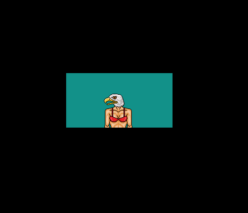

...Even more strange than before, apparently. The music for this was the Uranus
theme.

I switched back to Godzilla to play another level, and this level was quite a
surprise:

It was a normal City level! The colors were gloomy, but even still this was
quite a shock. This was the kind of level I would expect to see in a Godzilla
game, and I was kind of mad that I didn't get to play it earlier. The music was
the Earth theme.

I found it strange that a level fitting a Godzilla game would show up this late.
But there's no point crying over split milk, I suppose.

I moved Solomon over to a gray-ish green icon, which turned out to be a giant
high-tech Laboratory of some sort:

Lots of mechanical drones in this level, but Solomon cleared through them just
like the White Temple enemies. The music was a gritty, industrial beat. There
was also a strange, flying cyborg enemy, which was annoying because it would fly
away when you jumped to attack it.

Also of interest were these large stasis tanks, holding some kind of monster
inside. As you would guess, sometimes the monsters awaken and shatter through
the glass.

I tried to get past the stasis tanks as fast as possible, because the monsters
inside proved to be vicious little bastards upon release.

At the end of the level was an elevator, which I used to go down to the bottom
the level where the exit was. Along the way, I was shot at by security drones. I
couldn't leave the elevator, so my only defense was the heat beam.

The last level type was this simple thing that I call the "Heart Temple", for
obvious reasons:

Nothing but a big hallway, filled with floating enemies shaped like human
hearts. They're incapable of causing you damage, so what you do is run through
the level smashing as many as you can to get all the power-ups. One run through
these levels would get the life meter back up to full, and I would greatly
appreciate these levels later.

The Heart Temple's music reminded me of a circus tune, had an overly cheerful
sound to it which gave the level a really weird feeling.

Having seen all the level types, I chose to fight Gorosaurus using Solomon.

The music for this fight was Gezora's theme. It was during this fight I realized
that Solomon is overpowered: a single well aimed slash can take down as many as
four of the enemy's life bars.

Due to this, the fight was over very quickly. Gorosaurus had no projectile
attacks, or anything else that could match Solomon's deadly claws. But I kept
the fight going just long enough to see if Gorosaurus would use his iconic
"Kangaroo Kick", and I was greatly pleased when he did:

Even though I knew Solomon was my fighting ace, I used Godzilla to battle
Kumonga, just for variety. I briefly considered using Mothra, but of course
Godzilla won out.

Kumonga was also a simple opponent, no heat beams or anything. He attacks by
jumping on you, stabbing with his mandibles, and also uses his signature webbing
stream to paralyze you. Once you get webbed, Kumonga will sometimes take the
opportunity to attack, but it's mostly a way to buy some time, like Gezora
backing you in the corner until the time runs out. His music was Hedorah's
theme.

With Gorosaurus and Kumonga defeated I was at the end of Extus. Before I fought
Not-Ghidorah, there was something I had to do.

I wasn't expecting much from it, but for documentation's sake I took a look at
the other TV Screen. This is what it was:

I don't think there ever was much reason behind the Tv Screens. If I were to
guess, I'd say its some random, uncontrolled manifestation of the cartridge's
abilities. Or maybe all this makes perfect sense to the "game". Who knows.
Anyway, Mr. Faucet's theme was the Saturn music.

It was time for the opponent I had been dreading: Not-Ghidorah. Although I had
gained courage with Solomon's combat advantages, I was still nervous. And when I
started the fight, I was immediately confused:

My opponent was Not-Gezora. I defeated the imposter with a few strikes, and then
Not-Moguera appeared. The it made sense; In order to get to Not-Ghidorah, I had
to battle all the previous Replacements first.

And battle them I did.

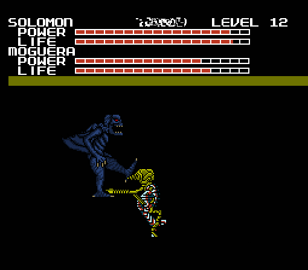

I tore my way through them until I finally made it to Not-Ghidorah who was... a
Dorat.

Once I stopped laughing, I destroyed him with only two slashes. The music
stopped, and I thought I was going back to the board. But the battle wasn't over
yet.

The real fight was against the Chimera, a monstrous hybrid of all the
Replacement beasts. This was by far the most difficult boss yet, every attack of
his would cut down whole life bars per use, while attacks against him were
greatly weakened. Solomon's slash for example, was now lucky to take away one
half a life bar.

During this battle I gained a great appreciation for two things: The Boss Fight
Time Limit, and the Heart Temple. Had it not been for those things, I might
never have beaten this boss.

To take down this behemoth, I came up with a strategy. I would switch between
Godzilla and Solomon, as one began to get dangerously low on health, I would
take him through the Heart Temple, while fighting Chimera with the other. I
should count my blessings that Chimera couldn't regain lost health.

A very interesting thing about Chimera was that the colored sections on his body
corresponded to his different body parts, so each body part effectively had its
own life meter. The head was invincible as long as the other parts were present,
and would always be the last part to be destroyed.

In addition to being difficult, it was also the longest fight so far. I tried to
remember how many times I got taken out of the fight by the timer, but I lost
count around thirteen.

Eventually I had destroyed all components but the head, which now flew around on
its own at an incredible speed.

Chimera fought well, but I was extremely determined and once he was reduced to a
head, he no longer had the power to defeat Solomon, and I heat beamed him into
oblivion.

And then Chimera was no more. I was exhausted after that drawn out fight, and
worried that might affect my performance in the End-World chase level.

The Headquarters icon was replaced, but not by the Hell Beast Face. Instead, it
was a crucifix.

I was completely stunned. I wasn't excited about seeing the Hell Beast icon
again, but if there was only one good thing about those levels, it's that they
were predictable. I had a basic idea of what to expect.

But now, here I was at the end and the icon was completely different. What did
it mean? And why a crucifix? It made me very uneasy.

I attempted to start the level with Solomon, but couldn't. I got this notice
that simply stated "SOLOMON CAN'T ENTER HERE".

It didn't say why. But I think maybe it has to do with Solomon's demonic
appearance. Since Solomon was out of the question, I went with Godzilla instead.

Once I saw the level, the crucifix made sense---the level was a graveyard.

I was still on edge, thinking this was some kind of trick. The last level had
always involved running from the demonic beast, and I wasn't going to be fooled
into thinking this would be any different.

So I started out running, but after a minute without interruption, I slowed
down. It was during this time that the music caught my attention. I knew it
sounded familiar when I first heard it, but it took a while before I realized
what it was---An 8-bit rendition of *Prayer For Peace*, from the first Godzilla
film. A very sad, powerful song, even in this form.

At two minutes into the level, I encountered something that I wasn't sure how to
react to:

My first instinct was to run, but this blue statue-esque being simply floated in
place. And I felt compelled just to stare at it, for a time.

Since this was a grave, and it was floating over a chapel, I guessed that this
was some kind of Angel, watching over the deceased.

It gave me a strange, but warm feeling. I wouldn't say "happy", but I felt that
I was at peace, somehow. I had never seen this being before, yet it seemed very
familiar to me.

Just as I was going to leave, The Hell Beast appeared, and it's presence warped
the music into a terrifying discordant screeching and transformed the level,
desecrating the tombstones as a new ground appeared, comprised of blood soaked
bodies:

I could feel my heart now beating out of control, I had no chance of escape with
the monster that close! It lunged for the kill, but the Angel got in its way.
The demon roared and started clawing through the Angel's leg, and tears of blood
streamed from its eyes.

I wanted to save the Angel, but there was nothing I could do. I had to honor its
sacrifice and run. And so I ran through the hellish landscape as fast I could.
The beast soon caught up with me, still swallowing the body of the Angel, whose
legs it had torn off.

And this sight made my terror change into anger. I now found myself hating this
horrible monster. There was no doubt in my mind that it was pure evil, and I
wanted it to die.

When I got to the end, I remembered how it responded to my insult in Trance, I
spoke to it and said: "You're going to pay".

This was its response:

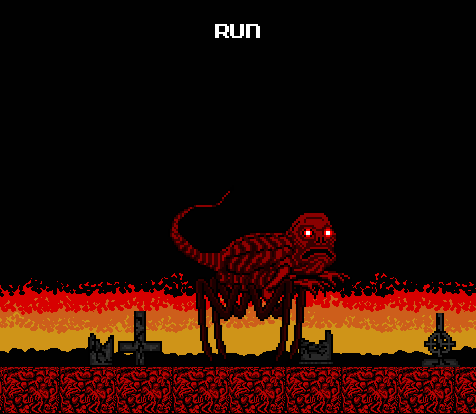

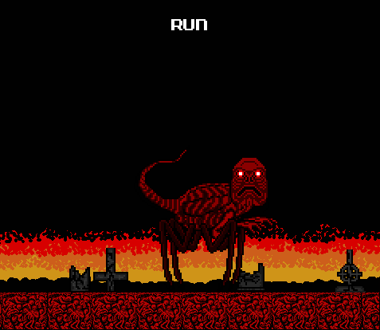

I had no idea how I would follow up on that threat.

And nothing could have prepared me for the horrors of the final world---Zenith.

## Chapter 7: Zenith

And here we are, at the final world. I don't like to discuss this part, and it
still bothers me very much, but it's something I have to do, so that I can put
this behind me. People deserve to know.

At this point I was well aware of the game's unnatural nature, but Zenith was
different than the other worlds. While the others were certainly strange, and
sometimes frightening, the world of Zenith was like a nightmare.

And I didn't have to go any further than the board screen for an indication that
something was wrong with Zenith. The first thing I noticed was the blood red
texture of the board, and the music, which was an eerie whistling tune.

I noticed that I had Solomon and Anguirus back, and I felt better for a second.
Then I scrolled over to the right to see who my enemies would be this time.

This time it was Destoroyah and Ghidorah. But judging from the icon it was a
different Ghidorah than the original, standing on the ground instead of flying.
The grotesquely detailed pinkish red icon also caught my eye. I couldn't tell
what it was supposed to be, and I was afraid to find out.

Going back to my side of the board, I decided there wasn't much choice but to do
my usual "routine", in going to the Quiz level before doing anything else. I was
not ready for what happened.

I jumped back when this appeared, accompanied by a terribly distorted version of
the password theme. It looked as if Face had fallen victim to some terrible
glitch. Is this what he meant by "Will you miss me?" Did he know this would
happen?

My thoughts were stopped short as I noticed the screen was glitching and
seemingly falling apart while I was inactive, and so I quickly rushed out.

And when I got back to the board, I had somehow gained a new monster. I hadn't
even been asked if I wanted one. I tried to select it, and this happened:

"WHAT THE HELL IS GOING ON?!"

The game's behavior was scaring me, and I hadn't even started the levels yet. I
couldn't understand why I was randomly given a new character, and then denied
use of it. But for the time being there was little that could be done, and I
viewed the last TV Screen:

No animation. No music. Dead.

Every instinct I had was telling me to stop playing, to just turn the game off.
And something in the game itself might have been trying to warn me as to just
how horrible this last world was.

But then, every stretch of the way I was compelled to give up. I couldn't do
that now, on the last world! Besides, after taunting me with memories of
Melissa, I felt the game owed me some answers.

I noticed that the first level was a Red Temple, so at least I would be familiar
with the level graphics if nothing else. And I went in with Godzilla, the
monster I was most familiar with.

Godzilla had been shrunk, the level and score meters had vanished, and the Blue
Temple statue faces were back. The music was similar to the Blue Temple also:
Strange, haunting vocalizations. I tried to get my spirits up by thinking "Well,
If this level is like the Blue Temple, then that might mean there are no enemies
to deal with."

How wrong I was.

After a short walk, all the statue's eyes starting glowing, and a pack of the
beasts from Shadow Labyrinth came charging into me. Since they were coming from
the right of the screen, I had to fight my way through them.

This battle greatly tested my reflexes, but thanks to my speed I plowed through
the beasts. They gave off health power-ups after dying, which helped recover the
damage they had given me.

However, as I continued through the hallway, the statue's eyes glowed again,
summoning another wave. It seemed to be the same number of them, but I was less
prepared this time, and took more damage. I had gone through four of these waves
until I reached the end of the hall, where I heat beamed the last of the
monsters over the edge into an abyss.

At first it seemed I had reached a dead end, but after the statue's eyes stopped
glowing, a brick path slowly appeared before me.

I followed the path, which kept me moving towards the right until it stopped at
a wall, where I was to go vertically by jumping up ledges. Along the way I
encountered new creatures, and some sort of strange shrine, which had a statue
of the Hell beast and some other creature I don't recognize.

As I went through, the path took a downward direction. I had to carefully aim my
jumps to avoid the enemies, which were plentiful in this part of the stage. They
didn't have many attacks, but they could easily shove you over the edge off a
platform.

At the end of this tunnel, there were a few small platforms floating above
nothingness. I landed on one towards the left of the screen, and then something
came down from above. It looked like the Blue Angel from the Graveyard, except
now it was red and had a skull face.

Any of the pleasant feelings I had from the Blue Angel were not present with
this Red one, and as it hovered around, its eye sockets started glowing just
like the statues, summoning monsters to attack me. Surely this was not the same
benevolent being I encountered before, this must be some kind of impostor.

The battle was nerve-wracking, as I started off with nearly half my health and
had to deal with multiple opponents, as well as the threat of gravity. To make
things even worse, as the Red Angel took damage some of the panels fell, until
only 3 remained.

But my luck had not ran out yet, just when I thought it was over, I struck the
Red Angel one more time, and it turned out that one last hit was all it could
take.

Just as the Red Angel completely disintegrated, the game instantly went back to
the Zenith board. I moved Mothra over to the nearest stage from the Red Temple,
which seemed be a garbled mess of letters spelling KILL, and began playing.

As suspected, all the level graphics were made of jumbled letters. And Mothra,
just like Godzilla, was shrunk to half size. I began to suspect that all the
Zenith levels would be like this.

The background music was terrible, like if someone put all the sounds an NES was
capable of making into a blender and then piecing them back together into a
"song". I had to turn the volume down because of it.

Playing as Mothra made avoiding the enemies easier, but they were nonetheless
determined to get at me. The first enemies I saw were headless Gigans, and later
on there were hybrids monsters pieced together from previous bosses, like the
Biollante headed thing seen above.

Five minutes had gone by as I didn't see anything new, and the level shifted
into another segment. The music changed from the loud and annoying beeps into
something far more ambient and menacing. The level graphics also changed, now
looking a blood drenched junkyard. The way everything in this level was red made
it sickening to look at.

The enemies multiplied in number, never ceasing to follow after me, and became
harder and harder to avoid. And at the end of the level, the situation reached a
climax, as the swarms of monsters fused together in one enormous, terrifying
hybrid:

Once I had gotten through the initial shock, I discovered the way to destroy
this thing: constantly shooting eye beams at the Hedorah cluster that formed its
"heads". If you attacked anywhere else, it would regenerate the damage.

Even with that knowledge, this was an extremely difficult fight. I'd say it was
as hard as fighting the Moon Beast was, if not harder. Its most common attack
was lunging forward with its arms, covered with Gigan saws and blades, if they
touched it would instantly drain health.

When it was over, the remaining monsters collapsed into a heap. Then they, and
the ground below them, started to disintegrate and sink towards the bottom of
the screen.

When I came back to the board, I thought to myself, "So far, the game has been
putting the easiest levels first... if that's the case, how bad will the rest of
Zenith be?"

With two levels down and three to go, my monsters and I had taken our foothold
in the world of nightmares that was Zenith.

Deciding what action to take next was more tense and difficult than ever before.
But ultimately, I had no way of knowing what the next levels would be like, or
how well my monsters would be prepared for them, so my only option was to guess.

I tried to to interpret what the icons of the next levels ahead of me were. The
last level before the boss battles was obviously representing some type of
volcanic area, with lava and open flames.

The middle icon I still didn't get, except that it looked "fleshy", and vaguely
like an organ of some kind. Oddly oversized as well.

The one I was nearest to, and about to enter next, looked like thorny vines
covering a puddle of blood. I guessed this would be a level with blood "rivers",
like the chase level of Dementia. As such, I went with Anguirus, because due to
his rolling move he would have the fastest speed while submerged.

The level which I call "Blood Lake" looked like I expected. Rivers of blood
accompanied by thorn covered vines, which were scattered along the sides of the
ground. The music was rather faint, but I could hear a distinct drum beat, and a
few other instruments. a lot of echoes, and sometimes it sounded like someone
was hitting a drum underwater.

I was disappointed to see that Anguirus was shrunk just as Godzilla and Mothra
had been, apparently all the Zenith levels would be like this. I felt less
secure with my giant monsters no longer so giant.

I walked along without interruption for only a minute until my path reached a
dead end.

There was a massive gap between the ground I was walking on and the ground to
the right of the screen. I would have swam across it and continued walking to
the right, but due to the huge mass of brambles in the way, there was nowhere to
go.

Two creatures with gliding membranes on their arms, and lamprey like mouths were
perched on outstretched vines and screeching at me, much like a crow does to an
invader of its territory. Another unnerving display of possible sentience by the
creatures of this game. If it's even accurate to refer to them as being "of the
game", that is.

I descended into the blood, slowly sinking to the floor. Aquatic enemies were
everywhere, and they were hard to avoid. The black shark in particular was very
aggressive and hard to deal with, but thankfully I only encountered one.

As the scene become more and more crowded, I swam up to the surface, to find
that it was littered with floating corpses.

"Creepy, but at least they're not a threat." Or so I thought...

...Until they all sprang to life and leaped on me! They were trying to pull me
under, and they were draining my health as they did it. They all attacked as a
group, and when I got one off me, another would jump on me from behind. I had to
curl up into a ball and roll for them to loosen their grip, and when they did I
quickly retreated. 

It wasn't long before I had reached another land path. A note regarding the brambles,
you can stand on them but it causes pain, and you can also destroy some of the vines,
but only the thinner ones. I had to destroy multiple vines, as well as dealing with
more enemies.

I was interrupted by a screen:

The screen was only up for about thirty seconds, then when it went back to the
level, I was facing another dead end, and a pregnant humanoid creature being
hanged from the top right of the screen, by a spine/umbilical cord.

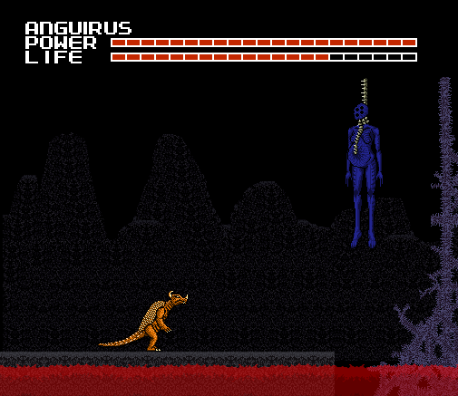

Instantly, the creature's belly was split open from the inside!

And as the lower part of its body was ripped apart and fell into the river
below, the Blood Lakes boss was revealed;

It came flying towards me, making a shrill, hacking scream. I was forced to move
back.

The bat was a highly mobile boss, fast and difficult to hit. As I moved back
along the ground , the monster opened its mouth and shout out a barrage of
needles. I jumped over them and managed to give it a blow to the head, and it
started flying out of my reach.

As the bat was flying, it shot a stream of fire from its eye sockets, and
started trying to hit me with the flames. I rolled along the ground, which
drained my power, but put us at equal speed.

"Now, only two levels left to go. Who to send this time?" Godzilla, Mothra, and
Anguirus had all completed one level, leaving Solomon. And also, the mysterious
fifth monster. I tried again to access it, but with no luck. I chose to use
Godzilla again for the next level, and Solomon for the final one.

The second to last level was what I refer to as the "Organic Level", which was
the most visually unpleasant of them all.

Right from the start I could see that the graphics where freakishly different.
The atmosphere was gruesome and foreboding, with the addition of the loud,
droning music. I was dreading what I would see in these levels, and it was only
a few seconds before something appeared:

Two hideous... things. It's hard to describe most of this level. Everything had
this disturbing "semi-real" look to it. Most of the enemies look halfway between
real animals, and misshapen lumps of gore with teeth.

It's also worth noting that all of them were considerably larger than Godzilla,
and although the majority were not very intelligent, each of them took around
30+ hits to kill. Due to this, it was a better idea to run away from them than
fight, but it was never clear exactly what direction to run to.

While most levels involved going to the right to get to the exit, the path of
this level was primarily going down, by walking to the edge of one platform and
jumping down to a lower one. There was no way to make sure you were going the
right way, nor any apparent means of getting back up to the higher platforms if
necessary.

Also, certain enemies acted as if they were aware you had to jump down, and
would stand at the edge of a lower platform, waiting for you. When this
happened, I would have to walk back and wait until the monster would leave.

As I went on I came across platforms stacked above each other with little space
in between, looking like a maze. This meant that I couldn't jump, and it made
escape from enemies difficult. Thankfully, the only enemies able to fit through
these mazes were the four-legged beasts seen at the beginning of the level.

Adding to the difficulty were long, tapeworm-esque monsters, that would rise
themselves up between the platforms and trap you. The only attack they responded
to was the heat beam, which would cause them to shrink back down. But this was
costing even more power, and I couldn't afford to do without the heat beam for
long.

While trying to avoid the abominations that dwell in this level, I found out
that if you stand idle in one place for too long, the ground tries to absorb
your monster;

I think it was about four minutes before the end that this level was making me
physically sick. The tension was getting to me, and having to take in all these
disgusting sights made me want to puke. I nearly did pause the game and look for
a bag, but I was able to hold it together.

I also found a trick at the end of the level, though it was too late to do me
any real good. If two different species of monster to run into each other
face-to-face, they would fight each other and leave me alone. I didn't
intentionally cause this, it just happened:

Finally at the end, it was time for another boss fight. It was certainly ugly,
but not quite as horrific as I feared it would be. But more important than
dealing with its appearance was defeating it, and since I had less than half my
health bar to start with, there was no room for errors.

It was attached to the floor when I first saw it, but after ten hits it detached
from the floor and began floating. It moved fast, and unlike the Blood Lakes
boss he wasn't impeded by any sort of gravity. It was even able to fly through
the ground without any collision effect.

It used this to its advantage, and would float beneath the ground and spring up
randomly to bite at you. But it stopped doing this after a few well aimed kicks
to the face. The pink area on its upper jaw was a weak point, too many hits
there would cause it to spasm uncontrollably.

The new strategy was to rapidly float up down while moving back and forth across
the stage, trying to constantly keep its jaws aimed towards me. Health was
getting critical at this point, and I spammed the heat beam, from which it had
no defense.

In the last stretch of the battle, the monster had lost its mind, rapidly
rushing back and forth and gnashing its jaws. I had to duck under it, and then
strike when its back was turned. Twenty more hits, and it was destroyed.

"One last level to go..." 

And then it was down to one last level. I didn't hesitate, I selected Solomon
and entered. Perhaps a little too fast.

This last level was definitely the peak of disconnect between what the NES was
graphically capable of, and what this game could create. The music also caught
my attention, it was one of the only songs that appeared more than once---the
horrible screeching from when the Hellbeast appeared in the graveyard.

As soon I started, there was already an enemy prepared to attack, a centaur
wielding a whip. And it wasn't alone.

When I started fighting, several more centaurs appeared. Coming from both sides
at the screen at the same time, it was too much to handle. Solomon's flight
saved me from taking too much damage at the start of the level. The centaurs
followed after, but seemed to be unable to jump.

After escaping the centaurs I noticed gaps in the ground. While trying to avoid
the jumping sword mouthed enemies in mid-flight I got close to the surface of
the lava, and a creature emerged and tried to grab me. It didn't succeed, but I
was startled. Careful maneuvering would be needed to avoid instant death here.

As new enemies appeared,the level soon became very difficult. A lot of the
trouble came from stocky red demons that stood on top of tall, narrow mountains
and spewed fire. I got by them by waiting till their back was turned, and
hitting them with a flying kick, which made them fall into the lava. It was at
this time I noticed that I wasn't gaining any health from killing enemies.

Not all the ground was stable. At one point, the ground was reduced to small
chunks that slowly drifted towards the right. Some of them would sink into the
lava upon landing on them, and there was no way to tell which ones would sink
and which would not. Being so close to the lava added the threat of the lava
creatures, and this was very frustrating.

I was also feeling very hot, which made concentrating hard. If you've ever had a
heat rash, it felt similar to that. I had periodically stop for water because of
it. This was almost certainly due to the game, and not my imagination, but I
kept pushing the thought out of my head. I didn't want to think about it.

At the end of the stage, I encountered the boss rising from the lava, its
arrival noted with a ungodly howling roar:

When it walked onto the land, I saw how gigantic it was, several times the size
of Solomon. I was about to fly up and attack it, when it opened its mouth and
let out a huge blast of fire:

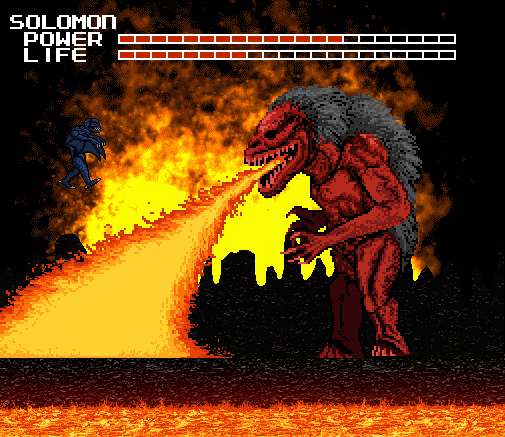

I had to fly to dodge the flames, and then get close enough to the boss to fire
a heat beam at its face, causing it to stumble backward. If it didn't stumble
backwards, it would have kept moving left until it forced Solomon into the lava,
as there was no more ground within reach.

The beast had to wait between uses of its fire breath, as it seemed to cost a
great deal of energy. I used this time to attack it. But fire wasn't its only
weapon, and I had to wary of the monster swatting at me with its clawed hands.
As its health decreased, it moved faster,and the battle felt like a tug of war
between the two monsters over this bridge of land.

After about forty hits, it was defeated, tumbling backwards into the lava from
whence it came. And then, the final stage had been completed.

At last it was down to two bosses, and a final encounter with the Hellbeast. For
some reason I thought Ghidorah would be easier to beat, so I confronted him
first.

The classic "Ghidorah Battle" music from the original started up as I was faced
against the new King Ghidorah;

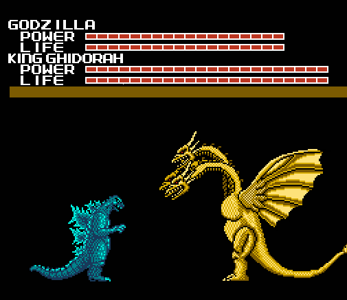

King Ghidorah was as powerful and unrelenting as ever. He instantly lashed out
with Gravity Beams, which were more damaging than Godzilla's heat beam. It
became a struggle of constantly beating Ghidorah at every oppoortunity to keep
him from using the attack.

But Ghidorah soon saw through my tactic and started using physical attacks as
well. He would strike with each of his necks, knocking me backward and making it
impossible to get close enough to punch him. But I had an idea, to wait for him
to lunge with one of his heads, and immediately blast it with the heat beam:

It worked, and to my surprise the heat beam had actually obliterated Ghidorah's
middle head. It was only a few seconds before I realized what this would lead
to, and sure enough...

...King Ghidorah was using the power of the glitch to transform into Mecha King
Ghidorah. But what really shocked me was the sudden change of music. I had heard
it before, but it wasn't from the original NES game---It was from the game Super
Godzilla, during the Mecha King Ghidorah fight.

Mecha King Ghidorah's first attack was its most deadly: The Machine Hand. Very
similar to Gigan's Saw, it immobilizes the monster and rapidly drains the health
bar. Fortunately, before Ghidorah could do a lot of damage, the timer ran out.

I would need to defeat Mecha King Ghidorah quickly to prevent him from using the
Machine Hand, so I sent Solomon to fight him. The two monsters were evenly
matched in strength.

But Solomon was faster, and by slashing and heat beaming without pause, the
cyborg monster soon met its end.

With Ghidorah defeated, I was returned to the board. I now outnumbered the enemy
by four monsters to one, and victory seemed to be soon at hand. The Base Icon
had changed to a blood red color. I could feel hatred emanating from it.

I started the fight against Destoroyah with Anguirus, and the music was the same
as Ghidorah's. When the fight began, Destoroyah was in Microscopic form. After
one hit it changed into the Juvenile, which had few attacks and was also dealt
with easily.

The fight became serious once Destoroyah entered the Aggregate Form, gaining the
use of large arms and the micro-oxygen beam.

Anguirus' roll attack, which had been very useful up until now, was rendered
useless by Destoroyah constantly attacking me with his large arms when I tried
to use it. For this part of the fight I had to rely on brute strength.

Just before the time ran out, Destoroyah had changed into his Flying form, which
Anguirus was ill-suited to fight against. Going back in,I fought against the
flying form with Mothra (which seemed fitting).

Mothra was weaker than Anguirus, but was much better equipped to dodge and counter
Flying Destoroyah's attacks, so the fight was in my favor. However, the Mecha
Ghidorah fight music started playing and Destoroyah changed into his Final form
sooner than expected, which drastically turned the tables.

Mothra's attacks were doing very little to Destoroyah, and I had to move
furiously to avoid damage while waiting for the timer to run out.

Even though it would be near impossible to beat Destoroyah with Mothra, I still
had three other monsters. Final form Destoroyah was very resistant to taking
damage, and the heavily armored foe would not be defeated without a long fight.

In the last part of the fight I wasn't using much strategy, just attacking as
brutally and as fast as I could.

On its last bar of health Destoroyah tried one last counter-attack---a beam of
energy from its chest.

I don't know how powerful it would have been, because just before it could fire
I punched Destoroyah in the chest cavity, destroying him!

And then that was it---the last kaiju boss was gone. In the midst of all the
excitement, I had briefly forgotten that there was still one last thing to do
before the game would be over.

Seeing the icon again hit me like a ton of bricks, and I froze for a few minutes.
I had come so far to get to this point. But I was terrified. I really did not
want to know what this last encounter was going to be like. 

Before I could let myself think about it any longer, I moved Godzilla over and
began the stage. "You're here now. This is the end. Just one last thing, and
then it's all over."

And when the screen changed, there was...

...Nothing.

Just Godzilla and a black screen. I walked back and forth. Fired a heat beam.
Nothing happened, until I heard something---the faint sound of a familiar drum
beat.

...

## Chapter 8: Finale

"Oh dear god."

That was my first thought on realizing I would have to fight "Red", the creature
that tormented me through nearly the whole game. How would I be able to fight
something that can kill with one touch? It seemed totally impossible.

Thankfully, Red was no longer able to deliver one hit kills. But despite that,
this was still the most difficult battle I've ever faced, in this game or
otherwise. If I had any real comprehension of what I was getting into before I
started the fight, I would never have done it.

I very soon learned what a horrible mistake I had made. Red reached out and
clawed at Godzilla. And when those claws cut through him, I felt it.

I know that it's common for people to cringe up when their video game character
gets hit or loses a life. But this was not that. This was genuine, physical
pain.

When the pain struck me I paused the game. I hadn't suffered any actual
injuries, but it felt just like my shoulder had been clawed through. I had seen
and experienced many unpleasant things at this point, but the game causing me
real pain was where I drew the line. Yes, I would be disappointed that I
wouldn't get to see the ending, but the risk was no longer worth it. I was about
to get up to take one last screenshot and turn off the NES, when I realized
something else---

---I couldn't get up.

I was paralyzed to my seat. The only muscles I could move were my fingers and
thumbs. As the terror set in, a new message appeared on the screen.

I started to scream, but only a weak choking sound was coming out. I desperately
tried to get my body to move, but it did nothing. I was looking every direction,
and then I looked over at the computer.

Somehow, the computer was taking screenshots of the game on its own when I began
the fight. I still don't know how or why. Something in the game must have been
causing it.

Since Red could hear what I was saying, I tried begging for him to let me go.
From here things start to get hazy as I was under extreme stress at the time,
but from what I can remember I said:

"I'm sorry. I'm sorry I insulted you. I didn't mean it. I didn't know things
would get this serious. Please just let me go. If you let me go I promise I will
never tell anyone or turn the game on ever again. PLEASE!"

And Red replied:

"Only one will survive."

The statement could not be any more clear. If I couldn't kill Red, then he would
kill ME. Like an idiot I had played around with something I didn't understand,
and now it might cost me my life.

I stopped struggling to move and accepted the reality of the situation. There
was only one way to get out of this alive. I had to kill Red.

It all went by so fast. If it weren't for the screenshots, I might not have
remembered any of this. Just like in the chase levels, Red moved at a
horrifyingly fast speed. There was barely enough time to process a thought.

And thus, there was no time to form a strategy. I had to rely solely on my wits
and reflexes. To make things worse, there was no way to predict what kind of
attacks Red might use, so I constantly had to be on the offensive AND defensive.

I felt every hit that Godzilla took. They all hurt. I tried so hard to avoid the
damage, but every attack that I dodged left me vulnerable to another. And the
pain would only get worse.

After he jumped over me, Red's eyes started to glow. I moved as far back as I
could and ducked, but there was no dodging this one:

When THIS hit me, I really did scream. I screamed so loud that someone else in
the apartment should have heard me, but they didn't. Just looking at the image
hurts me, making me remember the incinerating burn.

I paused the game because it hurt so bad, but Red unpaused the game to attack me
again, which made me furious.

I immediately counterattacked with the heat beam, again and again until the
power meter was totally diminished. I wanted Red to hurt like I did.

Just before the timer ran out, Red transitioned into his swimming form. I didn't
think the timer would still be affecting a battle like this. I'm thankful for
it, because it gave me a few minutes to collect my thoughts and decide what to
do next.

I chose to fight Red's next 2 forms with the monsters I had encountered them
with, so Anguirus was next. It probably wasn't all that smart of an idea, but
it's what I did.

I jumped up and heat beamed Red in the face, and he moved offscreen where I
couldn't reach him. Then a wave of large mines started to fall from above.

I felt this was unfair so I shouted:

"If you're going to cheat, then why do you even let me use the controller?!"

And then he came at me, rushing from the top left of the screen downwards:

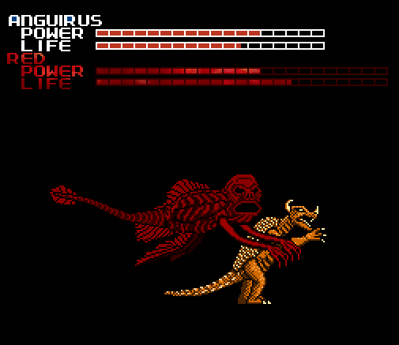

"DAMN IT!" Now I wouldn't even be able to see where his next attack was coming
from. Red continued to strike from random angles, I constantly moved to swerve
around him.

Another forty seconds went by and Anguirus was nearly gone, but together we had
forced Red into his flying form, so it was Mothra's turn next.

Deciding to fight Red with Mothra was a terrible idea. Mothra was instantly
overwhelmed by Red, and the life meter was devastated in a mere fifteen seconds.

And once Mothra's life was down to two bars, Red did something I didn't see
coming:

He reached out, grabbed Mothra, and ate her.

After Mothra was devoured I felt an agonizing pain, like being crushed to death.
Mothra had been killed for my stupidity and I would share the pain. It was a
short transition from the battle to the board, but it felt like an hour.

The pain, combined with being unable to move was driving me insane. I wanted so
badly for this to end. I never wanted anything so much.

But I still had hope. There was only one monster left that could be brought to
full health by engaging Red in battle. Solomon. If any of them had a chance to
save my life now, it would be him.

Solomon apparently has some history with Red, as when the fight started this
dialogue happened:

Red took me by surprise again by immediately burning me with his demonic fire a
second time:

As much as it hurt, it actually worked to my advantage: since Solomon started at
full life he still had some to spare, but now Red had used up all his energy and
could not use his ultimate weapon any longer. Now he would die.

As he drew close to the end of his life bar, Red turned his whole body to face
the screen and flew upwards, then slamming back down in an attempt to crush
Solomon:

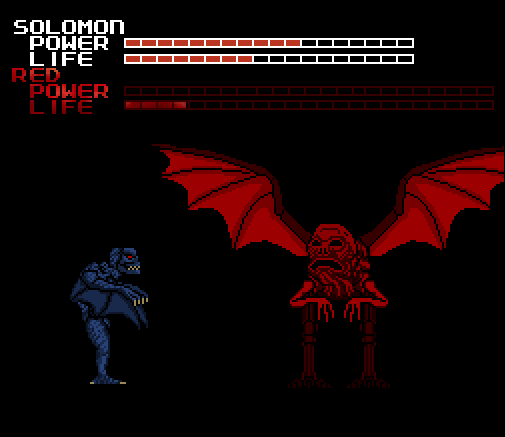

When that failed to work, he tried to devour Solomon like he had Mothra. But he
wouldn't be eating my monster this time:

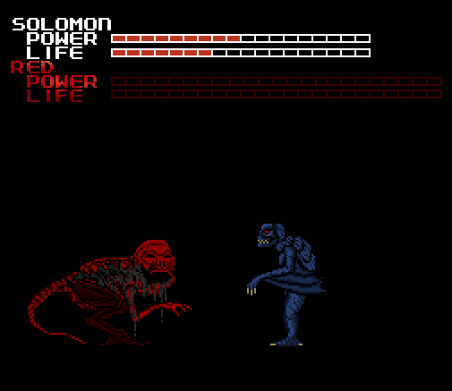

I thought I had won. But something was wrong. Red wasn't sinking to the bottom,
and I still couldn't move. Red was still alive...

After his seeming defeat by Solomon, Red had reconstructed his body into his
gigantic Final Form, transporting us to a blazing inferno in the process. It was
reminiscent of our first encounter. Except now the scenery,much like the true
power of Red, had become very real. The music had erupted into a loud blaring
sound, a furious drum of death.

Faced against Red's insane amount of health, my own demise was imminent.

Solomon was my strongest monster. But not even he stood a chance. It was like
trying to fight a mountain.

Within seconds Solomon was overpowered and dropped to the floor, when Red
crushed him to death underneath his foot. The sadistic demon took his time as he
snapped Solomon's vertebrae and ribs like dry, brittle twigs. I could tell he
was enjoying our pain.

"This is hopeless. I'm a dead man."

I had to no choice but to send another monster to his death. We were all going
to die. I only hoped they would forgive me.

After decreasing Red's health by a miniscule amount, Anguirus was also
obliterated. Red unleashed a hail of blazing hot needles into his face, until he
collapsed.

Another moment of unspeakable agony, then nothingness as my ally faded away.

I asked Red how he knew my name.

And then, he said it.

For years she was being tortured by something nobody understood. Now I knew what
it was.

Now I understood why I was mocked about Melissa's death, and how the game knew
about it. Because HE knew about it, because HE was the one responsible. And this
time, he was going to kill me.

I was taken back to the board to send Godzilla to his final stand. Barely
anything was left of the board, just Godzilla and Red's icons, and...

...the fifth monster.

In the midst of everything that was happening, I had completely forgotten about
it. I tried yet again to select it. I cursed, I begged,I screamed at it to do
something, ANYTHING to help me. To no avail.

There was only one thing to do.

I knew Godzilla didn't stand any more of a chance than the rest did. But maybe,
maybe now that all the other monsters were gone, the fifth monster might finally
awaken.

I knew Godzilla didn't stand any more of a chance than the rest did. But maybe,
maybe now that all the other monsters were gone, the fifth monster might finally
awaken.

It was then that Red decided he was done playing fair, and before I could
activate the monster, he went for the killing blow: paralyzing my heart. 

My hands started to become numb and unfeeling, but even as my vision was fading
away, I still tried to pressed the A button.

Red surely was breaking one of his rules, but he must have thought that if he
could kill me quickly, then it would be too late for any consequences to matter,
he would have won.

He was wrong.

Red's power was being challenged by another force. It prevented him from killing
me, and when I regained my vision I saw a familiar sight:

"...Who are you?"

"What? How is that possible! I... Red told me that he killed you..."

"But how will I be able to stop him now?"

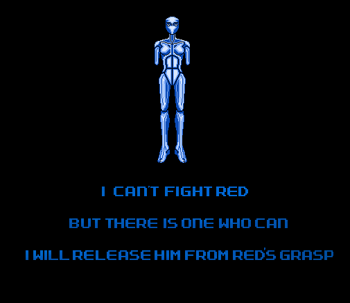

Her words stirred something inside of me. I wasn't going to die like this. And I
had more to fight her for than just my own life, I had to fight to save Melissa,
and the world she inhabits.

With her help, the 5th monster was finally unleashed:

It was time to end this, once and for all. Together, we would take this damned
hellspawn out of existence.

Acacius was by far the strongest playable monster in the game. He had to be, if
we were to have any chance of surviving. His "punch" involved turning his hands
into blades, which caused tremendous damage. But Red had more than enough life
to spare. In the end, this would come down to pure skill:

With one final strike, Red was destroyed. His body disintegrated and sank below,
accompanied by a soar of triumphant music. Slowly, the paralysis wore off, and I
was able to stand up again!

We had done it. Melissa's death had been avenged, and I felt overwhelming
happiness... until I remembered all the death and pain that led up to this point.
All the other monsters who had fought and died. I was about to mourn them, but
the game had yet to conclude.

Tears of joy streamed down my face, and I broke out crying. I cried harder than
I have in several years, maybe in whole life. All I had been through, all I had
discovered, and now the game was coming to an end. But before she and the others
left, Melissa had something to tell me:

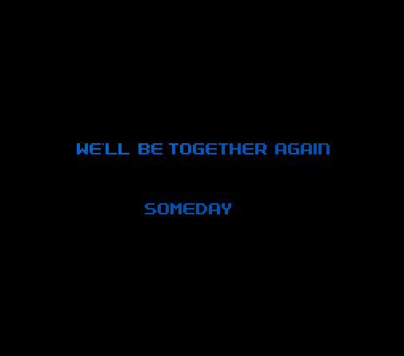

## Epilogue

I am Zachary, and at the time I write this, it has been three weeks since the
fateful night when I played the NES Godzilla game.

Going back to that night, to immediately after I turned off the NES. Once I was
able to start walking around again, the first thing I did was unplug the NES,
take out the cartridge, and put them in separate sock drawers.

I looked over at the computer. All the screenshots you've seen in the story were
saved. I backed up all the images on a flash drive before I turned the computer
off, just in case. After that, I hit the bed and instantly passed out. It was
not a restful sleep, but one of complete exhaustion. It felt like no time has
passed before I awoke again.

And what a day that was. The first thought I recall coming to mind was "...What
the hell happened last night?" I thought about it for a short while, until it
occurred to me to contact the person I got the game from to begin with, Billy.
So I called him up, and told him to just come over to my apartment, which he
did.

And I showed him the screenshots, and gave him a very basic summary of what had
happened. At first he thought I was pulling a joke on him, but he soon realized
that was not the case. Once it hit him that this was real, he was speechless. He
made it clear that he had absolutely not tampered with the game, and had no idea
about any of this.

So then the obvious question was asked to Billy; "Where did YOU get it from?" I
got the simple answer of "Another friend of mine that I trade games with." He
assured me that this was a trustworthy person, and he had never had any issues
with games he got from him before. So then Billy called him. But when we told
this guy the story, he was as shocked and surprised as anyone, except he
abruptly hung up on us. This clearly was going nowhere.

Before Billy left that day, he asked me if I wanted him to take the cartridge
and dispose of it. I sharply declined. He asked how I could possibly still want
to keep the thing. I told him that I needed time to think it over, and that was
that. Billy and I haven't talked much since. Even though I've told him this
isn't the case, I get the impression that Billy thinks what happened with the
game is his fault.

After he left that day, I did a lot of thinking.

It was very hard for me to do anything else, really. I couldn't stop thinking
about the game, there were so many questions left unanswered. What WAS Red? Was
Melissa really in the game? How did she get there? Why did all this happen with
THIS game?

But the one question that kept me for many nights was:

"Red said he had 'known me for a long time'. How?"

Ever since then, I can't shake this feeling of being watched.

The game made me ask myself questions about death and reality in ways that I
never wanted to think about. I'm not too sure of anything anymore. Constantly
thinking about it soon began to have a negative impact on my life. I just didn't
care about anything else at this point. By comparison, all the other day-to-day
activities seemed utterly pointless.

I eventually decided that I had to choose between one of two things: Try to play
the game again, or destroy it. I tried several times to convince myself to try
the former, but I never got farther than plugging the NES back up. Just touching
the cartridge made me remember all the pain I felt during the fight with Red.

I wondered if perhaps playing the game again myself might cause something
terrible to happen. I didn't know anything about how this "game" worked, and it
was too risky. I wasn't sure I could stand another round of the game anyway.

So then it was time for the other option. Wanting to get some fresh air, I took
the game with me and drove to the lake, planning to throw it in. I got up to the
lake with the cartridge in my hands, and I look down on it and... I thought of
Melissa. If what I had experienced in the game was indeed genuine, doing what I
did may have been the only way to save her from endless torture. In a way, this
warped game might have saved her soul.

Damn it. Once that thought came into my head, I knew then I wouldn't be able to
destroy it. So I just sat down at a bench, gazing at the lake for about an hour.
Ultimately, I decided on a third option: selling the game on EBay.

It may be selfish, but I promise you that it has nothing to do with money. I
don't care how much or little I get paid for this game, believe me. It's selfish
because I don't want the responsibility of owning this cartridge anymore. I
cannot dwell on this forever, and the only way I can deal with this, is by
putting the game out of my life.

So this brings me to the main reasons I created a summary of these events; first
is to record the details while I can remember them, and second is that whoever
bids on this game knows what they're getting into. I can't guarantee the safety
of anyone else who plays the game, or that anything will happen at all. But to
the new owner of the gamer, remember this; Be careful, and if you feel as if the
game is literally messing with your mind, SHUT THE DAMN THING OFF.
