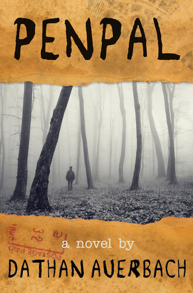

<section>

After garnering considerable fanfare on r/nosleep Dathan Auerbach, the author, has released an amazing full-length revision of *Penpal*. Consider [purchasing a copy](https://1000vultures.com/penpal) to support his work.

[<figure></figure>](https://1000vultures.com/penpal)

</section>

## Footsteps

<section>

This is long, so I apologize for that. I've never had to tell this story with enough detail to actually explain it all the way, but it is true and it happened when I was about six years old.

In a quiet room, if you press your ear against a pillow, you can hear your heartbeat. As a kid, the muffled, rhythmic beats sounded like soft footsteps on a carpeted floor, so as a kid, almost every night---just as I was about to drift off to sleep---I would hear these footsteps and I would be ripped back to consciousness, terrified.

For my entire childhood I lived with my mother in a fairly nice neighborhood that was in a transitional phase---people of lower economic means were gradually moving in, and my mother and I were two of these people. We lived in the kind of house you see being transported in two pieces on the interstate, but my mom took good care of it. There were a lot of woods surrounding the neighborhood that I would play in and explore during the day, but at night---as things often do to a kid---they took on a more sinister feeling. This, coupled with the fact that, due to the nature of our house, there was a fairly large crawlspace underneath, filled my mind with imaginary monsters and inescapable scenarios which would consume my thoughts when I was awoken by the footsteps.

I told my mom about the footsteps and she said that I was just imagining things; I persisted enough that she blasted my ears with water from a turkey baster once just to placate me, since I thought that would help. Of course it didn't. Despite all the creepiness and footsteps, the only weird thing that ever happened was that, every now and then, I would wake up on the bottom bunk despite having gone to sleep on the top, but this wasn't really weird since I'd sometimes get up to piss or get something to drink and could remember just going back to sleep on the bottom bunk (I'm an only child so it didn't matter). This would happen once or twice a week, but waking up on the bottom bunk wasn't too terrifying. But one night I didn't wake up on the bottom bunk.

I had heard the footsteps, but was too far gone to be woken up by them, and when I was awoken it wasn't from the sound of footsteps or a nightmare, but because I was cold. Really cold. When I opened my eyes I saw stars. I was in the woods. I sat up immediately and tried to figure out what was going on. I thought I was dreaming, but that didn't seem right, though neither did me being in the woods. There was a deflated pool float right in front of me---one of those ones shaped like a shark. This only added to the surreal feeling, but after a while it seemed like I just wasn't going to wake up because I wasn't asleep. I stood up to orient myself, but I didn't recognize these woods. I played in the woods by my house all the time, so I knew them really well, but if these weren't the same woods then how could I get out? I took a step and felt a shooting pain in my foot, which knocked me back to where I had just been laying. I had stepped on a thorn. By the light of the moon I could see that they were *everywhere*. I looked at my other foot, but it was fine, and as a matter of fact, so was the rest of me. I didn't have another scratch on me and I wasn't even that dirty. I cried for a little bit and then stood back up.

I didn't know which way to go, so I just picked a direction. I resisted the urge to call out since I wasn't sure I wanted to be found by who or what might be out there.

I walked for what seemed like hours.

I tried to walk in a straight line, and tried to course-correct when I had to take detours, but I was a kid and I was afraid. There weren't any howls or screams, and only once did I hear any noise that scared me. It sounded like a crying baby. I think now that it was just a cat, but I panicked. I ran veering in different directions to avoid big thicks of bushes and collapsed trees. And I was paying close attention to where I stepped because by that point my feet were in pretty bad shape. I paid too much attention to where I was stepping and not enough to where those steps were leading because not long after hearing the cry I saw something that filled me with a kind of despair I haven't experienced since. It was the pool float.

I was only ten feet from where I had woken up.

This wasn't magic or some supernatural space-bending. I was lost. Up until that moment I thought more about getting out of the woods than how I got in, but being back at the beginning caused my mind to swim. I wasn't even *sure* that these were my woods; I had only been hoping that they were. Had I run in a huge circle around that spot, or did I just get turned around and start making my way back? *How was I going to get out?* At the time I thought the north star was just the brightest star, and so I looked and found the brightest one and followed it.

Eventually things started to look more familiar and when I saw "the ditch" (a dirt ditch my friends and I would have dirt-clod wars in) I knew I had made it out. By that point I was walking really slowly because my feet hurt so much, but I was so happy to be so close to home that I broke into a light jog. When I actually saw the roof of my house over a neighboring, lower-set house I let out a light sob and ran faster. I just wanted to be home. I had already decided that I wouldn't say anything because I had no idea what I could possibly say. I would get back in the house somehow, clean up, and get in bed. My heart sunk as I rounded the corner and my house came fully into view.

Every light in the house was on.

I knew my mom was up, and I knew I would have to explain (or try to explain) where I had been, and I couldn't even figure out where to start. My run became a jog which became a walk. I saw her silhouette through the blinds, and although I was worried about how to explain things to her, that didn't matter to me at that point. I walked up the couple of steps to the porch and put my hand on the doorknob and turned. Right before I pushed it open, two arms wrapped around me and pulled me back. I screamed as loud as I could: "MOM! HELP ME! PLEASE! MOM!" The feeling of being so close to being safe and then being physically pulled away from it filled me with a kind of dread that is, even after all these years, indescribable.

The door I had been torn away from opened, and a flash of hope shot through my heart. But it wasn't my mom.

It was a man, and he was enormous. I thrashed around and kicked at the shins of the person holding me while also trying to get away from the person who had just come out of my house. I was scared, but I was furious.

"LET ME GO! WHERE IS SHE? WHERE'S MY MOM? WHAT'D YOU DO TO HER!?"

As my throat stung from screaming and I was drawing in another breath I became aware of a sound that had been present for longer than I had perceived it. "Honey, please calm down. I've got you." It sounded like my mom.

The arms loosened and set me down, and as a man approaching me blocked out the porch light with his head I noticed his clothes. He was a cop. I turned to face the voice behind me and saw that it really was my mom. Everything was ok. I began to cry, and the three of us went inside.

"I'm so glad you're home, Sweetie. I was worried I'd never see you again." By that point she was crying too.

"I'm sorry, I don't know what happened. I just wanted to come home. I'm sorry."

"It's okay, just don't ever do that again. I'm not sure me or my shins could take it..."

A little laughter broke through my sobs and I smiled a bit. "Well I'm sorry for kicking you, but why'd you have to grab me like that?!"

"I was just afraid that you'd run away again."

I was confused. "What do you mean?"

"We found your note on your pillow," she said, and pointed at the piece of paper that the police officer was sliding across the table.

I picked up the note and read it. It was a "running away" letter. It said that I was unhappy and never wanted to see her or any of my friends again. The police officer exchanged a few words with my mom on the porch while I stared at the letter. I didn't remember writing a letter. I didn't remember anything about any of this. But even if I sometimes went to the bathroom at night and didn't remember, or even if I could have gone into the woods on my own, even if all that could have been true, the only thing I knew at that point was,

"This isn't how you spell my name... I didn't write this letter."

</section>
