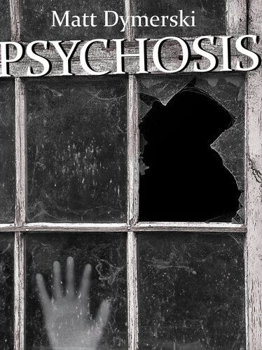


Now apart of Matt Dymerski's collection *Psychosis: Tales of Horror*, [available on Amazon](https://www.amazon.com/Psychosis-Tales-Horror-Matt-Dymerski-ebook/dp/B005DSU784/).


[<figure></figure>](https://www.amazon.com/Psychosis-Tales-Horror-Matt-Dymerski-ebook/dp/B005DSU784/)

### Sunday

I'm not sure why I'm writing this down on paper and not on my computer. I guess
I've just noticed some odd things. It's not that I don’t trust the computer... I
just... need to organize my thoughts. I need to get down all the details somewhere
objective, somewhere I know that what I write can’t be deleted or... changed...
not that that's happened. It’s just... everything blurs together here, and the
fog of memory lends a strange cast to things...

I'm starting to feel cramped in this small apartment. Maybe that's the problem.
I just had to go and choose the cheapest apartment, the only one in the basement.
The lack of windows down here makes day and night seem to slip by seamlessly.
I haven't been out in a few days because I've been working on this programming
project so intensively. I suppose I just wanted to get it done. Hours of sitting
and staring at a monitor can make anyone feel strange, I know, but I don't think
that's it.

I'm not sure when I first started to feel like something was odd. I can't even
define what it is. Maybe I just haven't talked to anyone in awhile. That's the
first thing that crept up on me. Everyone I normally talk to online while I
program has been idle, or they've simply not logged on at all. My instant
messages go unanswered. The last e-mail I got from anybody was a friend saying
he'd talk to me when he got back from the store, and that was yesterday. I'd
call with my cell phone, but reception's terrible down here. Yeah, that's it.
I just need to call someone. I'm going to go outside.

Well, that didn't work so well. As the tingle of fear fades, I'm feeling a little
ridiculous for being scared at all. I looked in the mirror before I went out,
but I didn't shave the two-day stubble I've grown. I figured I was just going
out for a quick cell phone call. I did change my shirt, though, because it was
lunchtime, and I guessed that I'd run into at least one person I knew. That didn't
end up happening. I wish it did.

When I went out, I opened the door to my small apartment slowly. A small feeling
of apprehension had somehow already lodged itself in me, for some indefinable
reason. I chalked it up to having not spoken to anyone but myself for a day
or two. I peered down the dingy grey hallway, made dingier by the fact that it
was a basement hallway. On one end, a large metal door led to the building’s
furnace room. It was locked, of course. Two dreary soda machines stood by it;
I bought a soda from one the first day I moved in, but it had a two year old
expiration date. I'm fairly sure nobody knows those machines are even down here,
or my cheap landlady just doesn’t care to get them restocked.

I closed my door softly, and walked the other direction, taking care not to make
a sound. I have no idea why I chose to do that, but it was fun giving in to the
strange impulse not to break the droning hum of the soda machines, at least for
the moment. I got to the stairwell, and took the stairs up to the building’s
front door. I looked through the heavy door's small square window, and received
quite the shock: it was definitely not lunchtime. City-gloom hung over the dark
street outside, and the traffic lights at the intersection in the distance blinked
yellow. Dim clouds, purple and black from the glow of the city, hung overhead.
Nothing moved, save the few sidewalk trees that shifted in the wind. I remember
shivering, though I wasn't cold. Maybe it was the wind outside. I could vaguely
hear it through the heavy metal door, and I knew it was that unique kind of
late-night wind, the kind that was constant, cold, and quiet, save for the rhythmic
music it made as it passed through countless unseen tree leaves.

I decided not to go outside.

Instead, I lifted my cell phone to the door's little window, and checked the
signal meter. The bars filled up the meter, and I smiled. Time to hear someone
else’s voice, I remember thinking, relieved. It was such a strange thing, to be
afraid of nothing. I shook my head, laughing at myself silently. I hit speed-dial
for my best friend Amy's number, and held the phone up to my ear. It rang
once... but then it stopped. Nothing happened. I listened to silence for a good twenty
seconds, then hung up. I frowned, and looked at the signal meter again---still
full. I went to dial her number again, but then my phone rang in my hand, startling
me. I put it up to my ear.

"Hello?" I asked, immediately fighting down a small shock at hearing the first
spoken voice in days, even if it was my own. I had gotten used to the droning
hum of the building's inner workings, my computer, and the soda machines in the
hallway. There was no response to my greeting at first, but then, finally, a
voice came.

"Hey," said a clear male voice, obviously of college age, like me. "Who's this?"

"John," I replied, confused.

"Oh, sorry, wrong number," he replied, then hung up.

I lowered the phone slowly and leaned against the thick brick wall of the
stairwell. That was strange. I looked at my received calls list, but the number
was unfamiliar. Before I could think on it further, the phone rang loudly,
shocking me yet again. This time, I looked at the caller before I answered. It
was another unfamiliar number. This time, I held the phone up to my ear, but
said nothing. I heard nothing but the general background noise of a phone.
Then, a familiar voice broke my tension.

"John?" was the single word, in Amy's voice.

I breathed a sigh of relief.

"Hey, it's you," I replied.

"Who else would it be?" she responded. "Oh, the number. I'm at a party on Seventh
Street, and my phone died just as you called me. This is someone else's phone,
obviously."

"Oh, ok," I said.

"Where are you?" she asked.

My eyes glanced over the drab white-washed cylinder block walls and the heavy 
metal door with its small window.

"At my building," I sighed. "Just feeling cooped up. I didn't realize it was
so late."

"You should come here," she said, laughing.

"Nah, I don't feel like looking for some strange place by myself in the middle
of the night," I said, looking out the window at the silent windy street that
secretly scared me just a tiny bit. "I think I'm just going to keep working or
go to bed."

"Nonsense!" she replied. "I can come get you! Your building is close to Seventh
Street, right?"

"How drunk are you?" I asked lightheartedly. "You know where I live."

"Oh, of course," she said abruptly. "I guess I can't get there by walking, huh?"

"You could if you wanted to waste half an hour," I told her.

"Right," she said. "Ok, have to go, good luck with your work!"

I lowered the phone once more, looking at the numbers flash as the call ended.
Then, the droning silence suddenly reasserted itself in my ears. The two strange
calls and the eerie street outside just drove home my aloneness in this empty
stairwell. Perhaps from having seen too many scary movies, I had the sudden
inexplicable idea that something could look in the door's window and see me,
some sort of horrible entity that hovered at the edge of aloneness, just waiting
to creep up on unsuspecting people that strayed too far from other human beings.
I knew the fear was irrational, but nobody else was around, so... I jumped down the
stairs, ran down the hallway into my room, and closed the door as swiftly as I
could while still staying silent. Like I said, I feel a little ridiculous for
being scared of nothing, and the fear has already faded. Writing this down helps
a lot---it makes me realize that nothing is wrong. It filters out half-formed
thoughts and fears and leaves only cold, hard facts. It’s late, I got a call
from a wrong number, and Amy's phone died, so she called me back from another
number. Nothing strange is happening.

Still, there was something a little off about that conversation. I know it could
have just been the alcohol she'd had... or was it even her that seemed off to me?
Or was it... yes, that was it! I didn't realize it until this moment, writing these
things down. I knew writing things down would help. She said she was at a party,
but I only heard silence in the background! Of course, that doesn't mean anything
in particular, as she could have just gone outside to make the call. No... that
couldn't be it either. I didn't hear the wind! I need to see if the wind is still
blowing.

### Monday

I forgot to finish writing last night. I'm not sure what I expected to see when
I ran up the stairwell and looked out the heavy metal door's window. I’m feeling
ridiculous. Last night's fear seems hazy and unreasonable to me now. I can't wait
to go out into the sunlight. I’m going to check my email, shave, shower, and
finally get out of here! Wait... I think I heard something.

---

It was thunder. That whole sunlight and fresh air thing didn't happen. I went out
into the stairwell and up the stairs, only to find disappointment. The heavy metal
door's little window showed only flowing water, as torrential rain slammed against
it. Only a very dim, gloomy light filtered in through the rain, but at least I knew
it was daytime, even if it was a grey, sickly, wet day. I tried looking out the
window and waiting for lightning to illuminate the gloom, but the rain was too heavy
and I couldn't make out anything more than vague weird shapes moving at odd angles
in the waves washing down the window. Disappointed, I turned around, but I didn't
want to go back to my room. Instead, I wandered further up the stairs, past the
first floor, and the second. The stairs ended at the third floor, the highest floor
in the building. I looked through the glass that ran up the outer wall of the
stairwell, but it was that warped, thick kind that scatters the light, not that
there was much to see through the rain to begin with.

I opened the stairwell door and wandered down the hallway. The ten or so thick wooden
doors, painted blue a long time ago, were all closed. I listened as I walked, but
it was the middle of the day, so I wasn't surprised that I heard nothing but the
rain outside. As I stood there in the dim hallway, listening to the rain, I had
the strange fleeting impression that the doors were standing like silent granite
monoliths erected by some ancient forgotten civilization for some unfathomable
guardian purpose. Lightning flashed, and I could have sworn that, for just a
moment, the old grainy blue wood looked just like rough stone. I laughed at
myself for letting my imagination get the best of me, but then it occurred to
me that the dim gloom and lightning must mean there was a window somewhere in
the hallway. A vague memory surfaced, and I suddenly recalled that the third
floor had an alcove and an inset window halfway down the floor’s hallway.

Excited to look out into the rain and possibly see another human being, I
quickly walked over to the alcove, finding the large thin glass window. Rain
washed down it, as with the front door's window, but I could open this one. I
reached a hand out to slide it open, but hesitated. I had the strangest feeling
that if I opened that window, I would see something absolutely horrifying on the
other side. Everything’s been so odd lately... so I came up with a plan, and I came
back here to get what I needed. I don’t seriously think anything will come of it,
but I'm bored, it's raining, and I’m going stir crazy. I came back to get my webcam.
The cord isn't long enough to reach the third floor by any means, so instead I'm
going to hide it between the two soda machines in the dark end of my basement
hallway, run the wire along the wall and under my door, and put black duct tape
over the wire to blend it in with the black plastic strip that runs along the base
of the hallway's walls. I know this is silly, but I don't have anything better
to do...

Well, nothing happened. I propped open the hallway-to-stairwell door, steeled
myself, then flung the heavy front door wide open and ran like hell down the
stairs to my room and slammed the door. I watched the webcam on my computer
intently, seeing the hallway outside my door and most of the stairwell. I’m
watching it right now, and I don't see anything interesting. I just wish the
camera's position was different, so that I could see out the front door. 
Hey! Somebody's online!

---

I got out an older, less functional webcam that I had in my closet to video chat
with my friend online. I couldn't really explain to him why I wanted to video chat,
but it felt good to see another person’s face. He couldn't talk very long, and we
didn't talk about anything meaningful, but I feel much better. My strange fear has
almost passed. I would feel completely better, but there was something... odd... about
our conversation. I know that I've said that everything has seemed odd, but... still,
he was very vague in his responses. I can't recall one specific thing that he
said... no particular name, or place, or event... but he did ask for my email address
to keep in touch. Wait, I just got an email.

I'm about to go out. I just got an email from Amy that asked me to meet her for
dinner at 'the place we usually go to.' I do love pizza, and I've just been eating
random food from my poorly stocked fridge for days, so I can't wait. Again, I feel
ridiculous about the odd couple of days I've been having. I should destroy this
journal when I get back. Oh, another email.

---

Oh my god. I almost left the email and opened the door. I almost opened the
door. I almost opened the door, but I read the email first! It was from a
friend I hadn't heard from in a long time, and it was sent to a huge number
of emails that must have been every person he had saved in his address list.
It had no subject, and it said, simply:

> "seen with your own eyes don’t trust them they"

What the hell is that supposed to mean? The words shock me, and I keep going
over and over them. Is it a desperate email sent just as... something happened?
The words are obviously cut off without finishing! On any other day I would
have dismissed this as spam from a computer virus or something, but the
words... seen with your own eyes! I can’t help but read over this journal
and think back on the last few days and realize that I have not seen another
person with my own eyes or talked to another person face to face. The webcam
conversation with my friend was so strange, so vague, so... eerie, now that I
think about it. Was it eerie? Or is the fear clouding my memory? My mind toys
with the progression of events I've written here, pointing out that I have not
been presented with one single fact that I did not specifically give out
unsuspectingly. The random 'wrong number' that got my name and the subsequent
strange return call from Amy, the friend that asked for my email address... I
messaged him first when I saw him online! And then I got my first email a
few minutes after that conversation! Oh my god! That phone call with Amy!
I said over the phone---I said that I was within half an hour's walk of
Seventh Street! They know I’m near there! What if they're trying to find me?!
Where is everyone else? Why haven’t I seen or heard anyone else in days?

No, no, this is crazy. This is absolutely crazy. I need to calm down.
This madness needs to end.

---

I don't know what to think. I ran about my apartment furiously, holding my
cell phone up to every corner to see if it got a signal through the heavy
walls. Finally, in the tiny bathroom, near one ceiling corner, I got a single
bar. Holding my phone there, I sent a text message to every number in my list.
Not wanting to betray anything about my unfounded fears, I simply sent:

> "You seen anyone face to face lately?"

At that point, I just wanted any reply back. I didn't care what the reply was,
or if I embarrassed myself. I tried to call someone a few times, but I
couldn't get my head up high enough, and if I brought my cell phone down
even an inch, it lost signal. Then I remembered the computer, and rushed over
to it, instant messaging everyone online. Most were idle or away from their
computer. Nobody responded. My messages grew more frantic, and I started
telling people where I was and to stop by in person for a host of barely
passable reasons. I didn't care about anything by that point. I just needed
to see another person!

I also tore apart my apartment looking for something that I might have missed;
some way to contact another human being without opening the door. I know it's
crazy, I know it’s unfounded, but what if? WHAT IF? I just need to be sure!
I taped the phone to the ceiling in case

### Tuesday

THE PHONE RANG! Exhausted from last night's rampage, I must have fallen asleep.
I woke up to the phone ringing, and ran into the bathroom, stood on the toilet,
and flipped open the phone taped to the ceiling. It was Amy, and I feel so much
better. She was really worried about me, and apparently had been trying to
contact me since the last time I talked to her. She's coming over now, and,
yes, she knows where I am without me telling her. I feel so embarrassed. I am
definitely throwing this journal away before anyone sees it. I don't even know
why I'm writing in it now. Maybe it’s just because it’s the only communication
I've had at all since... god knows when. I look like hell, too. I looked in the
mirror before I came back in here. My eyes are sunken, my stubble is thicker,
and I just look generally unhealthy.

My apartment is trashed, but I'm not going to clean it up. I think I need
someone else to see what I've been through. These past few days have NOT been
normal. I am not one to imagine things. I know I have been the victim of
extreme probability. I probably missed seeing another person a dozen times.
I just happened to go out when it was late at night, or the middle of the day
when everyone was gone. Everything's perfectly fine, I know this now. Plus, I
found something in the closet last night that has helped me tremendously: a
television! I set it up just before I wrote this, and it’s on in the
background. Television has always been an escape for me, and it reminds me
that there's a world beyond these dingy brick walls.

I'm glad Amy’s the only one that responded to me after last night's frantic
pestering of everyone I could contact. She’s been my best friend for years.
She doesn't know it, but I count the day that I met her among one of the few
moments of true happiness in my life. I remember that warm summer day fondly.
It seems a different reality from this dark, rainy, lonely place. I feel like
I spent days sitting in that playground, much too old to play, just talking
with her and hanging around doing nothing at all. I still feel like I can go
back to that moment sometimes, and it reminds me that this damn place is not
all that there is... finally, a knock on the door!

---

I thought it was odd that I couldn't see her through the camera I hid between
the two soda machines. I figured that it was bad positioning, like when I
couldn't see out the front door. I should have known. I should have known!
After the knock, I yelled through the door jokingly that I had a camera between
the soda machines, because I was embarrassed myself that I had taken this
paranoia so far. After I did that, I saw her image walk over to the camera
and look down at it. She smiled and waved.

"Hey!" she said to the camera brightly, giving it a wry look.

"It’s weird, I know," I said into the mic attached to my computer. "I've had
a weird few days."

"Must have," she replied. "Open the door, John."

I hesitated. How could I be sure?

"Hey, humor me a second here," I told her through the mic. "Tell me one thing
about us. Just prove to me you’re you."

She gave the camera a weird look.

"Um, alright," she said slowly, thinking. "We met randomly at a playground
when we were both way too old to be there?"

I sighed deeply as reality returned and fear faded. God, I'd been so
ridiculous. Of course it was Amy! That day wasn't anywhere in the world except
in my memory. I’d never even mentioned it to anyone, not out of embarrassment,
but out of a strange secret nostalgia and a longing for those days to return.
If there was some unknown force at work trying to trick me, as I feared,
there was no way they could know about that day.

"Haha, alright, I’ll explain everything," I told her. "Be right there."

I ran to my small bathroom and fixed my hair as best I could. I looked like
hell, but she would understand. Snickering at my own unbelievable behavior and
the mess I'd made of the place, I walked to the door. I put my hand on the
doorknob and gave the mess one last look. So ridiculous, I thought. My eyes
traced over the half-eaten food lying on the ground, the overflowing trash bin,
and the bed I’d tipped to the side looking for... God knows what. I almost turned
to the door and opened it, but my eyes fell on one last thing: the old webcam,
the one I used for that eerily vacant chat with my friend.

Its silent black sphere lay haphazardly tossed to the side, its lens pointed
at the table where this journal lay. An overwhelming terror took me as I
realized that if something could see through that camera, it would have seen
what I just wrote about that day. I asked her for any one thing about us, and
she chose the only thing in the world that I thought they or it did not know...
but IT DID! IT DID KNOW! IT COULD HAVE BEEN WATCHING ME THE WHOLE TIME!

I didn't open the door. I screamed. I screamed in uncontrollable terror. I
stomped on the old webcam on the floor. The door shook, and the doorknob tried
to turn, but I didn't hear Amy's voice through the door. Was the basement door,
made to keep out drafts, too thick? Or was Amy not outside? What could have
been trying to get in, if not her? What the hell is out there?! I saw her on
my computer through the camera outside, I heard her on the speakers through
the camera outside, but was it real?! How can I know?! She's gone now---I
screamed, and shouted for help! I piled up everything in my apartment against
the front door---

### Friday

At least I think that it's Friday. I broke everything electronic. I smashed my
computer to pieces. Every single thing on there could have been accessed by
network access, or worse, altered. I'm a programmer, I know. Every little piece
of information I gave out since this started---my name, my email, my
location---none of it came back from outside until I gave it out. I've
been going over and over what I wrote. I've been pacing back and forth,
alternating between stark terror and overpowering disbelief. Sometimes I'm
absolutely certain some phantom entity is dead set on the simple goal of
getting me to go outside. Back to the beginning, with the phone call from Amy,
she was effectively asking me to open the door and go outside.

I keep running through it in my head. One point of view says I've acted like a
madman, and all of this is the extreme convergence of probability---never going
outside at the right times by pure luck, never seeing another person by pure
chance, getting a random nonsense email from some computer virus at just the
right time. The other point of view says that extreme convergence of
probability is the reason that whatever’s out there hasn't gotten me already.
I keep thinking: I never opened the window on the third floor. I never opened
the front door, until that incredibly stupid stunt with the hidden camera after
which I ran straight to my room and slammed the door. I haven't opened my own
solid door since I flung open the front door of the building. Whatever’s out
there---if anything’s out there---never made an ‘appearance’ in the building
before I opened the front door. Maybe the reason it wasn't in the building
already was that it was elsewhere getting everyone else… and then it waited,
until I betrayed my existence by trying to call Amy… a call which didn't work,
until it called me and asked me my name…

Terror literally overwhelms me every time I try to fit the pieces of this
nightmare together. That email---short, cut off---was it from someone trying
to get word out? Some friendly voice desperately trying to warn me before it
came? Seen with my own eyes, don’t trust them---exactly what I've been so
suspicious of. It could have masterful control of all things electronic,
practicing its insidious deception to trick me into coming outside.
Why can’t it get in? It knocked on the door---it must have some solid
presence... the door... the image of those doors in the upper hallway as
guardian monoliths flashes back in my mind every time I trace this path of
thoughts. If there is some phantom entity trying to get me to go outside,
maybe it can't get through doors. I keep thinking back over all the books
I’ve read or movies I've seen, trying to generate some explanation for this.
Doors have always been such intense foci of human imagination, always seen as
wards or portals of special importance. Or perhaps the door is just too thick?
I know that I couldn't bash through any of the doors in this building, let
alone the heavy basement ones. Aside from that, the real question is, why
does it even want me? If it just wanted to kill me, it could do it any number
of ways, including just waiting until I starve to death. What if it doesn't
want to kill me? What if it has some far more horrific fate in store for me?
God, what can I do to escape this nightmare?!

A knock on the door…

---

I told the people on the other side of the door I need a minute to think and
I'll come out. I’m really just writing this down so I can figure out what to
do. At least this time I heard their voices. My paranoia---and yes, I
recognize I’m being paranoid---has me thinking of all sorts of ways that their
voices could be faked electronically. There could be nothing but speakers
outside, simulating human voices. Did it really take them three days to come
talk to me? Amy is supposedly out there, along with two policemen and a
psychiatrist. Maybe it took them three days to think of what to say to
me---the psychiatrist's claim could be pretty convincing, if I decided to
think this has all been a crazy misunderstanding, and not some entity
trying to trick me into opening the door.

The psychiatrist had an older voice, authoritarian but still caring. I
liked it. I'm desperate just to see someone with my own eyes! He said I have
something called cyber-psychosis, and I'm just one of a nationwide epidemic
of thousands of people having breakdowns triggered by a suggestive email that
'got through somehow.' I swear he said 'got through somehow.' I think he means
spread throughout the country inexplicably, but I'm incredibly suspicious that
the entity slipped up and revealed something. He said I am part of a wave of
'emergent behavior', that a lot of other people are having the same problem
with the same fears, even though we've never communicated.

That neatly explains the strange email about eyes that I got. I didn't get
the original triggering email. I got a descendant of it---my friend could
have broken down too, and tried to warn everyone he knew against his paranoid
fears. That's how the problem spreads, the psychiatrist claims. I could have
spread it, too, with my texts and instant messages online to everybody I know.
One of those people might be melting down right now, after being triggered by
something I sent them, something they might interpret any way that they want,
something like a text saying seen anyone face to face lately? The psychiatrist
told me that he didn't want to 'lose another one', that people like me are
intelligent, and that's our downfall. We draw connections so well that we
draw them even when they shouldn't be there. He said it's easy to get caught
up in paranoia in our fast paced world, a constantly changing place where more
and more of our interaction is simulated...

I have to give him one thing. It's a great explanation. It neatly explains
everything. It perfectly explains everything, in fact. I have every reason
to shake off this nightmarish fear that some thing or consciousness or being
out there wants me to open the door so it can capture me for some horrible
fate worse than death. It would be foolish, after hearing that explanation,
to stay in here until I starve to death just to spite the entity that might
have got everyone else. It would be foolish to think that, after hearing that
explanation, I might be one of the last people left alive on an empty world,
hiding in my secure basement room, spiting some unthinkable deceptive entity
just by refusing to be captured. It’s a perfect explanation for every single
strange thing I've seen or heard, and I have every reason in the world to let
all of my fears go, and open the door.

That's exactly why I'm not going to.

How can I be sure?! How can I know what's real and what's deception? All of
these damn things with their wires and their signals that originate from some
unseen origin! They're not real, I can’t be sure! Signals through a camera,
faked video, deceptive phone calls, emails! Even the television, lying broken
on the floor---how can I possibly know it's real? It's just signals, waves,
light... the door! It’s bashing on the door! It’s trying to get in! What insane
mechanical contrivance could it be using to simulate the sound of men
attacking the heavy wood so well?! At least I'll finally see it with my own
eyes... there's nothing left in here for it to deceive me with, I've ripped
apart everything else! It can't deceive my eyes, can it? Seen with your own
eyes don't trust them they... wait... was that desperate message telling me to
trust my eyes, or warning me about my eyes too?! Oh my god, what's the
difference between a camera and my eyes? They both turn light into
electrical signals---they're the same! I can't be deceived! I have to be
sure! I have to be sure!

### Date Unknown

I calmly asked for paper and a pen, day in and day out, until it finally gave
them to me. Not that it matters. What am I going to do? Poke my eyes out?
The bandages feel like part of me now. The pain is gone. I figure this
will be one of my last chances to write legibly, as, without my sight
to correct mistakes, my hands will slowly forget the motions involved.
This is a sort of self-indulgence, this writing… it’s a relic of another
time, because I’m certain everyone left in the world is dead... or something
far worse.

I sit against the padded wall day in and day out. The entity brings me food and
water. It masks itself as a kind nurse, as an unsympathetic doctor. I think it
knows that my hearing has sharpened considerably now that I live in darkness.
It fakes conversations in the hallways, on the off chance that I might
overhear. One of the nurses talks about having a baby soon. One of the
doctors lost his wife in a car accident. None of it matters, none of it is
real. None of it gets to me, not like she does.

That's the worst part, the part I almost can't handle. The thing comes to me,
masquerading as Amy. Its recreation is perfect. It sounds exactly like Amy,
feels exactly like her. It even produces a reasonable facsimile of tears that
it makes me feel on its lifelike cheeks. When it first dragged me here, it
told me all the things I wanted to hear. It told me that she loved me,
that she had always loved me, that it didn't understand why I did this,
that we could still have a life together, if only I would stop insisting
that I was being deceived. It wanted me to believe... no, it needed me to
believe that she was real.

I almost fell for it. I really did. I doubted myself for the longest time.
In the end, though, it was all too perfect, too flawless, and too real.
The false Amy used to come every day, and then every week, and finally stopped
coming altogether... but I don’t think the entity will give up. I think the
waiting game is just another one of its gambits. I will resist it for the
rest of my life, if I have to. I don’t know what happened to the rest of the
world, but I do know that this thing needs me to fall for its deceptions. If
it needs that, then maybe, just maybe, I am a thorn in its agenda. Maybe Amy
is still alive out there somewhere, kept alive only by my will to resist the
deceiver. I hold on to that hope, rocking back and forth in my cell to pass
the time. I will never give in. I will never break. I am... a hero!

---

The doctor read the paper the patient had scribbled on. It was barely
readable, written in the shaky script of one who could not see. He wanted
to smile at the man’s steadfast resolve, a reminder of the human will to
survive, but he knew that the patient was completely delusional.

After all, a sane man would have fallen for the deception long ago.

The doctor wanted to smile. He wanted to whisper words of encouragement to
the delusional man. He wanted to scream, but the nerve filaments wrapped
around his head and into his eyes made him do otherwise. His body walked
into the cell like a puppet, and told the patient, once more, that he was
wrong, and that there was nobody trying to deceive him.
