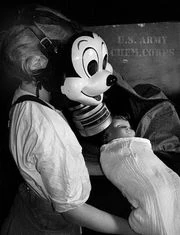

<section>





It's been a while since I've written anything related to the Disney Corporation, and I'm sure you can understand why.

A lot has been going on since my last post. I've received a lot of questions and concerns from folks who read my first-hand account of Mowgli's Palace… a resort that was built and abandoned by Disney.

I want to thank everyone who mirrored by post. It's been taken down from a few places, mostly corporate sites that were easily leaned on by a larger power. However, for every nuked topic or disappearing blog post, it seems like a hundred more have popped up.

This is something they'll have to face. There's no turning back for them… none for me, either…

I'm definitely being followed. For the first month or two, I chalked it up to paranoia. Any casual glance or half-smile in my direction set me off. Hairs standing on the back of the neck and everything.

The first one, or rather, the first one I was actually able to spot, was a telephone worker milling around my apartment complex.

He was middle-aged, doughy, dressed just as you'd expect, but something just seemed off about him. I couldn't place it, but I knew this wasn't just my imagination acting up. He was awkward and out of place, not somebody who was comfortable doing his routine job.

I followed him around a corner, only to lose him there. When I turned back to go home, there he was. Staring directly at me, about ten feet behind me. Expressionless and cold.

"Exploring?" he asked. That was all he said, and there was an accusing tone to his voice.

Tell me what blue collar phone jockey does that.

I guess that's the worst part. Never feeling safe. Never feeling alone. That, and the occasional Disney merchandise left somewhere for me to find. Little rubber Mickeys in the mailbox, a Disney Adventures magazine on my bookshelf.

They hide little Mickeys everywhere. Three circles, one big, two small, in the silhouette of the famous mouse's head.

I've started keeping a running list of Mickeys I've found.

Coffee cup rings on my coffee table. One big, two small. Colored glass bottles left on the doorstep, viewed from the top down. (All red.) Graffiti on the wall on my way to work; a huge Earth, small Sun and Moon in the proper locations.

They're everywhere.

People have emailed me about this as well. If you repost anything I have to say, you're going to start finding those son of a bitch outlines. I guarantee it.

The best one by far, one that actually made me laugh because of the horror of it all, was a drawing in chalk next my car. I was taken aback at first, walking through the parking garage, keeping an eye out for people following me.

The outline seemed a perfect match for… well, a "murder victim" you're probably familiar with if you've read my past posts.

Written in yellow… paint, I'm sure… was a single word.

"RETRACT"

The only good thing that has come out of all this is that I know I'm not the only one who's seen something they shouldn't have.

I'm not going to give their names, because… well, if I have to tell you why, you haven't been paying attention.

"Researcher" goes to Disney parks whenever he can, all throughout the year. He's not going to have fun, enjoy the rides, etc.

He's looking for the Gascots.

There's been a long tradition, apparently, of people reporting strange patrons throughout the park. Silent, motionless, staring patrons of every age, shape, and size. Men and women, adults, children, and teens.

All wearing Disney-themed gas masks.

Way back when, Disney would get tons of complaints about "oddly dressed" folks following others around the park. Folks who would then merge into crowds and disappear.

Later on, the gas masks caused folks to draw other conclusions, and reports of "possible terrorists" and "bombers" started flowing.

All of those reports most likely went straight into the trash can. I know I can't find any sign of any such occasions reported on by the media. (Although you should be aware of the fact Disney can pretty much control its press like no other.)

Researcher goes to the parks, talks to a few people, and tries not to draw any attention to himself. He'll just ask three or four families if they've seen "his friend", who's wearing a "funny mask".

He has yet to see a gascot for himself… though on one occasion, a child pointed him toward Frontier town. As he raced through the crowd, he heard a single voice ahead cry out "Mommy! I want a Goofy air-mask too!"

A fellow I'll call "Lifeguard" worked in a Disney water park from 2001 through 2003. He stood at the top of a huge water slide and made sure none of the kids got too rowdy. He passed the kids through, one at a time, telling them over and over again to be safe, keep their arms in, and so on.

One day, as he tells it, this fat kid goes down the tube and doesn't come out the other end.

He's sent two or three kids after, the whole thing moves at a steady clip, so naturally you'd expect that if fatty got stuck, the kids that followed him were stuck, too.

Not so. Only the big kid disappears. Everyone else comes out the other end, cheering and splashing like nothing's wrong.

Lifeguard shuts down the slide, much to the aggravation of the kids waiting. Before he can go through any of Disney's strict procedures… SPLASH… fatty finally comes out.

Staff members pulled the kid out of the water. He sank like a stone when he hit, his skin already blue and his eyes wide. All he would say was "No-face Kids" and "Stop squeezing".

The kid was okay, in case you're wondering. He got carted right off to the medical center. When Lifeguard was told to open the slide back up, he made a big stink about how it clearly wasn't safe. Despite his complaints, he was threatened with firing and begrudgingly opened the slide again.

From that point on, he kept a closer eye on the kids. Every so often, they'd come out in the wrong order… never as stunned as the fat kid, but always with a vague look of concern… a dreamy half-stupor that seemed as if they were trying to figure out what was reality.

They'd take on some water and choke a bit… and they'd never come back up to ride again.

I read his emails with the same sort of unease you might be feeling right now. I wanted him to share his own story, but in the end he didn't want to expose himself that way. I can't say I blame him.

"Snow White", which wasn't the actual role she played, was a "character" in the park. She had a nice little tidbit for me. You know what happens when a costumed employee drops dead in his suit?

Like, one second he's taking a picture with little Jimmy, and the next he's had a fatal stroke?

A second costumed mascot in the area has to sit with the corpse on a curb or bench and wait for a designated "Dry Cleaner" to arrive and cart the body away in a discrete manner. All the while, patrons have no idea they're sitting with a dead body for photo ops.

Feel free to check your photo albums at this point.

That was bad, but another fellow, "Janitor", went completely off the creepy charts.

Disney World (and probably others) is built with a series of underground tunnels just below your feet. Three stories' worth. Anything and everything you can imagine is down there, for use of the employees.

They're called Utilidors. Utility Corridors.

Basically, that's the reason you don't see character out of place or Janitors wandering through the park. They pop in and out of hidden doors, and travel a concealed town you're walking on.

Janitor told me something that might be common knowledge, but was nonetheless news to me.

Walt Disney had several apartments built into his parks. There's one above Cinderella's Castle… there's one in the Pirates of the Caribbean ride. They're all over the place.

More than that, there are night clubs, a movie theater, a bowling alley, and much more. All behind doors built right into the whimsical facades you passed by without a second look.

Club 22 is one such hidden area. If you have the cash to join the exclusive club (you don't) then you'll have access to it and much more.

Club 22 is a place where anything goes. Disney Co. calls these places "Dark Zones". Spots where the squeaky-clean visage of Mickey Mouse gives way to drinking, drugs, and, yes, sex.

Conversely, the rest of the park is the "Bright Zone", with a few "Gray Zone" utilodors between.

As far as Janitor has said, it wasn't always that way. It was more of a slow decline and the gradual relaxation of social norms within that elite group.

The reason he knows all of this? You may have already guessed - He's cleaned it.

After a lengthy background check and a non-disclosure form, Janitor moved up from a park attendant to one of the Dark Zone cleaning crew.

Now, before you get some Satanic "human sacrifice" vision in your head, Janitor saw nothing of the sort. Lots of empty alcohol bottles? Yes. Used condoms scattered like deflated New Years balloons? Oh, yeah. He cleaned up his share of blood, piss, and vomit, but it was all down to the unrestricted behavior of patrons as opposed to any sort of cult behavior.

At least that's how he sees it in retrospect.

All that trash, that profane shit, went into a furnace and mingled with the smoke of a quaint cottage's chimney.

If you've been to Disney World, you've breathed ultra-condensed sin.

Backing up this information was "Hammer". Hammer mailed me the old-fashioned way, though I don't know how he got my home address. He sent me photocopies of work papers proving his employment, with the instruction to burn them when I was convinced.
Which I did gladly.

Hammer worked around the Disney World park, doing demolition and construction. At one point, he approached a superior regarding some strange construction plans.

There was wide, rectangular area marked off on the blueprints, about the size of a supermarket. The area was left unnamed, and only bore the words "DO NOT DIG".

Not only was his superior in the dark, but he was super-fucking-purposefully in the dark. He didn't want to talk about it, didn't want to know about it, and ended the conversation with "this space intentionally left blank".

Hammer didn't get it. The area seemed a waste of space, and it was directly conflicting with the work his team had been given. He started poking around the area on his off-time, finding only a derelict steel door, and a great span of concrete just beyond.

It was a "supermarket's worth" of blank, gray floor.

Soon after, Hammer started picking gascots out of the crowds.

Unlike all other reports, the people… the things… would stand in full view of the guy. They'd cluster together in the distance, or they'd just be pressed against a wall when he turned a corner.

He said they "moved weird", like they were weak or injured… like a deer that's been run down by a hunter and can't flee anymore.

The gasmasks… the Disney character faces with filters jammed in… he noted that they seemed wet on the inside, like condensation on a car window. Tiny beads of water glimmered behind the glass, making it impossible for any of them to actually see.

Probing further, Hammer started asking questions of anyone and everyone who had been working in the park for a decade or more.

He hit dead ends throughout, until he was directed to Ida, an elderly woman who worked in a restaurant on Main Street. She'd been there since way back, and though nobody had the balls to ask directly, everyone KNEW she had plenty of terrible stories to tell.

Hammer asked about the empty space, then about the gas-masked customers, and at first he thought he would receive the same non-answers he'd gotten so far. She was quiet. Eerily quiet.

"Room Zero." She croaked, a single, shaking hand placed to her cheek as if she were a little girl fearing a Father's punishment.

She didn't meet the man's gaze for the entire conversation.

Room Zero, as it turned out, was yet another hidden room just like the apartments and Club 22. However, its sheer size and its spot deep beneath the park set it apart from any of the "fun" dark zones.

It was a bomb shelter.

Room Zero was built to withstand a massive attack, be it conducted by foreign or domestic enemies.

Room Zero was to be stocked with enough rations to feed the entire park's average number of patrons at any given moment, and housed a smaller yet lavish "panic room" of sorts for Disney higher-ups.

During World War II, official Disney gas masks were actually produced for children to wear in the event of an attack. The idea was that it would be less scary for kids if Mickey's face was emblazoned on the wartime safety device.

Yes, I know the obvious problems with that.

During the Cold War scare of the 60s, when Disney World was constructed, Room Zero was stocked with similar masks, as well. Whether they cared about the fears of children, or just callous branding, the things found their way down there.

What's more, some genius decided that kids would THEN be frightened by the gas masks their parents wore… and so all masks, adult and child, were made to comply to this insane standard.

Ida described it as "Treating a wound with lemon juice."

None of this explained what Hammer had been seeing, though. Not only the seemingly supernatural appearances, but the emptied out room as well.

"I've been in there," he explained, "There's nothing but a cement floor and four walls."

"No," Ida shook her head and covered her mouth, stifling a sob, "You've been on top of it."

Someone or something sounded the alarm one day, when the park was at full capacity. The warning was clear. It was supposedly an air attack.

Security ushered everyone down, down, down into the tremendous shelter. There, they were ordered to put on their masks and hunker down for the duration fo the assault.

Everything was quiet for about thirty minutes, save for the crying children and the frightened whispers. No one wanted to die, and so they were thankful in a way for this strange measure of safety.

Then, the first scream rang out.

"Hey!" a man shouted, "Quit pinching!"

Waves of shrieks and yelps rippled through the crowd, from one wall to the other, back and forth.

"Who's running around? Settle down!" Someone hollered.

"Who's laughing? This isn't funny!"

"Ow! Who stepped on my foot?!"

Despite security guards' urging to calm down and keep their cool, the crowd became more and more agitated until, finally, after nearly an hour of madness…

The lights flickered…

Then died.

What followed could only be described as utter chaos. In the dark, only the wails of the young and the anguished cries of adults could be heard in a massive, swelling din that bloodied the ears of all within that black echo chamber.

A group of staff members and a select few patrons made it out of the door, ready to face the War above rather than the insanity below. What they found, of course, was a desolate, yet untouched theme park. The music continued to play, echoing through silent storybook towns.

Upon returning to Room Zero, the few who stood at the top of the steel staircase that lead down into the pitch blackness heard no sign of the previous fray. There was only silence.

Ida herself descended that staircase despite the begging of those she left above.

She reached the reinforced doors, herself now awash in darkness and hearing only the buzzing in her ears.

A single voice came out of the darkness. The echo made it impossible to tell whether the mocking, raspy voice was at the back of the bomb shelter, or if it was right in front of her face.

"Shut the door, dear. You're letting out the cold."

Gripped by terror, she did just that. Within days, the entire thing… shelter, staircase, all of it… was covered with feet upon feet of cement. Air systems and generators above its ceiling were removed, creating the large, empty space.

"They're all still down there." Ida told Hammer, "Down there with whoever that was."

You might notice I've used Ida's name.

Unfortunately, she passed away soon after telling her story. Accidental fall, supposedly, after getting out of bed to turn on a light.

"Such a company devotee," the paper reported, "that her entire bedroom was covered with Mickey silhouettes."

</section>
