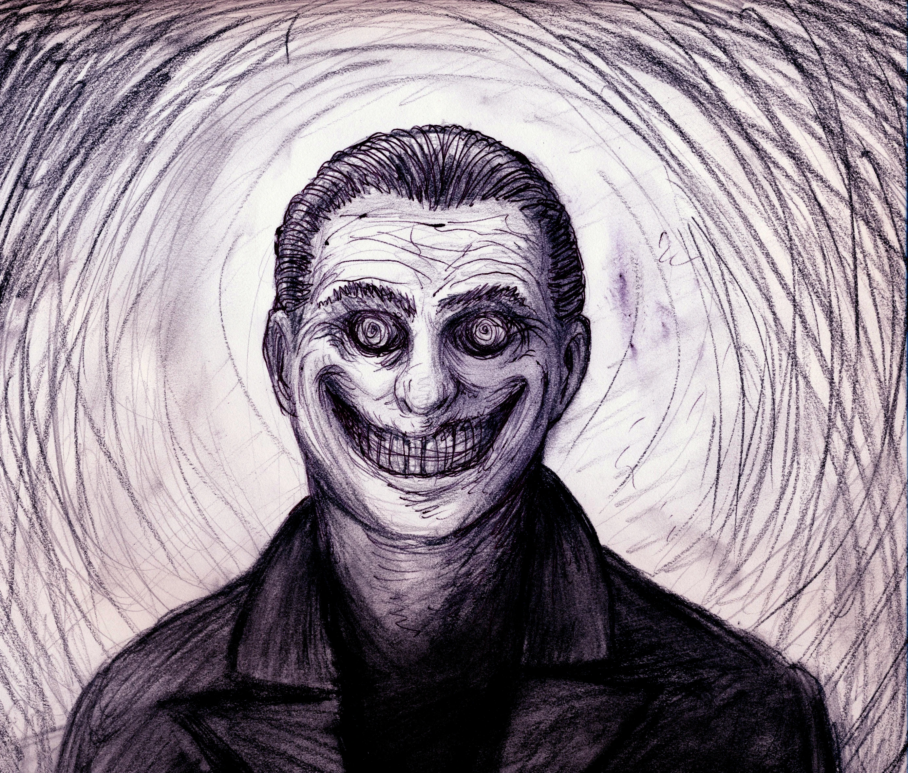

About five years ago, I lived downtown in a major city in the US. I've always been a night person, so I would often find myself bored after my roommate, who was decidedly not a night person, went to sleep. To pass the time, I used to go for long walks and spend the time thinking.

I spent four years like that, walking alone at night, and never once had a reason to feel afraid. I always used to joke with my roommate that even the drug dealers in the city were polite. But all of that changed in just a few minutes of one evening.

It was a Wednesday, somewhere between one and two in the morning, and I was walking near a police-patrolled park quite a ways from my apartment. It was quiet, even for a weeknight, with very little traffic and almost no-one on foot. The park, as it was most nights, was completely empty.

I turned down a short side-street in order to loop back to my apartment when I first noticed him. At the far end of the street, on my side, was the silhouette of a man, dancing. It was a strange dance, similar to a waltz, but he finished each "box" with an odd forward stride. I guess you could say he was dance-walking, headed straight for me.

Deciding he was probably drunk, I stepped as close as I could to the road to give him the majority of the sidewalk to pass me by. The closer he got, the more I realized how gracefully he was moving. He was very tall and lanky, and wearing an old suit. He danced closer still, until I could make out his face. His eyes were open wide and wild, head tilted back slightly, looking off at the sky. His mouth was formed in a painfully wide cartoon of a smile. Between the eyes and the smile, I decided to cross the street before he danced any closer.

I took my eyes off of him to cross the empty street. As I reached the other side, I glanced back... and then stopped dead in my tracks. He had stopped dancing and was standing with one foot in the street, perfectly parallel to me. He was facing me but still looking skyward, smile still wide on his lips.

I was completely and utterly unnerved by this. I started walking again, but kept my eyes on the man. He didn't move. Once I had put about half a block between us, I turned away from him for a moment to watch the sidewalk in front of me. The street ahead of me was completely empty. Still unnerved, I looked back to where he had been standing to find him gone. For the briefest of moments, I felt relieved, until I noticed him. He had crossed the street, and was now slightly crouched down. I couldn't tell for sure due to the distance and the shadows, but I was certain he was facing me. I had looked away from him for no more than ten seconds, so it was clear that he had moved fast.

I was so shocked that I stood there for some time, staring at him. And then he started moving toward me again. He took giant, exaggerated, tip-toed steps, as if he were a cartoon character sneaking up on someone. Except he was moving very, very quickly.

I'd like to say at this point I ran away or pulled out my pepper spray or my cellphone or anything at all, but I didn't. I just stood there, completely frozen, as the smiling man crept toward me.

And then he stopped again, about a car length away from me. Still smiling his smile, still looking to the sky.

When I finally found my voice, I blurted out the first thing that came to mind. What I meant to ask was, "What do you want?!" in an angry, commanding tone. What came out was a whimper: "Whaaat…?"

Regardless of whether or not humans can smell fear, they can certainly hear it. I heard it in my own voice, and that only made me more afraid. But he didn't react to it at all. He just stood there, smiling.

And then, after what felt like forever, he turned around, very slowly, and started dance-walking away. Just like that. Not wanting to turn my back to him again, I just watched him go, until he was far enough away to almost be out of sight. And then I realized something. He wasn't moving away anymore, nor was he dancing. I watched in horror as the distant shape of him grew larger and larger. He was coming back my way. And this time he was running.

I ran too.

I ran until I was off of the side-road and back onto a better lit road with sparse traffic. Looking behind me then, he was nowhere to be found. The rest of the way home, I kept glancing over my shoulder, always expecting to see his stupid smile, but he was never there.

I lived in that city for six months after that night, and I never went out for another walk. There was something about his face that always haunted me. He didn't look drunk, he didn't look high. He looked completely and utterly insane. And that's a very, very scary thing to see.
