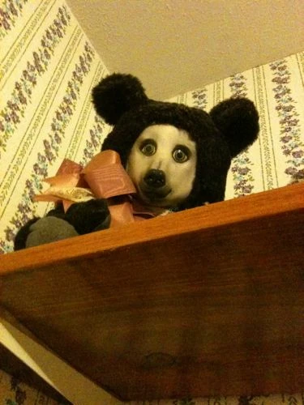

My sister had a teddy bear, a scary teddy bear. I do not know why, but it creeped me out. It was just so disturbing to me. The thing had eyes that looked so real. It was as if it was made from a real bear, and its face was just blank and unsettling.

I started to get weird feelings about the bear when my sister first got it-—-she was only a baby at the time, and I was about four. We had a dog, you see, and he had a habit of eating things, so my mother always had to put it up on the small cabinet in the corner of the hallway upstairs. Every time I went up those stairs, I saw that creepy bear suddenly glare around the corner at me, as if it was watching me. This wasn't the weird part; it started to get really strange about five years later, at the age of six or seven. My sister had lost interest in the bear, so my mother just threw it in the old toy cupboard. The only problem was that the cupboard was in *my* room.

When I was nine, old enough to stay on my own and go to bed without any assistance, I would get into bed every night and turn my lamp off. This is when it got scary. As I was getting some sleep, I suddenly remembered Mum putting that teddy in the cupboard. I slowly turned and looked across my room to see it through the glass. My heart suddenly stopped as I thought about the horrors the plush had caused me, but at the age of nine, I wanted to grow up and lose my fears, so I shook it off and put my head back on the pillow.

When I got up to pull my sheets on a bit further, I noticed something that would scar me for life. There, sat at the end of my bedroom, was the teddy.

I sat there staring at it for about a minute. My heart started beating normally again. When I needed to yawn, I closed my eyes. I opened them to see the teddy sitting closer to my bed.

At this point, I was really freaked out. I started to move back to the wall, and looked around to see if there was any sign that anyone had come in. When I looked back to see the teddy on the end of my bed, I was so startled that I almost fainted from fear. When I blinked, it had gone. I looked around. To my relief, I saw no sign of it.

I sat my head back down on my pillow, hoping for some sleep. Then I opened my eyes. It was above my head, staring straight down. I screamed as it lunged down at me. I will never see a bear the same way again.

A few years later, after years of horror, I burned it; I sat in enjoyment as the bear turned to smoking ashes in my fireplace.

I have lived my teenage life through adolescence; the only thing I could remember that was in any way similar to my bad experience was when I watched Trainspotting. That fucking baby scene shocked me so badly, but other than that, all was well.

When I turned nineteen, I was about to move into my new home. I had been given the keys to the house and was ready to set up my furniture. After hours of carrying, I carried the final box from the removal truck into the front door and shut the door behind me. I turned to go into the kitchen and put it on the table. I opened it to see a cabinet. I took it out, walked into my new living room and placed it in the corner, stared at it and thought to myself, *'I don't remember packing this cabinet.'* I didn't really care that much, as I had just moved into my new home.

I walked back into the kitchen to grab my television and brought it into the living room when I saw it. The teddy... it just sat there, staring at me.
