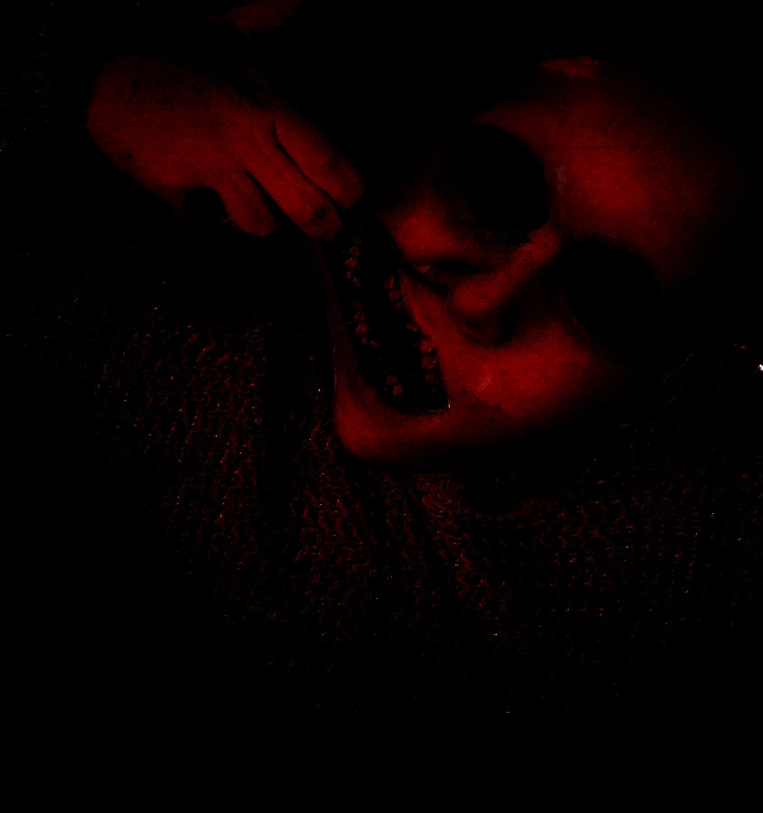
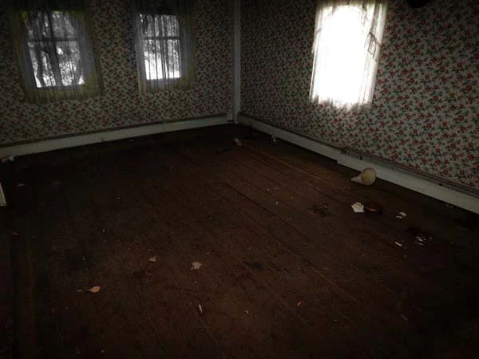
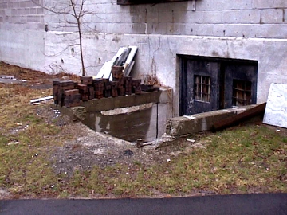

<section>

I'd never been too fond of anyone at my local school. They were all a little rude and boring for me. You see, I grew up in a small area with not many people interested in art like I am, so I had to venture off from home. I found myself attending a pretty rural art college. It's sorta like a normal university, except it's full of big-headed people.

The only reason I'm here is because I've always wanted to be an illustrator, a kid's book designer of sorts. I'd had a keen interest in children's media and classic books such as the *Arthur* series, so when I was sent to live at this college, I was taken aback when I realised a lot of the other students here were all "fine artists". You know the kind; the ones who like to splatter paint onto a canvas and claim it's art. I'm not really big on that sorta thing, but I didn't question it.

I settled into the new place pretty quickly. I was sharing a dorm with a few other students. There was myself, a graphic designer named Josh, a director and animator called Lilly, and one more guy called Daniel. Daniel was one of those "fine artists" I just described to you. His room was decorated with photographs of distorted women, and he always had weird music playing, too. It was sorta like trippy 60s stuff. He also liked to smoke, so his room smelt like an old ashtray. It was pretty gross, but he was a nice enough guy, and we all got along well. We soon became a tightly-packed group of friends.

It was the start of a new term for us, having all came back from home after spending the summer there. We unpacked our things and began talking about what we'd done over the break.

"I went hiking with my stepdad. We did one of those summer camps," said Josh.

"I spent most of my time with my girlfriend. We watched films and went to see some plays, too," Lilly said. She did a lot of whining about missing her sporty partner, so we were happy they'd had some time together.

I hadn't really done much worth mentioning. Just the usual stuff; parties and trips with my family. Nothing that special. I was just about to pipe up and speak when I got interrupted.

"I was at the dentist," we heard Daniel say. "My father is a doctor of sorts, so he let me come with him and explore the hospital. My favourite place was the dentistry. I got to touch and feel teeth. It was cool." We all stared at him, a bit confused. Were you allowed to have random strangers go into hospital rooms? Let alone play with the equipment? We didn't really care. We knew Daniel was that sort of guy anyway. He was known for getting into trouble for *"the sake of art."* That was always his excuse.

We all spent our first couple of days getting to grips with our assignments, finding out what we had to do. Naturally, my task was to study some illustrators and mimic their styles. Josh spent some money on a new Mac for design tests, and Lilly had to start playing about with claymation. It was a pretty nice vibe when we we were all at at our dorms, talking and swapping ideas. At least, it was nice until Daniel started insulting us.

He'd never been the same since he came back from summer break. He seemed more cold and distant. He never told us anything about his projects, not even what the subject was. It was pretty normal for him to be reserved, but never this much. At nights, he'd make himself dinner, shut himself in his room, crank up the music, and not be seen until the next morning. The rest of us would go out places, like bowling or down to a local gig. Daniel used to happily tag along, but not anymore. We assumed that something must have happened to him, so we decided not to press him on it.

One night, myself and Josh had gone out. Lilly didn't come with us; she said she wanted to see if Daniel was okay, since he hadn't been talking to us for a few days now. We could see her point and complied. She spent the evening knocking on his door, trying to get him to speak with her. Just before we left, we saw it open and Lilly step inside before it was locked again. Brushing it off, we headed out.

We'd gone to see a movie and then for a few innocent drinks. It was fun, but we didn't get home 'til around 2:00am. When we arrived back, Josh said goodnight and went straight to sleep. I didn't go to bed yet; I was pretty damn hungry. Drinking always made me hungry, so I raided our fridge and found some cold pizza from the night before. I was going to go back to my room when I realised something I didn't notice before. Daniel wasn't in his room, and Lilly wasn't in hers.

Due to Daniel's strange new behaviour of locking himself in his room until early hours, and the fact that Lilly never went anywhere without texting us, this was pretty weird. I went over to his door and gave it a knock, and it opened right up. It wasn't locked or anything. I assumed he and her had gone out with some of his poncy art friends, but it wasn't like Daniel to leave his door open.

I've always been a nosy son of a bitch, so I stepped inside to see if there were any signs that he had gone somewhere. His keys and jacket were missing, but he'd left his wallet on his desk. The other thing that was odd was that his laptop was on his bed, and still on.

Curiosity got the better of me. Perhaps this could've been my chance to find out about the art project he'd been hiding. I mean, Daniel was a "fine artist", remember, so it could have been anything.

I noticed that he had a USB plugged in and two files on the screen. One was called "Dentist Photos" and the other file was a singular image named: *"teeth.jpg"*.

I clicked on the "Dentist Photos" file. It was just pictures of people's teeth, as well as plastic models of teeth. Nothing interesting. I clicked back off the file and decided to check out "teeth.jpg".

The image would be forever burned into my brain. It startled me so bad that I slammed the laptop shut, shaking as I sat back. I wasn't sure if I wanted to lift the screen again, but I knew I had to, or Daniel would know someone touched his laptop. I raised it, staring at the image for a brief moment before clicking away from it nervously. I then made a decision. I needed to show this to Josh and Lilly in the morning. This was seriously messed up. I mean, I knew that Daniel was an artistic kind of guy, but this was insane.

I quickly bolted back to my own room and scoured for my USB drive. Eventually, I found it and darted back to Daniel's laptop, where I copied the image onto my USB. I stared at it for a little while longer. I was trying to dismiss it as mere photo manipulation, but there was just something so wrong about it. Perhaps it was the black, soulless eyes, or the fact that whoever or whatever this creature was, it was pulling up its mouth in such as weird and disturbing way. It almost looked forced. Like this thing had been made to pose in this way.

I shook it off as mere paranoia and fixed up the laptop so that it didn't look tampered with before I went back to my own room. Soon enough, I heard our front door open, then the sound of footsteps, then Daniel's door locking. Daniel was back home...but there were no signs of Lilly.

The next morning, I waited until Daniel had gone out for one of his lectures. Since it was a Friday, Josh and I had the morning off. I decided now would be a good time to show him the image.

I asked him if he wanted to see what Daniel had been hiding from us. He was confused, but also eagerly said yes. I brought my laptop into the living room, loaded up my USB, and opened the image for us both to see. Josh's expression fell into shock before he started spluttering.

"Wh...What the fuck is that thing?!" I could tell by his reaction that both of us were on the same page. This couldn't have been an art project image. There was no way that *this* would pass as fine art, would it? I mean sure, art can be creepy at times, but I couldn't imagine Daniel's teachers appreciating such a disgusting picture.

"I know that Daniel can be a creepy son of a bitch, but...that isn't right. We've got to show Lilly thi-"

We both cut off one another, then paused briefly before looking at each other in confusion. *Where was Lilly?* I realized that she hadn't come back with Daniel last night, and that neither of us had seen her that morning. When I explained to Josh, he began to worry. Lilly was never the kind to just sneak off and not tell anyone.

I picked up my phone and began to ring her mobile. For a while, there was silence. Then, from Lilly's room, we heard a faint buzzing sound. Josh got up and walked inside rather quickly (he'd never been one to go into girls' rooms). He came back out holding Lilly's phone in his hand with a worried look on his face. She was gone, and we had no way to get a hold of her.

"M...Maybe she's just gone to a lecture and forgot her phone..." I stuttered.

Josh shook his head, chewing on his lip from nerves. "No, Lilly doesn't have lectures on a Friday, remember? She'd at least say hello to us and take her phone! She lives on that thing; she never stops texting her girlfriend." He was right. Lilly's life revolved around her phone. We knew there was no way she'd leave it.

Suddenly, it lit up. Someone was calling her. We both looked at it, then back at one another before Josh passed it to me. I brought it up to my ear before speaking. "Hello?"

On the other end of the line was her girlfriend. I recognized her husky voice. "Ah! Lilly, there you are. Thank God you're okay...you didn't text me at all last night or this morning...I thought something was wrong!"

I cringed a little bit, realising I had to break it to her that I wasn't Lilly. As I spoke, I heard the girl begin to get upset. She was breathing quite heavily, and I could hear that sniffling sound someone makes when they cry. I felt so bad for her, but perhaps she was a chance to find out anything I could about Lilly.

"W...Where is Lilly? She hasn't spoken to me since last night. I thought she was just playing a joke on me, but now I don't know." I looked at Josh with a confused stare as he began to pace around a little bit. I put the phone on loudspeaker and asked her: "Why do you think Lilly was playing a joke on you? Did she say anything odd?"

"Yes," her girlfriend replied. "She sent me one message at around 1:30am."

I glanced at Josh, baffled, before I asked again. "What did the message say?"

"*Help me.*"

Me and Josh had wide and worried eyes. Lilly would never pull this kind of prank on anyone, let alone her own girlfriend. She always told us how worried she was about her getting paranoid, so we knew she wouldn't send a message like that unless she had a good reason.

I continued to speak to the girl, but I was getting nowhere. I reassured her that we knew where Lilly was and that she'd be calling her back tonight. Her girlfriend seemed suspicious, but agreed and put the phone down.

Myself and Josh paced back and forth. We had no idea what this could mean. Why would Lilly send a message like that? We continued to think for a while, deciding that, until we knew where she was, we were going to skip our lectures. We spent a long time thinking over things, and began to write down the connections we could make. Afterwards, Josh read out the list to me so I could think it over.

"First, Lilly goes into Daniel's room at around 10:00pm. She's locked in. Then we return home at 2:00am. During that time, at around 1:30am, we know that Lilly asked her girlfriend for help. You discover that neither Lilly or Daniel are home yet. Daniel's door is unlocked and his laptop has been left on. You find the image and then leave. You then return to your room and heard Daniel come home, but not Lilly. Lilly is still not back home yet, but Daniel is...what the hell could this all mean?"

I thought over it for a while, then came to a conclusion. I didn't want to make this connection, but it was the only one I could think of.

"Daniel did something to Lilly. We have to confront him tonight if Lilly doesn't come home between now and then, okay?"

Josh looked shocked, but he agreed. Daniel would be our only chance of finding out what happened to Lilly.

Later that night, there were still no signs of her. We knew that her girlfriend would be calling soon, so we decided to turn the phone off. We didn't want to reassure her with false information.

It was 6:00pm before Daniel finally came home. He looked rather startled to see us both standing there in the living room. He lightly placed his art folder and satchel down against the sofa as we both stood up. Josh spoke first, and I could tell he was trying to keep his composure.

"Daniel, we'd like to have a talk...it's about Lilly."

Daniel's eyes seemed to widen ever so slightly, but it was nothing I considered worth thinking over. He tilted his head at us, looking confused as he asked, "Why? Is...something wrong?" I shook my head. I didn't want him to think we were accusing him of anything; we would never get any answers out of him that way.

He did look a little on edge, though, glancing away from us as he itched his wrist under his baggy grey jumper. He pushed his rather dark black bangs out of his face as he spoke. "Then what is it? Is she okay? I mean, I know she left her phone here last night, so I suppose there wouldn't be any way to get ahold of her..."

We didn't say anything. We weren't too sure about how to proceed. How were we supposed to ask him if he did anything to Lilly without him taking offense?

I then realised something. It took me a moment to process before I spoke.

"...You just said she left her phone here last night, right? How the hell did you know that?"

Josh's eyes lit up. He'd just realised, too. How did Daniel know she'd left her phone behind unless they went somewhere? We already acknowledged the fact that Lilly never left her phone anywhere, so how on earth was he aware of it?

Daniel didn't answer. He was silent for a while before he pushed past us and walked into his room, slamming the door shut. We walked over to his door, banging on it harshly before he started shouting.

"Leave me alone! I have coursework to do! I'm sure Lilly will show up tonight, just...stop being so paranoid!"

We didn't know what to do. Daniel clearly knew a lot more than he lead on, but there was no way we were going to get it out of him. We walked back into the living room and slumped down. I ran a hand through my hair. What the hell was going on?

I then realised that Daniel had left his bags on the sofa. He must have been too flustered to pick them up when he stormed into his room. I peered around to his door. He hadn't left yet, but I knew soon enough, he would be coming out to get his bags.

In a moment of madness, I picked up the satchel and emptied its contents onto the coffee table. I could see Josh's eyes widen before he whispered to me frantically. "W-What the hell are you doing? What if he sees you?!" I didn't care. I needed to know anything I could about Lilly. She was a roommate, but also a best friend. I couldn't just leave this to solve itself.

I pushed through documents and came across what looked like a ticket. I crumpled it up and pushed it into my pocket, then found a zipped-up document bag. I pushed it into Josh's hands and told him to go hide it. He complied and put it in his room. I then quickly placed all the other stuff back into Daniel's bag and rested it up just how it looked before, before walking into Josh's room.

I watched Daniel go back to the living room and pick up his bags before entering his room again Josh grabbed the zip-up file from under his pillow as we both sat down on his bed. We didn't say anything. We just read the front cover of it.

***"Teeth"***

It sent chills up my spine. I knew that whatever was inside would have a connection to the image I found on the computer...but otherwise, what we saw was nothing like we expected.

It was a series of photographs. The first was of what looked like an abandoned room of sorts. The walls were covered in old floral wallpaper, and the floor was just damp wood. It looked like it hadn't been used in years. The next pictures were of plastic tools. We noticed that they were linked to dentistry. You know, like needles and drills. It was pretty creepy, but what came after made us both drain of colour.

There were photos of Lilly smiling.

We flipped through every single one of her. In each, she had her big toothy grin on display. Such a sweet smile. One of its most distinct features was a large front tooth. The left one. We always found it cute...but now it was no laughing matter. We noticed labels on the back of the photographs, and that each tooth on each photo was marked. There were notes attached that said things like *"remove"* or *"replace"*. It knocked Josh sick, and I was more terrified now than ever. We knew we couldn't confront Daniel about these photos. It would get us nowhere. We just sat in silence for a long time, staring at them in disbelief.

I then remembered the ticket I'd found and stuffed in my pocket. I pulled it out with a shaky hand, bringing it to my vision. It read:

**Group Ticket: 2**

**Location: Station Road**

**Date/Time: 28/09/2011, 11:34pm**

We both looked at each other with firm gazes. That was just yesterday evening. We knew exactly what we had to do now. We had to find where Lilly was.

We didn't see Daniel for the rest of the evening. Josh had become incredibly paranoid. He asked if he could sleep in my room tonight; I thought it was a bit awkward, but didn't mind. I mean, he was scared real bad, so I didn't want to leave him alone. While Josh was sleeping, I printed off the disturbing image for referencing, then spent most of the night planning for the next day. I had already emailed our lecturers letting them know we weren't going to show up, because we "felt sick". I also checked how far Station Road was. To my surprise, it was only an hour's drive away, so I figured we could take Josh's car up there and look around for where Daniel and Lilly had been.

The whole time, I kept staring at the teeth.jpg image. A horrible thought crept into my mind. I didn't want to think about it, but it could have been a possibility. *Was the person in the picture Lilly?* Every time I thought about it, I'd shake it off, telling myself I was just being paranoid...but it all added up. The timing, the photographs...it would make sense. I didn't want to believe it, and I certainly wasn't going to until we found Lilly.

The next morning, myself and Josh got ready at around 6:00am. We wanted to be out of the dorm before Daniel woke up, and we made sure to lock our own doors. We also decided to take Lilly's phone with us. We didn't want to leave anything behind that would indicate we were being suspicious.

Eventually, we left the dorm and got into Josh's car. I had brought along a small bag full of different things, such as the photographs, a flashlight, a camera, and a notepad with a pen.

We loaded ourselves into the car and made our way towards Station Road, able to pinpoint it with my mobile GPS. When we got there, we found that it was in a rather abandoned-looking area of town. The place was practically deserted. All we could see were tall, crumbling buildings and little, empty houses.

We took out the photo of the room and began to walk up to each house. We pressed our faces to their windows to see if we could make out the floral wallpaper like the room in the photograph. We spent a good few hours doing this, but for nothing.

We were getting pretty angry at this point. We just wanted Lilly back. Josh got so mad that he walked up to one of the house walls and started kicking it harshly, shouting from the top of his lungs, *"Daniel, you sick bastard!"*

Just as he kicked the wall one last time, we noticed it begin to tear. Josh looked down at his foot and realised he had ripped what appeared to be a piece of painted paper away from it. He quickly tore down the remaining pieces to reveal what looked like an outdoor basement. The doors were rusty and scratched, but we noticed that the metallic handle was clean...as if it had been tampered with.

Josh looked over his shoulder to me. I gave him a nod and quickly took a photo of the layout of this basement-like thing. Josh then walked down to the doors and gave them a push. To both of our surprises, they were blocked by a plank of wood, which Josh was thankfully able to remove fairly easily. We then opened the doors slowly and cautiously. Who knew what could've been kept in there? It was obviously hidden for a reason.

If only we knew what was was coming. Perhaps it would have saved us both from throwing up.

As we stepped inside, we were met with a rancid odour. Neither of us knew what the smell was, but it made us both feel instantly sick. Josh gagged and coughed, covering his face with his shirt. I swallowed back vomit as I walked on.

I pulled out my flashlight and shined it across the pitch-black stone room. We heard nothing, but as we walked further inside, the smell only thickened. It was getting so bad that Josh threw up behind me. He quickly composed himself and stumbled back upright before we continued.

As I looked around the space, my eyes met with something on the floor that made my heart race and the flashlight drop from my grasp. It was Lilly's knitted sweater. The one she always wore when we went out for pizza or bowling, with the same little torn threads on her sleeves where she'd chew on it. I could see Josh from my peripheral; his eyes were just as wide as mine, the last bit of colour drained from his face. I picked up the sweater, holding it up in front of me when I noticed there was a large, thick bloodstain soaked all the way through it. It started from the collar and became thinner as it went down.

I was now the one to throw up. I collapsed onto my knees, puking heavily. I didn't know what to do. I didn't even know what to think. I soon composed myself and stood up again, gripping the flashlight as I put the sweater in my bag. Through blurred, teary eyes, I pressed on.

From where I was standing, there was nothing left to see. Then, there was the flicker of a small switch from behind me, red light filling the corner of the room. Josh screamed louder than anything I had ever heard before. My stomach was in knots as I shined my light where he was standing. He was beside a large, black table, just standing there in complete terror, blocking my view of it. I could only imagine what he was looking at, and I truly wish I left it to my imagination.

I walked over to his side. There, I laid my eyes on the sight before me.

It was Lilly. She was strapped down onto a table, wearing nothing but her jeans. Her body was covered in thick layers of tape, keeping her strapped down. One of her arms dangled down to her side; the other was nowhere to be seen. Its replacement was a taped-up stub covered in bloodstains. I could hardly breathe. My stomach was so knotted and my breathing so tight that all I could do was stare.

I looked up at Lilly's face. Her head had been forced back, and we could see that her innocent blue eyes had been violently gouged out. They'd been replaced with thick, black wax that filled the holes. Her nose had been contorted and broken, snapped in many places...but the worst part of it all was her mouth.

Her jaw had been forced open, her maw filled with the same black wax. Her teeth had been ripped out and misplaced in all different directions, and her lips had been stretched upright, tearing her cheek to reveal more teeth that had been pulled from her mouth. It gave her a contorted, horrible smile. Her face was covered in streams of her own dried-up blood. I stared at the hand that was holding the mouth open. It was her own. *Her* hand had been stitched to the ripped cheek. The flesh was torn and falling apart under her nails, which were cracked and chipped, staples and little threads holding them in place. The red fluorescent light created horrific shadows, and highlighted every grotesque feature now visible on Lilly's face.

I silently and numbly pulled out the picture of "teeth.jpg", stared at it, then looked back at the real thing. They were identical. Josh brought a shaky hand over Lilly's cheek before he collapsed by the side of the table. I could hear him sobbing horrendously by her side before he passed out next to me. I too felt like I was on the brink of collapsing, but something caught my attention.

I could feel the presence of someone else entering the room...but I already knew who it was. I knew now there was nothing we could do. I heard the doors slam shut, the plank of wood being placed over them. I heard the sound of footsteps, inching closer and closer, until I could feel their presence behind me. I knew he was there, and I knew there was no way out. I heard his voice speak very faintly behind me.

*"I'm sorry you had to find out this way...but it's okay. It's all for the sake of art."*

...But that wasn't what made me collapse. I knew well enough that my fate was sealed. After he finished speaking, though, I heard one more tiny sound that made my heart ache and my tears stream further down my numb cheeks, before my vision faded away and my hands slipped from the table.

I could hear Lilly choking.

</section>
