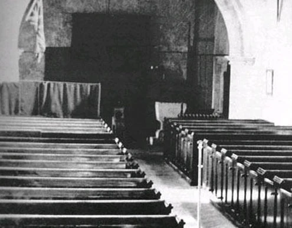

<section>

I was particularly excited about this onsite job. Later on that evening, my boss called again, and filled me in on more details about the request. He told me that traveling to the church would be quite a drive and that its location was in the countryside secluded from most towns.

He gave me strict instruction to abide by their basic rules and to not offend them by any means. Apparently, they had paid handsomely for this service and he wanted to be sure our company kept every dime. He did note that I only had to respect their rules and not necessarily buy into any of their religious activities or anything. He told me to stop by the office in the morning for the necessary equipment. He promised that the company would reimburse me with the cost of travel and reminded me to call daily with any updates.

I wasn’t a big fan of religion, but I wasn’t going to complain if they were providing food and a room for sleeping. Again, it was a chance to get out of the office for a few days. That night, I quickly packed up enough items for two weeks into two big suitcases. After preloading my car, I set my alarm early, knowing that I would need to compensate for the drive.

It was strange. My night was dreamless and it was quick. It felt as if I had closed my eyes for a second before I heard my alarm go off for the next day. What struck me even odder was the fact that I could not recall what had stirred me up the night before. I had a disturbing dream when visiting my parents, that much I knew, but of what specifically, evaded my memory. I dismissed the thought believing it to be for the best.

Despite being tired from the early rise, I was up without a struggle and ready to embark. The outside air was cooler than I usually preferred; the sky was starless almost like a dark veil was across it. I hopped in my car and kept the windows up this time with the heat at full blast. There were a few times where my eyes rolled back from the tiredness, but the radio helped keep that temptation at bay.

I made the quick stop by the office to gather up all the necessary equipment needed for the job. My boss already had it packed and ready to be loaded upon my arrival. He wasn’t there himself, but with the help from the third-shift crew, I was able to load everything into my trunk.

Afterwards, they provided me a set of GPS directions provided by my boss. Once I thanked the crew for helping, I made my way on the road. The further I drove, the more scarce the streetlights and other cars became. Before long, the sun had fully emerged giving sight to the endless oceans of green pastures and cornfields. Eventually though, even the pastures came to an end and soon I found myself swallowed by the dense patches of trees.

My car barely managed to remain on the thin rough path; below I could hear the rocks and twigs crunching under the wheels. I held my breath a few times, slowing my vehicle down hoping to not incur a flat tire, which was the last thing I needed. After what felt like ages, I finally came across a fairly large building ahead.

The building itself was an old structure, standing tall and stretched far back into the woods. Its appearance was withered, made of old wood, pale and decayed. It swayed a few times at the course of the wind letting off a most-disturbing groan as if suffering, wishing to be put out of its misery. Truly it was amazing that such a building hadn’t already collapsed.

Continuing to approach, I could make out more of its structure. The building appeared to be two stories. Its front was rather plain aside from the monotonous row of windows – a row of three that ran across the second floor. The windows themselves were elongated, running along the sides of the building as well. I was thrown off by the sight of this structure. I was sure my boss had informed me this was to be a church. I wasn’t much of a church-goer, but the building before me looked more like an old warehouse or boarding home rather than a place of worship.

The rugged path led up its entrance. In the front of a set of double-doors, I could see a lone figure standing, waiting for my approach. It was an elderly man in his mid-fifties in a grey suit and black tie. He immediately made his way to me when I parked. His walk was hobbled but elegant in poise.

A little hesitant, I gradually let down my window, greeted by his big toothy smile.

“Afternoon, son," he said in a strong country accent. "Yer the technician we’ve been waitin' for?”

I was taken back by his overpowering cologne; it smelled like a poor concoction of baby powder and sunflower seeds. He was balding towards the top of his head while his snowy white hair grew around the edge like a crescent. Deep wrinkles were pressed across his face and seemed to grow in number with his smile.

Slightly stuttering, I answered, “Y-yes, sir. Pleased to meet you.”

He gave off an old man’s chuckle, still housing his toothy grin. “There’s no need to be shy, son. I’m Reverend Gary Gooding. You can call me Gary. Welcome to Peach Herb County,” he said extending out a hand.

Nervously, I shook it.

“I'd like to personally thank ya' for coming all the way out here. I know it must’ve been something for ya'. I hope ya' didn’t get too lost on the way over.”

For some reason, I couldn’t find my voice and only shook my head.

“That’s good. Look here, why don’t ya' swing your car right around to the side. I’ll get one of my people to help ya' get yer stuff settled in. Ya' don’t have to lift a finger, understand?”

He gestured to the right-hand side of the building. I nodded and drove around as instructed and parked. Before I could even vacate the car, I jumped when stared ahead. There a man standing in front. I hadn’t even see him approach; I couldn’t lie. He was much younger than the Reverend, but clearly older than me. He had slick black hair combed-over to the side and wore a dark vest resting over a white button-top with grey dress pants.

He gave a slight wave while approaching my car. I exited and was greeted with a firm handshake. “Terrance Crowe,” he said. His accent wasn’t as strong as the Reverend’s. “Welcome to Peach Herb.”

I could tell that his smile was forced; even his eyes looked annoyed, but I thanked him.

“Ya' have any luggage on you?” he asked.

“Yeah,” I said. “It’s in the back.” I unlocked the door. Before I could turn around, the man quickly swooped over to the passenger door, opened it, and pulled out both suitcases. He began making his way towards the front gesturing me with his head.

“Ya’ll have to forgive my impatience. I was in the middle of something important before the Reverend had me pulled to assist ya'.”

“That’s alright,” I assured him. “I know the feeling. You’d be surprised how often my boss does that to me. I sometimes wonder if he actually *wants* me to get the job done,” I joked, hoping to lighten the mood. He didn’t laugh. I could hear his grunts as he struggled to carry the weight of my suitcases, occasionally swaying to the side. I felt guilty for letting him do so, but didn’t want to impede on their hospitality.

He led me around to the front and through the double-doors. I half-expected to find the Reverend waiting for us with his grin, but he was nowhere to be seen. Inside, we came into what looked like a lobby area. It was much nicer than I expected, completely different from the outside appearance.

Inside, the air was cold, borderline comfortable. Perhaps it was the hint of honey and sunflowers in the midst that made it bearable. The lobby was a simple room. Everything around held a calm pearl white. It was filled with a few tables and chairs up up against the wall. A golden chandelier hung from the ceiling, giving the bland room a more elegant feel. A red carpet led from the entrance to a set of closed double-doors ahead. Two other doors sat on the left and right walls, both closed.

The man led me inside, setting down the suitcases. He took out a handkerchief from his vest pocket to wipe away the sweat from his brow. “This here is the Lobby,” he finally said, tucking the handkerchief back in his pocket. I chuckled to myself as if that wasn't obvious. “Through the left door," he continued, "ya'll find a hallway leadin' to the dinin' area. To the right is a staircase leadin' to the livin' Quarters. Ya’ll be stayin' in room six. If ya' give me a minute, I'll fetch yer keys.”

“What about those?” I asked, gesturing to the main double-doors ahead. “Where do those lead to?”

He glanced towards the doors as if now realizing their presence. “Those lead to the Congregation room where we conduct our services. Ya’ll find we conduct those on a daily basis.”

“Daily? That’s a bit much,” I said jokingly. “Whatever happened to once a week?”

Again he didn't laugh, his face stern and solid. “Mister…?”

“Pale… Marcus Pale. Sorry, I never did introduce myself,” I replied.

“Right. Mr. Pale, this is a *church*. I’m sure where ya' come from, once a week will suffice, but *here*, it is our life.”

He paused, peering into my eyes.

“Ya' do attend a church, right?” My eyes must have truly given it away. He smiled, shaking his head. “Yer not much of a religious man now are ya', Mr. Pale?” The tone of his voice matched his face.

I shrugged slightly, taken off-beat at this question. “No, I guess not,” I answered.

“I see. Please forgive me when I say this then, but maybe ya' should just keep yer mind on yer job then. That is the reason why yer here. Understand?”

“Yeah, sure,” I replied, dryly.

“Good. I’ll be back with yer keys.”

I just stood there. The nervous feeling I had earlier had subsided; now what I felt was awkwardness. What was the guy’s problem? There was no need for his rudeness. The pity I felt for him earlier was no longer present. Yet, I shook it off remembering that my boss said not to offend these people by any means.

Five minutes went by and I still found myself standing there. What was taking so long? He made it sound like the keys were right behind the door. My eyes began wandering, bouncing from one side of the room to the next until finally settling on the double-doors.

They had a symbol, an emblem of some kind imprinted down the middle of them. Curious, I walked over to them to get a better look. The emblem on the white doors was golden, almost looking imperial-like. It resembled a face... no, maybe it was flower? It was surrounded with what appeared to be a wavering cloak of some kind. Did it have to do with their religion?

Still curious, I glanced over to the door where the man had disappeared behind. Finally, I returned my eyes back on the double-doors. They had fairly large bar-handles acting as the knobs. I was hesitant, but I slowly reached out to one of them. When my hand made contact with it, I felt a hint of warmness. This was peculiar because the room was cold, so how was this likely? The handle felt as if some had held it just recently, perhaps minutes ago.

I jerked back on it, but the door didn’t budge. I tried a few more times, but was unsuccessful; it was locked. I looked around it to see if there was keyhole, maybe I could peek inside. Instead, I found a small indent next to the handle. The indent was no bigger than a quarter maybe. Could this be the lock? I looked closer to see it had a similar design as the emblem engraved on the inside.

Feeling defeated, I made my way over to one of the chairs and sat. Hopefully the man wouldn’t be any longer. It was probably for the best that it didn’t open though. My first day on the job and I was already snooping around. I was actually glad the man didn’t catch me attempting to break in like that. That stunt could have had my ass sent home, especially since he already seemed to be an uptight jerk. If that had happened, my boss would’ve had a field day on me for blowing such a high paying opportunity.

The man eventually returned from the back with a large ring of keys in his hand. He hastily ushered me to follow, grabbing my luggage, and proceeded to the door on the right. Just as he had mentioned, there was a staircase on the other side. This area appeared more on par with the outside appearance of the building looking pale and decayed. Every step we took was followed by a long-winded creak. I was sure that at any moment they would give out on either of us, but they never did.

We reached the top and came to a long dimly lit hallway with another red carpet except this was long enough to run to the end. The doors in the hallway appeared adjacent and parallel to each other. Electric candles illuminated the area from the walls in-between the doors.

The man led me halfway down before halting at the door on the right. “This is yer room,” he stated, unlocking the door.

The door produced a loud creak as he opened. I braced myself, expecting to find a poorly conditioned room but was met an agreeable sight instead. It was similar appearance to the lobby: plain with pearly white walls. A large king-size bed sat neatly near the window; blanket and sheets and even a pillow were already provided. In the corner sat a sturdy wooden desk with a brass lamp on its stead. A tall bookshelf was leaned against the wall empty of books with a small dresser to its side.

The room looked very comfortable. The thought of staying in it for a few days was very appealing. The man placed my luggage near the dresser.

“Ya' can put yer clothes up in here. Breakfast is at eight, lunch at twelve and dinner at six...sharp,” he stated handing me a key from the ring. “Yer welcome to wear whatever pleases ya' to the meals, just make sure yer *not* late. We don’t start eating until everyone is present.”

“Eight, twelve and six,” I repeated. “Got it.”

“By the way, Mr. Pale? I’m interested to know how you propose to conduct yer work without any of yer...supplies?” he asked before leaving.

I chuckled to myself. “Oh yeah, sorry. I forgot to mention all my equipment is in the trunk of my car.”

He gave an unsettling glare and held out his hand. “Yer car keys, please.”

I returned him an unassured look, but quickly handed them over when I saw his glare tighten.

“I will return yer keys once I have acquired everything that ya’ll need from yer car. The Reverend informed me that ya' will not have to conduct any work until tomorrow so please enjoy the rest of yer evening. I will move yer supplies into the office downstairs. Ya' can find the office after heading through the door on left; it’s on the way to the dining area. We’ll see ya' at dinner,” he said, shutting the door behind him.

With that, I was left alone once again. The quietness of my room left me with a dull numbing sense. For a second, I was lost in its trance until the moan of the building from the wind awakened me. Once out of it, I turned my attention back to my room. Clearly it must’ve been recently refurbished. I ran my fingers along the surface of the desk. Just from sight alone, I could tell its history dated back with the building. Even so, it felt like it truly belonged despite its age. I made my way over to the window, looking below. I could see my car, but no sight of the man.

I shrugged it off. He could take as long as he wanted as long as he didn’t break anything, I thought. I smirked at this and returned my attention back inside. My eyes fell on the bookshelf. Although it was empty, several imprints from books could be seen in between the dust. The size of the imprints indicated they must have been fairly large books. Near the edge of the shelf, I could see dragging marks as if someone had removed all the books, maybe in anger or perhaps in a hurry.

That was probably done on purpose. I couldn’t blame them. These people here seemed like the secretive-type. They probably didn’t want me looking through any of their texts. My eyes floated over to the bed; it looked very tempting. I wanted to just crash on it, but I knew I had to call my boss first. I promised him that I would inform him of any updates. Even though I hadn’t started yet, I could at least inform him that had I arrived on time.

I pulled out my phone and checked the signal bar strength: it was hovering between one bar and none. This wasn’t a surprise considering where I was. I played around with its positioning, first raising it higher and then side-to-side. I had no luck though. I even tried holding it closer to the window, but still was unsuccessful.

It was possible that it was just the room blocking the signal. So, I made my way out into the hallway keeping my phone stretched out. With my eyes fixated on it, I moved around the hallway aimlessly still changing its position. Eventually, I realized how pointless it was. I decided to see if I had better luck outside.

I went downstairs and into the lobby checking my phone along the way. Feeling the frustration build up, I aimlessly swung it around threatening to just toss the useless junk. Without warning, I was thrown off by a loud scream.

Following it came a voice that yelled out: “Hey, watch it!”

I was stunned, almost jumping out of my skin. The voice belonged to a young woman... a quite attractive one to say the least. Her green eyes flared at me in anger. She had auburn hair that curled around her face and over her eyes. She wore what appeared to be a black and green Victorian-styled dress. The most eye-catching part about her was that she was pregnant. She had to be at least eight months by how much her stomach extended through her gown.

“I-I’m sorry. I didn’t m-mean to,” I stammered quickly. “I was trying to find a signal and I was getting...”

Her glare softened and a smile formed. She eventually let out a light giggle at my attempt to explain myself. “Okay, okay. It's fine, you’re forgiven already,” she said. Her voice? She had a British accent. I wasn't sure why considering everyone seemed to have a country one. “You must be the technician I’ve been hearing about?”

“Uh yeah,” I said blushing. “You’ve been hearing about me?”

“Well of course,” she replied. “They’ve been talking about you for weeks. Reverend Gary is especially excited. I’m Victoria Ruin,” she said, holding out her hand for me to shake. I couldn’t stop my blushing even when my hand met hers. It was smooth and felt frail to the touch. “Well aren’t you going to tell me your name?” she asked.

“Oh y-yes, of course,” I stammered again. “It’s Marcus. Marcus Pale.”

“Well Marcus Pale, it is a pleasure to meet you. I’ll have you know that cellular reception is very poor out in these woods. You can, however, use our telephone; it uses a landline connection and shouldn’t give you any issues at all. I can take you to it, if you like?”

“Yeah sure, I’d appreciate it,” I replied, finally collecting myself.

She began making her way to the hallway beckoning me to follow with one hand. I caught sight of a large silver ring on her ring finger. I guess she was married, of course she was. A woman that beautiful ought to be married, I thought to myself.

She led me through the door on the left where I originally saw the man retrieve the keys. It led to a long hallway similar to the one up stairs. This hallway was narrower, housing fewer doors all shut tight.

“So tell me, Marcus," she began, "Where are you from?”

“From Arlington,” I answered.

“And where is that?” she asked, snickering.

“Er- sorry, it’s northern Virginia,” I answered, blushing.

“That’s quite alright,” she said, giggling. “I’ve never been up north before. You’re lucky to be able to travel around. All my life, I’ve been *here*, stuck here, that is. I’ve always wanted to venture out, but…”

“But what?” I asked.

“No, it’s nothing,” she said, biting her lip. She came to a door on the left and opened it. “Here we are. You can use this phone,” she pointed inside.

I thanked her and entered. The room was tiny, just an upgrade from being considered a pantry. Inside it was a small wooden table cramped to back with an old phone. A single door sat to the side a small window. A strong collection of breads coated the air, making the cramp setting feel even more stuffy. I quickly dialed up my boss and informed him of the situation. He was glad to hear that I arrived alright and went into a speech about ensuring that I represented the company in the best manner possible. Afterwards, he told me to keep up the good work and to call him tomorrow.

After hanging up, I was surprised to find Victoria still waiting for me in the hallway.

“You didn’t have to wait for me,” I told her.

She smiled. “Well honestly, I have nothing better to do. I’ve been cooped up in my room for the longest time because of this bloody baby.”

“Oh,” I said. I couldn’t think of any response to this.

“You don’t talk much do you?” she asked, still smiling.

I shrugged sheepishly. “What can I say, I’m a quiet guy.”

“Well, it's a change for sure. You’re different from all the men around here. All they do is talk and lecture. They expect all the woman to just listen. It's quite maddening at times. Are all men of the north like you?”

I blushed at this. “Are you the only the woman here?” I asked, attempting to change the subject.

She scoffed. “Of course not, I don’t know what I do if I was. There are two others: my Aunt Margret and Cousin Sophia; you’ll meet them later at dinner. You are coming, of course?”

Her emerald eyes gleamed into my own. I could feel my heart rate slowly increase; my face must’ve been bright red from blushing. “Y-yeah, of course I will.”

Her smile widened. “I’ve been bored for the past few days; you want to go on a little adventure?”

“Adventure?” I repeated.

“Yes, I could give you a tour of the place? I’m sure you wondering where everything is at.”

I really hadn’t thought about the place as a whole. The only area that vaguely interested me was the room behind the double-doors, but I didn’t feel comfortable asking her. “Sure, why not,” I answered.

“Good,” she said, wrapping her arm around mine. “Where do you want to go first?”

Her perfume engulfed me, smelling of sweet berries and honey, a smell that was perfect for her. “You want me to decide?”

“Yes of course, I don’t want to bore you, showing you *every* nook and cranny,” she answered. I could tell she was reading my face because she added, “Come on, I know there’s a place you’re *dying* to explore.”

“Well…” I started.

“Yes? Just spill it already,” she shot.

“I did kind of want to see what was behind those doors in the lobby,” I replied, rubbing my neck in shame.

“Doors? You mean the Congregation room?”

“If we can’t, I understand,” I quickly added.

“Nonsense, let’s go,” she said, yanking my arm, pulling me until we reached the lobby again.

“Victoria?” I asked as she made her way to the doors.

“Yes?”

“That symbol on the doors? What is it?” I asked.

She glanced over to the doors. “That is the symbol of our religion. Well *their* religion anyway. I’ve grown tired of all their prayers and their sermons; it’s all rubbish really.”

“Rubbish? If you don’t care for it then why are you here?” I questioned.

“No, you’re right, I don’t. I never *was* into it. Ever since I was a little girl, my father forced me to be a part of it. All I have ever known has been Herb Peach County, well apart from brief stay in the UK. I'm sure you can tell I don't exactly *sound* like I'm from around here."

"Yeah, I noticed," I said rubbing my neck.

"You have my aunt to thank for that. Anyways, I've grown really tired of all it. Like I said earlier, I want to venture out and see the rest of the world. At least, my home country – I can't even remember it anymore.”

“So you're aunt brought here? What about your mother? What did she have to say about all this?”

She chuckled softly to herself. “I have no memory of my mother. My father told me she died after I was conceived. I was mainly raised by aunt.”

“Oh, I’m sorry,” I replied softly. "I know the feeling. My mother died when I was young too."

We went quiet for a minute.

“Why don’t you just leave?" I suggested, breaking the silence. You’re not a little girl anymore. You don’t have to stay here now.”

She smiled. “If only it were that simple, Marcus. I would *love* to leave, but some things are not that simple,” she said, looking down, rubbing her belly.

“Oh…” I started. “I’m sorry, I didn’t mean to…” I felt like a complete idiot. My talent of making awkward moments worse was starting to emerge. I was bad at this kind of thing and even worse at comforting someone. It was mainly the reason why I remained quiet.

“Come on. Let’s not ruin your tour with my story,” she interrupted, making her way over to the door.

“Yeah,” I said still feeling guilty. Without even thinking, I asked, “How do we even get in? It’s locked, right?”

A smile returned to her face. She turned to me giving off a jokingly-suspicious expression. “How did you know it was locked?”

I shrugged pathetically, giving off a sheepish grin. “I don’t know, aren’t most of the doors in this place locked?” It was a poor excuse, I knew it.

“Uh-huh. You’re more audacious than you make yourself, Marcus Pale,” she said, placing her ring into the small indent. She twisted her wrist to the right which prompted a soft click.

“Your ring is a key?” I asked in astonishment.

“What, does the north not have keys like these?” she teased, pulling open one of the doors. “Come on.”

I followed her behind the door. Inside, the room was huge. The sweet aroma from the lobby seemed to fall flat, sucking out when the door shut. Instead, the singe of smoke and ash filled the air. The lighting was very poor. What little light was present came from the cracks of the doors behind us. The room had long hues for seating lined in rows.

The rows made their way to the front of the room where they stopped in before an altar. From there, a small set of stairs ran up to a large podium – behind it was a flat table on the altar. The table itself was covered in a white cloth. Near the walls stood tall columns of rigged rock as if crudely carved, connecting to the ceiling. In between them stood small marble pillars, each housing a brass bowl.

What was this place? I must have spoken the question out-loud because Victoria answered me, “It’s the Congregation room, silly.”

“Was something burning in here?” I asked her.

“Yes, it’s from the candles; it’s what we use during our services due to the poor lighting,” she answered.

“Why not just install lights?” I brought up.

“Well candles are also an important part of our service,” she said, almost as if I was supposed to *know* this already.

I dismissed it though and went further in. I climbed up the stairs of the altar, noticing a figure standing behind the podium. It was hard to make out in the shadows. If it wasn’t for the strands of light behind us, I wouldn’t have even noticed it. I took out my phone and held it up to the figure using its back light.

What I saw almost caused me tumble down the stairs. In front of me, I saw a tall white statue depicting a strange figure well over my height. Its upper body was of a very fit man, bearing a strong chest and arms. The arms of the statue hung low sweeping near its ankles. It only had three fingers. The legs appeared inverted, its knees caving inward like a goat's legs. Even more disturbing was the head of the statue; it was a hard sight to bear.

The head looked to be a sick cross-breed between a dog and a man. It wasn't like the typical depictions seen like in Egypt. No, this head was like a dog and a man’s simultaneously. It had a long narrow snout that seemed to morph into the mouth of a man. Other parts of its face appeared human-like while in others, indescribable.

The eyes were small and beady staring firmly off into the distance. It held a third eye larger in comparison to the other two in the middle of its forehead. Long wild hair ran down its face ending at its shoulders with horns protruding from its back. The statue as a whole stood in a confident pose as if knowing its presence was significant.

“Victoria…?” I felt my voice squeak. I could fell an eerie chill fall down my spine, unable tear my eyes from the horrid view. “W-what the hell is that?” I stammered.

Walking to me, her eyes carried over to the figure. She seemed unfazed and calmly stated, “*That* is our god, Lanius, the White Eye of Time.”

</section>
