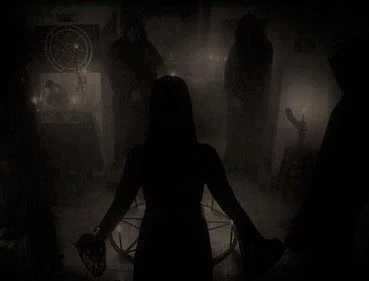

<section>

“Who the hell are you?” I asked, backing up from the woman.

“Please,” she begged, grabbing at my arm.

The smell from her was more unbearable up close. “Get off me, you old hag!” I yelled, pulling myself free.

She shushed me loudly. Her eyes appeared wide, scanning the area with paranoia. “You want them to hear?”

“Who will hear? What are you talking about?” I asked harshly. It had only been a few minutes with her and I was already beginning to become irritated.

“*Them!*” she hissed. I could see the whites of her eyes gleam in the moonlight at her weak attempt to scare me.

I shook my head unmoved. “I don't have time for this. I’m really tired and I’ve got to get up early. Honestly, I don’t care what you do out here, but just stay away from my car. I don’t want to catch you near it again or else I’ll report you.”

“No, please don’t,” she begged, ready to grab at me again.

However, I was able to avoid her clawing hands this time.

“Fine,” I shot back. “Just don’t touch me again. I’m leaving now.”

As I turned to leave, I could see the woman’s head sulk to the ground. Normally, this would have been the part where I felt sorry, but right now I didn’t care. I was too tired with my mind overwhelmed with the events that had transpired throughout the day. Besides, she was clearly deranged in the head, possibly homeless, or maybe one of those people who lived off the land.

I started to walk away when it hit me. I thought about what she had said earlier. I looked back to still see her eyeing the ground, almost appearing in a trance. I was reluctant to go back, but I had to know.

“What did you mean your daughter? And how did you know about the book?” I asked, approaching her.

Without looking up, she answered, “My daughter, I need your help to save her.”

“Your daughter? Who’s your daughter?”

“You already know of her, why do you ask me?” she replied, looking up at me. Her eyes relayed a look of solemn.

“I need to hear it from you,” I said. I was sure I knew the answer as she mentioned, but something inside me wanted to hear those words come from her. I wanted to be absolutely sure. “Say her name.”

“Why it’s Victoria, of course,” she said softly.

I shook my head in disbelief. “But how? You’re her mother but…You’re supposed to be…. She said you *died* when she was just a child.”

"Is that what she was told you?” she scoffed. “It would be like Gary to tell her such a lie.”

“What?”

“Yes,” she said stiffly. “He *took* her from me. When I didn’t want to submit to his religion, he banished me.”

This couldn't be possible. Victoria's mother was dead, right? But how would I know otherwise? I did notice, when I listened closely, I could hear her accent hidden behind her raspy voice.

“Wait, this man you’re talking about,” I started. It couldn't have been the same person. “Do you mean the reverend?”

She didn’t answer me immediately. Instead, her eyes wandered off into the trees beyond, but eventually her head gave a soft nod.

I sighed. “Look, you said to help your daughter and that the reverend 'took' her. Why didn’t you just go to the police or something?”

She chuckled to herself lightly, returning her eyes to mine. “You don’t know these people.”

“I don’t know anything because you’re not telling me everything,” I replied harshly. My impatience had elevated to annoyance.

“All you need to know is that the people you think you know, are liars. The Reverend is the worst of them all. They *need* my daughter; they made her a part of their revolting ritual. I should have never brought her here. I was so weak-minded back then. Damn them,” she spat bitterly. “I didn’t know what to do, but then, then I saw you arrive. At first, I was unsure what to think of you. Yet, while watching you with Victoria, I knew it would be *you* who would help me, to do what I couldn’t and take her away from all of this.”

It all started to come together. All those times, it felt like something or someone was watching me had been her. Yet, I was still confused. She hadn’t really answered my question and only contributed to the pile of others.

“That's a lot to believe, especially about the others. They don’t act the way you make them out to be. Besides, what ritual are you talking about?” I asked.

“You’re very fond of her, aren’t you?” she asked ignoring my question. “Of Victoria?”

“What?” I blurted out. I could feel my cheeks reddening.

“I’m glad that you are,” she said, smiling. “It does my heart good to see another care for Victoria as I do. This is the reason why I knew you’d help me, but I had to show you first, of what they plan to do and what they have already *done*. I left that book in your room as proof. You saw it, so you now know too.”

I was thrown-off again. I couldn’t believe she was behind the placement of the book as well.

“Wait a second! I don’t even know what I saw in that book. I couldn’t even read the words.”

“You don’t need the words, you saw the pictures, didn’t you?!” she shot back. “What you saw has been done.”

I didn’t know what to think. The images on those pages were indeed horrific. I wanted to believe, but another part didn’t want to accept it.

“You mean to tell that what’s growing in Victoria is…” I couldn’t finish the words. “What can you expect from *me* then? It seems a bit... too late now.”

“There is one thing we can do,” she brought up. “I can dispel their ritual, stop it before it is ever completed and that evil is born.”

“Why haven’t you done it already?”

“Because…” she began. “I need access to their room of worship and last I check I lost my key.” She held up her hand for me to see. I could make out a small stump where her ring finger used to be.

“What the hell?” I stammered.

“The rings are more than show. I'm sure you know that by now. They are keys, but there is a darker secret behind them. They are also a symbol to show your the allegiance to the faith by permanently clamping onto the wearer’s finger. The only way to remove it is by removing the finger entirely. When they banished me, I was so torn that I *bit* off my own finger. I didn’t want anything on me that was associated with them.”

“T-that’s crazy,” was all I could say.

I couldn’t fathom someone wanting to risk their finger or any part of their body on the basis of their faith or anything. I’ve heard of tattoos, but this was way beyond that. I couldn’t help but picture the woman clamping down on her finger until it snapped and spitting it out. The very thought made my stomach churn.

“Yes, but it was only after so, that I wished that I hadn’t. I could’ve ended this nightmare *years* ago. Yet, I let my anger cloud my judgment. But *you’re* here now which means there is hope again.”

“Me?” I replied. “I don’t have a ring either though.”

“I know, but the others do,” she said, smiling. “Do you know Terrance?”

I gritted my teeth. “How could I not? The prick,” I muttered.

“Terrance is a lapdog when it comes to the reverend and the faith, but he’s too much of a pansy to wear the ring like the others. He keeps his on a necklace he wears,” she continued.

“I’ve seen it,” I replied, recalling the times at dinner. “How am I supposed to get it, if it’s on him?”

“This is where you come in perfectly. You probably don’t see much of everyone throughout the day; that’s because there are chores to be done to keep the place up and running. Terrance is a working man. He normally chops up wood or fetches game for the meals. When he bathes afterwards, he takes off the necklace. I know this because I used to do the sheets around the living quarters and would see his ring just lying there. That is best time to do it, for he never locks his door at that time either. If you can take his ring at that moment, bring it to me and I’ll do the rest.”

I bit my lip, thinking on it. “I don’t know. It seems a bit risky. If I get caught, I’m finished and he’ll have me sent me home instantly.”

“Then don’t get caught. You’re the only one who can walk around easily. If I could do it, I would, but they’d see me on first sight. I was barely able to place the book in your room,” she brought up. “Please, you have to do this, for Victoria?”

I gave off another long sigh before conceding. With that, a smile formed wider than it ever had on her face. I could see the many crooked rows of her blackened and yellow teeth.

“Good,” she said, leaning close to me. “I’ve been watching Terrance for a while. He’s already chopped off a round of logs good for now, but he’ll need to do so again. He does it every two days. So the day after tomorrow you’ll have to make your move.” As she explained I nodded.

“Once I get it, how will I contact at you? Where will I find you?”

She paused for a moment before answering, “Your lamp. If you’re able to get the ring, then turn your lamp on and leave it on. I’m always watching, so I’ll see it.”

I nodded. “Then what?”

“Then bring the ring down to me and I’ll conduct my ceremony in the room. At that time, I want you to get Victoria out of here.”

“Wait, what about you?” I asked.

“I’ll be fine. I’ve survived this long, so don’t worry about me,” she answered. “You should go now; we don’t want anyone catching wind of you out here.”

“Yeah, right,” I agreed, turning to leave.

“There’s one more thing I need you to do,” the old woman said.

“What is it?” I asked.

“I need you to promise to never mention this meeting to Victoria. She must never know you’ve seen me.”

“What?" I said in bewilderment. "But Victoria would be thrilled to know that you’re alive.”

“I know she would, which is why she cannot know that I am or else she will not want to leave. Now can you do that for me?”

I heard her voice quiver off. Her eyes became glossy in the moonlight. I swallowed hard and nodded. She returned a grateful nod and faded until I could no longer see her among the shadows. I shivered a little. The chill of the wind was finally getting to me. So, I quickly ran back inside and back up to my room.

***

The following day, I started the day early as usual for my work. Throughout it, I thought about the plan. Regardless of how I felt, I knew I had to make it work. I also knew I had to stall the overall progress of my work. So I made sure to inform Terrance that I would need a few extra days to complete it. My boss didn’t pick up when I called, so I left him the message. I made up a b.s. excuse about needing more time to set up and ensure the system was functioning correctly.

After lunch, I proceeded to head to my room to take a nap. Normally, I would’ve spent this time with Victoria. When I unlocked my door, I heard a grunting sound. The noise was subtle at first and appeared to be coming from the end of the hallway. I paused for a moment unsure if I had actually heard something. I was ready to shrug it off until I heard it again, but a little louder.

Curious, I made my way down the hallway, listening as I did. I stopped at the door I presumed it came from and pressed my ear up against it. I heard it again. I took my ear away; this was Victoria’s door. Hesitant, I knocked on it lightly.

“Hey are you alright in there?” I asked.

There was no answer.

“Victoria? It’s me, Marcus,” I continued.

I could hear rapid breathing from inside sounding almost like hyperventilating. It didn’t sound good. Frantic, I knocked on the door with a little more force.

“Victoria, are you alright? What’s going on in there?” I asked urgently. “Can you let me in, please?”

“Go away,” I heard her say in between gasps.

I sighed, pressing my head softly up against the door. “Look, I understand you don’t want to talk to me,” I began. “And I don’t blame you. I had no right to… I was a jerk back there and I shouldn’t have been prying as I did. In truth, I don’t care about the baby or who the father is. I never did. I just wanted you to know that I…” The words again failed me. I could see them in my mind, but I couldn’t push them out. “… I’m sorry,” I forced out.

I wanted to tell her something else, about how I felt about her, about everything, but the timing didn’t feel right. I turned to leave, but stopped when I heard the door open behind me. She had it half-cocked to allow her face to peer through. She stared at me for a moment as if analyzing my eyes for truth. Finally, she opened it fully, walking back into her room. I followed her, closing the door behind.

Her room was nice. Unlike mine which was bland and almost empty, her room was more “cozy”. She had a desk filled with books, some open journals, others maybe novels. Her mini dresser was complimented with a vase filled with several flowers clearly well-cared for. The scent of her perfumed lingered in the air; I embraced its smell, a scent I longed missed.

“What was the noise I heard earlier?" I asked. "I thought something was wrong."

She walked over to the bed and sat, making a painful face as she did. “I’m fine,” she said gravely. “It’s just this bloody baby is all.”

I joined her on the bed.

“I meant what I said out there," I began. "I don’t care about it. You don’t have to tell me about it at all either.”

She kept her gaze way from me, but I could see tears forming in her eyes. “Just shut-up, Marcus,” she said with a quivering lip. “Just... shut it.”

She broke down in tears cupping her face with her hands. I was bad at handling these kinds of moments. They always left me feeling awkward, but I gradually reached over to her shoulder to comfort her. She immediately threw herself on me, bawling her eyes out on my chest. After a good solid five minutes, she had finally stopped. Her eyes were reddened and her nose slightly runny.

"You said your mother died when you were young," she finally said. "How did she die?"

I sighed. "She was killed,” I answered after a long pause. “Some guy broke into their apartment and shot her.”

"Marcus..." she said softly. “I'm so sorry. That must have been devastating for you."

"Yeah, well I don't remember when it happened. Like I said, I was too young."

I could feel her sob a little more on my chest.

“It was my father,” she finally said, leaning on my shoulder.

“Father?” I repeated, confused.

“Yes, he did this to me,” she said, looking down at her stomach.

My eyes widened as I pulled away. “Your father did this? Who is he?”

“Who do you think?” she said, harshly wiping her eyes.

I thought about it for a second and immediately my eyes flashed. “The reverend? Wait the reverend is your father?” I asked. I couldn’t believe it. Her mother said he took Victoria from her, but mentioned nothing of him *being* the father as well.

Victoria nodded, but then shook her head. “Well he’s my *step*\-father. My mother met him after my real father died.”

“If he did this, why didn’t you tell anyone?”

“Because I could not prove it; he drugged me or something, I don’t know. At first, I did not want to say anything, but when I started showing signs of the baby, he went on to tell everyone that it was a miracle, that it was a gift from *Lanius*," she explained. "And like aimless sheep, they questioned nothing, taking in his poisoned words. But I knew the truth, because he was the only one else there." A few more tears fell down her cheek.

I bit my lip when she said this. This part sounded all too familiar. I thought about the book and the image of the man standing with the woman, and that horrid figure behind her. Was it all true though? She had no memory of the event. Was it possible that this sick action was all just the reverend’s doing? Regardless of which, Victoria’s mother was right, these people were monsters, if not that, ignorant.

At this point, I wanted to cheer her up. I thought about telling her everything about her mother, but remembered the promise I made. Instead, I lifted her chin up so that her eyes were looking into my own.

“I can take you away from all off this. All we have to do is jump in my car and leave. You’ll never have to see this place again.”

I could see a mixture between happiness and fear in her eyes.

“But how? Where would we go?”

“You can stay with me. I have my own place. It’s safe, trust me.”

“Marcus…?” she spoke softly. A smile gradually formed on her lips. “Yes, let’s do it,” she said, rendering me a tight hug. “We should leave tonight.”

“Tonight?” I repeated.

“Yes, after dinner. Any earlier and they’ll become suspicious. They always hold their sermons late at night which gives us enough time between then. We can leave then.”

I looked away, trying to find a way to convey my thoughts. I didn’t want to reveal the plan or her mother.

“What’s wrong, Marcus?”

“Err, how about tomorrow night?” I suggested.

“Tomorrow? Why? Why do we have to stay here another day? Let’s leave tonight.”

“No, it has to be tomorrow night,” I quickly shot back without thinking.

“Marcus, I don’t understand. Is there something you’re not telling me?”

I placed my hands on her shoulders firmly looking her in the eyes. “Look, you have to trust me. I have a plan with… a friend. They’re willing to help, but it has to be tomorrow, okay?”

Her eyes were full of so much confusion. I knew she thirsted for answers, but luckily she simply nodded. “Okay, I trust you.”

For a second, we began to lean in for a kiss when we were both startled by an abrupt knocking at the door. I answered it to discover Sophia on the other side.

“Mr. Pale?” she said surprisingly. “We were beginning to worry about you when we didn’t find ya' in yer' workspace.” Her eyes shifted their gaze between me and Victoria. “I trust I wasn’t interruptin' anything?”

“No,” I said, trying to maintain my composure. “I was just... checking on Victoria.” I turned back to give her a wave and slid past Sophia.

Heading down, I glanced down the hall to still see her in Victoria’s doorway. I didn’t want to arouse suspicion so I continued on and back to the room I was working in.

***

I was glad I had patched things up with Victoria. The feeling helped ease my thoughts on the plan. I wondered if we could really pull it off. Leaving the place was one thing, but stealing the ring from that jerk was another.

Something broke this mood, though. I was heading back to continue my work when I caught sight of Terrance walking outside with an ax over his shoulder. That was strange. There was probably nothing to worry about; the old woman said he chopped every *two* days. He would still need to do it tomorrow. He probably needed it for something else I assured myself. Though the thought wasn’t that very reassuring.

I decided to keep my eye on him while I worked just in case. I looked towards the trees hoping to maybe catch sight of the old woman, but didn’t see anything. I didn’t actually believe I would see her since she had been able to keep herself invisible for years. I was sure though that she too was watching everything.

I continued working until Sophia came to me. She informed me that my boss had called and was waiting on the phone. Great, perfect timing as always, I thought grumpily. What did he want anyway? She led me back to the phone where I found it sitting off the hook on its side.

Apparently, he was following up on the message I left and wanted to ensure I was making progress. I told him that I would have everything up soon, hoping to end the phone call quickly. I noticed the small window in the room and peered out it, stretching the phone line as I did. I gazed out and to my horror I saw Terrance making his way back.

His shirt was fully soaked in sweat while he was pushing a wheel-barrow full of chopped logs. After dumping the logs off, he made his way around to the front. I felt my heart leap into my throat. In my ear, I could hear my boss go on into another one of his speeches about representing the company. Fuck the company right now, I thought. I had a small window of opportunity and I was about to miss it. We were completely wrong.

I could already hear Terrance slam the front door and proceed to the stairs. I quickly thought of a way to let my boss allow me to hang up, lying that one of the clients had asked for my help. Once over, I raced out the room nearly smacking into Margaret on the way.

“Goodness, me! You’re running as if a fire spurred!” she exclaimed.

I apologized frantically, my eyes looking down the hallway behind her.

“Is everything alright, dear?” she asked with a puzzled look.

“Yeah,” I lied. “I just need to--use to the bathroom *really* bad.”

“Oh, I shouldn’t keep you,” she replied, holding a hand up to her mouth.

I thanked her and raced towards the stairs, stopping immediately before reaching the top. I cautiously peeked down the hallway. No one was in sight. Where was he? Was he still in his room or did he already enter the bathroom? I crept up the last remaining steps slowly, eventually making my way down the hall. I could hear the sound of water running in the background. Yes, he was in the shower, but for how long?

Knowing I didn’t have much time, I sped up my pace until I reached his door. I opened it quickly, shutting it behind me. Surprisingly, his room was a lot like mine. There wasn’t much in it; it was bland and almost empty. Anything he did have like books were nicely organized in its place.

I began looking around making sure to return anything I moved back to its original place. I could feel my heart pounding in my chest. Every sound I heard, whether creak or thump, I associated it with it being Terrance. It felt like my senses had amplified. I found myself constantly looking towards the door in paranoia, thinking he’d could barge through at any minute.

I looked through his dresser and all around his bookcase, but found nothing. I started searching the desk, pulling open drawers to see inside. When I opened that last drawer, I froze. Inside I could make-out a familiar object: a gun. It was a revolver; I didn't know the specifics, but it had a very long barrel. I could see the dust that had formed over it; clearly, it hadn’t been touched in a while. I shut the drawer and continued searching around.

In the end, I couldn’t believe it, the ring wasn’t here. How could that be? I wanted to check over everything again, but a feeling inside urged me to leave. I listened to it and left the room gently closing its door behind me. I started to head back to my room until I heard a voice call out.

“Oy!” I heard, freezing my nerves.

I almost shouted in complete terror out of the shock. I turned to see a half-robed Terrance dripping in the hallway. A towel was wrapped around his waist soaking up what little water dripped from his wet body. His sweaty clothes were tightly gripped in a ball in one hand while the other held his shoes.

“What are doing down here?” he asked sternly.

My heart was now knocking against my chest as if wanting to burst out. “I just needed to use the bathroom,” I lied. “I didn’t realize someone was in it until I got down the hall.”

Terrance squinted hard at me as if trying to figure me out, but finally gestured to the bathroom with his head. “Well, it’s free now,” he said.

I thanked him and made my way past him. I pushed open the door to the small bathroom and immediately my eyes lit up. There sitting on the sink was the necklace with the ring attached. He had it with him all along. I was close to reaching for it until I heard someone behind me.

“There’s the blasted thing,” Terrance said, moving past me and grabbing it. “It’s all yer for real now,” he said and left.

I couldn’t believe it. The plan had failed. I wanted to punch a wall or something, even scream out-loud. Yet when I really thought about it, there was no chance of getting away with it freely. Even if he had left it in his room, he would have immediately noticed. There wouldn’t have been enough time to give it the old woman and leave with Victoria, especially if we planned to leave in the evening.

I sighed and began my long walk of defeat back. What could I tell the old woman now? We didn’t have an alternate plan. I continued, heading downstairs and decided to get back to work. Maybe I could think of something while I did so.

Dinner eventually came by and still I had no idea what to do. I was sure the old woman had seen my lamp was still off to relay the failure of the plan. I wondered if she would possibly come-up with a solution of her own.

“Marcus, how far along are you with your work?" Margaret inquired, pulling me from my thoughts. "I heard there were minor delays.”

“Well, I should have everything up and running by tomorrow,” I answered.

“Oh there’s a dreadful thought. We’re going to miss having you around. You’re almost like a member of the family now,” she said, giving off an unsettling giggle.

"I've actually been meaning to ask why you needed this service anyway. It doesn't seem like you really need it," I brought up.

"On the contrary, my boy," the reverend spoke. "Our faith is a rare breed, but that doesn't mean there aren't any other inspirin' souls out there. We wanna be able to reach any and all potential followers. With your help, we can do that and upload our sermons for all to see."

"Oh okay," I said weakly.

The mere thought of them uploading footage of them worshiping made me feel uneasy.

"Plus, it brought ya' to us, Marcus. Havin' a young lad such as yerself has truly been a pleasure," he continued.

I smiled sheepishly and glanced over to Victoria. She appeared to be squinting in pain.

“Are you alright, my dear?” Margaret asked when she caught sight of this too.

Victoria appeared to be suppressing the pain. “Yes,” she answered. “I think I just need to lie down for the evening.”

“Do you need any help?” Sophia offered.

“No, I’ll be fine. Please, there is no need to worry about me,” she said, excusing herself from the table. “I just need to rest.”

I could see her gripping her stomach as she did. I wanted to leave the table as well, but my legs remained frozen, numb to the commands from my brain. I just sat there watching her leave. For some reason, I could not shake the feeling of discomfort.

After dinner, I made my way back to my room. In the hallway, I glanced down towards Victoria’s door. What were we going to now? The plan had failed and tomorrow was the day I promised would be our last here. I entered my room almost slamming it shut. I could feel tears of anger growing in my eyes. Why did it all have to go to hell? Why did that bastard have to ruin everything? And why, why did I have to fuck it up so badly?

***

I must’ve have eventually passed out from my rage-fit because I was soon awakened by the sound of voices and footsteps. The footsteps sounded urgent rushing from one end of the hallway to the next. Without warning, a blood-curdling wail filled the air. It grew so loud that I had to put my hands over my ears. It sounded like a woman’s voice: Victoria’s.

I raced to my door ready to rip it open, but immediately I stopped myself. I could hear a sound worse than her wail; it was so eerie and frightening that it sent an icy chill down my spine. What I heard was the low chanting of voices. They spoke in unison, reciting words I couldn’t comprehend. I could see a dim light flicker across the door’s bottom crack. While it did, I could hear Victoria’s moans of pain.

The voices grew louder, passing by my door eventually fading into the distance. I cracked open my door to look out which let out its signature creak. I was sure it would alert them, and halted it in mid-swing. I could see the hallway was still quiet. I opened the door fully, taking a step outside. It was dark and absent of light. Under my shoe, I felt something wet. I took out my phone and used the backlight to get a better view. It was some kind of liquid, maybe water? I was ready to believe this thought until I accidentally dropped my phone *in* it. I quickly grabbed it in a panic, wiping it off, but the liquid seemed to only smear. I took my phone back into my room to see it better in the light. It wasn’t water, it was blood.

My heart skipped at the realization of this. I went back in the hallway using my phone’s light again over the liquid. I could make out more of it leading to the stairs. The other end of the hallway showed the trail lead back to Victoria’s room which had its light on. I swallowed hard and walked towards it trying to mentally prepare myself for the worse. I reached it and slowly edged my way in.

There was blood everywhere. A trail of it ran from the door up to her bed. The sheets were completely doused in red. I could smell her perfume mixed with smoke and the metallic smell of blood. I felt my stomach give-in at the sight. Immediately, I vomited all that I had eaten.

I felt my knees weaken and give away as well, falling to the ground and dropping my phone in the process. I must have blackened out for a few seconds before regaining awareness. When I regained consciousness, I noticed my phone’s backlight about to turn to black. I quickly got up, horrified that I had been laying next to *blood*. What had happened in here?

I grabbed my phone and glanced at the bed. A puddle of red soaked the lower half of the sheets. However, I noticed there was another spot, much smaller, forming near her pillow. I slowly reached for it unsure what I was about to see. I couldn’t imagine anything worse, but I was wrong. To my dismay, I found a finger.

It was clearly cut-off with the tip of its bone sticking out of the red covered flesh. It appeared to be Victoria’s, it had to have been. Next to the finger was a small knife with its tip covered in blood. Why did she cut it off? I observed the finger closer and realized the ring doused in red. She had cut off her finger so that I would have it; the key to the Congregation room.

She must’ve done so out of desperation. I thought about the pain she had shown from her contractions at dinner. She must’ve felt it was time for the child. Those sick bastards were going through with their ritual. They didn’t care about Victoria; the old woman was right.

I had to do something. I promised her that I would get her out of here and I was going to keep it. I hesitantly picked up the finger; it was still warm, and placed it in my pocket with care. Racing out of the room, I came to a stop when I remembered the gun kept by Terrance. It was something I was probably going to need. His door was locked when I tried to open it, but I didn’t care. I didn’t have time to waste, and began kicking it until the handle caved-in.

I pushed it open, running to the desk drawer where I had last seen the gun. I opened it and smiled; it was still there. I grabbed it feeling its weight fall into my hand. With my thumb, I popped its wheel open to reveal six bullets lined in their chambers. Perfect, I thought and tucked it in the back of my pants and then ran out the room.

I got to the bottom of the stairs and noticed that the lobby was dark, the scent of candles in the air. The trail of blood from earlier could be seen leading to the Congregation room. I pressed my ear up against the double-doors to listen. It was silent - no voices or wails from Victoria. Something wasn’t right. I tried the handle only to find it locked as it always was.

I reached into my pocket, pulling out the finger. I checked for the small indent on the door, placed it up against it, and twisted it to the right the way I remembered Victoria doing so. Instantly, there was a soft click from the door. I pulled at the handle again and could feel the door move. This was it. I placed the finger back in my pocket and peeked through the small crack.

All I could see was darkness. I opened the door wider and was met with a warm breeze to my face. With it opened, I could see a dim light flickering from the sides. I poked my head in first before completely entering. The light was coming from the candles mounted on columns near the walls. With it, I could make out the room even more than I had the first time.

The entire area looked older in the light. The walls appeared worn-out and decayed almost blackened as if burned. The columns appeared ancient in nature broiled with cracks and fungus throughout. A deep scent of ash and moisture filled the air. I could now see the seating hues were carved from stone similar to the columns. A few were split in areas almost falling apart. The place looked like it had been there for centuries. The building must have been built around it.

In the corner of my eye, I caught sight of a dark figure off to the side. The candle light flickered across it producing a vague outline of it. I swallowed hard, peering towards the thing with frightened eyes. Something was there, and it was watching me.

“Hello?” I called out softly to it. I could feel every hair standing up on my neck. “Hello?” I said again, my voice quivering.

The figure gave no answer in return. I slowly walked to it, watching as the light flickered across it. With the distance closing between us, I could see its pale face in the light. My heart plummeted. Empty black holes were present where its eyes were supposed to be. The mouth of it was gaped wide open, almost like it was screaming in terror, but no noise came out.

I was ready to bolt out of there until I noticed that it did nothing, it didn’t even move. Cautiously, I approached the figure with my hand stretched out. I eased cautiously, half-expecting it to lash out at me at any moment. Finally, I touched its surface. When I did, I took a deep sigh of relief. It was only a mask. I picked it up revealing its disturbing features even more up close. I looked back at the wall to see the figure was in fact a black cloak of some kind. I pulled it off, releasing it from the hook, and brought both objects into the light.

It was a cloak and mask alright, thank goodness. Was this what they wore for their ceremonies? I looked back at the wall to see several other empty hooks lined up. Glancing back at the cloak, I noticed a faded image running across it. It was a symbol, but not like the one on the door. I recognized this one though: it was an inverted cross. It had chains attached as well, hanging from its waistline. It must've been Victoria's.

Without warning, I was startled by the faint echo of a woman’s wails. It was coming from further back in the room. I followed the noise which brought me up to the altar. At the top, I could make out a familiar sight behind the podium. It was the statue from before, still horrid to the eyes as ever. As I climbed the stairs, the image of the statue became more apparent. It still brought an eerie feeling to me, right down to my bones.

I couldn’t stand the sight of it and looked away as I passed it. Behind it, I saw the mouth of a cave. Reaching it, I could see it stretch deep down into the darkness. It was dimly lit by a few candles mounted on its walls. Stone steps descended with it. I could feel a warm breeze flowing from it like the breath of a large beast.

Every so often, a wail would echo from its depths sending my heart into its own depths with it. This was crazy. How could all of this be in here? It was clear that this, that all of it, was *way* over my head. I wanted to turn around, God knows I wanted to, but with each wail I thought of Victoria. I couldn’t leave her to suffer.

I glanced down at my hands to discover that I was still holding the cloak and the mask. It was a long shot, but I thought if I wore it, it would help me blend in. Even if it bought me only a few minutes, I could use whatever edge I could get. I threw on the cloak and placed the mask over my face. I took one last breath and began making my descent.

</section>
