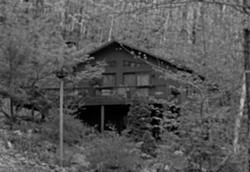

<section>





Melinda hated driving at night. She did her best to avoid it. Short trips to the store if she just realized she ran out of tampons or had nothing for dinner after getting home — that sort of thing happened now and then. But she did her best not to go out after dark unless someone was coming to pick her up.

So, naturally, she found herself on the longest drive of her life tonight, with no moon, few stars, swirling clouds above her, and acres of forest on either side.

As so many unpleasant things in her life, this was her father's fault. She hadn't seen or spoken to the bastard in fifteen years, but just after falling asleep tonight...no, that was wrong. It would be yesterday by this time. Out of the blue, her phone rang, and his voice was on the other end.

"I need you, Mellie. Please come, now."

He'd said just that, and then the line went dead.

The old ass was probably drunk, but he'd never called her before — not since she was a child and he was still trying to convince her mother to take him back. It felt like she had been dreaming — waking up to hear his voice again after all these years. It sounded like he was crying. His voice sounded just the same as the last time she'd heard it.

As though in a dream, she had risen, dressed, and gotten in the car. She was well out of town and halfway to his old place before realizing that she had no way of knowing if he even still lived there. She received updates from her mother from time to time over the years about where he was. The last time she heard from her mother about him was seven years ago. Had he ever stayed in one place that long?

Not to her recollection. She had been seven when her mother finally had enough and showed him the door. Prior to that, a move had come every few months. The house they had been living in was their longest stay in one place; a full sixteen months. It turned into two years after that, and then the next house had been the one she left when she moved out on her own. In all that time, she heard from him sporadically at best, and had finally decided it was best to simply forget about him.

Until tonight.

She had found out after a two-hour drive that she had been right to wonder if he was still in the same place. His last known address was a sketchy apartment in a low-income area of the town she had grown up in. Had he been number 24 or number 42? Maybe he was 14. It definitely had a four. It didn't matter. His name wasn't on *any* of the buzzers.

*Bastard!* Her drunk of a father had called her at night, all but demanding she come to him for reasons he didn't even feel were important enough to tell her over the phone, and then just expected that she would know where he lived now.

In a flurry of rage, she turned and marched back to her car, slamming the door and starting off in the direction she came. She was so angry she didn't even look where she was going and missed her turn-off.

The next thing she knew, she was on this lonely stretch of road. Cars were sparse, but she took some comfort in the fact that she would pass one every half-hour or so. Her dashboard clock now read 2:27 AM. She had been driving for more than five hours since leaving her house. *At night.*

Every five minutes or so, she checked her cell phone. Ever since realizing she was lost, she had checked her phone and found no bars at all. She even stopped at a gas station (closed, of course), just sure there should be some service around here somewhere, but nothing.

*Take stock of your life, Mellie*, she thought. *You're over thirty, you hate your job, you and your mother don't get along, you haven't seen or spoken to your father in just under half your life, you have no time for your friends or a relationship thanks to the aforementioned job you hate, and now here you are, trapped on a road you've never been on before, at night, and you can't even so much as call AMA let alone check Google Maps. Smart lady you are.*

She briefly considered stopping and flagging down the next car that passed. She quickly realized the futility of that plan. Any car on this road would also have no service. So there was nothing for it. She'd have to drive until she saw a house. She'd feel bad for waking someone up, but there was no choice. She needed to find her way back to the main highway.

But so far, all that she could see on either side was trees. Mile after mile of trees. No lights shining through the boughs. No sign that anyone had ever been here before except that there was a road and people were obviously still driving on it.

There weren't even any road signs other than the mile markers. Had she really found the middle of nowhere? She was just in the middle of this thought when her headlights illuminated something just up the road; a square, wooden sign — obviously made by someone other than the government. This wasn't a gas/food/lodging sign, or a mile marker, or a distance-to sign. This looked like the kind of signs advertising a private business was nearby. She slowed down to read it.

> **Granny Royce's Road House** 
> Come stay the night at Granny's! 
> She'll take good care of you! 
> Room! Board! Low Prices! 
> Next Exit!

Her heart sped up. She certainly wasn't interested in spending a night at Granny Royce's, but every business had a phone. At the very least, she'd have a map, or know the way back to the highway. She decided she would stop there.

She almost missed the turn. Granny Royce's Road House was buried at the back of a long, dirt driveway, secluded amid the trees. She was almost past the little dirt "road" that led back to it before realizing it was there. She skidded to a stop and turned in.

The little house lay ahead. It was two stories and looked to have about eight to ten rooms. Big for a home but small for anything announcing room and board. She got closer and looked for a vacancy sign. Nothing. It wasn't that the sign wasn't lit; there was no sign. The porch light was on and the front of the building was illuminated by that light and by her headlights. No signs of any kind.

She almost wondered if she'd gotten the wrong place, but she was certain that she had seen no other exits between this house and the sign announcing it.

She paused in the driveway and took out her cell again. Still no service. She did a quick search for any available wireless signals. To her complete lack of surprise, there were none. Not even any secured.

*There's no one here but me*, she thought.

At this point, she wouldn't be surprised to find the house empty as well. But the light was on and this was supposed to be a road house. Someone would be manning the front desk.

She got out of the car and headed for the front porch. As she turned around to make sure the lights flashed when she hit the lock button on her fob, she thought she could see a flash of movement in the trees. Something human-shaped. She stopped and looked again. Nothing. She decided she imagined it.

At the front door, she hesitated. If it really was a road house then she should be able to just go on in. But what if she got the wrong house? If she tried the door and just walked in, she could find herself arrested out here in Buttfuck, Nowhere.

Cautiously, she tried the knob. It turned. She pressed gently on the door. It opened. Relief flooded through her when she saw that she was in a small, but tastefully decorated foyer that had obviously been repurposed as an admissions area. A quaint desk with an honest-to-god guest book had been placed in the far right corner and some chairs had been set out, along with magazines on a table. She read the titles briefly—*Mademoiselle*, *Blue Book*, *The New Country Life*, *Arts & Architecture*—before turning her attention to the little desk.

There wasn't a computer. That was a cute touch. It was like the house was from a past era. Perhaps old Granny Royce really didn't like modern technology. There was, however, a little bell, just like there would have been in 1929. It wasn't even the round silver kind you slapped to ring; it was a little porcelain hand-bell. This place was starting to out-cute her.

*Please let her have a phone, and please let it use the numberplan, not 50s exchanges.*

She picked up the bell and gave it a shake.

For a while, nothing happened. Then she saw a light come on in the back room and the shadow of an old woman sprang up on the wall. The shadow moved toward her and within a few seconds, she saw its owner: Granny Royce, who perhaps looked like every grandmother in every storybook ever.

"Well, goodness me," she said. "My lands. Good morning deary. Pardon my tardiness but it's been a while since we got guests at this hour. Can I take your name, honey?"

Granny Royce was smallish, her grey hair tied in a neat bun behind her head, a dress that would have looked like it belonged to a senior citizen in the twenties, and a faded pink sweater. Melinda thought that she looked just like she would have wanted her own grandmother to look like, but her mother's mother had died when she was young, and she'd never met her father's mother. It almost hurt to deny this sweet little woman her business, but nevertheless, she had to get home.

"Actually, I'm sorry," she began. "But the fact is I'm lost. I'm not even sure where I am in the direction of..."

"Oh, you poor thing," said Granny Royce. "You just sit down and let me fix you some tea, or something. You must be cold."

"Really, thank you, but I'm okay," Melinda said gently. "I just need to use the phone, if I could, or if you've got a map, even that would be lovely. I really only live a couple of hours from here..."

She trailed off, not knowing if she was even right about that. She easily could have driven those five-plus hours in the wrong direction entirely.

"Oh dear," said the little woman sadly. "I'm sorry, honey, but the phone lines are down. As for a map, well...I used to have one, and if I look I still might, but it's probably quite out of date by now. The highway moved since then, I know that much."

Melinda's heart sank. How could her luck get any worse? No phone, cell or land line, and no map. What could she do? She had to get back home. She was expected to work at 8 AM tomorrow. And why were the phone lines down? The weather was coldish but clear. Were they fixing a line nearby?

She told Granny Royce the name of her town, but Granny only said "Believe it or not, I've never heard of that town. What did you say the name was?"

She told her again.

"No, doesn't ring a bell. I'm sorry. But I could not say which direction it's in. Why don't you stay the night, sweetie. I'll give you a discount for your trouble."

"Thank you. That's very kind of you. But I have work tomorrow and I need to get back home. I'm not even sure why I'm out tonight. The only reason I had doesn't seem to matter anymore."

"Honey, I wouldn't advise trying to drive back that far tonight," Granny Royce said. "Why, it's almost three in the morning, and you've not had any sleep. Maybe the lines will be up in the morning, and you can call your work and let them know you'll be late."

"That won't work, either," she replied. "I'm the opener. No one will be there. No, I'm sorry, I've really got to leave. I'll head in the other direction until I find the road I was on."

At that, Granny Royce's expression, already one of kind concern, seemed to shift somewhat — to one of fear. She paused, looking at Melinda as though she wanted to say something else to keep her inside. Finally she said, reluctantly, "Alright, honey, if you're sure. Just you be careful, now. Don't speak to nobody until you're back on the road."

That last warning seemed a little silly. After all, what was Melinda, a little girl? She thanked Granny Royce for her kindness and headed back to the car. About halfway to the car she remembered thinking she saw something moving in the trees. Her eyes scanned both sides of the secluded little cleared area she was in, looking for anything that appeared to be moving on its own rather than being blown by the slight wind. She saw nothing. Satisfied, she headed for her car. All four tires were flat.

*Goddammit!*

She leaned down and saw long slash marks on each tire. Someone in this little slice of *Green Acres* had slashed her tires in the time it took her to find out that she had no way of contacting anyone tonight.

*Kids from a local farmhouse, gotta be*, she thought grimly. *Nothing else to do, so you might as well go out at night and slash tires.*

She stopped and let the reality sink in. She wasn't going anywhere tonight. She had no choice now; she had to stay the night here until morning, when hopefully the phone lines would be up and she could call someone from work to ask them to go in for her, and then AMA to get her tires dealt with. She sighed and walked back in the house. She could hear Granny Royce as she was walking back to her room. She had already turned off the lights. Resigned to her fate, Melinda rang the little bell again.

"That you, miss?" she heard Granny Royce call.

"Yes, it's me," she answered. "Sorry to be a bother. My name is Melinda Orton. Sorry I never mentioned it before. I guess I will take a room for the night, if the offer's still good."

"Oh, of course it is, deary," said Granny Royce, re-entering the room and turning the lights back on. "Melinda. Oh, that's such a pretty name, honey. Well. Let's get you situated. You put your name and arrival time in the book there and I'll get you a key. All the boarding rooms are on the second floor, and there's only a couple left."

"There are others here?"

This was surprising. Not a single car had been in the front lawn when she pulled in.

"Oh, yes, Miss Melinda." Granny was puttering around in the adjacent room. "Mr. Norris, young Calvin, there's a few of us here." She came back out with a key in her hand. "Just out of curiosity, what made you change your mind?"

She seemed to brighten as she asked the question, as though relieved that Melinda would stay after all

"Oh, it's probably just local kids getting kicks," she said. "But I found my tires slashed."

Granny stopped suddenly, her face twisted with concern and worry. Then she resumed, as though nothing was wrong.

"Nothing to be done for it, I suppose," she said, with an err of sadness.

"Well, not until morning, at any rate," said Melinda. "Then hopefully the lines will be up."

"Oh," said Granny Royce, distractedly. "Yes, hopefully."

She led Melinda up the darkened staircase into an empty, quiet hall. Or perhaps not so quiet. From one end of the hall came the muffled sound of someone crying. Whoever it was was crying softly — not with anger or petulance or fear, but with deep sadness. It sounded as if crying was something this person was used to, but they were still unable to stop.

"Who is that?" she asked, pointing in the direction the crying was coming from.

"Oh, pay that no mind, honey," said Granny. "That's just Mr. Norris. He's been like that a while. Older man, you understand. Not all there." She tapped her temple.

"I understand," Melinda replied, but wondered privately how an old, out-of-touch man would wind up at a road house. "Has he been here long?"

"A while, I'd say," answered Granny. "Don't really recall how long, exactly."

*How does he pay for room and board*?

"I guess he doesn't drive," she said to the old woman.

"Actually, it doesn't look like anyone else here has a car."

Granny started at this, looking up with an almost guilty expression. "Oh, well," she said. "That kind of thing is the business of the guests. I don't ask about such things."

She turned the key in the lock of the room she had led Melinda to, and opened the door. Turning on the light, she showed Melinda the quaint little room. Melinda thought it looked like stepping into the past. She could swear this room would have looked modern in the early fifties, at the earliest.

*Come to think of it, so could the rest of this place*, she thought. *No wireless service, no computer, that old bell. And those magazines, they looked new, but...*

That thought was cut off as Granny put the key on the nightstand and started in with instructions.

"Now, the bathroom is down the hallway there. You'll be sharing with the whole floor, so please bare that in mind if you have to go. There's a shower schedule on the door, as well. First come, first serve. You just add your name to the first available line and that's the order the showers are in. I wouldn't worry about that if I were you, though. I'm sure you'll be first in line. I get up at 6 AM sharp every morning and start breakfast, but you come on down whenever you're ready and I'll whip something up for you.

"Oh, and one last thing, my dear. I would strongly advise you not to leave the house until sun-up. You just never know what could happen out there. In the dark."

"Of course," she replied. *I'd never go out there in the dark if I didn't have to...*

She stopped that train of thought right out of the gate.

After a few moments, she was alone. Alone, without anything to wear to bed, and nothing to shower, brush her teeth, or hair with in the morning. She sat on the bed and looked out the window, which faced front. Her car still sat where she had left it, the only thing for miles that seemed like part of her world.

*And an expensive, over-large paperweight until I can get a hold of someone*, she thought bitterly.

Despite the homeyness of the room, she felt an unwillingness to rise and shut off the light. Somehow the thought of going to sleep in this backward little room seemed unthinkable. So instead, she continued to sit and stare out the window. A figure in black detached itself from the shadows of the trees and made its way to her car.

*The hell?!* She jumped up and ran at the window.

The figure was tall, and seemed to be wearing a cloak made of night. She saw as its arm extended. In its hand was a long, jagged dagger. It dragged the dagger across the side of her car, leaving a long gash-mark in the paint and metal.

"Hey!" she shouted.

The figure kept dragging the dagger. She reached for the window to open it. It wouldn't budge. She looked for a lock, but couldn't see one.

"Hey!" she yelled again.

This time the figure raised its head. She could see the glint of two eyes under the hood. The figure raised the dagger, slowly, determinedly. It pointed it straight at her face. She leaped away from the window and ran for the door. A noise on the other side stopped her. Footsteps. Dragging, shambling footsteps. And crying. The sound of a person for whom deep, longing sadness is a way of life.

*Mr. Norris!*

She waited. Somehow, she just felt that she should let the old man pass before she opened the door. Before he got very far, however, she heard other footsteps - these much quicker and lighter — run up the stairs and stop near the door of her room.

"*Stop it!*" hissed Granny Royce. "Go back in your room right now! You know better. She can't see you yet. Hopefully she won't have to at all. Now you go back in there. You've got no business being out at this hour anyway."

*What on Earth?*

How could that sweet old woman talk to another human that way, let alone an old man with a foggy mind? She almost opened the door right then, but somehow her hand stopped, and waited until the shuffling, crying man had made his way back down the hallway. She heard his door open. She opened her own door just in time to see his foot, shod in a well-worn house-shoe, slide into his room. The door closed softly after him.

*That poor man*, she thought.

But now she was determined to find out what was going on. The punk outside in the Halloween costume slashing up her car followed by Granny yelling at an old man made her begin to understand that not all was well here. She went back down to the front desk area, which was completely unlit except for the moonlight and porch light coming through the window.

There was, however, a light on near the back room that Granny Royce had emerged from before. Melinda paused to take a look outside the front window. The maniac with the dagger was nowhere to be seen for the moment, but she was now determined that it was he that she had seen moving through the trees.

*He could have killed me!*

She strode in the direction of the light, seeing that it was the light to the kitchen. She kept going, expecting to find Granny Royce still puttering about with whatever an old inn-keeper did with herself during the early hours of the morning.

Instead, she found Granny sitting with a young man of about twenty. He had dark hair and a scruff of stubble and was wearing a dark brown corduroy shirt and khaki's, along with a pork-pie hat. He looked like he was ready to go sell newspapers on a street-corner in the thirties. He was quietly sipping tea while Granny was admonishing him from the other end of the table.

"Now that was a horrible thing to say!" she said. "When I was your age, young men minded their manners!"

"That's a laugh, talking about my age," muttered the young man with a sneer. "And just how old are you? Do you even remember?"

"Calvin Davidson, you are trouble, young man," she hissed back. Neither had noticed Melinda yet. "One of these days you're going to say something you'll regret."

"Oh, come on, Granny, what could I possibly say that will make things worse than they already are?" demanded Calvin. "I mean, look at old Mr. Norris up there! Both of us are ol...um, hullo, miss. I didn't know we had anyone else here." He had just seen Melinda.

"Uh, hi," she said.

She had the feeling she'd walked in on an old argument the two of them had had many times, and that did not concern her. Her fear and anger were forgotten for the moment. Calvin had been talking to Granny like a sullen kid, but something about what they were saying seemed...wrong.

"Can I help you, Melinda?" asked Granny Royce. "Is there something wrong with your room?"

That brought her back. "No," she said. "The room is fine. But nothing else is! I mean, what on Earth do you even have a road house out here where it seems like no one ever stops? Why are most of the rooms full even though mine is the only car out there? Why did I hear you talking to Mr. Norris like he was a dog? And why would you want to make sure I didn't see him?"

She got no further before Calvin cut her off.

"Good lord, she's not even been here a night and she can see it. Why did you even let her in, Granny? Why don't you just bolt the door? Hell, if I could go take down that sign don't you think I would have, by now? Lord love a duck."

*There's something you don't hear many young men say*, thought Melinda. She decided to ignore Calvin for the moment, otherwise.

"And besides that, there's someone out there! He's the freak who slashed my tires and he's been out there messing up my car since then! And you can't even call the police! Are you gonna tell me you've never had vandals out here before?"

There was a long pause in the room. Neither Granny nor Calvin seemed willing to break it. Calvin scratched at his neck. For the first time, Melinda noticed a red slash at his throat, half-hidden by his collar. It looked like either a very fresh scar or a slightly healed wound.

"Listen, miss, I don't know your name," he finally said.

"Melinda," she told him.

"Melinda," he repeated. "Melinda, I think you should sit down. I have to tell you something that you may find...troubling."

Melina did not like how he said that. She also didn't like the way his tone had switched from sullen child to serious adult. He looked several years her junior but he was talking to her like he was her uncle, or her boss. He swallowed a sip of tea and sighed.

Then he looked her straight in the face and said: "The reason I don't have a car out there is that when I got here, no one my age, no one in my line of work, would have owned a car. It would have seemed like an impossible dream."

"What...what are you talking about?" she asked, hesitantly.

"I worked in a textile mill," he said. "The mill was shut down by the time I got here. Most businesses were. So I struck out on my own; a drifter looking for what work I could find. And I stopped here. Forever."

"Businesses were shut down...I don't understand," said Melinda. "We're having a rough time of it right now, but businesses are mostly staying open..."

"Not then, they weren't," said Calvin, sadly. "I arrived here...in 1929."

Melinda blinked. Something had exploded behind her eyes.

"This place was new then," said Granny. "My man and I had just opened it. And young Mr. Calvin was a sweet young lad of sixteen. I offered to take him on as hired help over my husband's objections. Well, my husband was a well-meaning man, but he knew how to pinch a penny. T'was a year after I took Calvin on that Mr. Royce died. Calvin and I have been here ever since. And every few years or so, someone joins us."

"Yep," Calvin broke in. "Miss Tillie was first; she was a woman of ill repute who ran here, pregnant and scared that the man who'd run her trade up in New York was gonna find her and kill her. She and that baby..."

He broke off, now seeming on the point of tears.

"And then," said Granny, "there was Mr. Standish. He was a traveling minister. He doesn't travel anymore."

"Mr. Norris got here in '69," said Calvin. "His story is probably the worst. He was a...well, he was a bank-robber, you see. Carried a pistol. And he didn't like learning how long we'd all been here." He paused, stood and walked to the kitchen window. "He tried to leave on his own, you see. He ain't the first to try it. That was me, actually. I warned him not to try, but he wouldn't listen. But when he got outside...and he met *him*..."

"Calvin!" hissed Granny. "We don't talk about this!"

"She's gotta know," said Calvin. "There's no point in her finding out slowly."

"There's still a chance for her!" said Granny in a stage whisper. "All she has to do is wait until morning..."

"She's not going to wait until morning," said Calvin with some remorse in his voice. "No one ever waits until morning. The fact that she came down here is proof enough of that. Besides, what good would that have really done her? Her car is useless. We have no phones here. There was no phone when this place went up and there won't never be a phone here. You know that."

"Okay, everyone, stop!" Melinda shouted. "That's enough! Now, you can't keep me prisoner here and I have no intention of staying any longer. Only that knife-wielding maniac out there is keeping me from running up the road this minute! Now, I need to know what's really going on here and I need to know it now!"

"We've been telling you," Calvin said. "Granny may not want you to know everything, but you need to. Because you won't be leaving. Oh, we're not trying to keep you prisoner. I don't even care if you run out that door right now. But you'll never leave this house again afterward."

"Like hell I won't!" yelled Melinda.

"Listen, child!" said Granny, rising from her spot at the table. "Listen, please! None of us mean you harm, my dear, not even Mr. Norris. There's scant he can do anymore, and he knows it. That's why he's up there crying all the time. But we're stuck here, all of us. I hoped there was a chance for you to run for it in the morning, but Calvin's right. There's no guarantee you'd be safe in the morning, anyhow."

"What...the...*hell*...is wrong with this place!?" choked out Melinda.

She was beginning to break down. she could feel the tears welling in her eyes.

"It was about a month after Mr. Royce died," said Calvin. "When *he* came. He was wearing that long, black robe and carrying that ridiculous dagger. I saw him when I was trimming the hedges in the back. I told him he needed to get out of here, because I didn't like his look. He...he moved so fast I never saw it coming. And he got me, from here..." Calvin touched his neck. "...to here." He touched his lower abdomen on the opposite side from the neck slash. He began to undo his shirt. Melinda almost vomited. Under his shirt was a long, ugly slash that went deep...and was still seeping blood. She could see bone, muscle and intestines wriggling within that mangled ruin. "I died that night," said Calvin.

"But then I didn't. The next thing I knew, I was being dragged into the house by Granny, and when I woke up, I nearly scared her to death. She was sure that I was gone. The thing is, I was. But I was awake. I could talk, walk, do anything I could while alive. Well, except take any enjoyment or nourishment from food or drink anymore. I still drink that tea because it keeps my skin from turning ash-grey. I learned that about fifty years ago."

"*He* didn't go away, though," Granny broke in. "I went out to deal with him, carrying my axe. He took my axe and buried it in my back. I won't show you the wound, honey. Calvin shouldn't have shown you his, either. No one should have to see it."

"But that's how *he* works, Melinda," continued Calvin. "He's got that knife, but if you try to use a weapon on him, he just...moves like he does and takes it from you. You never stand a chance. He'll use whatever weapon you try to take him down with to end you. Mr. Norris learned that the hard way."

"This...this is not happening!" Melinda was ready to break down. She had to hold it together. She had to get out of here, somehow. Nothing about this was right. Nothing about it could be real.

It was all a dream; too much didn't make sense. Her father calling her out of the blue. Her leaving to go to him without a second thought. Getting lost so quickly, and so irreversibly. No cell phone service anywhere on this road. This place, everything about it! She was dreaming; that had to be it. But if so, she was going to survive this dream. She turned and ran for the stairs. Her purse was still in her room, but she was going to grab it and go. She'd had enough.

Protesting voices began babbling behind her; she cared not one whit. Mr. Norris was waiting at the top of the stairs. Contrary to Granny Royce's description of him, he was not old at all. No more than about forty.

But she saw instantly what she meant by "not all there". The top half of Mr. Norris's head looked normal, like a reasonably attractive man with dark hair peppered with grey here and there. His eyes, a clear green, were moist with fresh tears. The lower half of his face was a ruin of bone fragments, shredded muscle and blood. So much blood. His left side was similarly destroyed. His arm hung on a few hanging strings of muscle, his hip was just as much a mess of bone and blood as his face was. He kept his one good hand on the bannister as he shuffled toward her. Behind him stood a young woman in a bra and a pair of panties. Her stomach was cut open, and looking out of the wound with bright, intelligent eyes was the mangled remains of a baby.

Melinda turned and bolted for the front door. Her hand had just closed around the knob when Calvin rushed up to her, placing his freezing cold hand over hers.

"They're not going to hurt you," he said quickly. "But *he* will. If you step out for so much as a moment, *he* will kill you, and it will hurt. And it will go on hurting. Forever. After a while you learn to function with the pain, but it never goes away."

Sobbing, she asked the question she'd been afraid to ask since coming here.

"Who is *he*?"

"We don't know," said Granny, from behind Calvin. "He just...came here, and he won't go away. He likes to watch us, and do things to incite us to come out again. As soon as someone does, he hurts them more. But no matter how many times he kills us, we *don't die*. Believe me when I say, we all wish we could."

Melinda had had enough of this. She pushed Calvin away and threw open the door. *He* was standing on the porch. The knife was held out in front of him, just at face-level. Melinda ran into him at a rush, the knife puncturing her right eye and its tip sliding on through, out the other side. She just managed to see the grinning, pure-white face of her killer, before everything went black.

A few hours later, the house erupted with screams from upstairs as Melinda awoke to a world of pain, the like of which she'd never known.

</section>
