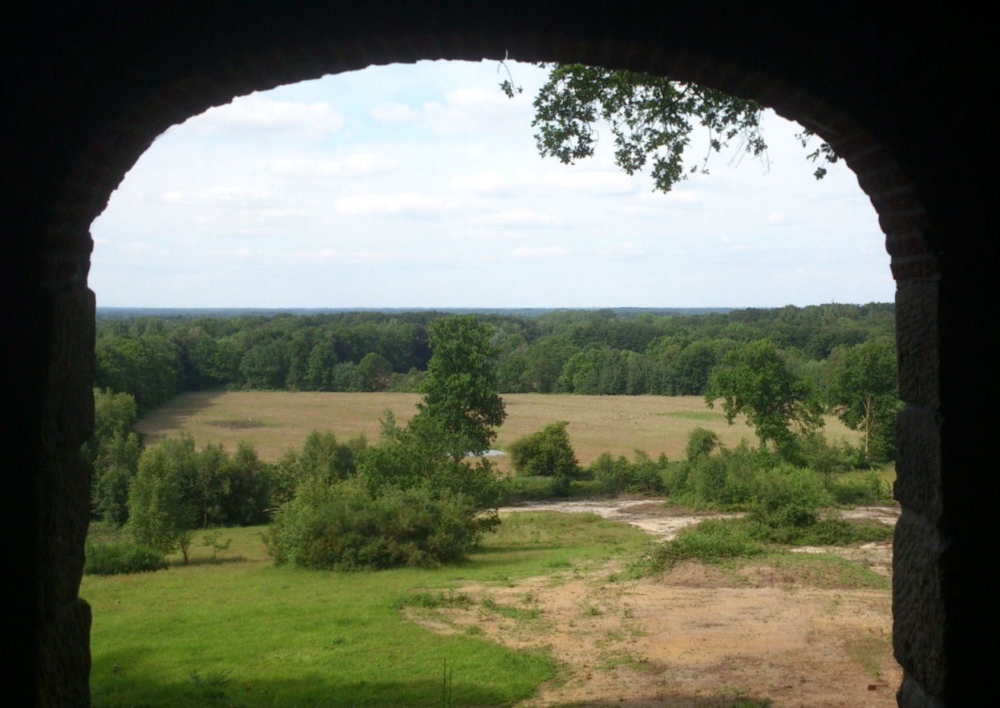
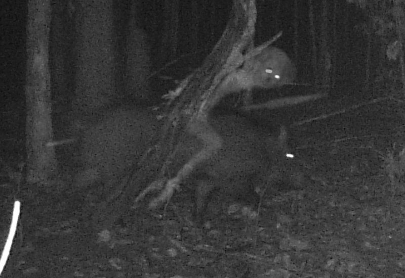
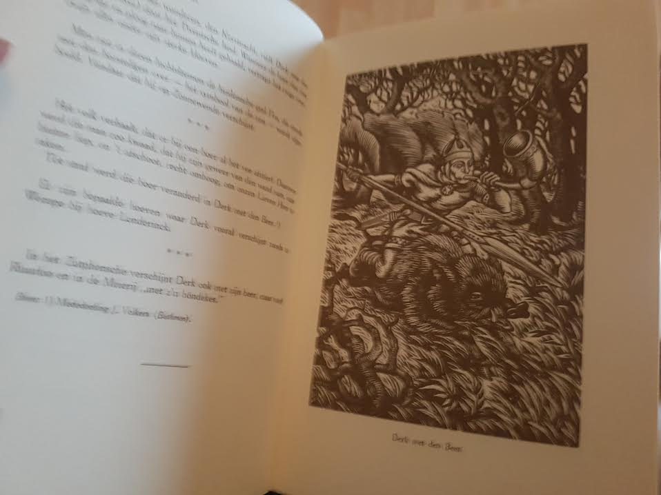
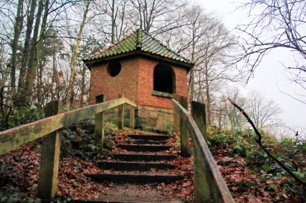

The shit story of my hunt for ancient germanic spirit
(featuring my bad english)



- Be me
- living in a small vilage on the border of Germany and The Neatherlands
- testing mu new night vision cam for school project
- wolfs are turning back to The Neatherlands trough Germany
- its been all over the fucking news
- Found a nice tree in the woods near a hill called Tankenberg
- looking for a money shot
- instal my sweet new cam, hook the baby up to a nice tree
- come back next day to look at pictures
- nothing but birds and small deer
- Just spend fucking &#8364;400 to spy on birds
- feelsbad.jpg
- repeat this for a week or two
- more birds, deer and Some hogs to
- send all pictures to a friend/project partner from school for further review




- next day
- got home from a family dinner at some spanish restourant
- turn on pc
- three Emails from friend
- two of them are about some Rare birds
- in the last mail he urges me to look at some picture i took a week ago
- open op folder
- open pic and see what apears to be a feral ghoul from falout 4 riding a hog





- holyfuck.jpg
- almost tear of my fucking balls as i whas scretch them at the moment
- lose my shit a bit
- i call friend
- dont know what to do
- go to police?
- no, what are they gonna do, look for a doctor seuss caracter riding a pig
- dont think so





- next day
- at school
- talk to friend about pic
- to afraid to show pic to anyone
- they might think i lost my mind or something
- ask him "did you show the pic to anyone anon?"
- anon: "yeah man my parents and my uncle"
- anon: "They think its prety funny"
- weekend
- go back home
- show pic to my mother
- she says its a weird picture like the ones on the Discovery Channel
- says grampa used to tell storys about a man riding a hog
- thats-really-specific.jpg




- next day
- go to see Gramps
- he pours me a drink as always
- Korenbrandewijn or Gin as you guys in Trumptopia call it
- my family is feuling my alcoholism
- gonna die before i turn thirty for sure
- ask him about a guy riding a hog
- at first he is clueless about what iam talking about
- he remembers and smiles
- he told me about a spirit called "Derk met den beer" (Derk with a Hog)
- says he is a protector of these woods and something about a old farmer beaing cursed for shooting a rivle at God on "Kerst Nacht" (Christmas Eve)
- he goes to the bookshelf to get an older leathery looking book with gold ornaments idk how to discribe it in english
- "Overijssels sagenboek" whas the titel on the cover
- a book with stories about local legends like dwarfs, water monsters and witches
- under the Chapter "Wilde jacht"(Wild hunt), i found multiple stories about Derk met den beer
- some about the cursed farmer, and one about him being a god from like pagan times
- some real viking shit



- i say to my grandpa, "Thats a weird name for a god "Derk"
- he smiles
- thats not his real name anon, you cant speak his real name it will bring bad luck
- whats he called i sayd Voldemort i said smiling
- even just seeing the wild hunt is a bad omen
- my grandma hears my grandpa talking about the spirit
- she looks at us and says "wasnt he called Fro or Friej or something?"
- in one fleuent motion my grandpa jumps out of his chair and begins to raise his voice
- "You dont speak his name!"
- "What did i tell just now!"
- ofuck.jpg
- didnt know my grandpa whas this superstitious
- after he calms down i showed him the picture i took of the thing in the woods
- my grandpa is silent
- "he even has the spear" he mumbles after a minnute
- "what?"
- i take a closer look and you can almost make out a spear behind the figure
- "he misses a war horn" said grandpa
- "a horn?" i said
- he turns the page of the book and on it a real nice looking picture of a Germanic looking dude riding a hog
- he is blowing a horn
- "what does the horn do?" i ask
- get some vague awnser, someting along the lines of "It helps him hunt"



- couple of days later
- back home i do some Research on Derk/Fro
- turns out he whas like an old germanic god, elmost every germanic country has its own name for him
- in The Netherlands and Germany they call him Fro or Frey
- and in the Scandinavian countrys they called him Freyr
- god of fertility
- yeah the dude indeed looks like a real ladys man
- reading some information on the Tankenberg were i took the pictures
- there is a small pagan temple
- temple for some goddess named Tamfana
- a temple for human sacrifice possibly
- go to the temple just for the heck of it



- not much to see just a small reconstruction of an temple and a nice view of the forest
- encounter some locals that live near the temple
- ask em about Tamfana
- they proudly tell about the goddess of hervest and nature
- i ask the man about Derk
- he told me that every Christmas Eve they round up all their shit and bring it inside their home
- becouse if you dont have your stuff together ar midnight Derk will come and wreck your shit
- mabey even you
- i ask "are there people who have seen Fro?"
- the man looks at me like i fucked his wive
- "Never say that name" he said
- i laugh and said "what will he do steal your broom?"
- the guy said again "Never say that name"
- he walks off
- weirdest interaction i ever had



- A week passes and some dude on local news says that he had seen a man on a hog
- thats it must be
- try to contact the man but no response
- next day
- got his adres
- ride to his house
- nobody home
- return home, this looks like a dead end
- three days later turns out the guy comitted suicide
- shit is getting to real now
- thats what you get for looking funny at someone i guess
- deside to go to police and show them our man fro
- man walks in gives me the most discusting cup of coffee i ever had
- they take some more info from me like the location and date the pic was taken
- return home
- cant sleep thinking of our boy fro
- 4 in the morning loud knoking on our door
- some fucking goons from the government or police i dont know
- they seize all my fucking equipment my camara and the new camara i just baught specialy for Derk
- my phone and my laptop
- some thicc looking guy with thin comb over asks if i have more pictures on that hard drive
- no
- they take it anyway
- there was some porn on there as well
- i know
- just the regular stuff dont worry
- luckely i backedup all pics on my google drive
- hackerman.gif



- grandpa passed away
- grandma said he wasnt doing so well lately
- i begin to get paranoid, think its because of the Derk thing
- think the government is hiding something
- bought some new cameras
- curently haning in the forest around Tankenberg
- strugeling with my study will become a dropout soon
- opsesively watching my cameras for a sign of Derk, just to prove that its out there

